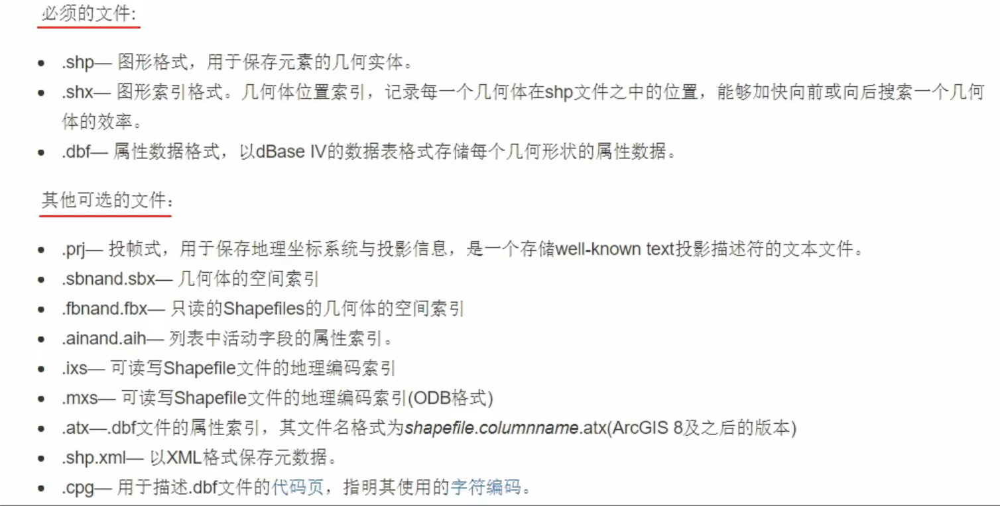

## ArcGIS 初识

功能布局设置

内容列表

目录

自定义目录显示

文件类型的支持

更改默认工作目录

设置鼠标滚轮方向：【自定义】-【常规】

前台处理：【地理处理】-取消【后台处理】

修改数据源：【属性】-【源】-【设置数据源】；右键【数据】-【修复数据源】；右键【地图文档属性】-【储存为数据的相对路径名】打勾

设置中文界面

shapefile和database

文件地理数据库

个人地理数据库

## 基础教程

### 数据格式转换

CAD 与 GIS

dat 与 GIS

excel 与 GIS

excel 到 GIS：根据原始数据信息，选择投影坐标系-...-输出位置，更改名称-拖拽进ArcGIS

GIS 到 excel：属性-选中所有数据-最右侧右击，复制-到Excel粘贴，保存

### 拓扑

### 数据变换

栅格数据镶嵌

工具箱-数据管理工具-栅格数据集-镶嵌至新栅格-单独存放需要文件拓展名

### 坐标转换

## 地图制图

### 地图矢量化

#### 建立数据库

建立数据集

先看地图的坐标系（Beijing54）

要素数据集：新建文件地理数据库-新建-要素数据集-选择坐标系-垂直坐标系-下一步，完成

数据要素类：注记、点要素、线要素、面要素

注记：新建-要素类-注记-参考比例

点、线、 面 依次创建

设置属性域：设置属性域之后，在要素自己创建字段，定义属性域

#### 地理配准

加载图片

定义坐标系：视图-数据框属性-坐标系-选择beijing54

地理配准：空白处右击-打开地理配准控制条-关掉自动校准-添加控制点-点击第一个点，输入X和Y坐标-添加3个点-然后保存

#### 矢量化

##### 裁剪

选择一部分：【视图】-【裁剪】，但只是隐藏了其他区域的数据

【工具】-【数据管理工具】-【裁剪】，是实际的裁剪

##### 矢量化

创建模版

### 编辑与修改

### 地图整饰

内容：图名、图例、比例尺、指北针、图形要素设置（矩形、报表）

图名的放置与修改：【插入】

图例

比例尺：

图形比例尺

比例文本

统计图表放置

### 地图输出

常规：分辨率300；24位真彩色

