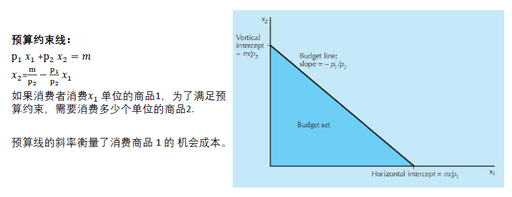
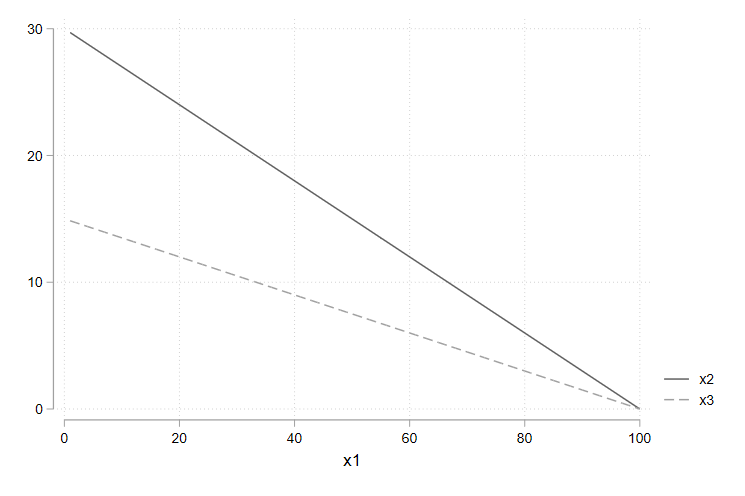
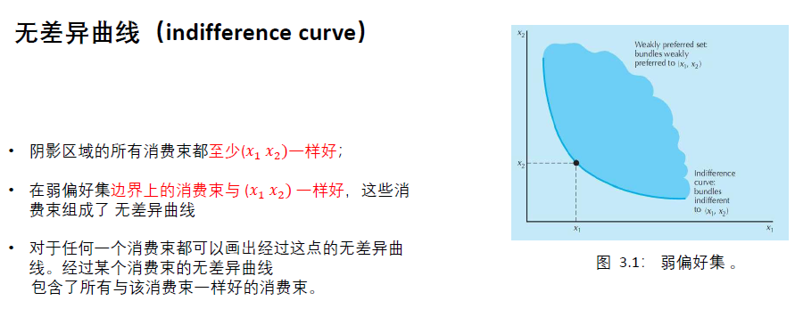
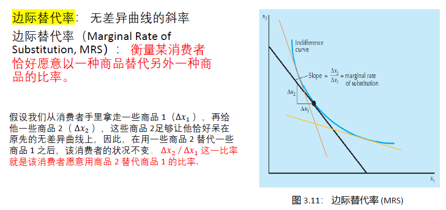

# 第二章 预算约束


## 基础知识

### 预算线的性质和变动

性质



变动：
- 收入变动
- 价格变动
- 税收
   - 从量税 $p_1+t$
   - 从价税 $(1+t)p_1$
- 补贴

## 练习题

Q1：消费者的初始预算线为 $p_{1}x_{1}+p_{2}x_{2}=m$。现在商品 1 的价格变为原来的 2 倍，商品 2 的价格变为原来的 8 倍，收入变为原来的 4 倍。写出新预算的表达式，其中价格和收入要分别以原来的价格和收入表示。

$2p_{1}x_{1}+8p_{2}x_{2}=4m$

Q2：如果商品 2 的价格上升，但商品 1 的价格和收入保持不变，那么预算线如何变动？

设初始预算线方程为$p_{1}x_{1}+p_{2}x_{2}=m$，它的斜率为$-p_{1}/p_{2}$，横截距为$m/p_{1}$，纵截距为$m/p_{2}$。当 $p_{2}$ 上升而 $p_{1}$ 和 $m$ 不变时，斜率绝对值变小，横截距不变，总截距变小。因此预算线绕着横截距点 $(m/p_{1},0)$ 向内转动（变得更平坦）。如下图所示：



```Stata
/*
s.t.
m =3000
p1 = 10; p2 = 300; p3 = p2*2

p1x1 + p2x2 = m -> x2 = (m - p1x1) / p2 
*/

clear
set obs 100

scalar m = 3000
scalar p1 = 30
scalar p2 = 100
scalar p3 = 2*p2

gen x1 = _n
gen x2 = (m-p1*x1)/p2 
gen x3 = (m-p1*x1)/p3 

tw (line x2 x1) (line x3 x1), scheme(plotplain)
graph export "$image/2.png", replace
```

## 拓展资料

>此次“武汉消费券”分为餐饮、商场、超市（便利店）、文体旅游四大类。今日起，武汉市民只要进入微信小程序“武汉消费券”即可订阅领券通知，4月19日中午12点正式开抢，每次可领一种券，面额分为10元、20元、50元及80元，第一波总额3000万消费券可领，领到的券将在20日生效。消费者通过小程序领到的武汉消费券，适用于采用微信商户支付结算的商户，使用个人版微信收款码的商户将无法核销“武汉消费券”。在活动商户处，消费者微信支付达到一定金额即可自动抵扣，无需额外操作。（[人民网](http://finance.people.com.cn/n1/2020/0417/c66323-31678143.html)）

**思考：新冠疫情期间，武汉市政府发放的消费券如何影响消费者预算线？对城乡居民的影响有何差异（加剧了不平等吗）**？

[经济观察网-消费券的效率与公平](http://www.eeo.com.cn/2020/0401/379878.shtml)

[人民网-消费券发放应兼顾公平和效率](http://money.people.com.cn/n1/2020/0406/c42877-31662696.html)


实际是增加消费者的可支配收入，使得持券者的预算约束向外移动。（收入效应）

虽然是普惠性质的消费券，但是消费券使用条件限制，农村地区没有大型商店，无法使用消费券。


# 第三章 偏好


## 基础知识

### 偏好

假设有两个消费束 $(x_1,x_2)$和$(y_1,y_2)$：
- 严格偏好 $(x_1,x_2) \succ (y_1,y_2)$
- 弱偏好 $(x_1,x_2) \succeq (y_1,y_2)$
- 无差异偏好 $(x_1,x_2)\sim(y_1,y_2)$

#### 关于偏好的几种假设

- **完备性（complete）公理**。假设任何两个消费束 都可以比较，即给定$X $和消费束$ Y$，必有 $(x_1,x_2) \succeq (y_1,y_2)$ 或者 $(y_1,y_2) \succeq (x_1,x_2)$，或者二者都成立， 在最后一种情形中，消费者对于这两个束是无差异的。
- **反身性（ reflexive） 公 理 **。 假设任何消费束都至少和它本身一样好 $(x_1,x_2)\succeq(x_1,x_2)$。
- **传递性（ transitive）公 理 **。 如 果$(x_1,x_2)\succeq(y_1,y_2)$并且$(y_1,y_2)\succeq(z_1,z_2)$，则$(x_1,x_2)\succeq(z_1,z_2)$。换句话说，如果消费认为束 $X$ 至少和$ Y$ 一样好，而 且消费束$ Y $至少和 Z 一样好，则他认为消费束$X$至少和 $Z$ 一样好。

### 无差异曲线



无差异曲线为什么不能相交？

### 商品之间的关系

将偏好与无差异曲线联系起来，描述一些偏好（不同商品）的情况。

#### 完全替代品
#### 完全互补品
#### 中性商品
#### 餍足
#### 离散商品

### 良态偏好

### 边际替代率


MRS 的其他解释：
- MRS 是一种比率，在该比率下消费者敲好处于用商品 1 替代商品 2 的边际上。换句话说，消费者恰好愿意“支付”商品 1 来购买一些商品 2 。因此，有时人们说**无差异曲线的斜率衡量消费者的边际支付意愿（marginal willingness to pay）**。
- 偏好的凸性假设使 MRS 展现出另外一种行为。对于严格凸的无差异曲线来说，随着 $x_1$ 逐渐增加，无差异曲线的斜率的绝对值，即 MRS 会逐渐减少。因此，无差异曲线展现出**边际替代率递减（diminishing marginal rate of substitution）的性质**。

## 练习题
Q1：某大学橄榄球教练说，任意给定两个前锋比如 A 和 B ，他永远偏好身材更高大和速度更快的那个。他的这种偏好关系是传递的吗？是完备的吗？

**完备性**是指任何两个消费束都是可比较的，即假定有任意消费束 Y 和 X，若有 $(x_1, x_2) \geq (y_1, y_2)$  ，或者 $(y_1, y_2) \geq  (x_1, x_2)$ ，或者两种情况都有，在最后这种情况下，消费者对两个消费束无差异。**传递性**是指假如消费者认为 X 至少和 Y 一样好，Y 至少和 Z 一样好，那么就可以认为 X 至少和 Y 一样好。

回到上例，显然不满完备性，但是满足传递性。理由如下：

- 非完备。可以通过反证法证明：令下标 1 和 2 分别表示身材和速度，假设是完备的，则有 $A_{1} \geq B_{1}$ 并且 $A_{2} \geq B_{2}$ （或者 $B_{1} \geq A_{1}$ 并且 $B_{2} \geq A_{2}$）。但是当$A_{1} > B_{1}$ 但 $A_{2} > B_{2}$，即 A 身材更高但速度更慢，而 B 的身材更矮但速度更快，这种情形下选择谁？
- 是传递的。假设有 $A_{1} \geq B_{1}$ 并且 $A_{2} \geq B_{2}$ ，若 $B_{1} \geq C_{1}$ 并且 $B_{2} \geq C_{2}$ ，则必然有 $A_{1} \geq C_{1}$ 并且 $A_{2} \geq C_{2}$ 。 

Q2：面值 1 元的钞票与面值 5 元的钞票，计算它们之间的边际替代率。

边际替代率（marginal rate of substitution, MRS）为 无差异曲线的斜率，$MRS_{12} = \Delta x_1 /  \Delta x_2$，即消费者愿意用商品 2 去替代商品 1 的比率。

因此，本题的 $MRS_{12} = \Delta x_1 /  \Delta x_2 = 1 / -5 = - 1/5$，即减少5 张1 元的钞票，要增加 1 张 5 元的钞票才能使消费者还在原来的无差异曲线上。

## 拓展资料


# 第四章 效用

## 边际效用与边际替代率


## 练习题

Q1：计算柯布-道格拉斯偏好（Cobb-Douglas Preferences）的边际替代率。

柯布-道格拉斯偏好的形式为：

$$
u(x_1,x_2) = x_{1}^{c}x_{2}^{d}
$$

其中，$c$ 和 $d$ 都是表示消费者偏好的正数。

若选择上述指数形式，则有：
$$
MRS = - \frac{\delta_u(x_1,x_2)/\delta x_1}{\delta_u(x_1,x_2)/\delta x_2} = \frac{cx_{1}^{c-1}x_{2}^{d}}{dx_{1}^{c}x_{2}^{d-1}}=- \frac{cx_2}{dx_1}
$$

若将柯布-道格拉斯偏好转换为对数形式，则有：
$$
u(x_1,x_2) = c\ln x_{1} + d \ln x_2
$$
求得边际替代率为：
$$
MRS = - \frac{\delta_u(x_1,x_2)/\delta x_1}{\delta_u(x_1,x_2)/\delta x_2} = \frac{c/x_1}{d/x_2}=-\frac{cx_2}{dx_1}
$$

Q2：效用函数 $u(x_1,x_2)=x_1+\sqrt{x_2}$ 表示什么类型的偏好？ 效用函数 $v(x_1,x_2)=x_{1}^2+2x_1\sqrt{x_2}+x_2$ 是的单调变换吗？

$u(x_1,x_2)=x_1+\sqrt{x_2}$ 表示拟线性偏好。因为 $x_1 \geq 0, x_2 \geq 0$（消费数量不能为负），所以 $u(x_1,x_2)=x_1+\sqrt{x_2} \geq 0$，对效用函数 $u(x_1,x_2)$ 做单调变换 $f(u)=u^2$ 可得 $f(u) = x_{1}^2+2x_1\sqrt{x_2}+x_2$，而这正是效用函数$v(x_1,x_2)$，因此 $v(x_1,x_2)$ 是 $u(x_1,x_2)$ 的单调变换。

# 第五章 选择

## 最优选择

> 拉格朗日函数

## 估计效用函数

# 第六章 需求

## 正常商品与低档商品

## 普通商品与吉芬商品

## 替代和互补

## 反需求函数

# 第七章 显示偏好

# 第八章 斯勒茨基方程

# 第九章 购买和销售

## 净需求和总需求

# 第十章 跨时期选择

# 第十一章 资产市场

# 第十二章 不确定性

# 第十三章 风险资产

# 第十四章 消费者剩余

# 第十五章 市场需求


