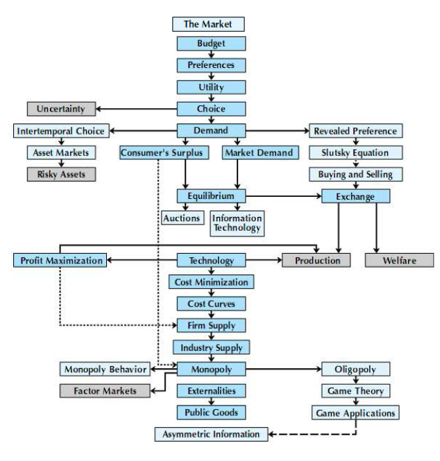
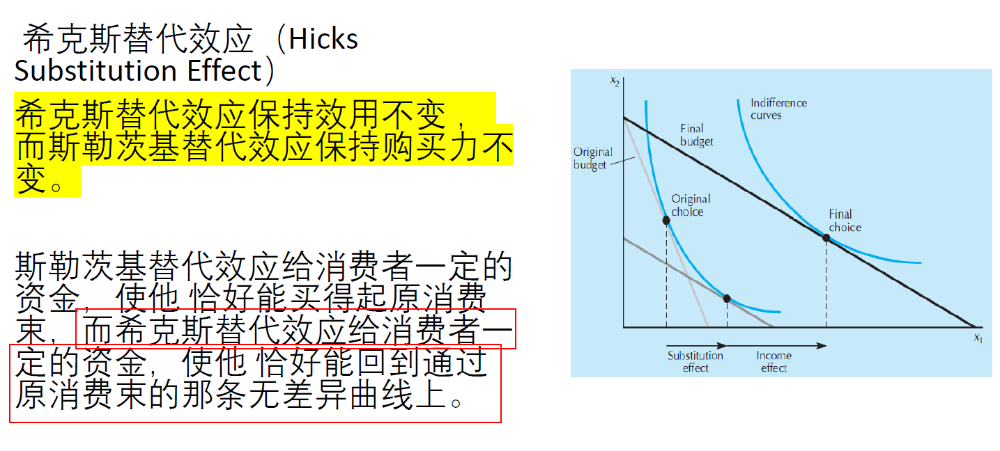
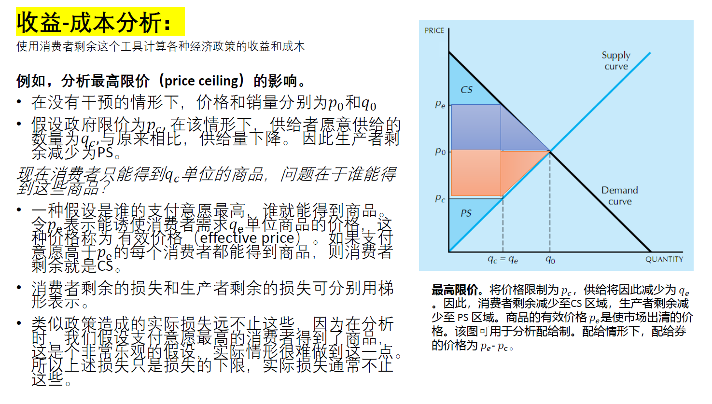
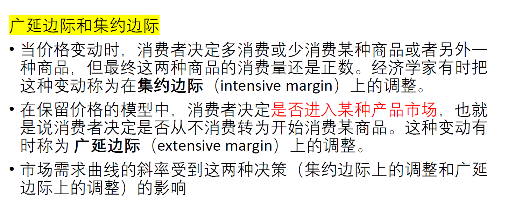
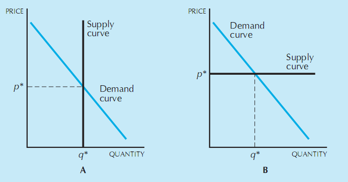
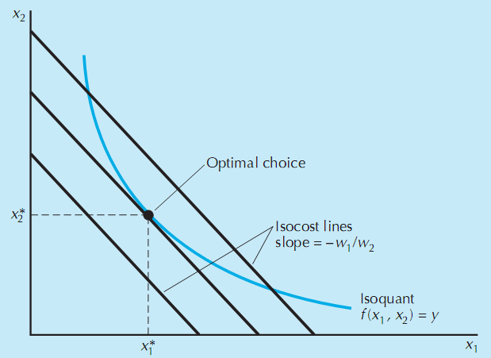
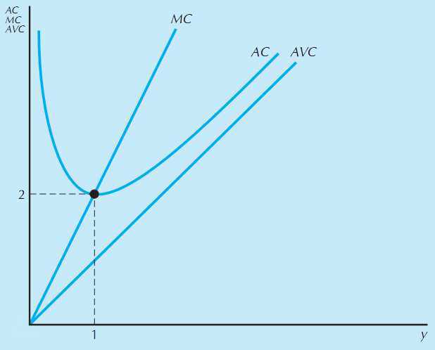
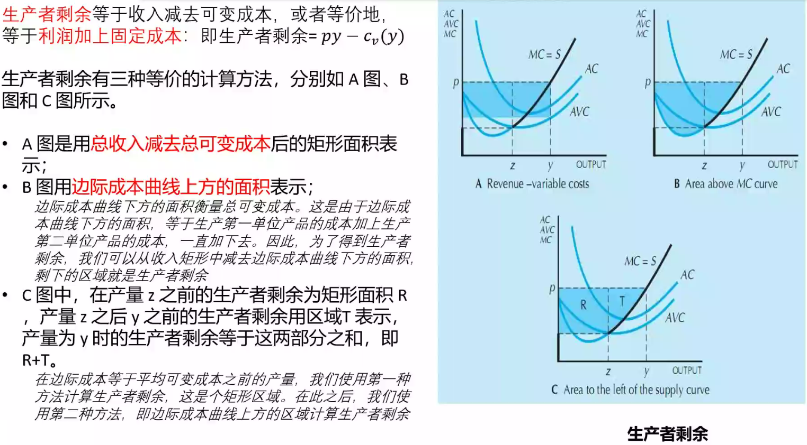

# 第一章 市场

## 基础知识

### 最优化与均衡

最优化原理：人们总是选择他们能支付得起的最佳消费方式；

均衡原理：价格会自行调整，直到人们的需求数量与供给数量相等。

### 比较静态分析

研究均衡价格和数量在基础条件变化时如何变化的理论称为比较静态学。

# 第二章 预算约束


## 基础知识

### 预算线的性质和变动

性质


变动：
- 收入变动
- 价格变动
- 税收
   - 从量税 $p_1+t$
   - 从价税 $(1+t)p_1$
- 补贴

## 练习题

Q1：消费者的初始预算线为 $p_{1}x_{1}+p_{2}x_{2}=m$。现在商品 1 的价格变为原来的 2 倍，商品 2 的价格变为原来的 8 倍，收入变为原来的 4 倍。写出新预算的表达式，其中价格和收入要分别以原来的价格和收入表示。

$2p_{1}x_{1}+8p_{2}x_{2}=4m$

Q2：如果商品 2 的价格上升，但商品 1 的价格和收入保持不变，那么预算线如何变动？

设初始预算线方程为$p_{1}x_{1}+p_{2}x_{2}=m$，它的斜率为$-p_{1}/p_{2}$，横截距为$m/p_{1}$，纵截距为$m/p_{2}$。当 $p_{2}$ 上升而 $p_{1}$ 和 $m$ 不变时，斜率绝对值变小，横截距不变，总截距变小。因此预算线绕着横截距点 $(m/p_{1},0)$ 向内转动（变得更平坦）。如下图所示：


```Stata
/*
s.t.
m =3000
p1 = 10; p2 = 300; p3 = p2*2

p1x1 + p2x2 = m -> x2 = (m - p1x1) / p2 
*/

clear
set obs 100

scalar m = 3000
scalar p1 = 30
scalar p2 = 100
scalar p3 = 2*p2

gen x1 = _n
gen x2 = (m-p1*x1)/p2 
gen x3 = (m-p1*x1)/p3 

tw (line x2 x1) (line x3 x1), scheme(plotplain)
graph export "$image/2.png", replace
```

## 拓展资料

>此次“武汉消费券”分为餐饮、商场、超市（便利店）、文体旅游四大类。今日起，武汉市民只要进入微信小程序“武汉消费券”即可订阅领券通知，4月19日中午12点正式开抢，每次可领一种券，面额分为10元、20元、50元及80元，第一波总额3000万消费券可领，领到的券将在20日生效。消费者通过小程序领到的武汉消费券，适用于采用微信商户支付结算的商户，使用个人版微信收款码的商户将无法核销“武汉消费券”。在活动商户处，消费者微信支付达到一定金额即可自动抵扣，无需额外操作。（[人民网](http://finance.people.com.cn/n1/2020/0417/c66323-31678143.html)）

**思考：新冠疫情期间，武汉市政府发放的消费券如何影响消费者预算线？对城乡居民的影响有何差异（加剧了不平等吗）**？

[经济观察网-消费券的效率与公平](http://www.eeo.com.cn/2020/0401/379878.shtml)

[人民网-消费券发放应兼顾公平和效率](http://money.people.com.cn/n1/2020/0406/c42877-31662696.html)

实际是增加消费者的可支配收入，使得持券者的预算约束向外移动。（收入效应）

虽然是普惠性质的消费券，但是消费券使用条件限制，农村地区没有大型商店，无法使用消费券。

>问：前段时间很多地方为了刺激消费，政府都发放了消费券，一般都是在指定的超市或商店满减。这些消费券会对消费行为产生什么样的影响？有没有达到预期的政策效果呢？有些农村偏远的地方并没有指定的商店（如沃尔玛、中百），这是不是一定程度上存在效率与公平的问题呢？
>发消费最直观的感觉是相当于变相补贴，会使预算约束线右移，会使消费者拥有更多的选择。但是不同收入人群对这点补贴的敏感度不一样，这种普惠的发券，岂不是没有精准向中老年投放更有效率（当然还要考虑到社会公平问题）。还有一个讨论是，发券和发钱那个更有效，不知道您有没有看过相关的资料或者文献。

答：关于消费券刺激经济的作用，我觉得要看1）消费券的资金来源：政府？企业？联合投资？，如果是政府的钱可能需要审批啊之类，但是如果金额不大可能手续也很简单，如果是企业肯定不需要审批是吧；2）消费券的金额：有些人都反映只抢到了几块钱，那这个作用就很有限；3）消费券的用途：消费券只能买特定的商品还是和现金的作用一样也是需要考虑的问题: 4）消费券的抢购和使用方法也会影响它的实际作用。
从效率上看，个人觉得现金的刺激消费者的消费作用应该更大，但是对企业不见得事件好事。因为消费券某种程度是企业先拿到钱，再提供优惠的，不管这个券有没有用完，钱其实应该早已经到企业的手里了。我确实没有关注武汉的消费券，因为它的力度貌似不大，总共1000万还是2000万人民币？你平均，每个人也就几块钱，效果应该没有很大，还需要抢，不是每个人都能拿到。如果有网络投机的人在里面，通过团伙作业的形式可能能抢到的比较多，其实公平和效率都没有顾及到我觉得； 但是武汉市发放消费券这件事本身可能给社会传达了正能量，就是政府采取措施刺激经济了。
美国给年收入低于7.5万美元的人每人发1200美元，通过这件事数据显示沃尔玛，亚马逊的消费量有明显的提高，包括电视，家居等耐用品，以及食品等日常用品都销量在现金支票到手后的一个星期都有所提高。

# 第三章 偏好


## 基础知识

### 偏好

假设有两个消费束 $(x_1,x_2)$和$(y_1,y_2)$：
- 严格偏好 $(x_1,x_2) \succ (y_1,y_2)$
- 弱偏好 $(x_1,x_2) \succeq (y_1,y_2)$
- 无差异偏好 $(x_1,x_2)\sim(y_1,y_2)$

#### 关于偏好的几种假设

**1. 完备性（complete）公理**。假设任何两个消费束 都可以比较，即给定$X $和消费束$ Y$，必有 $(x_1,x_2) \succeq (y_1,y_2)$ 或者 $(y_1,y_2) \succeq (x_1,x_2)$，或者二者都成立， 在最后一种情形中，消费者对于这两个束是无差异的。
**2. 反身性（ reflexive） 公 理 **。 假设任何消费束都至少和它本身一样好 $(x_1,x_2)\succeq(x_1,x_2)$。
**3. 传递性（ transitive）公 理 **。如果$(x_1,x_2)\succeq(y_1,y_2)$并且$(y_1,y_2)\succeq(z_1,z_2)$，则$(x_1,x_2)\succeq(z_1,z_2)$。换句话说，如果消费认为束 $X$ 至少和$ Y$ 一样好，而 且消费束$ Y $至少和 Z 一样好，则他认为消费束$X$至少和 $Z$ 一样好。

### 无差异曲线


思考：无差异曲线为什么不能相交？

因为相交就违背了

### 商品之间的关系

将偏好与无差异曲线联系起来，描述一些偏好（不同商品）的情况。

#### 完全替代品
#### 完全互补品
#### 中性商品
#### 餍足
#### 离散商品

### 良态偏好

### 边际替代率


MRS 的其他解释：
- MRS 是一种比率，在该比率下消费者敲好处于用商品 1 替代商品 2 的边际上。换句话说，消费者恰好愿意“支付”商品 1 来购买一些商品 2 。因此，有时人们说**无差异曲线的斜率衡量消费者的边际支付意愿（marginal willingness to pay）**。
- 偏好的凸性假设使 MRS 展现出另外一种行为。对于严格凸的无差异曲线来说，随着 $x_1$ 逐渐增加，无差异曲线的斜率的绝对值，即 MRS 会逐渐减少。因此，无差异曲线展现出**边际替代率递减（diminishing marginal rate of substitution）的性质**。

## 练习题
Q1：某大学橄榄球教练说，任意给定两个前锋比如 A 和 B ，他永远偏好身材更高大和速度更快的那个。他的这种偏好关系是传递的吗？是完备的吗？

**完备性**是指任何两个消费束都是可比较的，即假定有任意消费束 Y 和 X，若有 $(x_1, x_2) \geq (y_1, y_2)$  ，或者 $(y_1, y_2) \geq  (x_1, x_2)$ ，或者两种情况都有，在最后这种情况下，消费者对两个消费束无差异。**传递性**是指假如消费者认为 X 至少和 Y 一样好，Y 至少和 Z 一样好，那么就可以认为 X 至少和 Y 一样好。

回到上例，显然不满完备性，但是满足传递性。理由如下：

- 非完备。可以通过反证法证明：令下标 1 和 2 分别表示身材和速度，假设是完备的，则有 $A_{1} \geq B_{1}$ 并且 $A_{2} \geq B_{2}$ （或者 $B_{1} \geq A_{1}$ 并且 $B_{2} \geq A_{2}$）。但是当$A_{1} > B_{1}$ 但 $A_{2} > B_{2}$，即 A 身材更高但速度更慢，而 B 的身材更矮但速度更快，这种情形下选择谁？
- 是传递的。假设有 $A_{1} \geq B_{1}$ 并且 $A_{2} \geq B_{2}$ ，若 $B_{1} \geq C_{1}$ 并且 $B_{2} \geq C_{2}$ ，则必然有 $A_{1} \geq C_{1}$ 并且 $A_{2} \geq C_{2}$ 。 

Q2：面值 1 元的钞票与面值 5 元的钞票，计算它们之间的边际替代率。

边际替代率（marginal rate of substitution, MRS）为 无差异曲线的斜率，$MRS_{12} = \Delta x_1 /  \Delta x_2$，即消费者愿意用商品 2 去替代商品 1 的比率。

因此，本题的 $MRS_{12} = \Delta x_1 /  \Delta x_2 = 1 / -5 = - 1/5$，即减少5 张1 元的钞票，要增加 1 张 5 元的钞票才能使消费者还在原来的无差异曲线上。

## 拓展资料

> David L. Ortega, H. Holly Wang, Nicole J. Olynk, Laping Wu, Junfei Bai, Chinese Consumers' Demand for Food Safety Attributes: A Push for Government and Industry Regulations, *American Journal of Agricultural Economics*, Volume 94, Issue 2, January 2012, Pages 489–495, https://doi.org/10.1093/ajae/aar074

The random utility model (RUM) is used to analyze consumer preferences.


# 第四章 效用

## 基数效用和序数效用

## 边际效用与边际替代率


## 练习题

Q1：计算柯布-道格拉斯偏好（Cobb-Douglas Preferences）的边际替代率。

柯布-道格拉斯偏好的形式为：

$$
u(x_1,x_2) = x_{1}^{c}x_{2}^{d}
$$

其中，$c$ 和 $d$ 都是表示消费者偏好的正数。

若选择上述指数形式，则有：
$$
MRS = - \frac{\delta_u(x_1,x_2)/\delta x_1}{\delta_u(x_1,x_2)/\delta x_2} = \frac{cx_{1}^{c-1}x_{2}^{d}}{dx_{1}^{c}x_{2}^{d-1}}=- \frac{cx_2}{dx_1}
$$

若将柯布-道格拉斯偏好转换为对数形式，则有：
$$
u(x_1,x_2) = c\ln x_{1} + d \ln x_2
$$
求得边际替代率为：
$$
MRS = - \frac{\delta_u(x_1,x_2)/\delta x_1}{\delta_u(x_1,x_2)/\delta x_2} = \frac{c/x_1}{d/x_2}=-\frac{cx_2}{dx_1}
$$

Q2：效用函数 $u(x_1,x_2)=x_1+\sqrt{x_2}$ 表示什么类型的偏好？ 效用函数 $v(x_1,x_2)=x_{1}^2+2x_1\sqrt{x_2}+x_2$ 是的单调变换吗？

$u(x_1,x_2)=x_1+\sqrt{x_2}$ 表示拟线性偏好。因为 $x_1 \geq 0, x_2 \geq 0$（消费数量不能为负），所以 $u(x_1,x_2)=x_1+\sqrt{x_2} \geq 0$，对效用函数 $u(x_1,x_2)$ 做单调变换 $f(u)=u^2$ 可得 $f(u) = x_{1}^2+2x_1\sqrt{x_2}+x_2$，而这正是效用函数$v(x_1,x_2)$，因此 $v(x_1,x_2)$ 是 $u(x_1,x_2)$ 的单调变换。

## 拓展资料

>王老师，最近复习微观消费者选择理论的时候在想，目前谈论到好像都是单个消费者的选择问题，但是在现实中，一些决策往往是以家庭为单位，并未追求个人的效用最大化。尤其是农村资源禀赋有限的时候，农户的决策更是要考虑家庭的因素。比如对有些农户而言，外出务工可以挣更多的收入，但是考虑到孩子留守的问题，会选择在家务农。这个该怎么理解，将孩子照看好本身可以带来较大效用？

答：不过，以农村地区农民进城务工或者留守当地为例来看，就看效应是怎么衡量的？这的确是一个个人/家庭的选择，但是某种程度上也是符合效用最大化原理的，有些家庭比较看重金钱，觉得（短期的）金钱最大效用就最大，但是外出打工的弊端就是家庭关系疏远，老人无人照顾，留守儿童教育存在问题等；有些家庭比较注重家庭关系和还在的教育以及孩子未来的成长问题，顾忌这些因素，短期来看的确损失了一些金钱，但是我们也讲过效用是受个人的感觉/偏好影响的，如果你给这些因素赋予金钱价值的话，没有外出打工的家庭效用不一定低，对吧？

还有我们讲过机会成本的概念，外出打工可以换回现金金钱，同时放弃了家庭亲情，孩子教育。如果我们说工资是一部分，但是没有外出打工的家庭可能由于家庭关系比较好（假设值1000块），孩子被关心和教育的比较好（假设值2000），那么这个家庭的收入可能也不一定比别的 人低。如果十年后，非留守儿童考上大学改变了自己甚至整个家庭的命运，和留守儿童初中辍学进城打工，然后走父辈的路相比，可能没有进城打工的家庭效用会更大。

### 基于随机效用理论的多项Logit(MNL)模型

Ortega et al.(2011)

# 第五章 选择

## 最优选择

> 拉格朗日函数

## 估计效用函数

# 第六章 需求

## 正常商品与低档商品

## 普通商品与吉芬商品

## 替代和互补

## 反需求函数

# 第七章 显示偏好

# 第八章 斯勒茨基方程

## 基础知识

#### 斯勒茨基方程

研究消费者的选择怎样随价格变化而变化。

某种商品价格改变时，将产生替代效应和收入效应两种效应。


#### 希克斯替代效应




## 练习题

假设消费者对牛奶的需求函数为：$x_{1}=10+\frac{m}{10p_{1}}$，起初他的收入为每周120元，牛奶的价格为每单位 3 元，现在假设牛奶的价格降低为每单位 2 元。计算替代效应和收入效应。

**替代效应：**

首先，为了保持原来的牛奶购买数量，在价格变动的背景下，收入变动为：
$$
\Delta m = \Delta p_{1}x_{1} = (2-3)*(10+\frac{120}{10*3}) = -14
$$
因此，能让购买力不变的收入水平为：$m'=m+\Delta m=120-14=106$

新的价格和收入水平下，牛奶的购买量为：
$$
x_{1}'(p_1',m')=10+ \frac{106}{10*2} = 15.3
$$
替代效应为：$\Delta x_{1}'=x_{1}'(p_1',m')-x_1(p_1,m)=15.3-14=1.3$ 单位。

**收入效应：**
$$
\Delta x_{1}^n = x_1(p_{1}',m)-x_1(p_{1}',m')=16-15.3=0.7
$$
因为纽海对于消费者来说是正常商品，收入增加时牛奶的需求也增加。


# 第九章 购买和销售

## 基础知识

## 练习题

# 第十章 跨时期选择

## 基础知识
## 练习题
Q1：当利率增加时，跨期预算线变得更陡峭还是更平坦？

Q2：若利率为 20%，20年后的100万元相当于今天的多少钱？

```Stata
scalar r = 0.2
scalar t  = 20 
scalar fv = 100

scalar pv = fv/(1+r)^t  
dis "现值为: "pv "万元"
```

Q3：若利率为 10%，一年后的 100 元钱的现值是多大？如果利率是 5% 呢？

```Stata
scalar r1 = 0.1
scalar r2 =  0.05
scalar t  = 1 
scalar fv = 100

forvalues i = 1/2{
	scalar pv = fv/(1+r`i')^t  
	dis "利率为r`i'时，现值为: "pv "元" 
}
```

# 第十一章 资产市场

# 第十二章 不确定性


# 第十三章 风险资产

# 第十四章 消费者剩余

## 基础知识

### 消费者剩余

### 补偿变化和等价变化

假设一个消费者的效用函数是$u(x_1,x_2)=x_{1}^\frac{1}{2}x_{2}^\frac{1}{2}$，他最初面临的价格是$(1,1)$，收入是100。然后商品1的价格上升至2，此时，补偿变化和等价变化各是多少？**

（柯布-道格拉斯需求函数的求解，见教材$P_{60}$）

对于柯布-道格拉斯效用函数，相应的需求函数可以由下式给出：
$$
x_1 = \frac{m}{2p_1},x_2 = \frac{m}{2p_2}
$$
运用上述公式，可求得消费者需求从$(x_{1}^\star,x_{2}^\star)=(50,50)$变动到$(\hat x_{1},\hat x_{2})=(25,50)$。

**计算补偿变化：即考虑在价格$(2,1)$下，消费者需要拥有多少货币才能使其境况与消费束$(50,50)$时一样好。**令$m$表示货币量，将$m$和价格$(2,1)$代入需求函数，求得消费者最优选择的消费束为：
$$
x_1 = \frac{m}{2*2},x_2=\frac{m}{2*1} \Rightarrow (\frac{m}{4},\frac{m}{2})
$$
令此消费束的效用等于消费束$(50,50)$，可得：
$$
(\frac{m}{4})^\frac{1}{2}(\frac{m}{2})^\frac{1}{2} = 50^\frac{1}{2}50^\frac{1}{2}
$$
求解$m$，可得：
$$
m = 100 \sqrt{2} \approx 141
$$

因此，在价格变动之后，要使消费者的境况与价格变化前的境况一样好，就大约需要补偿他 $141-100=41$ 元。

**计算等价变化：即考虑在价格$(1,1)$下，消费者必须拥有多少货币才能使其境况与消费消费束$(25,50)$时的境况一样好。**令$m$表示货币量，将$m$和价格$(1,1)$代入需求函数，求得消费者最优选择的消费束为：
$$
(\frac{m}{2})^\frac{1}{2}(\frac{m}{2})^\frac{1}{2} = 25^\frac{1}{2}50^\frac{1}{2}
$$
求得$m$为：
$$
m = 50 \sqrt{2} \approx 70
$$
所以在初始价格下，如果消费者拥有 70 元，那么他的境况就与新价格下拥有 100 元一样好。因此，收入的等价变化大约为 $100-70=30$ 元。

### 生产者剩余

供给曲线上方的面积为生产者剩余，它测度的是商品供给者享有的剩余。

利用生产者的反供给曲线$p_{s}(x)$进行分析，这个函数测度的是使生产者供给$x$单位商品所必需的价格。

### 收益-成本分析



## 练习题

Q1：考察线性需求曲线$D(p)=20-2p$。当价格从 2 上升至 3 时，相应地，消费者剩余的变化是多少？

```Stata
clear
set obs 200

gen q = _n
gen p = (20-q)/2 
keep if  p >0
gen p1 = 2
gen p2 = 3

line p q || (rarea p p1 q if q <= 16 & p <= 3, sort color(gray)) || ///
	(rarea p1 p2 q if q <= 14,sort color(gray)), ///
	scheme(qleanmono) plotregion(margin(sides)) legend(off) /// 
	title("消费者剩余的变化") ///
	ytitle("p") xtitle("q") ///
	yline(2,lp(dash)) xline(16,lp(dash)) ///
	yline(3,lp(dash)) xline(14,lp(dash)) ///
	ylabel(0(2)10 2 3) xlabel(0(4)20 14 16) ///
	text(6.5 10  "{it:D(P) = 20 - 2*P}") ///
	text(2 17 "{it:(16,2)}")  ///
	text(3 15 "{it:(14,3)}") ///
	text(2.5 6 "{it:S =½(14+16)*1 = 15 }")
```

Q2:假设需求曲线为$D(p)=10-p$，供给曲线为$S(p)=p+2$。

- a. 求市场的均衡价格和消费量？
- b. 如果价格从4上升为6，消费者剩余变动了多大？生产者剩余变动了多大？
- c. 如果政府对每一单位的商品征收1元的消费税，消费者剩余和生产者剩余的变化如何？

# 第十五章 市场需求

## 基础知识

### 市场需求
个体需求加总为市场需求。

### 广延边际（Extensive Marginal）和集约边际（Intensive Margin）



### 弹性
价格弹性：
收入弹性：
（是后面分析销售收入最大化的基础）
影响商品弹性的因素
弹性与边际收入的关系：e<1,MR与p正相关。
收入弹性将商品区分为正常商品和劣等商品。

## 练习题

Q1: 一个吸毒成瘾的人对品需求函数可能是非常缺乏弹性，但但毒品的市场需求函数却有可能是非常富弹性。请解释原因。
吸毒成瘾者：集约边际，弹性较小；
吸毒市场：广延边际，新的吸毒者会根据价格变化选择是否吸毒。

Q2：假设 $D(p)=12-2p$，能使收益最大化的价格是什么？

```Stata
clear
set obs 200

gen p = _n
gen d = 12-2*p
gen s = d*p
drop if s < 0

scatter s p || qfit s p, ///
xline(3, lp(dash)) text(18.5 3 "(3, 18)")
```

## 拓展知识

### QUAIDS 模型
估计商品的弹性


# 第十六章 均衡

## 基础知识

### 均衡
**完全竞争市场**：我们假设每个需求者和供给者都是既定价格的接受者，即假设个体不能影响价格，他们能做的事情就是对给定的市场价格作出最优的反应。如果某市场中的任何个体都不能影响价格即只能接受给定的价格。



市场均衡的两种特殊情形:
- 在A 图中，供给曲线为一条垂线，此情形下均衡价格完全由需求曲线决定；
- 在B 图中，供给曲线为一条水平线，此情形下均衡价格完全由供给曲线决定。

#### 反需求曲线和反供给曲线

#### 比较静态分析

无论使用哪种方法，令需求量等于供给量或者令需求价格等于供给价格，都可以找到一个均衡状态。**在找到了这个均衡状态之后，我们可以分析当需求曲线和供给曲线变动时，该均衡状态是怎么变动的**。例如，如果需求曲线向右平移——每个价格水平下需求量都增加了相同数额——均衡价格和均衡数量必然都会上升。另一方面，如果供给曲线向右平移，均衡数量增加，但均衡价格必然下降。

### 税收
#### 征税的比较静态分析

#### 税收的转嫁

谁承担的税收更多，取决于需求弹性或者供给弹性。

#### 征税的净损失（deadweight loss）
税收的额外损失等于征税引起的消费者剩余的净损失（net loss）。

### 帕累托效率/均衡

帕累托效率（Pareto efficient）是指一种经济状态，在这种状态下已无法做到让任何人的状况进一步改善而又不损害其他人的状况。

## 练习题

Q1：假设需求曲线和供给曲线都是线性的：
$$
D(p) = a-b\times p \\
S(p) = c + d \times p
$$
（1）求出相应的均衡价格和均衡数量；

（2）找到反需求曲线和反供给曲线，并解出均衡价格和均衡数量。

Q2：假设现在对需求者征税，对需求和供给函数的影响？对市场均衡价格和数量的影响？画图说明。

Q3：利用反需求和反供给函数表示的话，又有什么影响？

Q4:如果市场的供给曲线是水平的，那么生产补贴将有什么反应？

Q5：

Q6：为了应对疫情对经济的影响，政府采取的措施的效果？


Q7：在当前的国际背景下，中国经济的出路？

# 第十七章 测度

概括

估计

检验

预测

预计

# 第十八章 拍卖

# 第十九章 技术

## 基础知识

### 技术替代率

### 边际产品递减

### 规模报酬

## 练习题

## 拓展知识

# 第二十章 利润最大化

## 基础知识

### 利润

短期最大化：

短期内，只有$x_1$的投入量是变化的
$$
max_{x_{1}} p f(x_1,\bar x_{2}) - w_{1}x_{1}-w_{2} \bar x_{2}
$$

长期利润：
长期内，企业可以选择所有要素的投入量。
$$
max_{x_{1}} p f(x_1,\bar x_{2}) - w_{1}x_{1}-w_{2}x_{2}
$$

### 利润最大化和规模报酬

# 第二十一章 成本最小化

## 基础知识

### 成本最小化



使生产成本最小化的要素选择可以通过在等产量线上找出与最低成本线相切的那个点来确定。

### 沉没成本

## 练习题

## 拓展知识

# 第二十二章 成本曲线

## 基础知识

### 平均成本

### 边际成本

### 边际成本和可变成本

例子：

考察成本函数$c(y)=y^2+1$，从中，我们可以推导出以下成本函数：

可变成本：$c_v(y)=y^2$

固定成本：$c_f(y)=1$

平均可变成本：$AVC=\frac{y^2}{y}=y$

平均不变成本：$AFC(y)= \frac {1}{y}$

平均成本：$AC(y)=\frac{y^2+1}{y}=y+\frac{1}{y}$

边际成本：$MC(y)=2y$



### 长期边际成本

## 练习题

## 拓展知识


# 第二十三章 厂商供给

## 基础知识

从成本函数推导供给曲线

## 练习题

## 拓展知识


# 第二十四章 行业供给

## 基础知识

### 利润和生产者剩余



## 练习题

## 拓展资料

# 第二十五章 垄断

## 基础知识

## 练习题

## 拓展知识


# 第二十六章 垄断行为


## 基础知识

### 买方垄断
### 寡头垄断
寡头垄断企业的策略选择：价格领导者；价格追随者；产量领导者；产量追随者

## 练习题
如果劳动力市场是买方垄断的，而且假设政府设定的最低工资高于竞争工资...

## 拓展知识

# 第二十七章 要素市场

# 第二十八章 寡头垄断