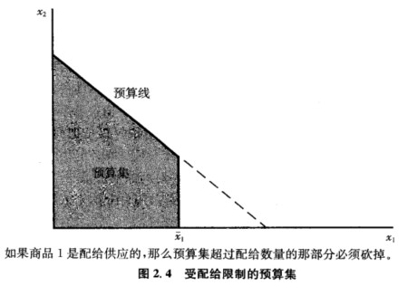
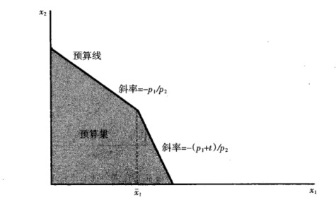
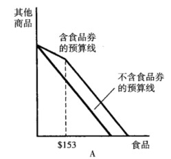
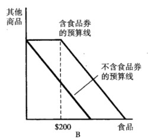

>20200928 16:43

## 2. 预算约束

### 2.1 复合商品假说

两种商品的模型虽然简化，但具有合理性，我们可以把 $x_1$ 作为要研究的商品，$x_2$ 代表除了 $x_1$ 之外的消费者要消费的其他一切商品。 用商品 2 代表除商品 1 之外的消费者要消费的其他一切东西的假设就是复合商品假说。

好处：复合商品假说使消费者行为的分析框架更加简洁而清晰，如在预算线和无差异曲线等的分析中，复合商品假说使所分析的商品只有两种，即要分析的一种商品 1 和其他复合商品 2。一个最经常的假设就是把商品 2 看作是消费者可以用来购买其他商品的货币，货币的价格当然为 1，此时预算约束为：$p_1x_1+p_2x_2 \leq m$ 。

### 2.2 预算线的含义及其变动

#### 2.2.1 预算线的含义

消费者在收入 $m$、商品价格 $p$ 既定时，能购买到的商品的不同数量的组合。假设有两种商品中，有一种商品是复合商品。（$x_1$ 是特定商品，$x_2$ 是复合商品），那么预算线公式为：$p_1x_1+p_2x_2\leq m$，斜率为 $-p_1/p_2$。

预算线的斜率衡量了市场中商品 1 替代商品 2 的比率。说明如下：

问题：假设消费者增加商品 1 的消费量为 $\Delta x_1$，此时，商品 2 的消费量如何变化才能恰好满足预算约束？

令 $\Delta x_2$ 表示商品 2 消费量的变化，由于消费量变动前后都需要满足预算约束，则有：

$$
p_1x_1+p_2x_2 = m  \\
p_1(x_1+ \Delta x_1) + p_2(x_2 + \Delta x_2) = m
$$

由第二个式子减去第一个式子可得：

$$
p_1 \Delta x_1 + p_2 \Delta x_2 = 0
$$

即消费变动的价值之和等于 0。由上式解出 $\Delta x_2 / \Delta x_1$ 可得：

$$
\frac{\Delta x_2}{\Delta x_1} = - \frac{p_1}{p_2}
$$

上式说明要重新满足预算约束的条件，用商品 1 替代商品 2 的比率，而这正好是预算线的斜率。

### 2.2.2 计价物

若用两个商品价格和一个价格来确定预算线，其中有一个变量是多余的，可以将其中一个价格或者收入看成是固定不变的，然后调整另外两个变量，这样可以描绘出同样的预算线。而**其中价格被限定为 1 的商品就是计价物（numeraire）价格**，这么做的好处在于可以少考虑一种价格。

#### 2.2.3 预算线的变动

完全平衡的通货膨胀：价格和收入以同样比率上涨——不会影响预算约束，不改变最佳选择

收入：平移。

价格：转动。

经济政策：

- 税收（作用：提高价格）

  - 从量税：消费者按照购买商品的数量支付的税收。若对商品 1 征收 $t$ 单位的从量税，则预算线变动为 $(p_1+t)x_1+p_2x_2$，使得预算线变陡。
  - 从价税：消费者按照购买商品的价格支付的税收，常用%表示。若对商品 1 征收 $\tau$ 的从价税，则预算线为 $(1+\tau)x_1+p_2x_2$，同样使得预算线变得陡峭。
  - 总额税：使预算线内移。

- 补贴（作用：降低价格）

  - 从量补贴：政府按照消费者购买商品数量进行的补贴。若对消费者购买商品 1 给予 $s$ 单位的补贴，则有 $(p_1-s)x_1+p_2x_2$，使得预算约束线变平缓。
  - 从价补贴：政府按照消费者购买价格给予的补贴，常用%表示。若政府对商品 1 给予 $\sigma$ 单位补贴，则有 $(1-\sigma)p_1x_1+p_2x_2$，使得预算约束线变平缓。
  - 总额补贴：预算线外移。

- 配给（政府控制供给数量）

  

  原来的预算集，砍去了“超过部分”--消费者买得起但超过控制数量的部分。

- 税收和配给的混用

  假设：消费者按照价格 $p_1$ 消费最多为 $\bar x_1$ 数量的商品 1，接着对超过 $\bar x_1$ 的所有消费支付税收 $t$。则其预算线为：

  

  在 $\bar x_1$ 左侧的斜率为 $-p_1/p_2$，右侧为 $-(p_1+t)/p_2$。

### 2.3 例子：食品券计划

从价补贴：家庭每月可得 153 元的食品券。

- 家庭月收入 300 元，购买 153 元食品券，要 83 元；
  - 补贴率=1-83/153=46%；预算线斜率=-83/153；
- 家庭月收入 100 元，购买 153 元食品券，要 25 元。
  - 补贴率=1-25/153=84%；预算线斜率=-25/153。

效果：**随收入的增加，**预算线斜率越陡。

总额补贴：把 200 元食品券发给符合要求的家庭，用于购买食品。实质是一种总额补贴。

### 2.4 练习题

1.假设预算线方程 $p_1x_1+p_2x_2 =m$；现在政府决定：对消费者征收定额税 $u$；对每单位商品 1 征收 $t$ 元从量税；对每单位商品 2 补贴 $s$ 元。求新预算线的表达式。

答案：$(p_1+t)x_1+(p_2-s)x_2=m-u$

2.如果消费者的收入增加，同时其中一种商品价格下降，消费者的状况至少与原来一样好吗？

答案：预算线变动后，新的预算集包含原来的预算集，而且，新的预算集还增加了新的消费选择，因此消费者的状况至少与原来一样好。