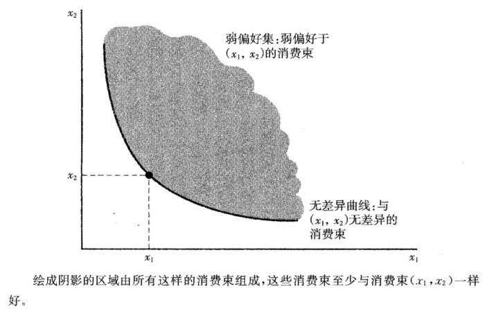
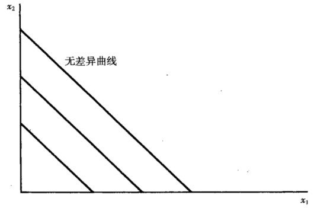
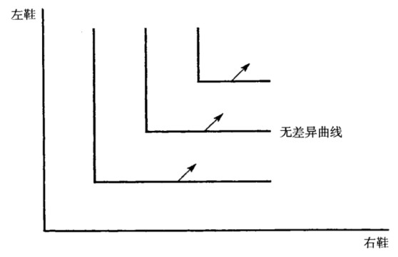
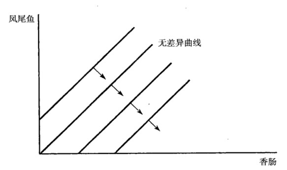
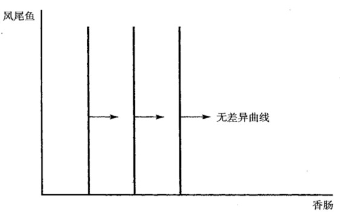
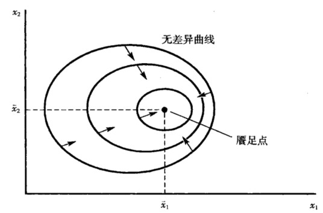
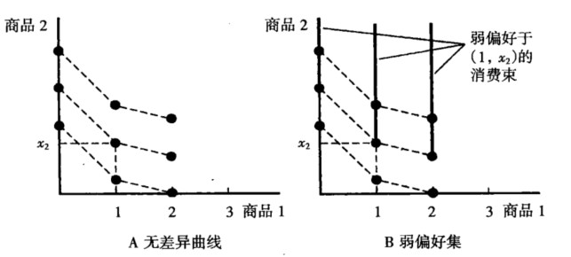
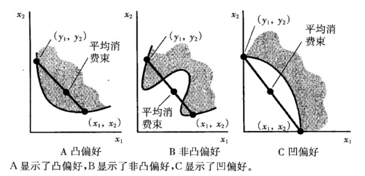

## 3.偏好

### 3.1 偏好关系及其公理

#### 3.1.1 偏好关系

- 严格偏好：$(x_1,x_2)\succ(y_1,y_2)$
- 无差异：$(x_1,x_2)\sim(y_1,y_2)$
- 弱偏好：$(x_1,x_2)\succeq(y_1,y_2)$

#### 3.1.2 公理

完备性：指任何两个消费束都是可比较的。
反身性：任何消费束至少与本身同样好。
传递性：指假如消费者认为 $(x_1,x_2) \succeq (y_1,y_2)$，并且 $(y_1,y_2) \succeq (z_1,z_2)$，那么可以认为 $(x_1,x_2) \succeq (z_1,z_2)$。

这三条公理形成所谓的“理性”。一个有理性的当事人能作出选择，而且他的选择是一致的。(平新乔《微观经济学十八讲》)

### 3.2 无差异曲线

无差异曲线和偏好之间什么关系？

无差异曲线是描述偏好的工具。根据偏好的三条公理，使用无差异曲线来描述偏好。

弱偏好集：弱偏好于 $(x_1,x_2)$ 的消费束。如上图所示，至少和消费束 $(x_1,x_2)$ 一样好的所有消费束组成的集合。

无差异曲线：与 $(x_1,x_2)$ 无差异的消费束。

无差异曲线的特点：

- 任意两条曲线不能相交（违背传递性）；
- 无差异曲线上的箭头：标示更受偏好的消费束的方向。

### 3.3 特殊偏好的无差异曲线

#### 3.3.1 完全替代品

完全替代品：消费者愿意以**固定比率**将一种商品**替换**为另一种。完全替代品的重要特征：

- 无差异曲线有固定的斜率，但不一定是-1；
- 偏好方向朝向右上方。

#### 3.3.2 完全互补品

完全互补品：指几种商品按固定的比例被一起消费的商品。完全互补品的重要特征：

- 无差异曲线呈 L 型，L 的顶点为左鞋和右鞋数量相等的地方；
- 以固定的比例被消费，但比例不一定是 1: 1；
- 偏好方向朝向右上方。

#### 3.3.3 厌恶品

厌恶品：指消费者不喜欢的商品。于是设计一种方案：消费一种厌恶品，给予消费者喜欢的商品进行补偿。书中的例子：凤尾鱼是消费者的厌恶品，香肠是嗜好品，消费凤尾鱼的时候给予香肠进行补偿。厌恶品的特征：

- 无差异曲线正斜率；
- 偏好方向朝右下方。

#### 3.3.4 中性商品

中性商品：指某种商品消费者可有可无。假设凤尾鱼是中性商品，那么：

- 无差异曲线是垂线：消费者只关心得到多少香肠，不关心得到多少凤尾鱼；
- 偏好增加的方向：右方，即增加香肠的消费；
- 凤尾鱼对香肠的边际替代率为 0。

#### 3.3.5 餍足

餍足：对于消费者而言，消费束越接近饱和点，消费者越喜欢。有最佳的消费束 $(x_1,x_2)$，越接近 $(x_1,x_2)$ 越好，则 $(x_1,x_2)$ 是餍足点或最佳点。餍足的特征：

- 当两种物品都“太少”或“太多”时，无差异线的斜率为负：
- 当一种物品“太多”时，无差异线的斜率为正。这物品是厌恶品——减少厌恶品，更接近“最佳点”。
- 当两种物品都太多，那么两种物品都是厌恶品，减少对两种物品，更接近最佳点。

#### 3.3.6 离散商品

离散商品：商品的消费数量只能是整数。假设商品 1 是离散商品，与给定消费束无差异的消费束是离散点集，与给定消费束至少一样好的消费束集是一组线段。

### 3.4 良好性状偏好

良好性状偏好：单调的、凸的。

- 单调的：如果 $y_1 \geq  x_1$ 且 $y_2 > x_2$ 或者 $y_1 > x_1$ 或者 $y_2 \geq  x_2$，则必有 $(y_1,y_2) \succ (x_1,x_2)$。这意味着：
  - 只能是正常商品，而非厌恶品，在达到餍足点之前“越多越好”；
  - 无差异曲线的单调性：斜率为负。
- 凸的：如果 $(x_1,x_2) \sim (y_1,y_2)$，则对于任意 $t，0 \leq t \leq 1$，$(tx_1+(1-t)y_1,tx_2+(1-t)y_2) \succeq (x_1,x_2)$ 都成立。这意味着：
  - “平均消费束”至少与“端点消费束”一样好，或者受偏爱；
  - 为什么要假设良好性状的偏好是凸的？现实情况中，消费者会消费多种商品。

凹状偏好：“端点消费束”比“平均消费束”受偏爱。比如白酒和啤酒的偏好，如果把白酒和啤酒各一半混用，消费者的偏好不如分别消费白酒和啤酒。

严格凸偏好：“加权平均消费束**严格好于**“端点消费束”。完全替代品的偏好是凸的，但不是严格凸的。凸偏好的无差异曲线可能包含直线，但严格凸偏好的无差异曲线必须是弧形的，不能包含直线。

_拟线性偏好：**$k = v(x_1)+x_2$**，消费者的无差异曲线是由无差异曲线互相垂直移动得到。_

---

【补充】凸函数：$f [\lambda x_1+(1-\lambda)x_2] ≤ \lambda f(x_1) + (1-\lambda)f(x_2), \lambda \in (0,1)$
判别：求二阶导数

- $f''(x) \geq 0$ $\rightarrow$ 凸函数；
- $f''(x) ＞ 0$ $\rightarrow$ 严格凸函数。

性质：

- 凸 $\rightarrow$ $f '(x)$ 在该区间上单调递减 $[x_1>x_2→f(x_1)<f(x_2)]$；
- 凸 $\rightarrow$ 函数，在它的切线的上方： $f(y) \geq  f(x) + f '(x) (y − x)$。
- 凸 $\rightarrow$ 如果 $f '(c) = 0$， $c$ 是 $f(x)$ 的最小值。

---

### 3.5 边际替代率

边际替代率（Marginal Rate of Substitution, MRS）:消费者在保持相同满足程度时，愿意用一种商品替代另一种商品的比率。边际替代率等于无差异曲线在该点的斜率。偏好的单调性，决定无差异曲线斜率为负，所以，边际替代率为负。

边际替代率可以描述无差异曲线的形状：

- 不变的边际替代率：完全替代品；
- 边际替代率无穷大：中性物品；
- 边际替代率为 0，或无穷大：完全互补品

#### 3.5.1 边际替代率的其他解释

边际替代率衡量边际支付意愿。即，消费者处于交换与不交换的边际支付意愿上。边际替代率衡量一种意愿，即为多消费商品 1，而愿意放弃商品 2 的数量，就如同为多消费商品 1 而支付。为了得到某一个额外消费数量，实际付出的数量与愿意付出的数量也许不同。获得少量的额外商品，实际付出的数量取决于商品的价格，愿意付出的数量取决于偏好。获得大量的商品，实际付出的数量取决于偏好、价格。

#### 3.5.2 边际替代率递减规律

偏好的凸性假设使得，对于严格凸的无差异曲线来说，随着 $x_1$ 逐渐增加，无差异曲线的斜率的绝对值 $|MRS_{12}|$ 会逐渐减少。因此，无差异曲线展现出边际替代率递减（diminishing marginal rate of substitution）的规律。

### 3.6 练习题

1.某大学橄榄球教练说，任意给定两个前锋比如 A 和 B ，他永远偏好身材更高大和速度更快的那个。他的这种偏好关系是传递的吗？是完备的吗？

**完备性**是指任何两个消费束都是可比较的，即假定有任意消费束 Y 和 X，若有 $(x_1, x_2) \geq (y_1, y_2)$ ，或者 $(y_1, y_2) \geq  (x_1, x_2)$ ，或者两种情况都有，在最后这种情况下，消费者对两个消费束无差异。

**传递性**是指假如消费者认为 X 至少和 Y 一样好，Y 至少和 Z 一样好，那么就可以认为 X 至少和 Y 一样好。

回到上例，显然不满完备性，但是满足传递性。理由如下：

- 非完备。可以通过反证法证明：令下标 1 和 2 分别表示身材和速度，假设是完备的，则有 $A_{1} \geq B_{1}$ 并且 $A_{2} \geq B_{2}$ （或者 $B_{1} \geq A_{1}$ 并且 $B_{2} \geq A_{2}$）。但是当 $A_{1} > B_{1}$ 但 $A_{2} > B_{2}$，即 A 身材更高但速度更慢，而 B 的身材更矮但速度更快，这种情形下选择谁？
- 是传递的。假设有 $A_{1} \geq B_{1}$ 并且 $A_{2} \geq B_{2}$ ，若 $B_{1} \geq C_{1}$ 并且 $B_{2} \geq C_{2}$ ，则必然有 $A_{1} \geq C_{1}$ 并且 $A_{2} \geq C_{2}$ 。

  2.面值 1 元的钞票与面值 5 元的钞票，计算它们之间的边际替代率。

边际替代率（marginal rate of substitution, MRS）为 无差异曲线的斜率，$MRS_{12} = \Delta x_1 /  \Delta x_2$，即消费者愿意用商品 2 去替代商品 1 的比率。

因此，本题的 $MRS_{12} = \Delta x_1 /  \Delta x_2 = 1 / -5 = - 1/5$，即减少 5 张 1 元的钞票，要增加 1 张 5 元的钞票才能使消费者还在原来的无差异曲线上。
