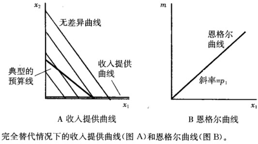

## 6. 需求

一种商品的需求量，是所有商品价格、收入的函数，记作：$x_1 = x_1(p_1, p_2, m)$。

###  6.1 正常商品和劣等商品

正常商品：收入增加需求增加，收入下降需求下降；

劣等商品：收入增加需求下降。

---

奢侈品：当收入增加，某种商品的需求增加的速度比收入增加的速度快；

必需品：当收入增加，某种商品的需求增加速度比收入增加的速度慢。

普通商品：普通商品的价格下降，需求量上升；

吉芬商品：价格下降，其需求量反而下降。（这是因为价格的变化在某种程度上类似收入的变化，即使货币收入不变，某商品的价格变化也会改变购买力，因此改变需求）

---

### 6.2 收入提供曲线和恩格尔曲线

**收入提供曲线**：也叫收入扩展线。是价格保持不变时，不同收入上的最优选择。是由收入增加时预算线向外平移产生的一系列需求束，将这些需求束连接起来就得到收入提供曲线（income offer curve）。如果两种商品都是正常商品，那么收入提供曲线的斜率为正。

**恩格尔曲线**：价格不变时，不同收入水平下对应的商品最优选择。在所有商品价格不变的情况下，将某种商品的需求视作收入的函数而得到的曲线。（横轴为$x_1$，纵轴为$m$）

### 6.3 特殊偏好的收入提供曲线和恩格尔曲线

#### 6.3.1 完全替代

收入提供曲线：如果$p_1＜p_2$，消费者专门消费商品1，那么收入增加，商品1的消费增加。因此，收入提供曲线就是横轴。
恩格尔曲线：对商品1的需求：$x_1＝\frac{m}{p_1}$，恩格尔曲线是一条斜率等于$p_1$的直线。

#### 6.3.2 完全互补

收入提供曲线：消费者对每种商品消费相同的数量，所以收入提供曲线总是一条经过原点的对角线。

恩格尔曲线：商品l的需求是$x_1＝\frac{m}{(p_1+p_2)}$，恩格尔曲线是—条斜率为$(p_1+p_2)$的直线。

#### 6.3.3 柯布道格拉斯偏好

如果$u(x_1,x_2)=x_1^ax_2^(1-a)$，商品1的柯布道格拉斯需求函数为$x_1=\frac{am}{p_1}$，商品2的柯布道格拉斯需求函数为$x_2=\frac{(1-a)m}{p_2}$。

#### 6.3.4 位似偏好

如果存在消费束$(x_1,x_2)$和$(y_1,y_2)$，消费者偏好$(x_1,x_2) \succ (y_1,y_2)$，那么：

对于任意$t>0$，消费者都将偏好$(tx_1, tx_2)$胜过$(ty_1, ty_2)$。

完全替代、完全互补和柯布道格拉斯偏好都是位似偏好。

如果消费者具有位似偏好，那么收入提供曲线是经过原点的直线。相似偏好要求商品的需求同收入同比例递增或者递减，所以位似偏好的恩格尔曲线是直线。

#### 6.3.5 拟线性偏好

拟线性偏好：收入增加根本不影响商品1的需求，所有多余的收入都用于消费商品2。生活中，拟线性偏好的商品如牙膏和食盐。

### 6.4 普通商品和吉芬商品

普通商品：普通商品的价格下降，需求量上升；

吉芬商品：价格下降，其需求量反而下降。（这是因为价格的变化在某种程度上类似收入的变化，即使货币收入不变，某商品的价格变化也会改变购买力，因此改变需求）

**启示：效用最大化模型需要对消费行为作出某些假设限制。**

### 6.5价格提供曲线和需求曲线

价格提供曲线：当一种商品价格变化，而另一种商品价格和收入不变时，需求与价格的关系。每一条无差异曲线与相应的预算线相切，把最优点（即切点）连接起来即为价格提供曲线（price offer curve）。

**需求曲线：假设商品2的价格和收入不变，对每个不同$p_1$值画出商品1的最优消费水平，就得到需求曲线。**一般商品的需求曲线负斜率，吉芬商品的需求曲线为正斜率。

### 6.6 特殊偏好的需求曲线

#### 6.6.1 完全替代

当$p_1>p_2$时，商品1的需求为0；当$p_1=p_2$时，商品1的需求是预算线上的任一数量；当$p_1<p_2$时，商品1的需求等于$m/p_1$。

#### 6.6.2 完全互补

价格提供曲线：对角线。因为无论价格如何，商品1和商品2的需求量总是相同的。

需求曲线：商品1的需求曲线$x_1=\frac{m}{p_1+p_2}$，令$m$和$p_2$固定，得到如图所示的需求曲线。

#### 6.6.3 离散商品

保留价格：使得消费者消费或不消费，刚好无差异的那个价格。

### 6.7 替代和互补

替代品：如果$P_{x_2}$上升，$x_1$上升，即$\frac{\Delta x_1}{\Delta x_2} > 0$；

互补品：如果$P_{x_2}$上升，$x_1$下降，即$\frac{\Delta x_1}{\Delta x_2} < 0$。

### 6.8 反需求函数

需求曲线：保持$p_2$和$m$不变，画出$p_1$和$x_1$的关系，即为需求曲线；

反需求曲线：将价格视为需求量的函数$p_1 = f(x_1)$。