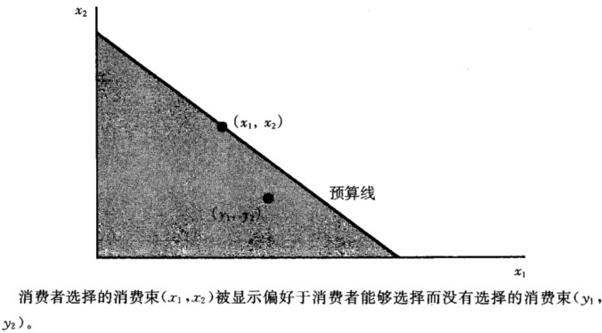
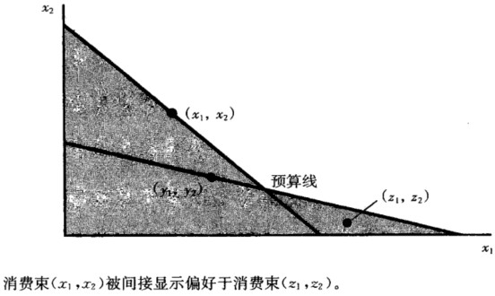
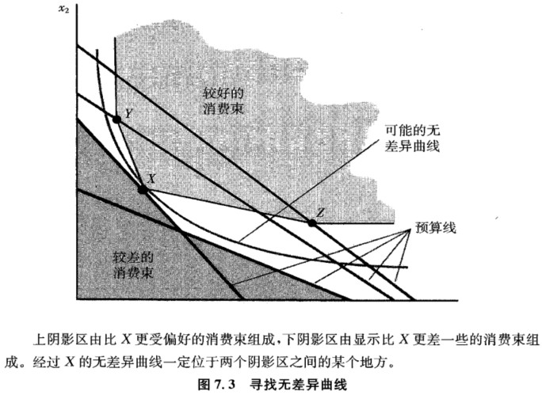
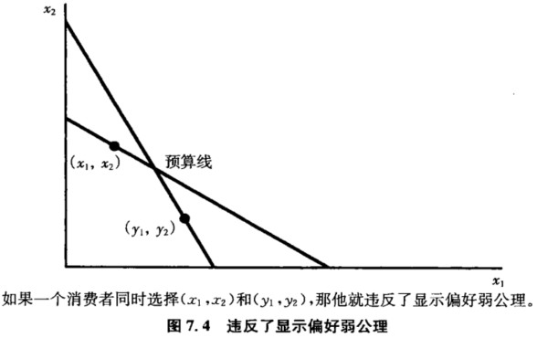

## 7.显示偏好

### 7.1 显示偏好

如何利用消费者的需求信息去发现其偏好情况？
假设：在观察消费者的选择行为期间（月度或季度），他的消费偏好保持不变。

假设：偏好严格凸，即每个预算约束有且只有一个需求束。
显示偏好：消费者选择了商品束$(x_1,x_2)$，这表明$(x_1,x_2)$被显示偏好于$(y_1,y_2)$，因为他原本可以选择$(y_1，y_2)$但是没有选择。这些消费束可以买得起但是没有买，因此实际购买的消费束一定更好。

显示偏好原理：令$(x_1, x_2)$是价格水平为$(p_1, p_2)$时消费者选择的商品束，$(y_1, y_2)$满足条件$p_1x_1 + p_2x_2 \geq p_1y_1 + p_2y_2$的其他商品束，则如果消费者在他能买得起的商品束中选择最好的，必有$(x_1,x_2) \succ (y_1, y_2)$。

显示偏好和偏好有啥区别？
- 显示偏好表示能够选择Y时实际选择的X，是对消费者行为的描述；
- 偏好是将X排在Y前面，是对喜欢程度的排序。

#### 7.1.1 直接显示偏好

若消费者需求束为$(x_1,x_2)$，预算线内的商品束为$(y_1,y_2)$：

因为$p_1x_1+p_2x_2 = m$，而$p_1y_1+p_1y_2 \leq m$，所以$p_1x_1+p_2x_2\geq p_1y_1+p_2y_2$，即$(x_1,x_2)$是$(y_1,y_2)$的直接显示偏好。

#### 7.1.2 间接显示偏好

间接显示偏好：利用偏好的传递性原理

若$(x_1,x_2) \succ (y_1,y_2)$，$(y_1,y_2) \succ (z_1,z_2)$，则称$(x_1,x_2)$被间接显示偏好于$(z_1,z_2)$。

### 7.2 复原偏好

在理性假设下，通过观察消费者的选择行为，可以估计偏好，观察到的行为越多，估计越准确。

### 7.3 显示偏好弱公理

**显示偏好弱公理（WARP）**：如果$(x_1,x_2)$被直接显示偏好于$(y_1,y_2)$，且$(x_1,x_2)$和$(y_1,y_2)$不同，那么$(y_1,y_2)$就不可能直接显示偏好于$(x_1,x_2)$。用文字表述就是：消费者有能力购买却没有购买的东西，一定比他最终选择的东西差。所以上图的情况不会出现。

### 7.4 显示偏好强公理

显示偏好强公理（SARP）：如果$(x_1,x_2)$被直接或间接显示偏好于$(y_1,y_2)$，且$(x_1,x_2)$与$(y_1,y_2)$不同，则$(y_1,y_2)$不可能被直接或间接显示偏好于$(x_1,x_2)$。

### 7.5 指数

- 假设在 $t$ 期，价格是 $(p_{1}^t, p_{2}^t)$ ，消费者的选择是 $(x_{1}^t, x_{2}^t)$ 。

- 在基期 $b$ ，价格是 $(p_{1}^b, p_{2}^b)$ ，消费者的选择是 $(x_{1}^b, x_{2}^b)$ 。

**如何知道消费者“平均”消费发生了怎样的变动？**

如果令 $w_1$ 和 $w_2$ 为某种计算平均数的“权数”，那么就可以得到如下数量指数：
$$
I_{q} = \frac{w_{1}x_{1}^t+w_{2}x_{2}^t}{w_{1}x_{1}^b+w_{2}x_{2}^b}
$$

- 如果 $I_{q}$ 大于 1 ，表示从时期 $b$ 到时期 $t$ ，“平均”消费是上升的；
- 如果 $I_{q}$ 小于 1 ，表示从时期 $b$ 到时期 $t$ ，“平均”消费是下降的。

**该使用什么做“权数”呢？**

最自然的选择是商品的价格，因为价格度量的是商品的相对重要性。

根据选择价格的时期不同，数量指数可以划分为：

- **拉氏指数（Laspeyres index）：使用基期 $b$ 的价格作为权数**；
- **帕氏指数（Paasche index）：使用时期 $t$ 的价格作为权数**。

把时期 $t$ 的价格代入数量指数，帕氏指数可以表示为：

$$
P_{q} = \frac{p_{1}^tx_{1}^t+p_{2}^tx_{2}^t}{p_{1}^tx_{1}^b+p_{2}^tx_{2}^b}
$$

把时期 $b$ 的价格代入数量指数，拉氏指数可以表示为：

$$
L_{q} = \frac{p_{1}^bx_{1}^t+p_{2}^bx_{2}^t}{p_{1}^bx_{1}^b+p_{2}^bx_{2}^b}
$$

