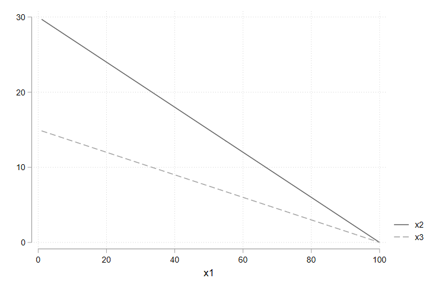

# 第一章 市场

Q1：假设需求曲线为$D(p)=100-2p$。如果有60个公寓，市场将如何定价？如果有40个公寓，市场将如何定价？画出需求和供给曲线。


```Stata
clear
set obs 100

gen q = _n
gen d_p = (100 - q)/2

line d_p q, scheme(plotplain) ytitle(P) xtitle(Q)  ///
            xline(40) xline(60) ///
            yline(20,lp(dash)) yline(30,lp(dash)) ///
			text(45 25  "{it:D(P) = 100 - 2*P}") ///
			text(10 48 "{it:S1 = 40}")  ///
			text(10 68 "{it:S2 = 60}") 
graph export "$image/1.png", replace
```

# 第二章 预算约束

<<<<<<< HEAD


=======
>>>>>>> 8083f9f3c5cbf3f72c004d98d62651428655e7c1
Q1：消费者的初始预算线为 $p_{1}x_{1}+p_{2}x_{2}=m$。现在商品 1 的价格变为原来的 2 倍，商品 2 的价格变为原来的 8 倍，收入变为原来的 4 倍。写出新预算的表达式，其中价格和收入要分别以原来的价格和收入表示。

$2p_{1}x_{1}+8p_{2}x_{2}=4m$

Q2：如果商品 2 的价格上升，但商品 1 的价格和收入保持不变，那么预算线如何变动？

设初始预算线方程为$p_{1}x_{1}+p_{2}x_{2}=m$，它的斜率为$-p_{1}/p_{2}$，横截距为$m/p_{1}$，纵截距为$m/p_{2}$。当 $p_{2}$ 上升而 $p_{1}$ 和 $m$ 不变时，斜率绝对值变小，横截距不变，总截距变小。因此预算线绕着横截距点 $(m/p_{1},0)$ 向内转动（变得更平坦）。如下图所示：



```Stata
/*
s.t.
m =3000
p1 = 10; p2 = 300; p3 = p2*2

p1x1 + p2x2 = m -> x2 = (m - p1x1) / p2 
*/

clear
set obs 100

scalar m = 3000
scalar p1 = 30
scalar p2 = 100
scalar p3 = 2*p2

gen x1 = _n
gen x2 = (m-p1*x1)/p2 
gen x3 = (m-p1*x1)/p3 

tw (line x2 x1) (line x3 x1), scheme(plotplain)
graph export "$image/2.png", replace
```

# 第三章 偏好

Q1：某大学橄榄球教练说，任意给定两个前锋比如 A 和 B ，他永远偏好身材更高大和速度更快的那个。他的这种偏好关系是传递的吗？是完备的吗？

**完备性**是指任何两个消费束都是可比较的，即假定有任意消费束 Y 和 X，若有 $(x_1, x_2) \geq (y_1, y_2)$  ，或者 $(y_1, y_2) \geq  (x_1, x_2)$ ，或者两种情况都有，在最后这种情况下，消费者对两个消费束无差异。**传递性**是指假如消费者认为 X 至少和 Y 一样好，Y 至少和 Z 一样好，那么就可以认为 X 至少和 Y 一样好。

回到上例，显然不满完备性，但是满足传递性。理由如下：

- 非完备。可以通过反证法证明：令下标 1 和 2 分别表示身材和速度，假设是完备的，则有 $A_{1} \geq B_{1}$ 并且 $A_{2} \geq B_{2}$ （或者 $B_{1} \geq A_{1}$ 并且 $B_{2} \geq A_{2}$）。但是当$A_{1} > B_{1}$ 但 $A_{2} > B_{2}$，即 A 身材更高但速度更慢，而 B 的身材更矮但速度更快，这种情形下选择谁？
- 是传递的。假设有 $A_{1} \geq B_{1}$ 并且 $A_{2} \geq B_{2}$ ，若 $B_{1} \geq C_{1}$ 并且 $B_{2} \geq C_{2}$ ，则必然有 $A_{1} \geq C_{1}$ 并且 $A_{2} \geq C_{2}$ 。 

Q2：面值 1 元的钞票与面值 5 元的钞票，计算它们之间的边际替代率。

边际替代率（marginal rate of substitution, MRS）为 无差异曲线的斜率，$MRS_{12} = \Delta x_1 /  \Delta x_2$，即消费者愿意用商品 2 去替代商品 1 的比率。

因此，本题的 $MRS_{12} = \Delta x_1 /  \Delta x_2 = 1 / -5 = - 1/5$，即减少5 张1 元的钞票，要增加 1 张 5 元的钞票才能使消费者还在原来的无差异曲线上。

# 第四章 效用

Q1：计算柯布-道格拉斯偏好（Cobb-Douglas Preferences）的边际替代率。

柯布-道格拉斯偏好的形式为：

$$
u(x_1,x_2) = x_{1}^{c}x_{2}^{d}
$$

其中，$c$ 和 $d$ 都是表示消费者偏好的正数。

若选择上述指数形式，则有：
$$
MRS = - \frac{\delta_u(x_1,x_2)/\delta x_1}{\delta_u(x_1,x_2)/\delta x_2} = \frac{cx_{1}^{c-1}x_{2}^{d}}{dx_{1}^{c}x_{2}^{d-1}}=- \frac{cx_2}{dx_1}
$$

若将柯布-道格拉斯偏好转换为对数形式，则有：
$$
u(x_1,x_2) = c\ln x_{1} + d \ln x_2
$$
求得边际替代率为：
$$
MRS = - \frac{\delta_u(x_1,x_2)/\delta x_1}{\delta_u(x_1,x_2)/\delta x_2} = \frac{c/x_1}{d/x_2}=-\frac{cx_2}{dx_1}
$$


Q2：效用函数 $u(x_1,x_2)=x_1+\sqrt{x_2}$ 表示什么类型的偏好？ 效用函数 $v(x_1,x_2)=x_{1}^2+2x_1\sqrt{x_2}+x_2$ 是的单调变换吗？

$u(x_1,x_2)=x_1+\sqrt{x_2}$ 表示拟线性偏好。因为 $x_1 \geq 0, x_2 \geq 0$（消费数量不能为负），所以 $u(x_1,x_2)=x_1+\sqrt{x_2} \geq 0$，对效用函数 $u(x_1,x_2)$ 做单调变换 $f(u)=u^2$ 可得 $f(u) = x_{1}^2+2x_1\sqrt{x_2}+x_2$，而这正是效用函数$v(x_1,x_2)$，因此 $v(x_1,x_2)$ 是 $u(x_1,x_2)$ 的单调变换。