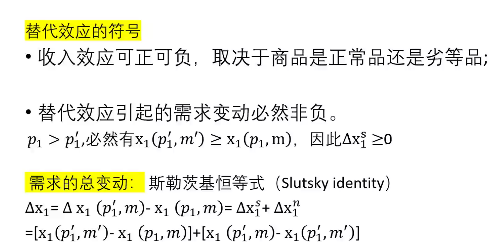

QUAIDS 模型的推导

# 第五章 选择

最优选择：预算线与无差异曲线相切处的消费束为最优选择（求一阶导数为0）。

看到线图，需要知道每条线的移动

现实生活中，我们通常需要根据可观测的需求行为推知相应的偏好。

Q1:假定一个消费者每 1 杯咖啡总是加 2 块糖。如果咖啡和糖的单价分别为 $p_1$和$p_2$，消费者总花费为 $m$。那么，估计效用是多少？

令$x_1$和$x_2$分别表示咖啡和糖的数量，则有：
$$
x_1 = 2x_2
$$
预算线为：
$$
p_1x_1 + p_2x_2 = m
$$
联立上述等式可得：
$$
x_1=\frac{2m}{2p_1+p_2},x_2 = \frac{m}{2p_1+p_2}.
$$
Q2:
$$
U(x_1,x_2)=x_1^2x_2^5 
p_1x_1 + p_2x_2 = m
$$

Q2：

拉格朗日函数：将有约束条件的函数最优化问题通过拉格朗日函数转化为无条件的函数最优化问题。

为什么要将商品归类？
（了解他们的收入弹性以及收入弹性带来的政策含义）

正常商品是收入增加时需求随着增加的商品；低档商品是收入增加时需求反而减少的商品。

普通商品是其价格上升时需求降低的商品；吉芬商品是其价格上升时需求反而随之增加的商品。

不仅研究收入变动对某种商品的影响，还要研究和其他商品之间的关系。收入对商品的影响不同，是我们划分不同类型商品的原因，可以根据他们在消费结构中的重要性，调整生产的方向。

反需求函数有什么作用？
在实际研究中，价格通常是给定的...

## 斯勒茨基方程

研究消费者的选择怎样随着价格的变化而变化。

### 替代效应
由于两种商品之间的交换比率的变化引起的需求变化。

商品1变得更便宜，这表明购买商品1需要放弃的商品2的数量变少了。商品1价格变化改变了用商品2“替代”商品1的比率。

### 收入效应
由于购买力提高引起的需求变化。

收入效应可能有两个方向：正常商品是正的，劣等商品为负的。

### 图解

## 希克斯替代效应（Hicks Substitution Effect）

希克斯替代效应保持效用不变，而斯勒茨基替代效应保持购买力不变。斯勒茨基替代效应给消费者一定的资金，使他恰好能买得起原消费束，而希克斯替代效应给消费者一定的资金，使他恰好能回到通过原消费束的那条无差异曲线上。

# 第九章 购买和销售

禀赋：指消费者在进入市场之前就拥有的财富$(w_1,w_2)$。

总需求：指消费者最终实际消费的商品数量，即消费者从市场购买商品的数量$(x_1,x_2)$。

净需求：消费者最终拥有的商品量（总需求）与商品初始禀赋之间的差额$(x_1-w_1,x_2-w_2)$。

供给者：

预算约束：消费者最终拥有的消费束价值等于其初始禀赋的价值，即$p_1x_1+p_2x_2=p_1w_1+p_2w_2$，运用净需求的定义，可以表示为$p_1(x_1-w_1)+p_2(x_2-w_2)=0$。

- 如果$(x_1,w_1)$取正值，那么称消费者是商品1的净购买者或净需求者；
- 如果$(x_1,w_1)$取负值，那么称消费者是商品1的净销售者或净供给者。

禀赋的变动实际上等价于货币收入的变动，所以可以推导出与研究货币收入变化时相同的结论。

# 第十章 跨时期选择

波洛尼厄斯点（Polonius point）

 

# 第十一章  资产市场

# 第十二章 不确定性

自然状态

或有消费计划

## 期望效用

财富的期望值的效用：

财富的期望效用：

期望财富的效用>财富的期望效用 ->更偏好财富的期望效用而非赌博本身->风险厌恶型

