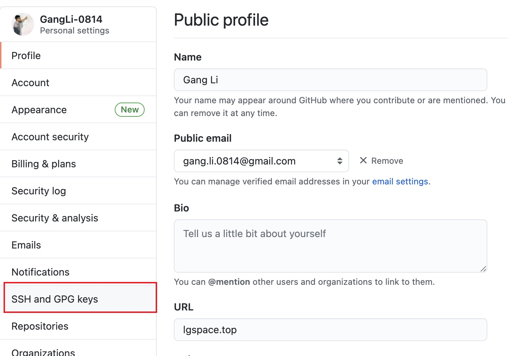
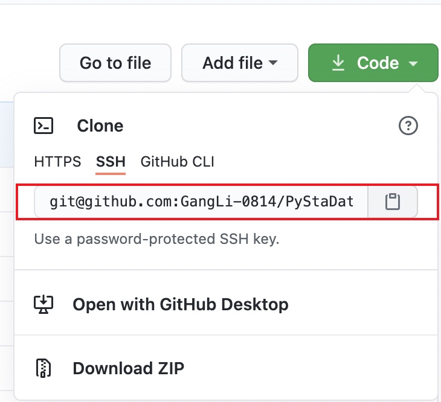

## 0. 提出问题

换了新设备后，怎么将远程仓库拉取到本地仓库，并将本地仓库与远程仓库关联起来？


## 1.解决方式

### 1.1 添加密钥


首先打开终端，输入：
```git
ssh-keygen -t rsa -C "xxx@xxx.com"
```

`xxx`填入自己的邮箱，运行完毕之后找到生成的`ssh-rsa`文件，默认地址为`/User/xxx/.ssh/id_rsa.pub`，也可以在终端输入`open ~/.ssh`打开。

打开文件夹之后，找到`id_rsa.pub`文件，选择用记事本打开，将其中的内容进行复制。


前往Github主页：点击右侧头像-选择`Settings`-选择`SSH and GPG keys`。随后点击`New SSH Key` 按钮，将之前复制的内容粘贴到`key`框中，之后去一个名字填入`title`，最后点击`Add SSH Key`即可。





## 1.2 检查是否关联成功

打开终端，输入:
```git
ssh -T git@github.com
```
如果操作正确，会出现如下提示：
```
The authenticity of host 'github.com(207.97.227.239)' can't be established.RSA key fingerprint is 16:27:ac:a5:76:28:2d:36:63:1b:56:4d:eb:df:a6:48.Are you sure you want to continue connecting (yes/no)?
```
输入`yes`，按提示输入密码，之后提示:

```
Hi xxx You've successfully authenticated, but GitHub does not provide shell access.
```
说明连接成功。

## 1.3 设置用户信息

输入如下可以查看配置信息：
```
git config --global --list
```
设置用户名和邮箱：
```
git config --global user.name "GangLi"
git config --global user.email "gang.li.0814@gmail.com"
```

## 1.3 本地项目关联

在要存放本地项目的地址，初始化本地项目，输入：

```
git init
```

为本地项目添加远程仓库：
```
git remote add origin git@github.com:GangLi-0814/xxx.git
```

远程仓库的地址从此处获取：



将GitHub上的项目`pull`到本地：
```
git pull git@github.com:GangLi-0814/xxx.git
```

将内容`add`到本地，之后`commit`：
```
git add .
git commit -m "init commit"
```

最后`push`:
```
git push
```

