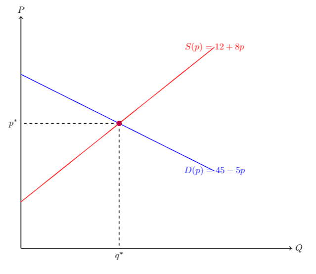
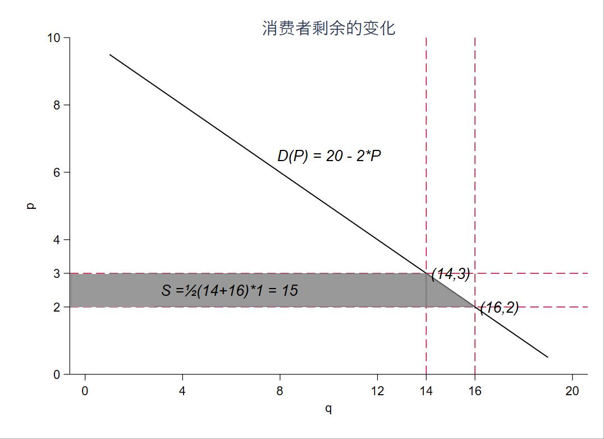
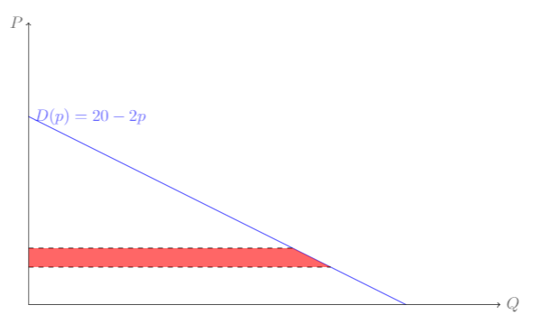
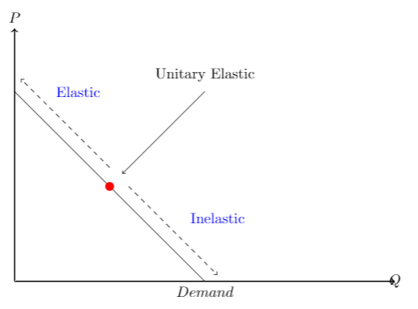
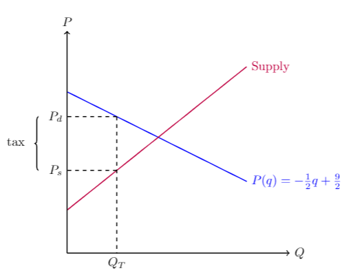
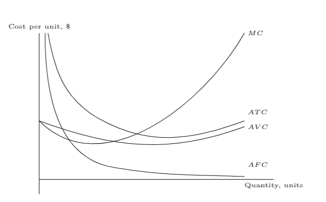
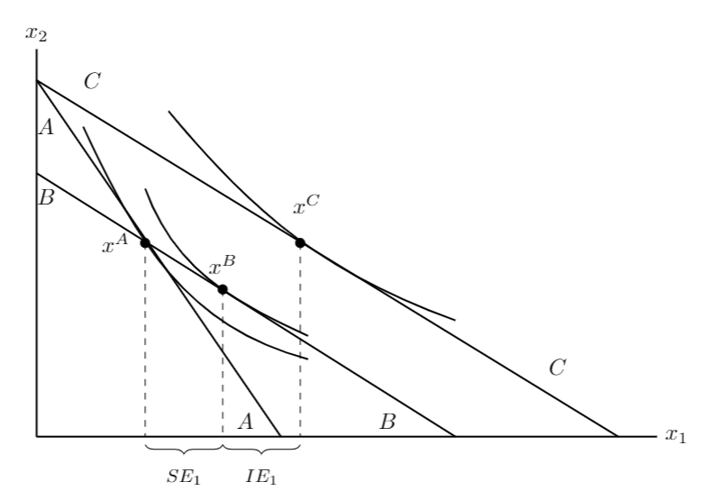

看经济学教材的时候，在想这些复杂又清晰的图是怎么绘制的。于是上网搜了一下，根据网上的信息，在 LaTeX 中使用 TikZ 包进行绘制是一个不错的选择，所以这两天花点时间学习了一下。

这篇推文算是学习笔记，共分为三部分：首先，从最熟悉的供求均衡入手，通过带有详细注释的代码，熟悉基本用法；虽有，尝试做一个用阴影表示消费者剩余变化的练习题，这部分我还用 Stata 画了图对比；最后，从其他资料中附上其他示例。


## 均衡



```LaTeX
\documentclass{article}
\usepackage[utf8]{inputenc}
\usepackage{tikz} % 引入tikz宏包
\usetikzlibrary{calc} % 计算坐标轴

\begin{document}
\begin{tikzpicture}[domain=0:5,scale=1.5,thick] % scale 实现缩放，所以不必担心绝对坐标的问题
% 定义供给曲线和需求曲线的参数
\def\dint{4.5} %需求曲线Y轴的截距
\def\dslp{-0.5} %需求曲线的斜率
\def\sint{1.2} %供给曲线Y轴的截距
\def\sslp{0.8} %供给曲线的斜率
    %定义供给曲线和需求曲线
    \def\demmand{\x,{\dslp*\x+\dint}}
    \def\supply{\x,{\sslp*\x+\sint}}

% 标记坐标点
\coordinate (ints) at ({(\sint-\dint)/(\dslp-\sslp)},{(\sint-\dint)/(\dslp-\sslp)*\sslp+\sint});  %均衡点
\coordinate (ep) at (0,{(\sint-\dint)/(\dslp-\sslp)*\sslp+\sint}); %均衡价格纵坐标
\coordinate (eq) at ({(\sint-\dint)/(\dslp-\sslp)},0); %均衡数量横坐标
\coordinate (dint) at (0,{\dint});
\coordinate (sint) at (0,{\sint});

% 绘制坐标轴
\draw[->] (0,0) -- (0,6) node[above] {$P$};
\draw[->] (0,0) -- (7,0) node[right] {$Q$};

% 绘制供给和需求曲线
\draw[thick, color=blue] plot (\demmand) node(right) {$D(p)={45}-5p$}; % 需求曲线
\draw[thick, color=red] plot (\supply) node(right) {$S(p)=12+8p$}; % 供给曲线
\draw[dashed] (ints) -- (ep) node[left] {$p^*$};
\draw[dashed] (ints) -- (eq) node[below] {$q^*$};

% 标示均衡点
\fill[purple] (ints) circle (2pt);
\end{tikzpicture}
\end{document}
```

## 表示消费者剩余变化

问题：考察线性需求曲线$D(p)=20-2p$。当价格从 2 上升至 3 时，相应地，消费者剩余的变化是多少？并通过图形表示。

### Stata绘制



```Stata
clear
set obs 200

gen q = _n
gen p = (20-q)/2 
keep if  p >0
gen p1 = 2
gen p2 = 3

line p q || (rarea p p1 q if q <= 16 & p <= 3, sort color(gray)) || ///
	(rarea p1 p2 q if q <= 14,sort color(gray)), ///
	scheme(qleanmono) plotregion(margin(sides)) legend(off) /// 
	title("消费者剩余的变化") ///
	ytitle("p") xtitle("q") ///
	yline(2,lp(dash)) xline(16,lp(dash)) ///
	yline(3,lp(dash)) xline(14,lp(dash)) ///
	ylabel(0(2)10 2 3) xlabel(0(4)20 14 16) ///
	text(6.5 10  "{it:D(P) = 20 - 2*P}") ///
	text(2 17 "{it:(16,2)}")  ///
	text(3 15 "{it:(14,3)}") ///
	text(2.5 6 "{it:S =½(14+16)*1 = 15 }")
```
### LaTeX 绘制



```LaTeX
\begin{tikzpicture}[domain=0:5,scale=0.4,fill opacity=0.6]
\def\dint{20}     %Y-intercept for DEMAND.
\def\dslp{-2}     %Slope for DEMAND.

\def\demand{\x,{\dslp*\x+\dint}}
% DEMAND
\draw[color=blue] (20,0) -- (0,10) node[right] {$D(p) = 20 - 2p$};
% CS    
\draw[dashed] (0,3) -- (14,3);
\draw[dashed] (0,2) -- (16,2);
\fill [fill=red] (0,3) -- (14,3) -- (16,2) -- (0,2);
% Draw axes
    \draw[->] (0,0) -- (25,0) node[right] {$Q$};
    \draw[->] (0,0) -- (0,15) node[left] {$P$};
\end{tikzpicture}
```
## 更多例子

## 需求价格弹性



```LaTex
% 需求价格弹性
\begin{tikzpicture}[scale=3]

% 坐标轴
\draw [<->,thick] (0,2) node (yaxis) [above] {$P$}
    |- (3,0) node (xaxis) (above) {$Q$};
    
    % 绘制两条直线
    \draw[color=white] (0,0) coordinate (a_1) -- (2,2) coordinate (a_2);
    \draw (0,1.5) coordinate (b_1) -- (1.5,0) coordinate (b_2) node[below] {$Demand$};
    
    % 计算直线交点，并储存为c
    \coordinate (c) at (intersection of a_1--a_2 and b_1--b_2);
    
    % 标示交点
    \fill [red] (c) circle (1pt);
    
    \draw[->,dashed] ($(c)+(0,0.15)$) -- ($(c)+(-.7,0.85)$);
    \draw[->,dashed] ($(c)+(0.15,0)$) -- ($(c)+(0.85,-0.7)$);
        
        \fill[blue] (0.5,1.5) node {Elastic};
        \fill[blue] (1.6,0.5) node {Inelastic};
        
    \draw[->] (1.5,1.5) node[label=above:Unitary Elastic] {} -- ($(c)+(.1,.1)$);

\end{tikzpicture}
```

### 征税



```LaTeX
%                         TikZ code: An excise tax
\begin{tikzpicture}[domain=0:5,scale=1,thick]
\usetikzlibrary{calc}                                %allows coordinate calculations.
\usetikzlibrary{decorations.pathreplacing}           %allows drawing curly braces.
 
% Define linear parameters for supply and demand
\def\dint{4.5}      %Y-intercept for DEMAND.
\def\dslp{-0.5}     %Slope for DEMAND.
\def\sint{1.2}      %Y-intercept for SUPPLY.
\def\sslp{0.8}      %Slope for SUPPLY.
 
\def\tax{1.5}       %Excise (per-unit) tax
 
% Define Supply and Demand Lines as equations of parameters defined above.
  \def\demand{\x,{\dslp*\x+\dint}}
  \def\supply{\x,{\sslp*\x+\sint}}
  \def\demandtwo{\x,{\dslp*\x+\dint+\dsh}}
  \def\supplytwo{\x,{\sslp*\x+\sint+\ssh}}
 
 
% Define coordinates.
    \coordinate (ints) at ({(\sint-\dint)/(\dslp-\sslp)},{(\sint-\dint)/(\dslp-\sslp)*\sslp+\sint});
    \coordinate (ep) at  (0,{(\sint-\dint)/(\dslp-\sslp)*\sslp+\sint});
    \coordinate (eq) at  ({(\sint-\dint)/(\dslp-\sslp)},0);
    \coordinate (dint) at (0,{\dint});
    \coordinate (sint) at (0,{\sint});
 
    \coordinate (teq) at  ({(\sint+\tax-\dint)/(\dslp-\sslp)},0); %quantity
    \coordinate (tep) at  (0,{(\sint+\tax-\dint)/(\dslp-\sslp)*\sslp+\sint+\tax}); %price
    \coordinate (tint) at  ({(\sint+\tax-\dint)/(\dslp-\sslp)},{(\sint+\tax-\dint)/(\dslp-\sslp)*\sslp+\sint+\tax}); %tax equilibrium
     
    \coordinate (sep) at (0,{\sslp*(\sint+\tax-\dint)/(\dslp-\sslp)+\sint});
    \coordinate (sen) at ({(\sint+\tax-\dint)/(\dslp-\sslp)},{\sslp*(\sint+\tax-\dint)/(\dslp-\sslp)+\sint});   
 
% DEMAND
    \draw[thick,color=blue] plot (\demand) node[right] {$P(q) = -\frac{1}{2}q+\frac{9}{2}$};
     
% SUPPLY
    \draw[thick,color=purple] plot (\supply) node[right] {Supply};
 
% Draw axes, and dotted equilibrium lines.
    \draw[->] (0,0) -- (6.2,0) node[right] {$Q$};
    \draw[->] (0,0) -- (0,6.2) node[above] {$P$};
    \draw[decorate,decoration={brace},thick]  ($(sep)+(-0.8,0)$) -- ($(tep)+(-0.8,0)$) node[midway,below=-8pt,xshift=-18pt] {tax};
     
    \draw[dashed] (tint) -- (teq) node[below] {$Q_T$};                  
    \draw[dashed] (tint) -- (tep) node[left] {$P_d$};                       
    \draw[dashed] (sen) -- (sep) node[left] {$P_s$};                        
         
\end{tikzpicture}
```
### 短期单位成本曲线


```LaTex
\begin{figure}
\begin{tikzpicture}[scale=0.8]
\tiny
\draw (0,0) -- (8,0) node [below] {Quantity, units};
\draw (0,-0.5) -- (0,5) node [above] {Cost per unit, \$};
\draw (0.2,5) to [out=270,in=172] (2.6,0.4);
\draw (2.6,0.4) to [out=350.5,in=178] (7,0.1);
\node [right] at (7,0.5) {$AFC$};
\draw (0.3,5) to [out=280,in=150] (2,2.1);
\draw (2,2.1) to [out=330,in=200] (7,2);
\node [right] at (7,2.3) {$ATC$};
\draw (0,2) to [out=340,in=200] (7,1.8);
\node [right] at (7,1.8) {$AVC$};
\draw (0,2) to [out=315,in=240] (7,5);
\node [right] at (7,5) {$MC$};
\end{tikzpicture}
\caption{Short-run unit cost curves}
\end{figure}
```

### 斯勒茨基分解

```LaTeX
% Slutsky Decomposition
\usetikzlibrary{decorations.pathreplacing} 
\begin{figure}
\begin{tikzpicture}[scale=1.2]
\draw [thick] (0,0) -- (8,0);
\draw [thick] (0,0) -- (0,5);
\node [right] at (8,0) {$x_1$};
\node [above] at (0,5) {$x_2$};
\draw [thick] (1.7,4.2) to [out=310,in=160] (5.4,1.5);
\draw [thick] (0.6,4) to [out=295,in=165] (3.5,1);
\draw [thick] (1.4,3.2) to [out=290,in=155] (3.5,1.3);
\node [right] at (6.5,0.9) {$C$};
\draw [thick] (0,4.6) -- (7.5,0);
\draw [thick] (0,4.6) -- (3.15,0);
\draw[dashed](1.4,2.5)--(1.4,0);
\draw[dashed](3.4,2.5)--(3.4,0);
\draw [thick] (0,3.4) -- (5.4,0);
\draw[dashed](2.4,1.9)--(2.4,0);
\node [above] at (2.4,2) {$x^B$};
\draw[fill] (2.4,1.9) circle [radius =0.06];
\node [left] at (1.3,2.5) {$x^A$};
\draw[fill] (1.4,2.5) circle [radius =0.06];
\node [right] at (3.2,3) {$x^C$};
\draw[fill] (3.4,2.5) circle [radius =0.06];
\node [right] at (0.5,4.6) {$C$};
\node [right] at (-0.1,4) {$A$};
\node [left] at (2.9,0.2) {$A$};
\node [right] at (4.3,0.2) {$B$};
\node [right] at (-0.1,3.1) {$B$};
\draw [decorate,decoration={brace,amplitude=4pt, mirror},xshift=0pt,yshift=-3pt]
(1.4,0) -- (2.4,0) node [black,midway,yshift=-.5cm] {\footnotesize $SE_1$};
\draw [decorate,decoration={brace,amplitude=4pt, mirror},xshift=0pt,yshift=-3pt]
(2.4,0) -- (3.4,0) node [black,midway,yshift=-.5cm] {\footnotesize $IE_1$};
\end{tikzpicture}
\caption{Slutsky decomposition}
\end{figure}
```

# 参考资料
http://static.latexstudio.net/wp-content/uploads/2016/06/tikzforeconomists-110619150244-phpapp01.pdf

https://sites.google.com/site/kochiuyu/Tikz

https://riguz.com/tex/latex_tikz/

http://www.texample.net/tikz/examples/


