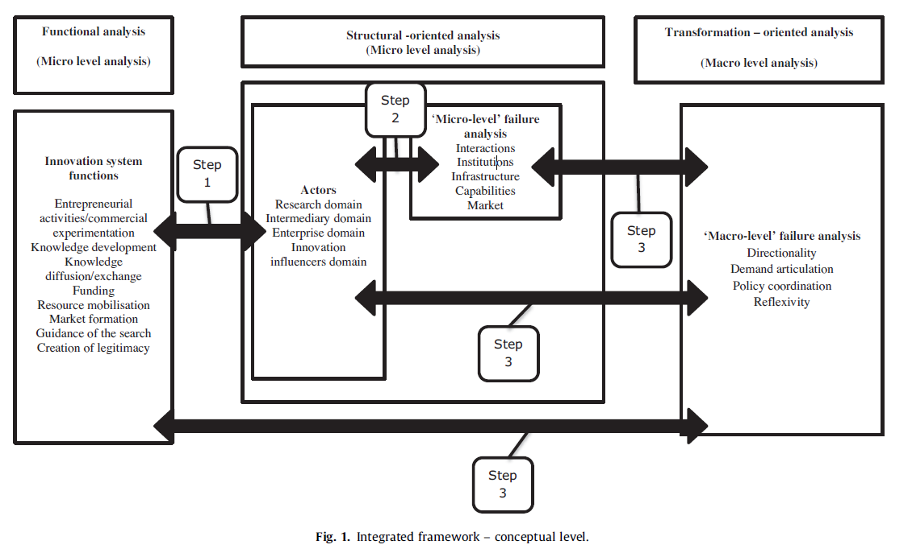
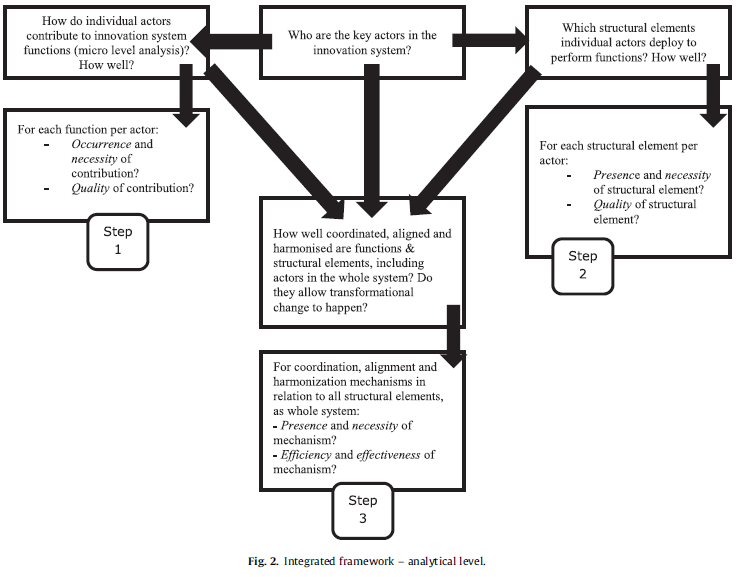
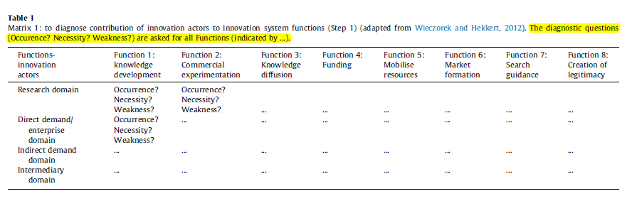
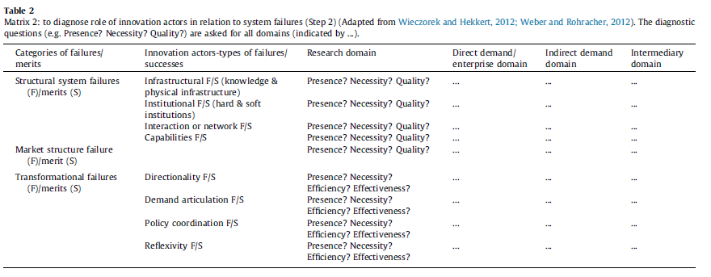
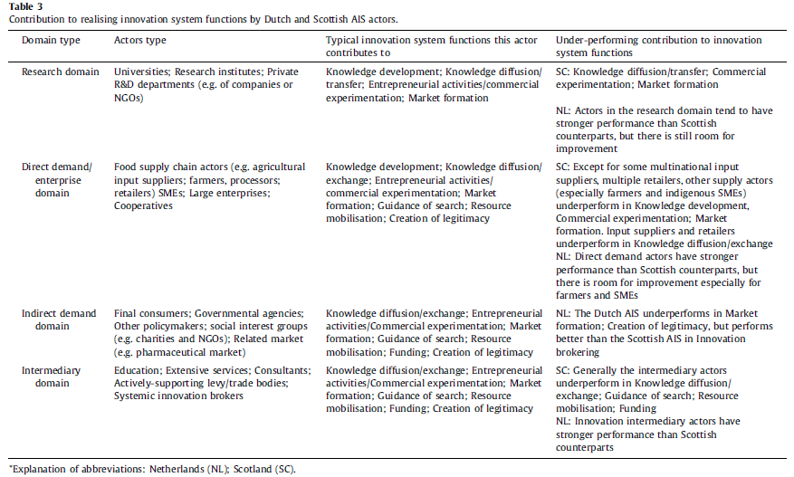
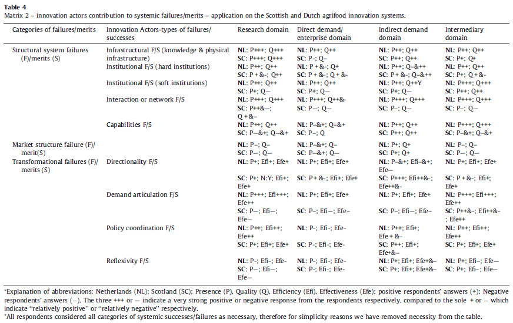

> Function: Notes of C. Lamprinopoulou et al.(2014)
>
> Name: Li Gang
>
> E-Mail: gang.li.0814@gmail.com
>
> Create Date: 2020/04/25
>
> Last Modify: 2020/04/27 15:42

*You can see the latest version of this notes  at my [Github Page](https://github.com/GangLi-0814/PyStaData/blob/master/Paper_Notes/Lamprinopoulou_2014_Application%20_of_an_integrated_systemic_framework/Notes_Agricultural_Systems_129(2014)40_54.md)*.

# 0.Abstract

**Main Idea**:

Applying a comprehensive innovation systems analytical framework, reconciling analyses of systemic structures, functions, failures and merits of innovation systems to assess and compare the performance of the agricultural innovation systems of Scotland and the Netherlands.

**Organization of this paper**: 

- section 2: present the integrated analytical framework, clarifying the particular analytical tools;
- section 3: describe the methods;
- section 4: present the results of cross-country comparison;
- section 5: discussion of the implications of the findings;
- section 6: some concluding remarks.

# 1.Introduction

This paper combine several analytical tools into an integrated framework aiming to assess performance of innovation systems and to formulate related policy recommendations.

What this paper adds is that it discusses which dynamics exist between all key structures and functions of innovation systems, and which policy instruments may affect these dynamics in a way that transform systemic failures into merits. The key aims of this paper are hence to:

- identify amongst the existing innovation systems frameworks the analytical building blocks necessary to holistically describe and investigate an AIS;
- operationalize and combine these building blocks into an integrated analytical framework;
- apply the integrated analytical framework in the context of the Scottish and Dutch agri-food sectors with the aim of revealing from the informants viewpoint where particular strengths and weaknesses exist as regards innovation and what are the underlying reasons for this;
- inform innovation systems policies.

# 2.Integrated Analytical Framework

## 2.1 Structures: actors and institutions in innovation systems

***See table 3 of paper.***

According to Arnold and Bell’s (2001), actors can be classified into four categories(domains):

| DOMAIN | SPECIFIC |
| :---: | :---: |
|research, enterprise domain|research: universities, research institutes or  private R&D departments.   enterprise: the supply chain actors, i.e. input suppliers, farmers,food manufactures or retailers.|
|indirect demand/innovation influencing domain|final consumers, policymakers, social interest groups and markets complementary|
|intermediary domain|organizations that are playing a catalytic role in joining fragmented IS actors and facilitating knowledge/innovation flows|

## 2.2 Adding functional analysis to enrich structural analysis

Functional analysis emerged to complement the structural focus with a process-oriented analysis, identifying different functions of an IS.

## 2.3 Analyzing how structures enable or disable innovation system functions by means of detection "system failures"

Structural analysis served to study structural elements of innovation systems, including the actors, institutions and infrastructures.

Different categories of innovation system failures:

|CATEGORY|EXPLANATION|
|:---:|:---:|
|Infrastructural failures |concern the physical infrastructure, such as railroads telecom, machines, buildings, harbors etc.|
|Institutional failure|refers to either laws, regulations and strategies any other formalized rules (the so-called "hard institutions"), or a set of unwritten rules, common habits, routines and shared norms/values used by humans in repetitive situations;|
|Capabilities failure| points to actors "capacity to learn, innovate or utilize available resources; to identify and articulate their needs; and to develop visions and strategies" |
|Market structure failures|refer to the positions of and relations between market parties. Such as a monopoly or the lack of transparency in the ever enlarging food chains, but also imperfections in the "knowledge market".|
|Directionality failure|implies that socio-technical transformational change is closely linked to direction and the setting of collective priorities for the system|
|Policy coordination failure|refers to coordination and coherence problems at policy levels e.g regional-national-European or technological versus sectoral innovation policies.|
|Demand articulation failure|"reflects a deficit in anticipating and learning about user needs...|
|Reflexivity failure|concerns the insufficient ability of the system to engage actors in a self-governance process, to constantly monitor progress against the transformational goals, and finally to anticipate and develop an adaptation strategy.|

## 2.4 Towards an integrated framework

As shown in Fig.1, within a successful innovation system, individual actors are engaged in innovation ‘activities’, which contribute to the overall innovation system functions, and for which different actors will play different roles.

Beyond this level, analysis needs also to examine functioning of the entire system at its most aggregated form. This transformation-oriented approach is alternatively called "positive external-economies functioning".

# 3. Case selection and research methods

## 3.1 Case Selection

Why choose Dutch and Scottish compare?

- First, there are perceptions that the Dutch have one of the most innovative agri-food sectors in Europe and therefore can provide a useful 'benchmark' against which to evaluate Scotland.
- Second, as both countries are EU members they have the obligation to comply with common EU agricultural, environmental and innovation policies;
- Third, both countries followed the logic of liberalization and embarked on a process of privatization of extension services and research establishments from the 1980s which led to a proliferation of new knowledge creators and providers.

## 3.2 Methods

Data: primary data derived from interviews and workshops in Netherland and Scotland. 

Participants were selected on the basis of:
- their knowledge/insight in the Scottish/Dutch agricultural innovation landscape;
- their ability to articulate their opinion;
- their influence/power within their organization and in the wider agricultural innovation landscape (opinion leaders), and
- the position of their organization in the innovation system as recognized by other informants

## 3.3 Data analysis

**Step 1**: to diagnose contribution of innovation actors to innovation system function.

**Step 2**: to diagnose role of innovation actors in relation to system failures.

# 4. Findings

The analysis follows the structures derived from the analytical framework. First, and overview of actors is given and the results related to functional performance are considered before the analysis of systemic failures and merits.

## 4.1 Contribution of actors to fulfilling innovation system functions

The table below summarizes the types of actors identified within each domain.

## 4.2 Systemic structural failures and merits

|TYPE|CONTENT|
|:---:|:---:|
|Knowledge infrastructure|strong and well-spread across the two countries|
|Physical infrastructure|both sufficient|
|funding infrastructure|NL is better than SC|
|hard institutions|both in EP, legislations are relatively similar(environmental, employment, health and safety regulations)|
|Soft institutions|greater differences, NL is better than SC|
|Weak networks|NL benefits from wide array of innovation brokers and intermediaries; SC's array is smaller and has more recently developed|
|Strong networks|SC's is driven by government(research-driven); NL's policies stress the important of inclusivity|
|Capabilities|both have ageing population problem;   SC's direct relationship is problematic, NL's already recognized|

## 4.3 Market structure failures and merits

Information asymmetries are apparent in the NL and SC AIS. 

On the demand side, SC and NL farmers appear to have less incentive to seek knowledge under the privatized system for a number of reasons.
- First, the charge fee rates are significant;
- Second, there is some mistrust of own-commercial;
- Third, "information smog".

Consequently, the industry faces difficulties in terms of scanning the market, assessing differences in providers’ quality, ex ante evaluating service value, and in many cases even identifying the provider(s) possessing the needed piece of information/knowledge they are looking for.

## 4.4 Systemic transformational failures and merits

|TYPE|CONTENT|
|:---:|:---:|
|Demand articulation failures and merits|SC often has a mismatch between the ability or willingness of research providers to help and the requirements of knowledge exploiting actors; NL is much better.|
|Directionality failures and merits|SC government take a "hand-on" approach, but NL government take a "hand-off" approach.|
|Policy coordination failures and merits|both the NL and SC governments have made a steady progress towards overcoming another IS failure, namely policy coordination failure that goes beyond directionality failure.|
|Reflexivity failures and merits|the need of the NL and SC AIS to involve multi-actors in processes of reflection and self-governance by providing sufficient platforms for interaction and spaces for experimentation, monitoring and learning.|

# 5. Discussion and policy implications

## 5.1 Comparison of the performance of the Dutch and Scottish agri-food systems

## 5.2 Policy implications

This section discusses the policy implications with regard to the: 

- impact of country’s innovation culture

- challenges of collective learning and managing the accumulated
  experiences

- importance of involvement of more multi-stakeholders

- impact of blurred boundaries in the roles of innovation actors

- importance of assessment of fields of expertise of insufficient
commercial interest.

## 5.3 Reflections on the use of the integrated framework 

The findings confirm the appropriateness of considering actors, functions, systemic structural, market and transformational failures(or merits) together as complementary analytical tools to evaluate the performance of AIS. **The integrated framework has helped to produce a richer and more systematic analysis, compared to using some of the aforementioned analytical tools in isolation**.

**Limitations of this study**: 

- the focus on only two countries, both belonging to the EU. We anticipate that the application of the integrated framework on the national AIS of more countries, including those outside the EU will enable better assessment of its validity, and strengthen its value as an analytical tool;
- the study has an ex-post character, which means circumstances may have changed in the meantime, and respondents’ information may be not be completely up-to-date;
- Its requirements in terms of data, means that substantial investment is needed to gather data from informants and broad literature review.

# 6. Conclusion

This paper tries to reconcile four approaches developed to inform innovation policies. Namely:
- structures;
- functions of innovation systems;
- systemic structural failures;
- transformational failures.

The proposed integrated framework goes beyond analysis of how individual actors contribute to fulfilling innovation system functions to also examine functioning of the whole system at its most aggregate form (broad/macro level).