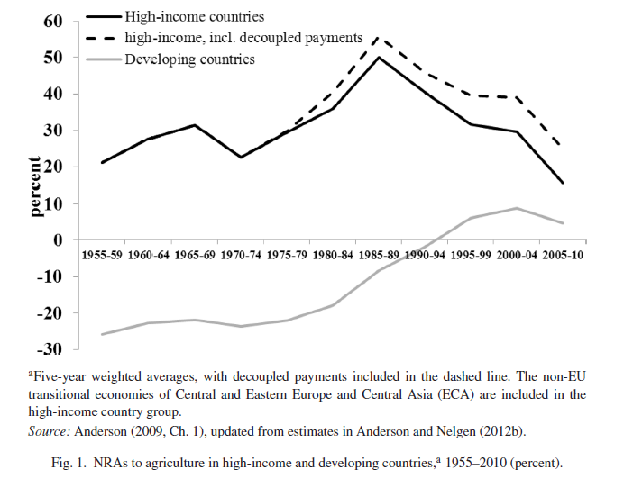

> 用途：W5文献阅读笔记
>
>创建时间：2020.06.12
>
>最近修改：2020.06.15
>
>姓名：李刚
>
>学号：201912080249

如文章的标题，这篇文章利用历史数据、计算衡量指标，研究了农产品价格扭曲的趋势和波动性、回顾和展望。

## 背景与内容

### 研究背景

这篇文章写于2012年，当时国际粮食价格带来了农产品价格变动，农产品贸易政策重新成为人们关注的焦点。一方面，食品进口国家指责农业出口国限制出口加剧了粮食安全问题；另一方面，食品进口国减少了进口限制，一些甚至还补贴了其主食的进口食品，加重了国际食品需求。

关注到由国家政策带来的价格扭曲问题，这篇文章采用全球农产品价格数据来观察历史政策和各国政府的应对措施。

### 研究内容

具体来说，这篇文章回顾了由世界银行汇编和更新的关于农业激励扭曲演变模式的经验数据。主要包括如下几点内容：

- 首先，概述了该数据库中提供的经验指标，总结了自1950年代中期以来，国家实行价格扭曲的趋势；
- 随后，回顾各国政府对国际食品价格波动的反应及其应对措施；
- 最后，评估世界经济和国际贸易结构的变化将如何影响未来一两年内与国家贸易相关的政策选择。

文章最后得出的结论是，可以使用新的国内社会保护政策方案来减少发展中国家的粮食不安全状况。

## 农产品价格扭曲

### 衡量指标

### NRA(Nominal Rate of Assistance)
> defined as the percentage by which national government policies raise gross returns to farmers above what they would be without the government’s intervention or lowered them, if NRA < 0 (see Anderson et al., 2008 for methodological details).

名义援助率，定义为国家政策政策将农民的总收益提高到超出政府干预水平的百分比。

### CTE(Consumer Tax Equivalent)
消费者税当量率（CTE），如果贸易措施是政府对特定产品进行干预的唯一来源，则所衡量的 NRA 即为该产品价值链中同一点的 CTE 。但如果还存在其他的税收或者补贴，NRA 就不等于 CTE 。

### RRA(Relative Rate of Assistance)
农民不仅受到自己产品价格的影响，而且还受到非农业生产者面临的激励。即农产品价格是相对价格，因此是政府援助的相对比率影响生产者激励措施。因此，作者计算了RRA（相对援助率）。

$$
RRA = 100 \times [\frac{(1+\frac{NRAag^{t}}{100})}{(1
+\frac{NRAnonag^t}{100})}-1]
$$

其中，$NRAag^t$ 和 $NRAnonag^t$ 分别是农业和非农业部门可贸易部分的NRA加权平均百分比。

### 国家对农民激励措施的扭曲：1950年代中期

1. 日本和欧盟
2. OECD
3. 东北亚以外的发展中国家

世界银行的研究，Schiff和Vald´es（1992）总结了他们的估算，结果表明，**发展中国家农民面临的激励措施低迷，仅部分是由于各种形式的农产品价格和贸易政策，包括对粮食进口的补贴。在许多情况下，更重要的是那些间接损害农民的发展中国家的非农业政策。两个关键因素是制造业保护主义（工业部门从农业西区资源）和高估的汇率（将资源吸引到生产非贸易品的部门，例如服务）**。

4. 全球趋势

上图的结果显示：在第二次世界大战后至 1980年代末，高收入国家农民的 NRA 稳步上升，而国际食品价格在 1973–1974 年间飙升。在 1980 年代中期，国际食品价格接近创纪录的低点时，高收入国家的NRA大幅下降。即使包括实现的新农场计划，从某种意义上来说，这些限制措施的实施效果与价格变动的现实已“脱钩”。这些措施没有使得国内市场与国际食品价格变动相隔离，国家的限制政策都不再影响生产决策。

5. 发展中国家

尽管发展中国家出口商的平均 NRA 一直为负（从1960年代和1970年代的–50％降至几乎为零）。在2000年至2009年期间），发展中国家针对进口竞争的农民的NRA呈上升趋势，从10％和30％上升（在1980年代中期国际价格低迷的年份甚至达到40％）。

这表明，在发展中国家，以出口为重点的农民仍然在两个方面受到歧视：
- 在本国农业部门内，通过援助的反贸易结构；
- 高收入国家的农民仍然受到保护。

### 国家对国际食品价格波动的反应

各国政府显然不喜欢国内食品价格的波动，因为它们往往围绕国际食品价格的趋势水平传递的波动少于全部波动。这种趋势意味着每种产品的估计NRA（国内价格超过边界价格的百分比）也在其长期趋势附近逐年波动，并且与国际价格相反。

表1对政府贸易政策对国际价格上升的比例贡献做出了估算。关键谷物的最新估计值：大米0.4，小麦0.19，玉米0.1。

表2 报告了2006-2008年国内价格上涨与国际谷物价格上涨的比较。2006-2008年的数据表明，样本中所有国家的平均国内价格涨幅均比调整后的国际小麦价格涨幅略高，而玉米的涨幅仅略少，大米的跌幅仅为六分之一。

这些结果表明，各国政府实行的保护措施的综合反应已被充分抵消，几乎没有采取任何措施使国内市场与最近的国际粮食价格上涨相隔离。

### 未来一两年贸易政策变动？

根据NRA中的趋势变化，过去的行为使人们期望高收入国家政府和发展中国家政府继续改变其食品贸易限制，以使其国内市场与国际食品价格的波动有所隔离。

基于前文的分析，作者认为继续实行贸易限制的行为将继续扩大国际市场上的价格波动，**并且，如果出口国和进口国都继续做出类似反应，那么这种干预将在防止国内食品价格波动方面仍然相当无效**。

## 政策建议

文章通过历史数据的分析，探究了各国对国际食品价格波动和上涨的反应，最后认为国家贸易限制政策至少通过两种方式非同寻常地增加了国际食品价格的波动性：

- ~~通过“变薄”国际食品市场。~~农产品规模变小；

- 通过使国内食品市场与国际价格波动“绝缘”。

这些政策属性共同放大了全球粮食供求的任何冲击对国际价格的影响。

政策建议方面：

- 在第一个"变薄”国际食品市场问题上，作者建议各国应该进一步放开农产品贸易市场；但这在政治层面是难以实现的。

- 在第二个使国内食品市场与国际价格波动“绝缘”（相隔离）问题上：作者认为单个国家的贸易政策可能会被其他国家的贸易政策所抵消，以致于难以实现其预期的干预目标，因此作者建议通过WTO等多边组织和协议来限制各国的贸易保护。

