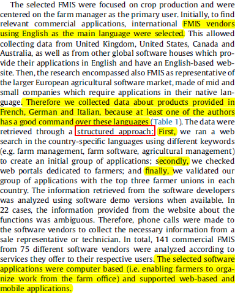
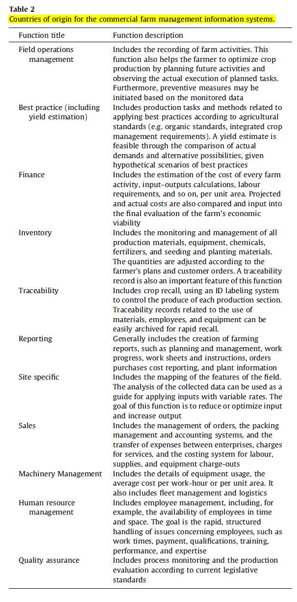
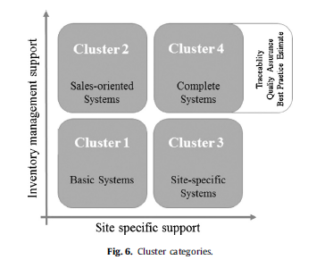
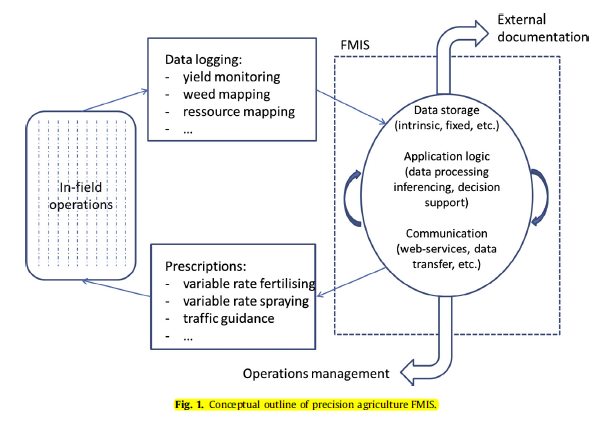

> Function: Notes of S. Fountas et al.(2015)
>
> Name: Li Gang
>
> E-Mail: gang.li.0814@gmail.com
>
> Create Date: 2020/05/16
>
> Last Modify: 2020/05/18 23:50

_You can see the latest version of this notes at my [Github Page](https://github.com/GangLi-0814/PyStaData/blob/master/Notes/Paper_Notes/Notes_Fountas_2015/Notes_Fountas_2015.md)_.

[TOC]

# Background

As the key factors for the success of agriculture nowadays are:

- timely information
- elaborated decision making

This paper presented a targeted review of current situation and future perspectives of Farm Management Information System(FMIS) from both an academic and commercial.

- The academic analysis: covers mainly the areas of systems architecture, applications, FMIS in Precision Agriculture (PA) and future trends.
- The commercial analysis: covers the FMIS currently implemented and in commercial.

## Aim of this paper

The aim of this study was therefore to evaluate current FMIS designs and solutions available for farm businesses from both academic and commercial points of view in order to extract future needs and correspondence with current developments, both in terms of research development and commercialization.

## Organization of this paper

The first section:

- presents the methodological approach for the selection of the agricultural domain;
- the procedure adopted to select the relevant scholarly contributions to FMIS development;
- the procedure adopted for the identification of commercial FMIS and the subsequent clustering procedure.

The second section:

- presents a targeted review of **academic FMIS** concepts and solutions.

The last section:

- presents **commercial FMIS**, showing a possible division in groups created through a two-step clustering analysis focusing on functions currently offered.

# Methodology

## The academic FIMS

The methodology for the academic FIMS review has a principle
of using selective keywords for the search in international academic databases. The specific keywords were:

- (i) farm management information system,;
- (ii) farm software,;
- (iii) decision support systems for agriculture;
- (iv) information management in agriculture,
- and combinations of the formers.

## The commercial FIMS

### Data Collection

The review of commercial solutions involved the analysis of 141 international software packages, categorized into 11 functions.

### Clustering analysis

Based on the data collected:

Cluster analysis was used to group current commercial FMIS as well as examine possible avenues for further development.

# Conclusion and Suggestion

## Conclusion

### Academic research

Results indicated that on the question of academic research and its ability to accommodate advanced systems like PA, **academic research tend to analyze more complex systems, capturing new trends involving spatial and temporal management, as well as distributed system involving internet of things, future internet and web services**.

### Commercial application

**The commercial applications tends to focus on solving daily farm tasks and aim to generate income for the farmers through better resource management and field operations planning**. In terms of the commercial applications being able to adopt the innovations from research, this is the case to a large extent but it is foreseen that **software vendors must put extended efforts on adopting the more advanced systems and closely cooperate with academia in order to accommodate the requirements from, for example, PA**.

## Suggestion

Key research representing areas for further development and improvement for currently available academic and commercial applications include:

- improvements in technology, adaptation motives, hindrances;
- specific new functionalities;
- greater emphasis on software design governed by usability and human-computer interaction.