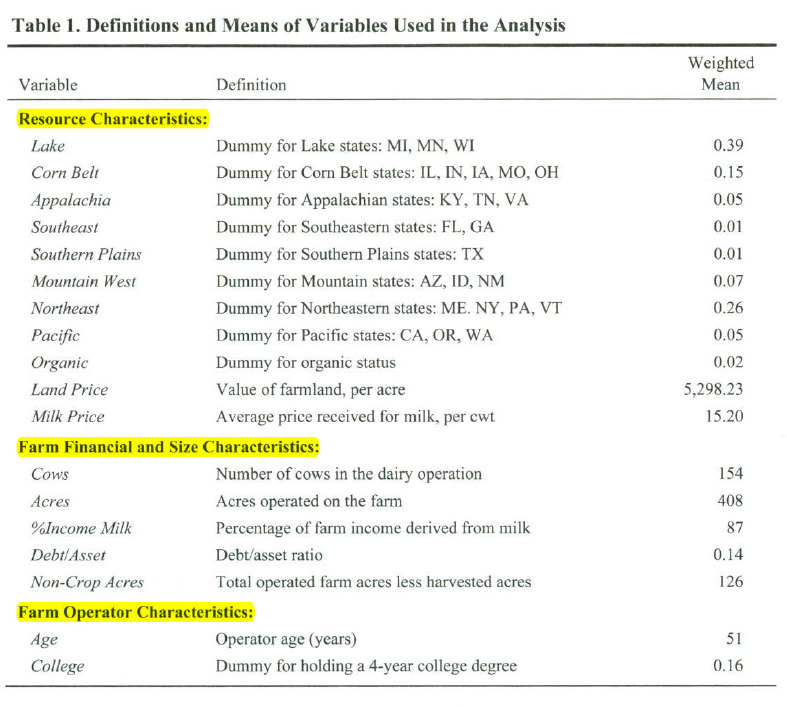
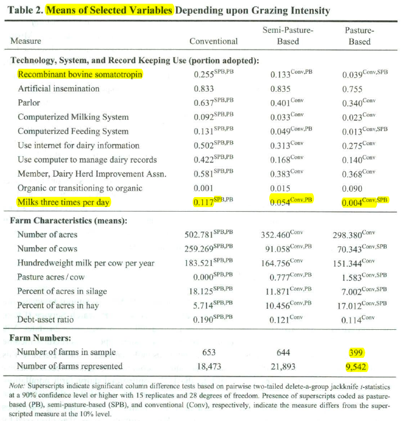
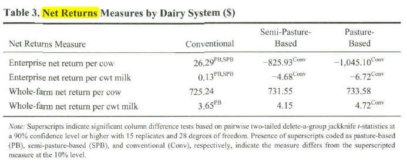
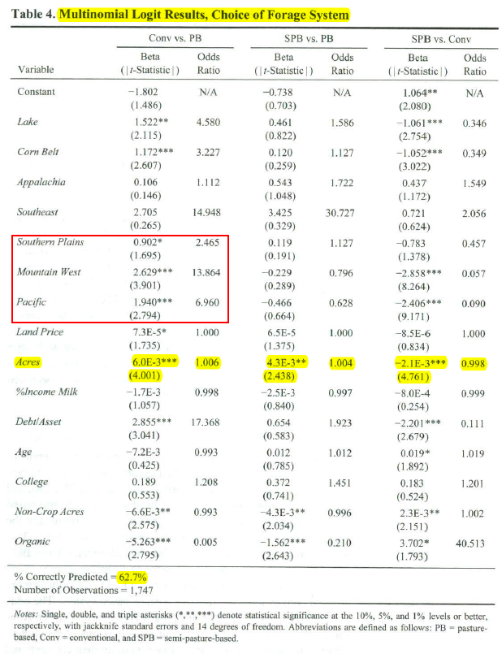
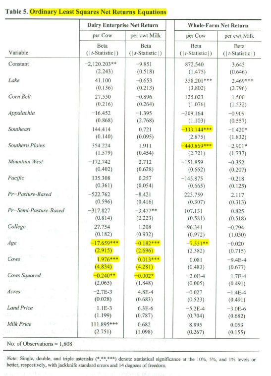

> Function: Notes of  Jeffrey et al.(2009)
>
> Name: Li Gang
>
> E-Mail: gang.li.0814@gmail.com
>
> Create Date: 2020/05/30
>
> Last Modify: 2020/06/01 14:26

_You can see the latest version of this notes at my [Github Page](https://github.com/GangLi-0814/PyStaData/blob/master/Notes/Paper_Notes/Notes_Gillespie_2009/Notes_Gillespie_2009.md)_.

## Background and Objectives

**Background:**

**Can pasture-based systems be competitive in today's dairy sector?**

>Pasture-based dairies are "management grazing"or "mixed feed" operations(Foltz, 2006). 

- **Management-intensive grazers**: use pasture as the primary forage source during the grazing period;
- **mixed-feed**: operators obtain part of their forage rations from pasture but rely primarily on stored feed. 

**Objectives: **

- compare the characteristics of pasture-based dairy operations with those of conventional operations;
- determine whether there are differences in dairy enterprise. and whole-farm profitability.

## Research Design and Data

### Model

Model for estimating the impact of pasture-based systems on dairy enterprise:
$$
\pi_{i} = \beta'x_{i}+\sum_{j=1}^{n}\delta_{j}g_{ij}+\epsilon_{i},
$$

- $\pi_{i}$: profitability for frim $i$;
- $g_i$: **discrete variables indicating the extent of pasture use**;
- $x_i$: other explanatory variables include farmer and farm characteristics hypothesized to influence farm profitability, such as region farm size, and demographic variables;
- $\epsilon_{i}$: random error;
- $j$: specifics the use of pasture system (convention system is the base; **$j=1$ intensive pasture-based system**; $j=2$ less intensive pasture-based system).

---

**But pasture use decision are based on the farmer's self-selection, variable indexing $g_{ij}$ are treated as endogenous. Thus, IV are appropriate for estimating their impact on profit.** The equation used is expressed as:
$$
g_{ij}=\gamma'z_{i}+\mu_{ij},
$$

- $g_{ij}$: $j=1$ represents producer realizes the greatest profit from system. (In other words, choose to use pasture.)
- $z_{ij}$: variables to influence system choice. 

---

*In sum, this model is estimated using two stages (Heckman two-step estimation)*:

- In the first stage, a **multinomial logit model** to estimate which of three production systems is chosen, from intensive pasture use to conventional production;
- In the second stage, **OLS** to estimate the impact of production system and other factors on profitability.

### Variables

#### Equation(2)(Multinomial Logit)

**Dependent variable(Determining Which of Three Production Systems Is Used) :**

*Question 01:"Did this operation use pasture or cropland to graze dairy cattle during 2005?"*
*Question 02: "About what percent of their total forage ration do milk cows obtain from pasture during the grazing months?"(answer:1-24%, 25-49%, 50-74%, and 75-100%)*

| Category | Answer |
| ---------------- | ------ |
|conventional-producers|"no" at first question|
|semi-pasture-based-producers|"yes" + "1-24%" or "25-49%" to the second|
|pasture-based-producers|"yes" + "50-74%" or "75-100%" to the second|

**Independent variable:**

Estimated via multinomial logit, are categorized as follow:

| Category              | Variables                         |
| ------------------------ | --------------------------------- |
| Resource characteristics | regional and land price variables |
|Farm financial and size characteristics|measures of farm size, debt, and specialization|
|Farm operator characteristics|Age and College|

#### Equation(1)(OLS)

**Dependent variables:**

Including two dairy enterprise profit measures and two whole-farm profit measures.

**Independent variables in the profit equations**:
- regional variables as described in the multinomial logit models
- the number of dairy cows in the operation (Cows)
- the number of dairy cows squared (Cows Squared, divided by 1,000 for scaling purposes)
- College
- Age
- Acres
- Land Price
- the average price received for milk (Milk Price)
- Debt/Asset

### Data

**Data Source**: USDA's Agricultural Resource Management Survey (ARMS), conducted by National Agricultural Statistics Service (NASS) and the Economic Research Service (ERS).

**Sample**: 2005 ARMS Phase III dairy version includes 1,815 usable responses from 24 states.

**Note**: 

- because this design-based survey uses stratified sampling(分层抽样), **weighted regression **procedures were used to estimate all models reported in this paper.
- The multi-phase sampling underlying ARMS data provides challenges in estimating variances using classical methods; thus, the **delete-a-group jackknife estimator** is used.

## Result

###	Mean Tests

### Paired t-test

On the one hand, conventional farms are more profitable than pasture-based and semi-pasture-based farms. On the other hand, **when whole-farm measures are used, significant differences are not found on a per cow basis, but the pasture-based operations yield higher net return on a cwt milk produced basis**.

### Multinomial Logit Production System Choice Estimates

The multinomial logit model for determining how producers choose among the alternative dairy production systems. Results suggest a number of drivers influence system choice. The percentage correctly predicted for this model is 62.7%, with 710,756, and 342 farms being predicted to fall into the conventional, semi-pasture-based, and pasture-based systems, respectively.

### Net Returns Equation Estimates

Net returns equations provide insight as to the type of operation yielding the highest net return per cow or per cwt milk. Results suggest that Lake States producers received higher whole-farm net returns than did Northeastern producers. On the other hand, Southeastern and Southern Plains dairy farms were less profitable than Northeastern producers on a whole-farm basis.

## Conclusion

- Pasture-based dairy systems differ in prominence by region, but also by farm and operator demographics.
- Pasture-based producers are more likely to be smaller-scale and have lower debt, and can be thought of as "extensive," rather than "intensive" grazing operations. **They are less likely to adopt "intensive" technologies.**
- Semi-pasture-based producers are more likely to be smaller-scale and have lower debt than conventional producers, but are larger than pasture-based producers.
- Paired t-tests reveal significant differences in profitability among systems, but the conclusion as to which system is more profitable depends upon whether an enterprise or a whole farm measure of net returns is used.
- The net returns analysis underscore the importance of farm size.

# 老师点评

1.应该花更多的时间在方程一的解释上

2.为什么不分区域回归？

分区域回归后，无法比较不同系数统计上是否显著。保留每个回归结果，之后再做F检验。

3.在答辩时，引言需要点出：选题背景+研究目的。背景介绍不用花太多篇幅。

4.先介绍数据情况，再介绍Data Description。

