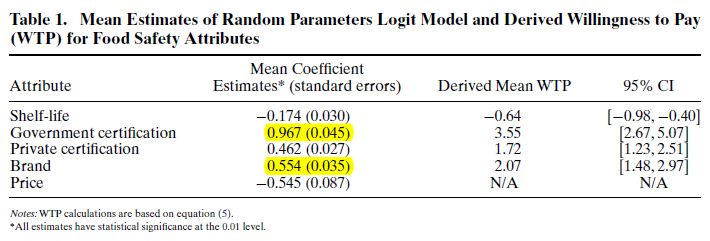
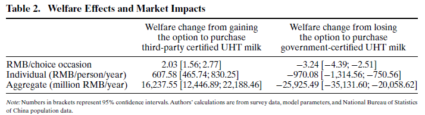

> Function: Notes of Ortega et al.(2011)
>
> Name: Li Gang
>
> E-Mail: gang.li.0814@gmail.com
>
> Create Date: 2020/05/30
>
> Last Modify: 2020/06/01 09:50

_You can see the latest version of this notes at my [Github Page](https://github.com/GangLi-0814/PyStaData/blob/master/Notes/Paper_Notes/Notes_Ortega_2011/Notes_Ortega_2011.md)_.

## 1. Background and Goal

**Background**: milk-related food safety $\Rightarrow$ trade flows from China.

**Goal**: provide an economic assessment of Chinese consumer preferences for food safety verification attributes in UTH milk(Ultra-high temperature, or UHT, milk is ultra-pasteurized milk that comes in sterilized containers).

## 2. Methodology and Data

### 2.1 Methodology

Choice experiment approach to evaluate Chinese consumer's willingness to pay(WTP).

- **Five two-level attributes**: price, shelf-life(保质期), government certification, third-party (private) certification, and brand.
- **Experiment Area**: Beijing, Chengdu, Hohhot, Nanjing, Shanghai, Wuhan, and Xi'an.
- **Interviewee**: random in supermarkets and convenience stores, where actual milk purchasing decisions take place.

### 2.2 Data

7 cities $\times$ 60 observations $\times$ 16 choice sets = 6720 observations.

### 2.3 Econometric Methods

#### 2.3.1 The random utility model(RUM)
The random utility model is used to analyze consumer preferences.

$$
P_{nit} = \frac{exp(V_{nit})}{\sum_{j}{exp(V_njt)}}
$$

#### 2.3.2 RPL model (Recognition of Prior Learning)

Consumer preferences for food safety informational attributes is measured using RPL. RPL model relaxes the limitations of the traditional logit by **allowing random taste variation within a sample according to a specified distribution.**

$$
P_{nit}=\int \frac{exp(V_{nit})}{\sum_{j}{exp(V_{njt})}}f(\beta)d\beta
$$

Where we can specify the distribution of the random parameters $f(.)$. If the parameters are fixed at $\beta_c$ (nonrandom), the distribution collapses, i.e., $f(\beta_c) \to \infty$ and $f(\beta_c)=0$ otherwise.

#### 2.3.3 WTP(Willingness to Pay)

$$
WTP=-2 \frac{\beta_{k}}{\beta_{p}}
$$

$\beta_{k}$ is the estimated parameter of the $k$th attribute, $\beta_{p}$ is the estimated price coefficient.

#### 2.3.4 Welfare Evaluation

$$
CV = ln(\sum_{j}{e^{V_{i}}})+ \gamma
$$

where $\gamma$ is Euler's constant(欧拉常数). Therefore, the change in welfare that from moving from situation A to B is given by

$$
\frac{1}{Marginal\,Utility\,of\,Income}(CV^B-CV^A)
$$

## 4. Results

### 4.1 Willingness to Pay

Table 1 indicates that consumers are willing to pay the most for government certification, followed by the product's brand and private certification;then there is negative WTP for UTH milk with the shelf-life longer than three months.

### 4.2 Welfare Evaluation and Market Impacts

## 5. Conclusions

This study finds that:

- consumers prefer the shorter shelf-life UHT milk relative to the longer shelf-life product;
- consumers have highest value for government certification, followed by a national brand;
-  third-party nongovernment certification program is positively valued by consumers.

# 6.点评

1.这篇文章给我们的启发：我们都知道收入变化之后，饮食结构会发生变化，但这篇文章的研究方法，为我们观察饮食结构是如何提高提供了参考。

2.这篇文章在Multinomial Logit的基础上，使用RPL模型，考虑到了消费者的异质性。

3.根据数据结构来选择模型。

