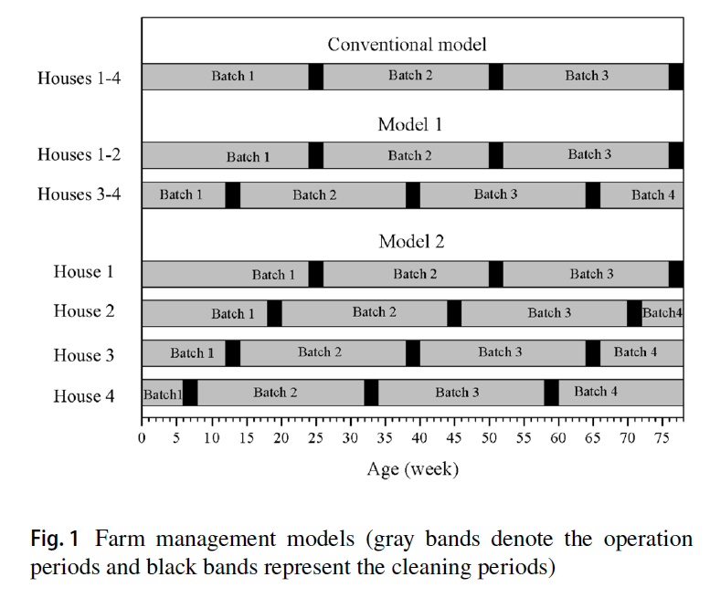

> Name: Li Gang
> 
> Number: 201912080249
> 
> E-Mail: gang.li.0814@gmail.com

## 1. Introduction

### 1.1 Purpose
This study develops improved farm management models to enhance the efficiency of biogas production and improve the economics of operation of these farms.

Livestock farming is categorized into **continuous** and **batch** modes.

|Mode|Advantage|Disadvantage|
|:---:|:---:|:---:|
|Continuous|Pigs can be sold continuously|require large space|
|Batch|easy to operate|may cause incomplete wastewater treatment|

### 1.2 Different Modes

It is necessary to feed wastewater into the lagoon continuously for consistent biogas production.

- In Model 1, the operation was divided into two offset batch intervals;
- In Model 2, the operation used four separate offset batch intervals. 

The models developed here help avoid an unnecessary long lag phase in the digester, allowing more stable anaerobic digestion performance and more evenly distributed biogas production.

## 2. Methodology

### 2.1 Location and Characteristics

- Location: Wang Chan distract Rayong Province, Thailand.

- Characteristics: This farm is representative of most medium-sized farms in Thailand. Raising 3600 pigs, the farm uses four evaporation houses, each of which accommodates 900 livestock.

- Wastewater and Biogas Characteristics:  While farming occurs, a great amount of wastewater caused by swine excretion and daily house cleaning is generated.

### 2.2 Economic Parameters

- NPV (Net Present Value)
- IRR (Internal Rate of Return)
- PI (Profitability Index)
- LOCE(Levelized Cost of Electricity)

## 3. Results

- The models produce a more stable supply of energy for domestic use, achieving a 36-44% reduction in the **electricity expense** or a savings of 43,782  $m^3$ **biogas/year** or 35,834 kWh **equivalent** compared with that of conventional management. 
- Conventional farm management has periods of excess and deficient biogas production; excess biogas is produced at a rate of up to 14,714 $m^3$/year or 12,043 kWh equivalent at the peak period. 
- This excess could be reduced by 79–100% by using the proposed farming models. This reduction is equivalent to greenhouse gas reductions of 9441 and 11,902  $m^3$ CO2 eq./year by Models 1 and 2. 