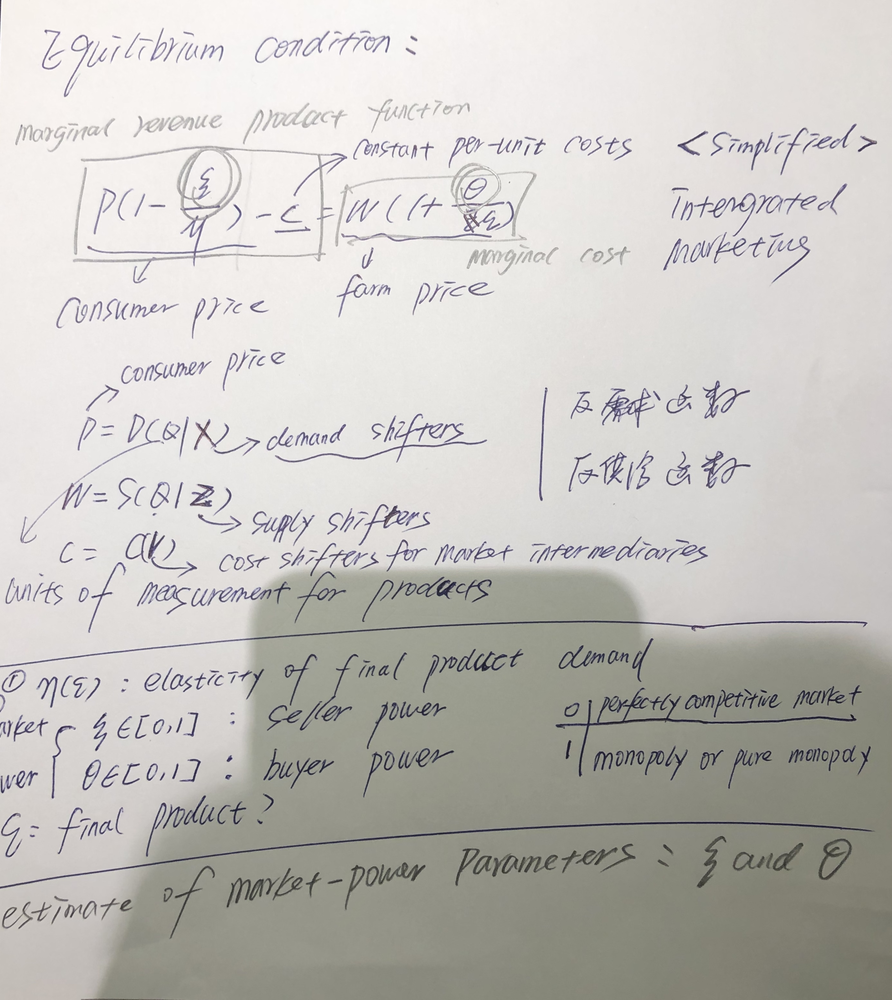

> Name: Li Gang
> 
> Number: 201912080249
> 
> E-Mail: gang.li.0814@gmail.com

## Background

With the increasing consolidation and vertical coordination of market players in the food supply chain, such as the supermarket revolution and the emergence of supermarkets in their various formats as powerful players in the food sector, which has triggered people’s fears that manufacturers affect the welfare of producers and consumers, as well as sector efficiency.

## Topic

Market power in food supply chain.

- Do the market-power lessons from traditional models that presume arm’s length, spot-market transactions and symmetry in effects between buyer power and seller power apply in modern agricultural markets?
- Can empirical models that are grounded in these traditional models provide accurate measurements of market power in key industries?
- If buyer and seller power are fundamentally different, as Adjemian et al. (2016), Crespi et al.(2012), Sexton (2013), and Swinnen & Vandeplas (2010, 2011, 2014) have argued, then can analyses of buyer power based on models that are, in essence, the flip side of seller power reach useful conclusions (M´erel & Sexton 2017)?

## Model

## Contributions

- Scanner data 
- Models that recognize explicitly the bilateral power
that exists in such relationships

## Conclusions

- The structural changes that have occurred in food retailing have been driven by a quest for efficiency and to eliminate costs from the system, and this has been accomplished to the betterment of consumers in terms of expanded choices and low prices. 

- Go beyond the bounds of the standard industrial organization models tend to cause market power to be less than would be predicted based on the predominant oligopolistic and oligopolistic structures of many modern agricultural and food markets. 

- Such factors include downstream buyers who rationally internalize long-run implications of their pricing decisions to farmers, powerful food manufacturers and retailers who countervail each other’s market power, and considerations inherent to the decisions of multistore and multiproduct food retailers.

