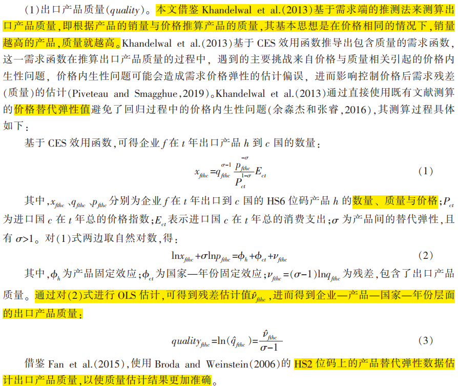
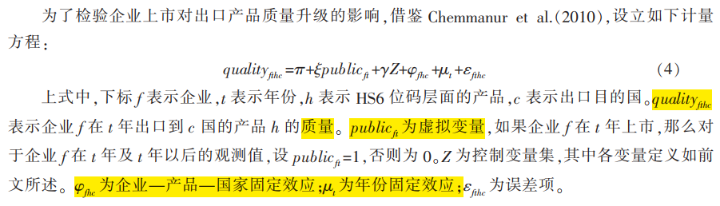
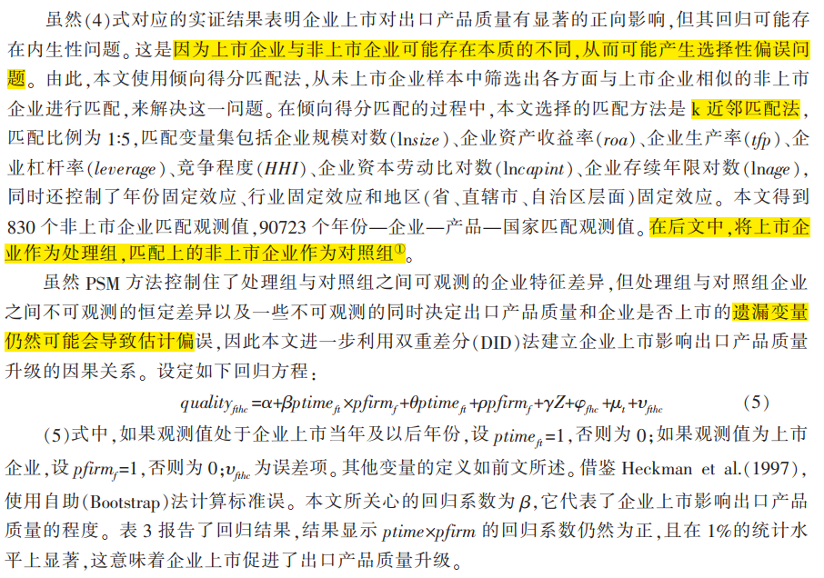
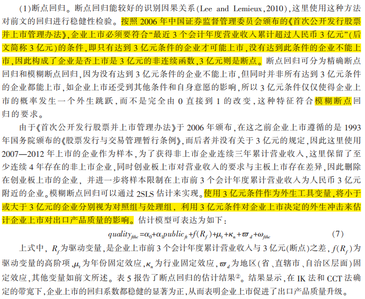
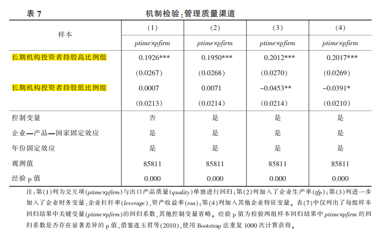
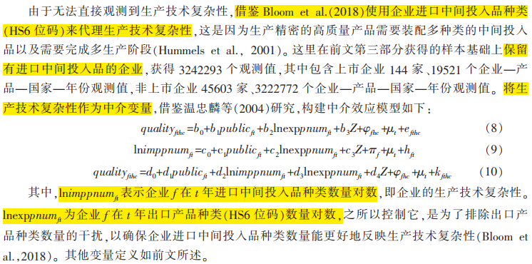
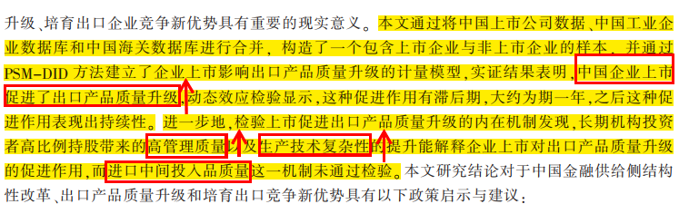
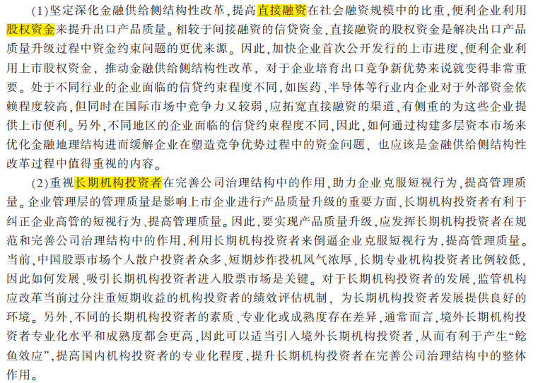
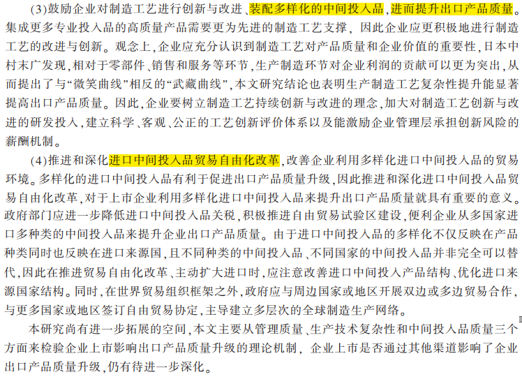

> 文献来源：祝树金,汤超.企业上市对出口产品质量升级的影响——基于中国制造业企业的实证研究[J].中国工业经济,2020(02):117-135+1-8.

## 主要内容

本文通过将中国上市公司数据、中国工业企业数据库和中国海关数据库进行合并， 构造了一个包含上市企业与非上市企业的样本，并通过 PSM-DID 方法建立了企业上市影响出口产品质量升级的计量模型，实证结果表明，中国企业上市促进了出口产品质量升级，动态效应检验显示，这种促进作用有滞后期，大约为期一年，之后这种促进作用表现出持续性。 进一步地，检验上市促进出口产品质量升级的内在机制发现，长期机构投资者高比例持股带来的高管理质量以及生产技术复杂性的提升能解释企业上市对出口产品质量升级的促进作用，而进口中间投入品质量这一机制未通过检验。

## 影响机制

### 管理质量渠道

降低管理质量：企业上市——股权流通和分散、所有权与控制权的分离——加剧委托代理关系——降低管理质量。

提升管理质量：企业上市——股权流通便于长期机构投资者对企业持股——利于企业克服短视行为——提升管理质量。

### 生产技术复杂性渠道

借鉴 Bloom et al.（2018），**生产技术复杂性是指企业拥有的在制造最终产品过程中能组装多少种类中间投入品的技术能力，企业能组装中间投入品种类越多，其最终产品质量就越高。因此，生产技术复杂性与企业获取多样化的中间投入品能力、生产技术的创新和改进有关**。

上市利于企业获取多样化中间投入品的能力：（1）上市——缓解融资约束（Acharya and Xu，2017）——利于企业获得多样化的中间投入品；（2）上市——利于开展兼并收购（Ksimovic et al.，2013）——采购渠道整合——利于获取更加多样化的中间投入品——提升企业提高技术复杂性。

上市利于企业生产技术的发明与改进：（1）上市后股权激励提升——缓解委托代理关系、提升代理人的风险承担水平（Coles et al.， 2006）——促进企业技术研发；（2）上市——股权融资上升——扩充技术发明和创新的资金——资金增多后：留住人才；兼并收购——利于研发人力资本投资；技术协同效应——促进生产技术发明与改造。

### 中间投入品质量渠道

企业上市可以通过缓解融资约束、兼并收购来影响企业获取高质量中间投入品的能力。

## 研究设计

### 数据来源

本文使用 2000-2013 年中国制造业企业数据作为样本，主要来源于中国工业企业数据库、中国海关数据库、国泰安数据库（CSMAR）和 Wind 数据库。

- 中国工业企业数据库涵盖了所有国有企业及规模以上的非国有工业企业，包含了这些企业的基本信息以及资产负债表、损益表和现金流量表中大部分的财务数据。
- 中国海关数据库包含了企业—产品（HS 8 位码）—国家层面的每一笔进出口记录，其中，**出口贸易数量和出口单价是本文计算出口产品质量的关键**。
- 国泰安数据库提供了沪深两市 A 股上市企业的基本信息以及**机构投资者持股比例**等相关数据。
- Wind 数据库提供了测算**机构投资者类型**所需的机构投资者资产组合数据。

上市公司数据与工企-海关数据的匹配：

为了保证上市前后至少有一年的观测值，选择 2001—2012 年上市的企业，将之与匹配数据库进行**名称匹配**，上市企业名称来源于国泰安数据库。因为文章旨在考察上市前后企业出口产品质量的差异，因此：

- 上市企业样本：只保留**上市前后**有相同企业—国家—产品（HS6 位码） 对的上市企业样本（文章将不同版本的 HS6 位码统一匹配到 1996 版），获得共计 166 家企业， 4284 个企业—国家—产品对，24476 个年份—企业—国家—产品层面观测值；
- 非上市企业样本：保留匹配数据库中**连续三年**有相同企业—国家—产品（HS 6 位码）对的非上市企业样本，获得共计 70877 家企业，1024357 个企业—国家—产品对，4965615 个年份—企业—国家—产品层面观测值。

### 变量定义

|  变量名  |   变量含义   |                           构造方式                           |
| :------: | :----------: | :----------------------------------------------------------: |
| quality  | 出口产品质量 |                    基于需求端的推测法测算                    |
|   tfp    |  企业生产率  | 借鉴 Head and Ries（2003）、许和连和王海成（2016）的方法测算 |
|   roa    |  资产收益率  |                   企业净利润除以企业总资产                   |
|   size   |   企业规模   |                         用总资产衡量                         |
|   age    |   存续年限   |                  观测值所在年份减去成立年份                  |
|   HHI    |   竞争程度   |        赫芬达尔指数，分年度分行业使用销售收入计算获得        |
| leverage |  企业杠杆率  |                       总负债除以总资产                       |
| capital  |  资本劳动比  |                     固定资产除以雇佣人数                     |
|   soe    | 是否国有企业 |         依据企业注册登记类型识别，国企为 1，否则为 0         |

出口产品质量（quality）变量的构造方式：

### 模型构建

#### 基准回归

##### 企业上市影响出口产品质量：OLS 估计

##### 企业上市影响出口产品质量：PSM-DID 法估计

#### 稳健性检验

##### 断点回归

##### 其他检验方式

1. 以出口产品价格衡量出口产品质量。
2. 以企业—产品层面出口产品质量作为因变量。
3. 控制企业劳动力人均工资。劳动力成本是影响出口产品质量的重要因素，进一步控制企业劳动力人均工资，企业劳动力人均工资以企业工资支出除以企业雇佣人数衡量。
4. 控制出口目的国市场规模和人均收入。出口目的国市场规模和人均收入可能会影响出口产品质量，这里控制出口目的国人均收入和市场规模，以作为稳健性检验。其中，出口目的国的人均收入水平以国家人均 GDP 衡量，出口目的国的市场规模以国家 GDP 衡量。

## 影响机制检验

借鉴 Gao et al.（2018）等研究通过**分样本**考察管理质量渠道，使用**中介效应模型**检验生产技术复杂性渠道和中间投入品质量渠道。

### 管理质量渠道检验

采用企业长期机构投资者持股比例来衡量管理质量，进行分样本回归。具体而言：

- 使用交易换手率对机构投资者进行划分（Yan and Zhang，2009），借鉴刘京军和徐浩萍（2012），以每个机构投资者在过去四个半年度的交易情况来计算其换手率，交易数据来源于 Wind 数据库中所有股票型基金和混合型基金披露的每半年度的股票资产组合数据，时间跨度为 2000 年 6 月至 2012 年 12 月。

- 为了考察上市通过长期机构投资者高比例持股带来的管理质量提升促进了出口产品质量升级，以企业上市当年长期机构投资者持股比例的**中位数**，将上市企业划分为长期机构投资者持股高比例组和长期机构投资者持股低比例组，并将倾向得分匹配得到的非上市企业样本划分到与其匹配的上市企业所在组别中。

- 为了检验两组样本间回归系数差异的显著性，借鉴连玉君等（2010），使用 Bootstrap 法重复 1000 次计算检验统计量“经验 p 值”，检验 $H0: d=0$ 即两组样本间回归系数不存在显著差异。

### 生产技术复杂性渠道

### 中间投入品质量渠道

由于缺失**企业国内中间投入品**的相关数据，借鉴 Bloom et al.（2018）使用**企业进口中间投入品质量**来代理**中间投入品质量**。 这里的进口中间投入品质量计算方法与前文测算出口产品质量的方法相同，为了得到企业层面进口中间投入品质量（impqua），借鉴施炳展和邵文波（2014）进行了标准化处理并加总。将中间投入品质量作为中介变量，建立与第（8）—（10）式类似的中介效应模型。

## 结论与政策建议

### 主要结论

### 政策建议

