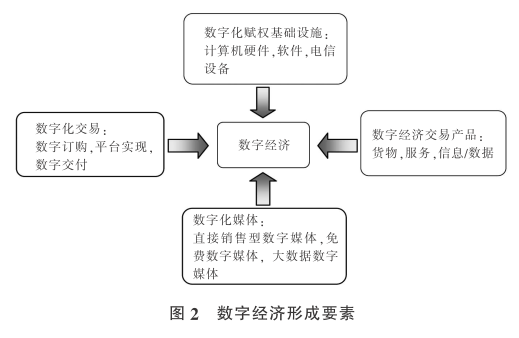

> 文献来源：许宪春,张美慧.中国数字经济规模测算研究——基于国际比较的视角[J].中国工业经济,2020(05):23-41.

## 主要内容

对数字经济规模进行了测算。具体而言，在梳理信息经济、互联网经济、数字经济演变历程的基础上，提炼数字经济的内涵与形成要素，构建数字经济规模核算框架，界定数字经济核算范围，确定数字经济产品，筛选数字经济产业，对 2007-2017 年中国数字经济增加值与总产出等指标进行测算，并将测算结果与美国和澳大利亚进行比较。

文章的创新之处：

- 界定数字经济统计范围；
- 划分数字经济统计分类；
- 探索数字经济测度方法；
- 测算具有国际可比性的数字经济规模。

## 理论基础

## 核算方法

### 数字经济范围

### 数字经济产品与数字经济产业

根据《统计用产品分类目录》逐一筛选数字经济产品，并在《国民经济行业分类》中确定生产该产品的行业。**因为部分产品同时拥有数字化和非数字化的成份，文章将其称为“不完全数字化产品”（Partly Digital Product），因为要从这类产品中剥离出数字化的成份需要更详细的数据支撑，文章只考虑了完全或主要特征为数字化的产品。**

### 核算方法

#### 行业增加值结构系数

由于现有数据主要提供门类层面的国民经济行业增加值数据，《中国投入产出表》提供了相对详细的 139 个行业的增加值数据，但是无法完全确定属于数字经济相关行业的国民经济行业大类以及更加细分的行业类别的增加值数据。因此，需要引入**“行业增加值结构系数”来推算数字经济相关行业的增加值数据**。计算公式为：

$$
行业ij增加值结构系数 = \frac{行业ij增加值}{行业j增加值} \tag{1}
$$

其中，行业 $ij$ 增加值为第 $j$ 行业第 $i$ 子类增加值，行业 $j$ 增加值为行业 $j$ 子类的增加值合计。

#### 数字经济调整系数

由于在与数字经济相关的国民经济行业中，一些行业只有部分内容属于数字经济，例如批发业中的互联网批发、零售业中的互联网零售等，因此不能简单的将与数字经济相关的所有行业增加值加总来计算数字经济总增加值。参考郑彦（2017）与黄璆（2017）构建“教育调整系数”和“物流调整系数”的方法，文章引入**“数字经济调整系数”，数字经济调整系数是指行业中数字经济增加值占该行业总增加值的比重。**计算公式为：

$$
行业数字经济调整系数 = \frac{行业数字经济增加值}{行业总增加值} \tag{2}
$$

#### 行业增加值率

行业增加值率是指国民经济各行业增加值与相应行业总产出的比率，用公式表示为：

$$
行业增加值率 = \frac{行业增加值}{行业总产出} \tag{3}
$$

#### 各行业数字经济增加值

借鉴 BEA 的测算方式（Barefoot et al., 2018; BEA, 2019），假设数字经济中间消耗占数字经济总产出的比重与相应产业中间消耗占总产出的比重相同，即**各行业数字经济增加值为该行业数字经济总产出与该行业增加值率的乘积**。用公式表示为：

$$
行业中数字经济增加值 = 行业数字经济总产出 \times 行业增加值率 \tag{4}
$$

结合公式（3）和（4），可得：

$$
\frac{行业数字经济总产出}{行业总产出} = \frac{行业数字经济增加值}{行业总增加值} \tag{5}
$$

综上，**数字经济调整系数既是行业中数字经济增加值占该行业总增加值的比重，也是该行业中数字经济总产出占该行业总产出的比重**。