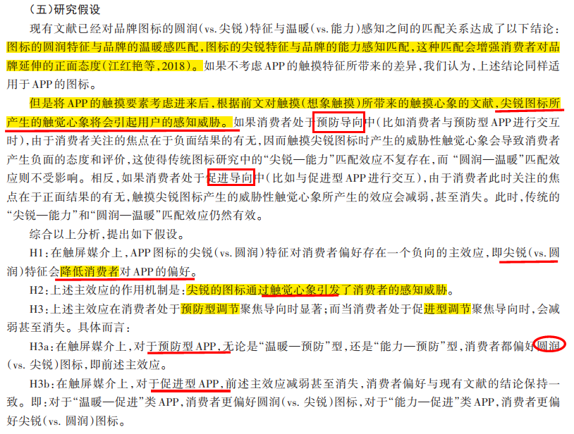
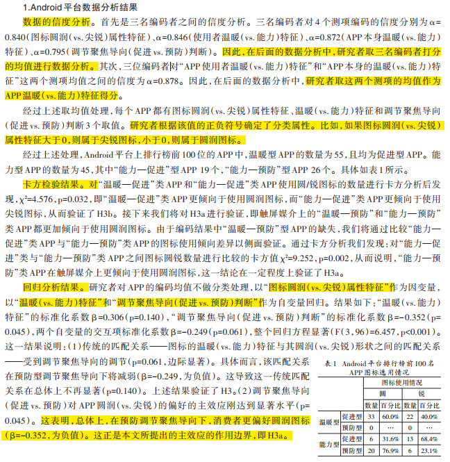
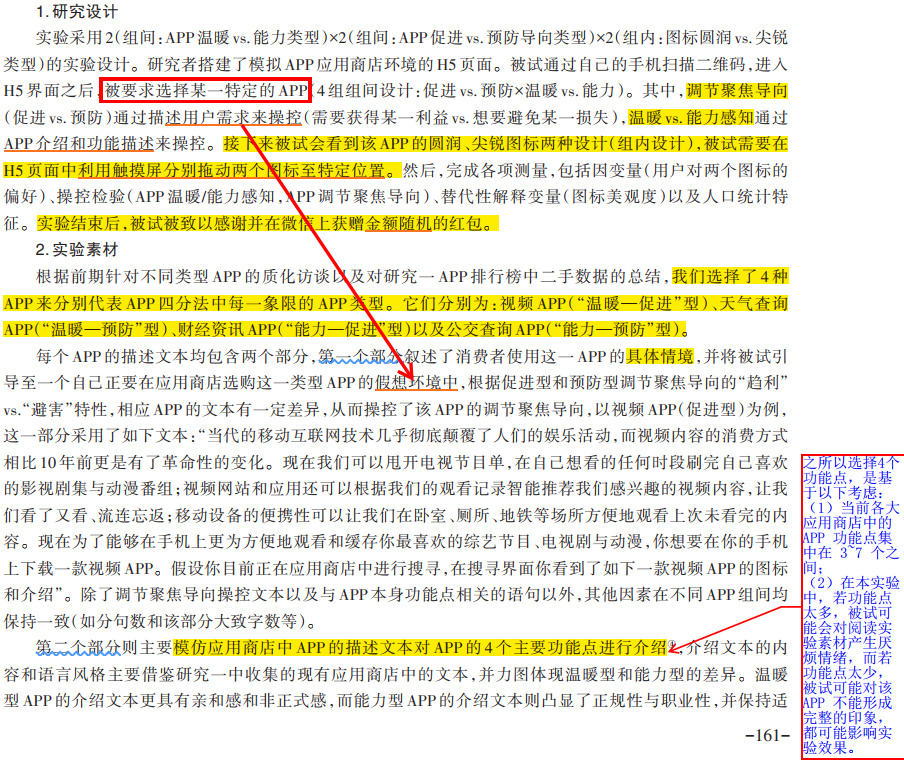
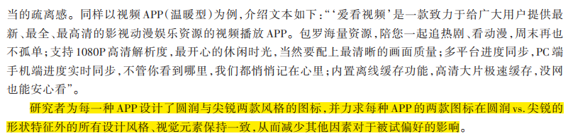
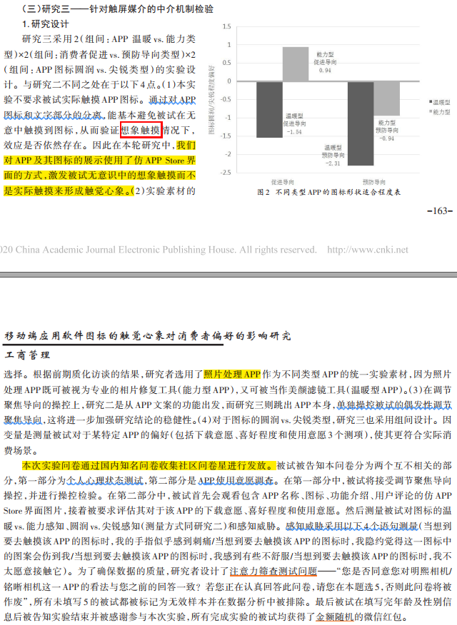
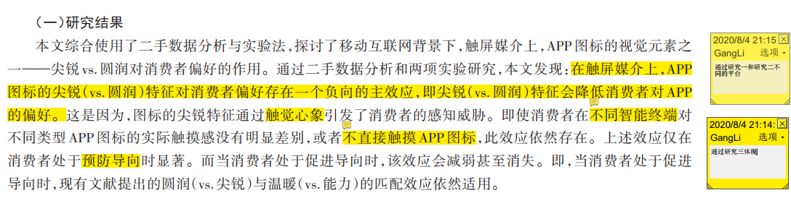

> 文献来源：费显政,肖登洋.移动端应用软件图标的触觉心象对消费者偏好的影响研究[J].管理世界,2020,36(07):153-171.

## 主要内容

通过二手数据分析和两项实验研究，探讨了 APP 图标的视觉元素之一——尖锐 vs.圆润对消费者偏好的作用。文章发现在触屏媒介上，APP 图标的尖锐（vs. 圆润）特征对消费者偏好存在一个负向的主效应，即尖锐（vs. 圆润）特征会降低消费者对 APP 的偏好。这是因为，图标的尖锐特征通过触觉心象引发了消费者的感知威胁。即使消费者在不同智能终端对不同类型 APP 图标的实际触摸感没有明显差别，或者不直接触摸 APP 图标，此效应依然存在。

## 关键概念

### 作为视觉刺激物的图标

图标的圆润特征是指图标是弯曲的、没有尖角的；而尖锐特征则是指图标是由直线与尖锐的拐角所构成（Jiang et al.，2016）。一般认为，圆形与和谐性、友好性相关；而方形与个性化、坚韧性、攻击性、力量性、男子汉气概相关（Aronoff et al.，1992；Berlyne，1976）。圆润弯曲的形状更多地与可爱、美丽、靠近相联系，而尖锐笔直的形状更多与科技、分析和冰冷的反应相联系（Fang & Mowen，2005）。方形视觉刺激让人产生了对于边框的联想，会给消费者带来“限制”的概念，从而降低了消费者的创造力，影响了消费者对新产品的正面评价（陈辉辉等，2016）。Ren 等学者的研究也认为，在服务场景中，弯曲婉转的手写体给人们带来更多温暖感（Ren et al.，2018）。

### 温暖与能力感知

温暖感知和能力感知由 Fiske 等人（2002）在其刻板印象内容模型（Stereotype Content Model）中所提出。温暖感知和能力感知分别作为人们评估其他个体的意图及其实施意图的能力的两个维度。温暖意味着关注他人、行为与道德规范一致的动机，能力则意味着实施意图的有效能力（Cuddy et al.，2008）。这两个维度将人们对待外群体的刻板印象根据温暖感知和能力感知的高低程度构成了四象限的刻板印象内容模型（Fiske et al.，2002）。

文章利用温暖（vs. 能力）这一维度作为划分 APP 类型的依据。具体而言，有两大判断标准：

- 一是产品的功能属性：如果该 APP 产品的功能给人带来的感觉是温暖的、友好的、亲切的，则属于温暖型；如果该产品给人带来的感觉是自信的、有能力的、有竞争力的，则属于能力型。
- 二是该 APP 产品的用户群体形象：如果你想到该产品的使用者是温暖的、友好的、亲切的，则属于温暖型；如果你想到该产品的使用者是自信的、有能力的、有竞争力的，则属于能力型。

### 触觉心象

心理学研究发现，个体对尚未经历的事情可由文字描述、图片描述或心象提示语等外界刺激而产生一种类似于想象的心理过程（MacInnis & Price，1987），即为心象。心象是反映个体对关于情感、记忆、想法等所体现的感觉信息进行呈现的过程，是一种心理表征，也可看做是记忆加工的某种方式或是内容（MacInnis & Price，1987）。

文章认为，对尖锐物体的触摸通常会给人们带来疼痛感和不适感，APP 图标的尖锐特征同样会因为给使用者带来感知威胁，从而负面影响消费者的偏好。

### 调节聚焦导向

调节聚焦理论（Regulatory Focus Theory）提供了一套解释个体对于同一事物采取不同处理方式的研究视角（Higgins，1997，1998）。调节聚焦导向起源于人的两个生存基本需要：发展（Nurturance）与安全（Security）。

- 基于发展需求的社会调节产生了促进导向（Promotion Focus），它使得人们的自我调节关注于如进步、志向、成就等**正面结果**的存在与否。
- 基于安全需求的社会调节产生了预防导向（Prevention Focus），它使得人们的自我调节关注于如保护、安全、责任等**负面结果**的存在与否（Higgins，2002）。

这同样导致了个体在感官信息的处理方式上的差异：

- 促进导向的个体关注于**积极事物**的有无，如成就、希望、理想；
- 预防导向的个体关注于**消极事物**的有无，如安全、责任、义务（Higgins et al.，2003）。

### 基于调节聚焦导向和温暖（vs. 能力）感知双视角的 APP 分类

根据 APP 功能（或者其使用者形象）的温暖（vs. 能力）特征感知，以及人们在下载/使用 APP 时所受内外部因素影响所处的调节聚焦导向（促进 vs. 预防）状态，可将 APP 划分为上图所示。

## 研究假设

## 实验设计与数据分析

文章首先利用二手数据检验了当前 APP 市场的实际数据是否与本文假设相符；接下来使用 H5 页面模拟消费场景，要求被试实际触摸 APP 图标，来验证消费者在触屏媒介上的对不同类型 APP 的图标偏好；最后进行针对触屏媒介的中介机制检验。

### 研究一：针对触屏媒介的二手数据分析

#### 数据来源

研究者于 2017 年 2 月 14 日，选择了 iOS 和 Android 平台应用下载排行榜上的前 100 个应用类 APP 作为数据源。

- 在 iOS 平台上，从免费排行榜与付费畅销榜上各自截取排名前 50 位 APP（排除了游戏类应用）的图标与应用介绍。
- 在 Android 平台上，则截取了豌豆荚移动应用榜（这一榜单上仅统计非游戏类应用）上排名前 100 位 APP 的图标与应用介绍。

研究者邀请了三名对智能手机应用十分熟悉的消费者（平均年龄 23 岁）作为编码者，他们分别为互联网行业从业者、理工科高校在校大学生、营销学术工作者。他们均不了解本研究的目标和研究假设。三人独立对上述 200 个 APP，按照给定的规则进行编码。**编码项目包含：APP 图标的圆润（vs. 尖锐）属性特征、该 APP 的典型使用者的温暖（vs. 能力）特征、该 APP 本身的温暖（vs. 能力）特征、该 APP 的调节聚焦导向（促进 vs. 预防）判断。编码者按照-3 到 3 的七级量表进行评分，其中，圆润（-3）—尖锐（3），温暖（-3）—能力（3），促进型（-3）—预防型（3）**。

#### 分析结果

##### Android 平台数据分析结果

##### iOS 平台数据分析结果

同前，分别进行信度分析、卡方检验和回归分析，研究结论与 Andriod 平台核心结论基本一致。

### 研究二：针对触屏媒介的主效应检验

研究二将模拟消费者在触屏媒介上浏览并下载图标的场景，邀请被试在 H5 页面下通过触摸图标来完成实验。

#### 研究设计

### 研究三：针对触屏媒介的中介机制检验

#### 研究设计

## 研究结果

