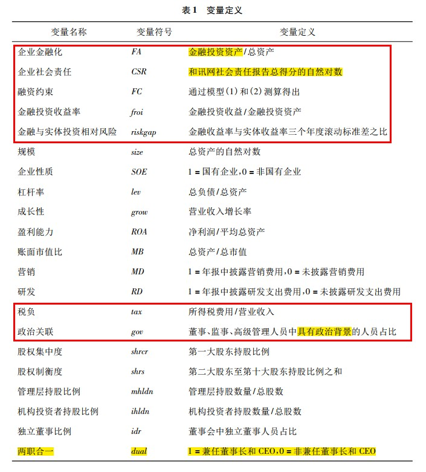
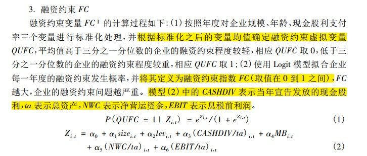

## 主要内容

利用 2010—2017 年中国 A 股非金融上市公司数据，立足于企业社会责任的股东价值主义假说，分析企业社会责任对企业金融化的影响及其作用机制。研究发现，企业能够通过承担社会责任得关键资源、缓解融资约束，间接提高金融资产配置比例、加重金融化，进而对企业价值产生潜在负面影响。

## 理论基础

### 企业社会责任

企业社会责任( Corporate Social Ｒ esponsibility) 是指企业在创造利润、促进股东财富最大化之外， 还需要进一步承担对利益相关者的责任( McWilliams and Siegel，2001) 。关于“企业承担社会责任是否有利于提升企业价值”的问题，现有观点可分为：

- **股东价值主义**：以资源依赖理论和利益相关者理论为基础。在股东价值主义观下，企业社会责任的资源集聚作用可以为企业带来竞争优势、提升企业价值。企业社会责任体现了股东利益。

- **管理层自利主义**：以委托代理理论为基础。在管理层自利主义假说下，企业社会责任的信息传递效应被扭曲为信息遮蔽效应，管理者企图通过良好的社会责任表现来掩盖或转移公众对其不端行为的关注( 高勇强等， 2012) 。

### 企业金融化

#### 是什么

文章将企业金融化定义为非金融企业增加对金融资产以及类金融资产( 如投资性房地产) 投资的行为。企业进行金融资产投资的**动机**可分为：

- **服务实体经济的“蓄水池”动机**：企业以流动性储蓄为出发点配置金融资产，目的是缓解企业面临的融资约束问题。
- **阻碍实体经济发展的“投资替代”动机**：资本套利被认为是企业金融化的本质。

#### 如何做

如何识别企业金融化的动机？

**已有研究**：从影响企业金融化的外部因素、金融化行为的结果两个角度识别；
**但是**：作者认为这建立在经济或财务分析框架上， 并未考虑非财务因素的影响；
**所以**：文章企业社会责任这一非财务视角，分析管理层的行为策略及其市场后果。

## 研究假说

**文章基于企业社会责任的股东价值主义假说**：

企业社会责任 ↑——利益相关者的信任度 ↑——集聚金融资源——缓解融资约束。

**分别在“蓄水池”动机和“投资替代”动机下推导企业社会责任对企业金融化的影响：**

**如果企业金融化更多体现为服务实体经济的“蓄水池”动机**：企业社会责任缓解融资约束——弱化金融资产进行预防性储蓄的动机——金融资产配置水平 ↓。即：

_H1a: 若企业金融化是出于“蓄水池”动机， 则企业社会责任负向影响企业金融化_

**如果企业金融化更多体现的是阻碍实体经济发展的“投资替代”动机**：企业社会责任缓解融资约束——成为金融资产投资的资金来源——金融资产配置比例 ↑。即：

_H1b: 若企业金融化是出于“投资替代”动机， 则企业社会责任正向影响企业金融化。_

## 研究设计

### 数据

#### 数据来源

文章选取 2010 年至 2017 年中国沪深两市 A 股上市公司作为研究样本。

企业财务数据和公司治理数据：上市公司年报、RESSET 金融研究数据库和 CSMAR 数据库；

企业社会责任数据：和讯网的上市公司社会责任报告，并使用润灵环球的社会责任报告披露情况进行稳健性检验。

选择 2010 年作为研究起点的原因是和讯网从 2010 年开始披露社会责任得分情况。

#### 样本筛选

研究样本同时经过以下处理:

1. 剔除金融业企业和房地产业企业；
2. 剔除同时在 B 股市场或者 H 股市场上市的企业，因为“A + B”股或者“A + H”股上市公司面临境内外双重监管环境，企业可能因为法律规定而不得不承担额外的社会责任或者只承担很少的社会责任;
3. 剔除 ST 类、PT 类企业;
4. 剔除相关数据异常或缺失的样本
5. 为消除极端值的影响，本文对所有连续变量在 1%和 99% 分位上进行 Winsorize 处理,最终得到 2849 个有效样本。

### 变量构造

### 模型设定

基准模型：企业金融化为因变量，企业社会责任为自变量，纳入控制变量；

异质性检验，在基准模型中，加入**企业性质**与企业社会责任的交互项、**股权集中度**与企业社会责任的交互项；

在企业社会责任对企业金融化影响的作用机制部分，使用B-K方法检验融资约束的中介作用；

为进一步识别不同企业性质和股权集中度企业的金融化动机，将链条拆解；

PSM-DID：解决企业社会责任和企业金融化互为因果的内生性问题

## 研究结论
