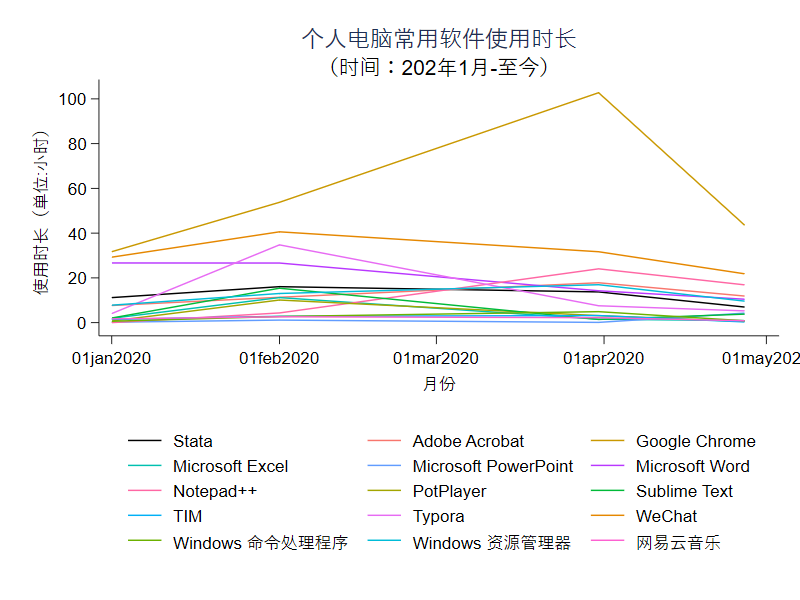
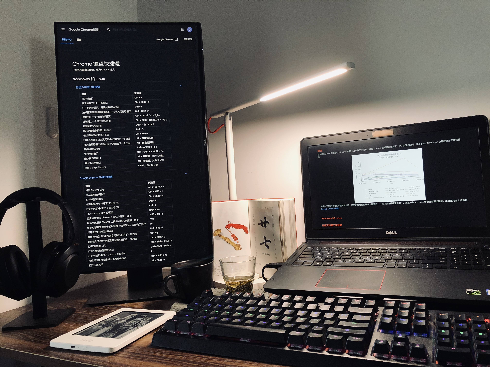

# 前言

简单统计了一下 2020 年至今电脑上常用软件使用时长，发现 Chrome 使用频率太高了。平时除了浏览网页，用 Jupyter Notebook 写一些代码也需要经常开着浏览器。

我看网页还有写东西习惯全屏，竖屏看横屏写，感觉这样会更加沉浸和专注（~~强迫症~~）。比如写这篇推文的时候，场景是这样的：

因此，感到熟悉  Chrome 常用快捷键再配合一些插件，使用起来比较顺畅。今天花了点时间专门看了下快捷键的文档。**声明一下：（1）这篇文章主要是搬运 [Google Chrome 帮助](https://support.google.com/chrome/answer/157179?hl=zh-Hans) 上的内容；（2）因为现在用的这台电脑是 Windows 系统，所以主要关注 Windows 上的使用。前往官方帮助文档，其他操作系统对应的快捷键**。全篇共 6 部分，分别为：

- 标签页和窗口快捷键
- Google Chrome 功能快捷键
- 地址栏快捷键
- 地址栏快捷键
- 网页快捷键
- 鼠标快捷键

# 快捷键

## 标签页和窗口快捷键
| 操作                                     | 快捷键                         |
| ------------------------------------------ | --------------------------------- |
| 打开新窗口                            | Ctrl + n                          |
| 在无痕模式下打开新窗口          | Ctrl + Shift + n                  |
| 打开新的标签页，并跳转到该标签页 | Ctrl + t                          |
| 按标签页的关闭顺序重新打开先前关闭的标签页 | Ctrl + Shift + t                  |
| **跳转到下一个打开的标签页**   | **Ctrl + Tab 或 Ctrl + PgDn**    |
| **跳转到上一个打开的标签页**   | **Ctrl + Shift + Tab 或 Ctrl + PgUp** |
| 跳转到特定标签页                   | Ctrl + 1 到 Ctrl + 8             |
| **跳转到最右侧的那个标签页**   | **Ctrl + 9**                      |
| **在当前标签页中打开主页**      | **Alt + Home**                    |
| 打开当前标签页浏览记录中记录的上一个页面 | Alt + 向左箭头键             |
| 打开当前标签页浏览记录中记录的下一个页面 | Alt + 向右箭头键             |
| **关闭当前标签页**                  | **Ctrl + w 或 Ctrl + F4**        |
| **关闭当前窗口**                     | **Ctrl + Shift + w 或 Alt + F4** |
| **最小化当前窗口**                  | **Alt + 空格键，然后按 n 键** |
| **最大化当前窗口**                  | **Alt + 空格键，然后按 x 键** |
| **退出 Google Chrome**                   | **Alt + f，然后按 x 键**     |

##  Google Chrome 功能快捷键

| 操作                                             | 快捷键               |
| -------------------------------------------------- | ----------------------- |
| 打开 Chrome 菜单                               | Alt + f 或 Alt + e     |
| 显示或隐藏书签栏                           | Ctrl + Shift + b        |
| 打开书签管理器                              | Ctrl + Shift + o        |
| 在新标签页中打开“历史记录”页      | Ctrl + h                |
| **在新标签页中打开“下载内容”页**  | **Ctrl + j**            |
| 打开 Chrome 任务管理器                      | Shift + Esc             |
| 将焦点放置在 Chrome 工具栏中的第一项上 | Shift + Alt + t         |
| 将焦点放置在 Chrome 工具栏中最右侧的那一项上 | F10                     |
| 将焦点移到未聚焦于的对话框（如果显示）或所有工具栏 | F6                      |
| 打开查找栏搜索当前网页                  | Ctrl + f 或 F3         |
| 跳转到与查找栏中搜索字词相匹配的下一条内容 | Ctrl + g                |
| 跳转到与查找栏中搜索字词相匹配的上一条内容 | Ctrl + Shift + g        |
| 打开“开发者工具”                        | Ctrl + Shift + j 或 F12 |
| 打开“清除浏览数据”选项               | Ctrl + Shift + Delete   |
| 在新标签页中打开 Chrome 帮助中心       | F1                      |
| 使用其他帐号登录或以访客身份浏览   | Ctrl + Shift + m        |
| 打开反馈表单                                 | Alt + Shift + i         |

## 地址栏快捷键

| 操作                                                         | 快捷键                                                   |
| ------------------------------------------------------------ | -------------------------------------------------------- |
| 使用默认搜索引擎进行搜索                                     | 输入搜索字词并按 Enter 键                                |
| 使用其他搜索引擎进行搜索                                     | 输入搜索引擎名称，然后按 Tab 键                          |
| 为网站名称添加 `www.` 和 `.com` ，然后在当前标签页中打开该网址 | 输入网站名称并按 Ctrl + Enter 键                         |
| 打开新的标签页并执行 Google 搜索                             | 输入搜索字词并按 Alt + Enter 键                          |
| 跳转到地址栏                                                 | Ctrl + l 或 Alt + d 或 F6                                |
| 从页面中的任意位置搜索                                       | Ctrl + k 或 Ctrl + e                                     |
| 从地址栏中移除联想查询内容                                   | 按向下箭头键以突出显示相应内容，然后按 Shift + Delete 键 |
| 将光标移到地址栏                                             | Ctrl + F5                                                |

## 网页快捷键

| 操作                                         | 快捷键                      |
| ---------------------------------------------- | ------------------------------ |
| 打开选项以打印当前网页              | Ctrl + p                       |
| 打开选项以保存当前网页              | Ctrl + s                       |
| 重新加载当前网页                       | F5 或 Ctrl + r                |
| 重新加载当前网页（忽略缓存的内容） | Shift + F5 或 Ctrl + Shift + r |
| 停止加载网页                             | Esc                            |
| 浏览下一个可点击项                    | Tab                            |
| 浏览上一个可点击项                    | Shift + Tab                    |
| 使用 Chrome 打开计算机中的文件      | 按住 Ctrl + o 键并选择文件 |
| 显示当前网页的 HTML 源代码（不可修改） | Ctrl + u                       |
| 将当前网页保存为书签                 | Ctrl + d                       |
| 将所有打开的标签页以书签的形式保存在新文件夹中 | Ctrl + Shift + d               |
| 开启或关闭全屏模式                    | F11                            |
| 放大网页上的所有内容                 | Ctrl 和 +                     |
| 缩小网页上的所有内容                 | Ctrl 和 -                     |
| 将网页上的所有内容恢复到默认大小 | Ctrl + 0                       |
| **向下滚动网页，一次一个屏幕**    | **空格键或 PgDn**          |
| **向上滚动网页，一次一个屏幕**    | **Shift + 空格键或 PgUp**  |
| 转到网页顶部                             | 首页                         |
| 转到网页底部                             | 末尾                         |
| 在网页上水平滚动                       | 按住 Shift 键并滚动鼠标滚轮 |
| 将光标移到文本字段中的上一个字词起始处 | Ctrl + 向左箭头键         |
| 将光标移到下一个字词起始处        | Ctrl + 向右箭头键         |
| 删除文本字段中的上一个字词        | Ctrl + Backspace               |
| 在当前标签页中打开主页              | Alt + Home                     |
| 重置页面缩放级别                       | Ctrl + 0                       |

## 鼠标快捷键

| 操作                                   | 快捷键                                                       |
| -------------------------------------- | ------------------------------------------------------------ |
| 在当前标签页中打开链接（仅限鼠标）     | 将链接拖到标签页中                                           |
| 在新的后台标签页中打开链接             | 按住 Ctrl 键的同时点击链接                                   |
| 打开链接，并跳转到该链接               | 按住 Ctrl + Shift 键的同时点击链接                           |
| 打开链接，并跳转到该链接（仅使用鼠标） | 将链接拖到标签栏的空白区域                                   |
| 在新窗口中打开链接                     | 按住 Shift 键的同时点击链接                                  |
| 在新窗口中打开标签页（仅使用鼠标）     | 将标签页拖出标签栏                                           |
| 将标签页移至当前窗口（仅限鼠标）       | 将标签页拖到现有窗口中                                       |
| 将标签页移回其原始位置                 | 拖动标签页的同时按 Esc                                       |
| 将当前网页保存为书签                   | 将相应网址拖动到书签栏中                                     |
| 在网页上水平滚动                       | 按住 Shift 键并滚动鼠标滚轮                                  |
| 下载链接目标                           | 按住 Alt 键的同时点击链接                                    |
| 显示浏览记录                           | 右键点击“后退”箭头，或者左键点住“后退”箭头；右键点击“前进”箭头 下一步，或者左键点住“前进”箭头 |
| 在最大化模式和窗口模式之间切换         | 双击标签栏的空白区域                                         |
| 放大网页上的所有内容                   | 按住 Ctrl 键并向上滚动鼠标滚轮                               |
| 缩小网页上的所有内容                   | 按住 Ctrl 键并向下滚动鼠标滚轮                               |