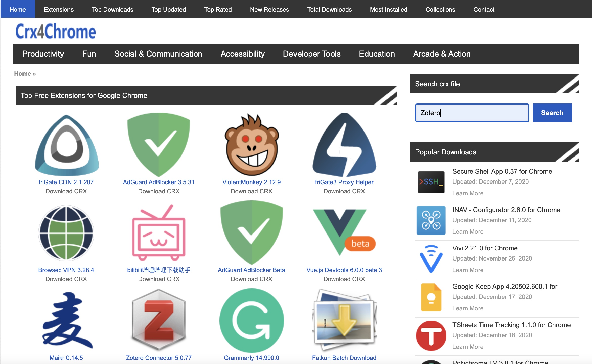
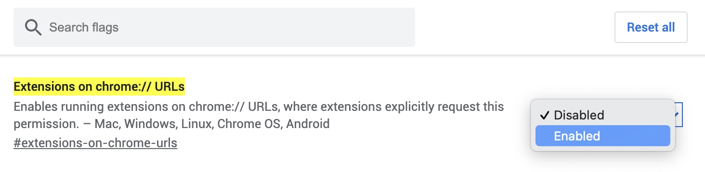

Chrome 离线安装拓展的方式

### 前言

由于网络原因，常有 Chrome 扩展程序无法安装的问题，本文介绍 Chrome 离线安装拓展的方法。

### 安装步骤

**第一步**：前往 [Crx4Chrome](https://www.crx4chrome.com/) 下载需要安装拓展程序的`.crx`文件；

**第二步**：在`Chrome`浏览器网址栏输入`chrome://flags/#extensions-on-chrome-urls`，将 `Extensions on chrome:// URL`的 `Disabled` 改为 `Enabled` ，并点击下面的 `[Relaunch]` 重启浏览器。

**第三步**：重启浏览器后，在浏览器网址栏输入：`chrome://extensions/`，打开右侧开发者模式。之后将第一步下载的`.crx` 拖入扩展程序中即可安装。

**第四步**：安装完成之后，重新输入`chrome://flags/#extensions-on-chrome-urls`，将 `Extensions on chrome:// URL`的 `Enabled` 改为 `Disabled` ， 之后重启浏览器，即可完成安装。

