#  Math Cheat Sheets
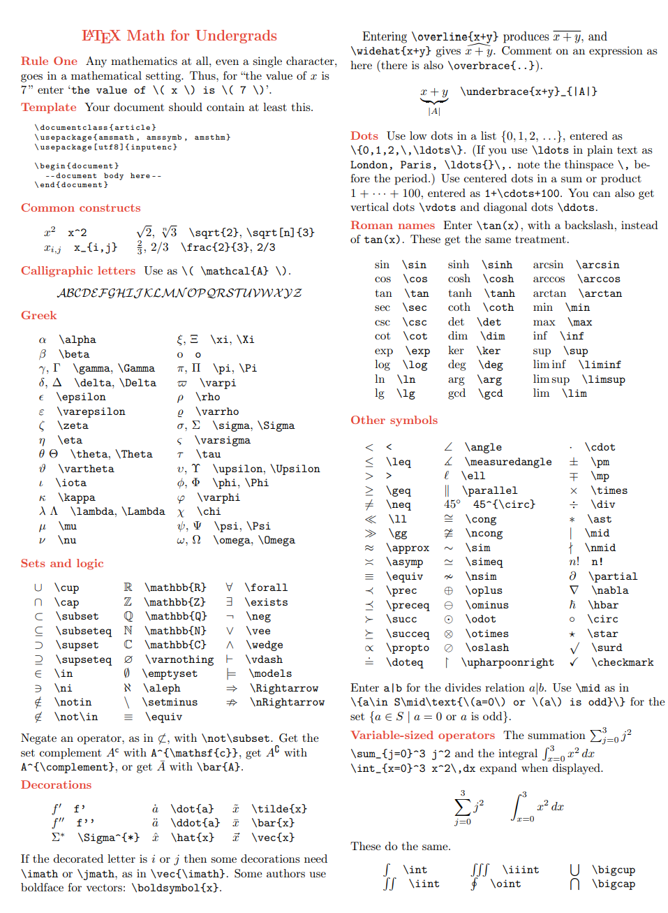

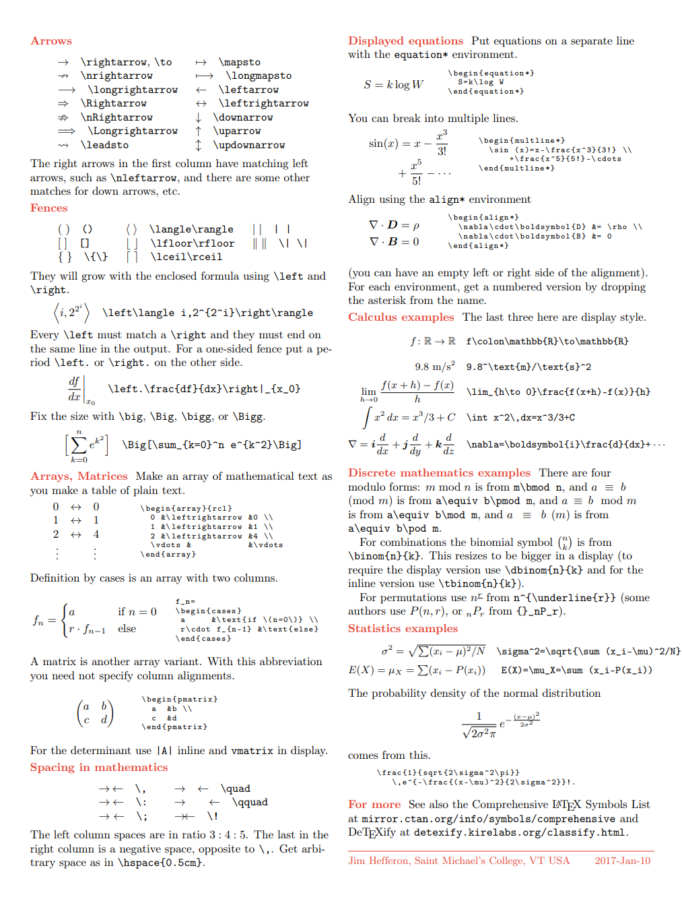

# Math Symbols

## Math Mode Accents

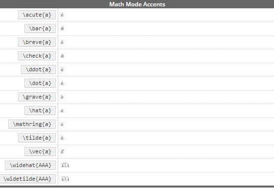

## Greek Letters

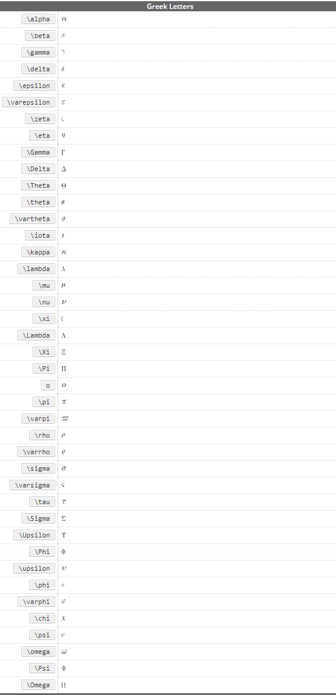

## Binary Relations

## Binary Operators

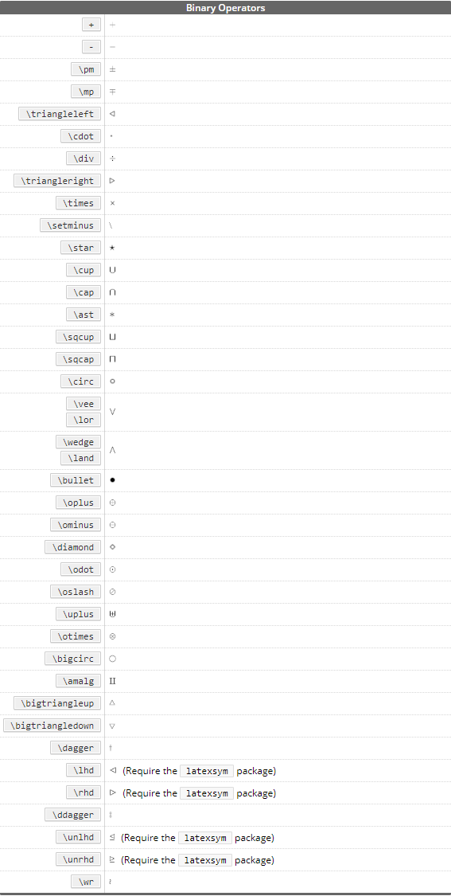

## BIG Operators

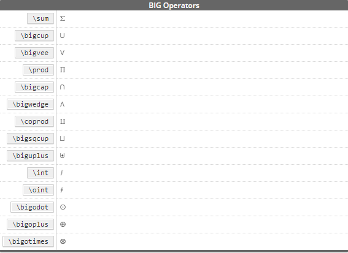

## Arrows

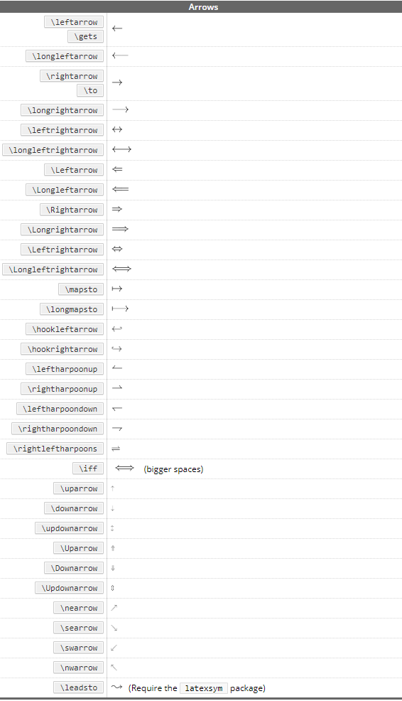

## Arrows as Accents

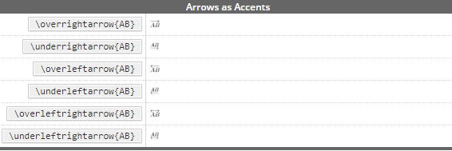

## Delimiters

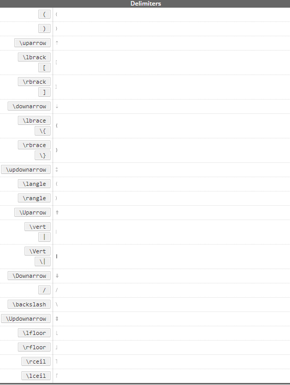

## Large Delimiters

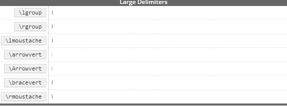

## Miscellaneous Symbols

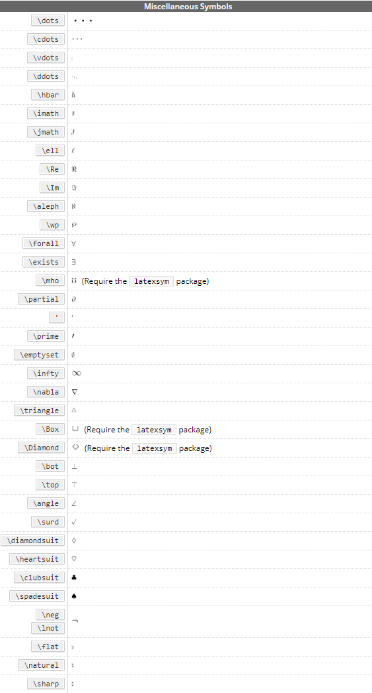

## Non-Mathematical Symbols

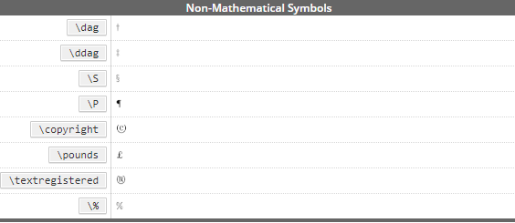

## AMS Delimiters

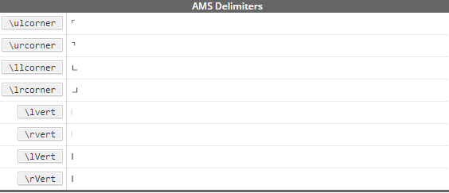

## AMS Greek and Hebrew
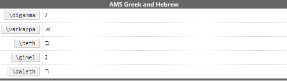

## Math Alphabets
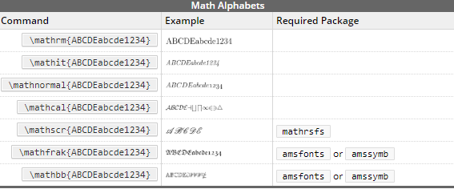

## AMS Binary Operators

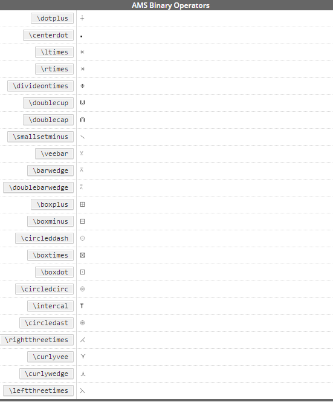

## AMS Binary Relations

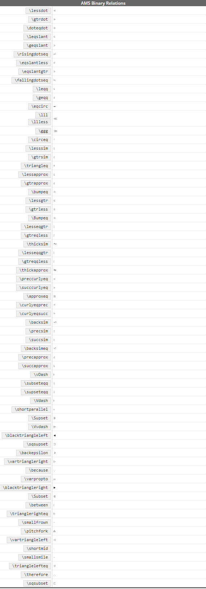

# Source 

1.https://kapeli.com/cheat_sheets/LaTeX_Math_Symbols.docset/Contents/Resources/Documents/index 
2.http://tug.ctan.org/info/undergradmath/undergradmath.pdf