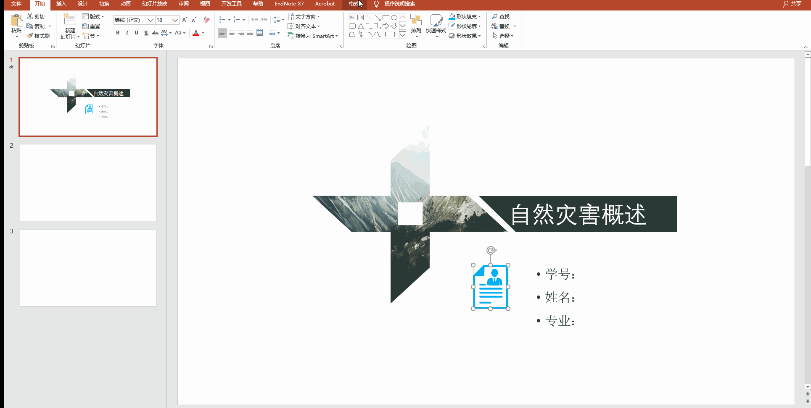
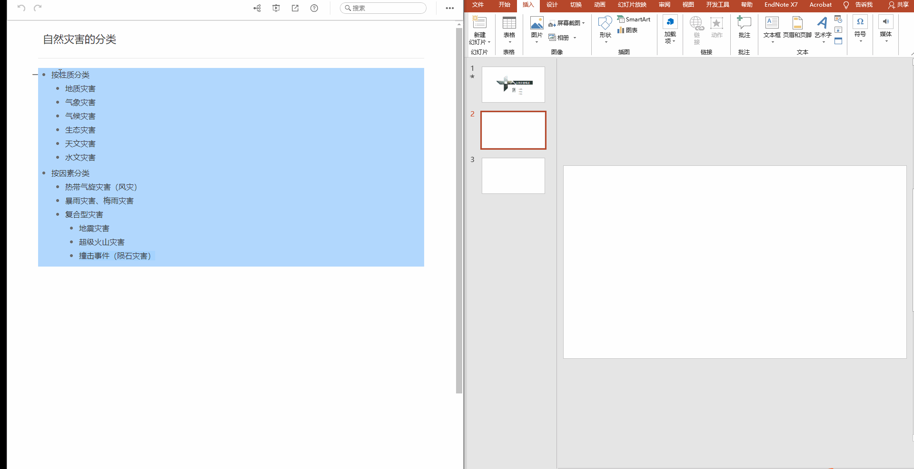
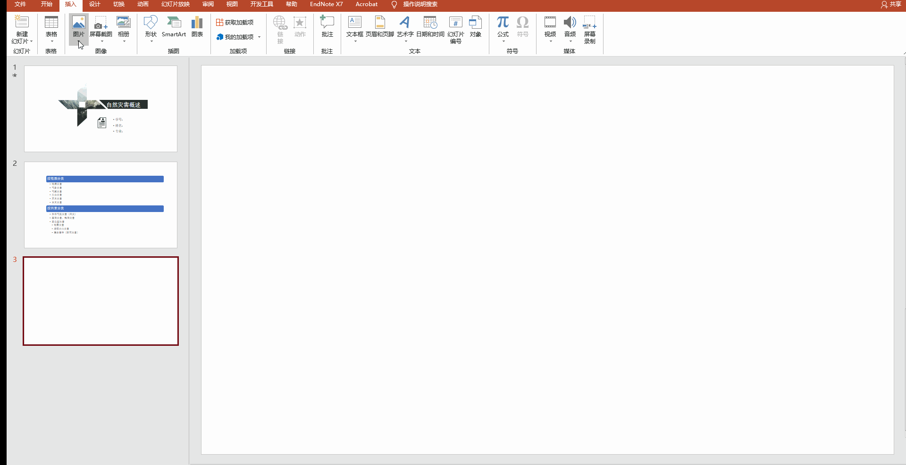
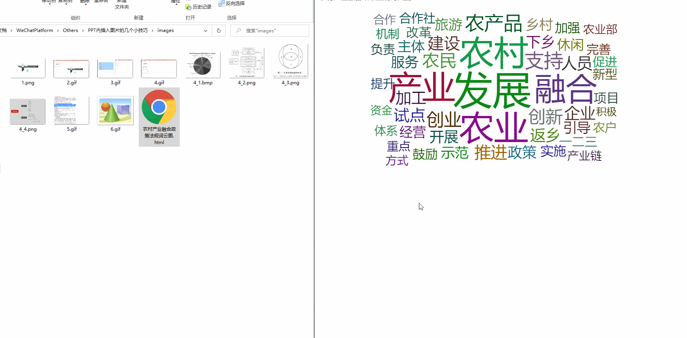
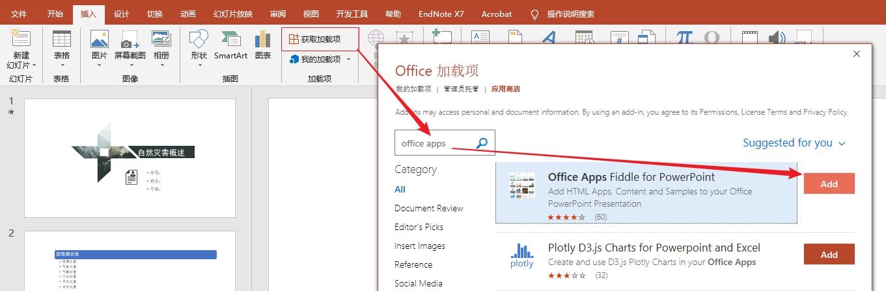
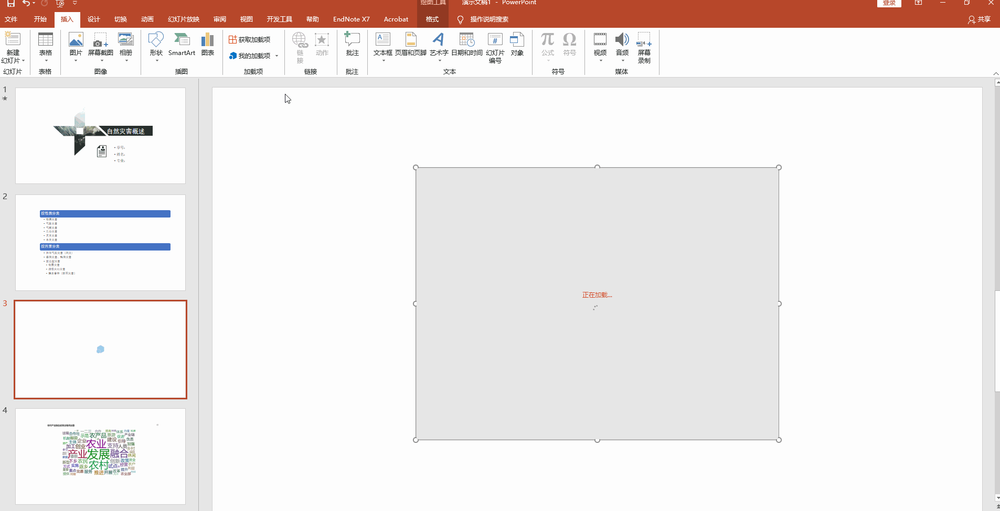
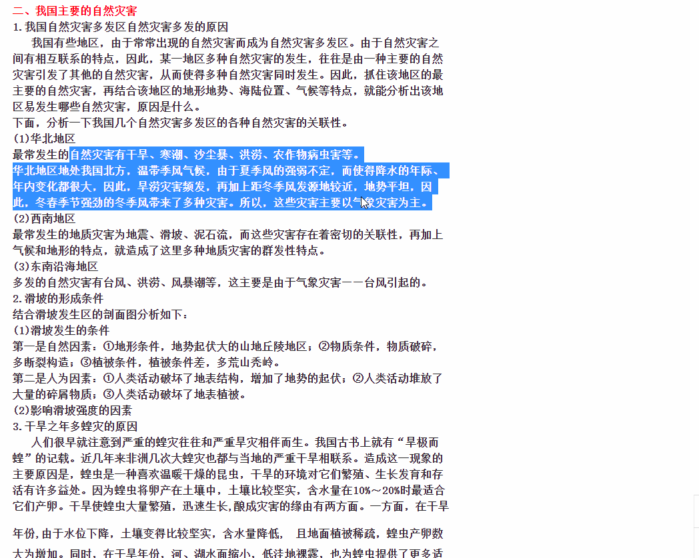

# PPT 中插入图片的几个技巧

## 前言

今天给大家分享几个制作PPT的小技巧，主要是与图片相关。分别是：图片取色器、插入流程图、多图快速布局和插入 `pyecharts` 动态图和复制禁止复制页面的内容。

## 图片取色器

通过取色器快速修改颜色。比如下面这张图中，图标是别处找的，蓝色和背景显得不协调。可以通过取色器快速修改为背景颜色。取色器选项卡的位置为：点击图片-格式-形状颜色-取色器-选择更换后的颜色。

## 流程图

之前加入一些流程图，我是使用幕布制作好导出为图片再加入 PPT。但是感到幕布导出图片的清晰度和配色不太好，和 PPT 整体风格不搭。探索了一下，**可以使用 PPT 的 SmartArt 将文字转化为列表、流程图、结构图等**。操作方式为：先在幕布中编辑好文本层次关系-在 PPT 中插入文本框-将文字通过 `Ctrl+C` 和 `Ctrl+V` 复制粘贴到文本框-选中文字右键选择【转换为 SmartArt】-选择合适的图形-调整颜色等细节。

## 多图快速布局

在同一页面需要插入多张图片时，可以通过图片版式快速布局。操作为：插入-图片-图片格式-图片样式栏选择【图片版式】-选择合理的布局，将颜色等微调。

## 插入 pyecharts 图表

PPT 中免不了数据可视化，插入静态图片显得很单调，可以考虑插入 pyecharts 制作的动态图。实现步骤为：

- 首先使用 Python 的 `pyecharts` 库绘制，之后复制动态图 html 的源代码。

- 在 PPT 中 PT 下载“Office Apps Fiddle for PowerPoint”加载项。

- 在加载项中插入 HTML 代码。

接下来，以我之前绘制过的词云图为例，展示具体实现过程：

**Step01: 获取图片 HTML 页面的源代码**

**Step02：前往 PPT 下载加载项**

**Step03：插入 HTML 代码**

需要说明的是：在插入 HTML 代码时会报错，多尝试几次就好；在打开 PPT 时需要加载，如果插入过多动图会导致 PPT 打开缓慢，防止演示意外，可以在汇报或者答辩中适当插入关键图片，在保证流畅度的前提下给人眼前一亮的效果。

## Crtl+P 复制内容

在有些页面需要登录或者禁止复制时，可以通过 `Ctrl+P` 打印预览进行复制。

