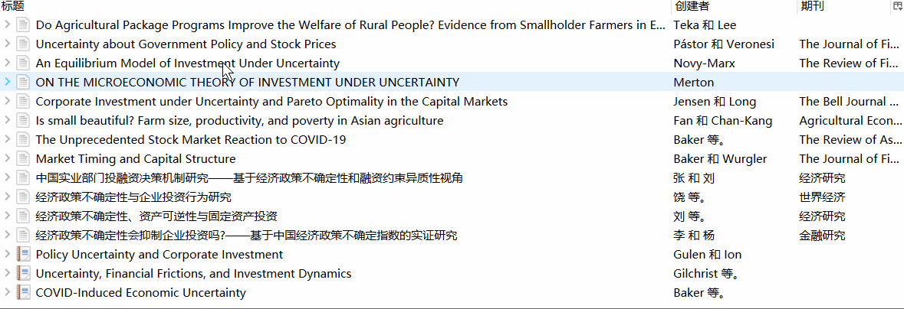

## 从知网导入中文文献，作者姓和名分割



### 解决办法一

找到Zotero安装路径translator文件夹中的`CNKI.js`文件（`...\Zotero\translators`），将如下代码（约在第220行至223行）：
```JavaScript
else {
					// Chinese name. first character is last name, the rest are first name
					creator.firstName = creator.lastName.substr(1);
					creator.lastName = creator.lastName.charAt(0);
				}
			}
```
修改为：
```JavaScript
else {
					// Chinese name. first character is last name, the rest are first name
					// creator.firstName = creator.lastName.substr(1);
					// creator.lastName = creator.lastName.charAt(0);
					creator.firstName = "";
				}
			}
```

评价：修改后新导入的文献导入为