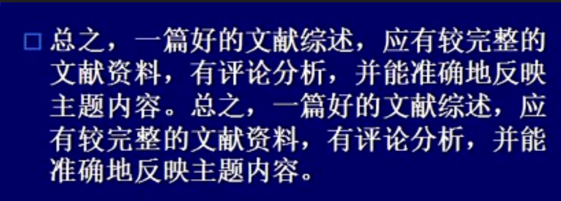

## 前言

这门课已经接近尾声，将这几周老师点评中的要点整理一下。

## 注意事项
### 汇报方面

1. 注意仪表、气质、语态和语速。**拒绝口语化语言**，少用：然后、就是、还有、嗯、呃、内个...。
2. 时间严格把控，多少分钟汇报和多少分钟互动，和规定的时间要“一分不多一分不少”。
3. 汇报时间短不是讲不清楚的理由，要能够在规定的时间内讲出主要问题，关键在于如何组织和思考。
4. 小组分工不仅要第一位同学介绍，最好在 PPT 上写明每个组员负责的内容。
5. 第一位同学破题，必须介绍汇报的整体思路和章节间的逻辑关系（每部分讲什么、为什么这么安排）。
6. 小组汇报过程中时，后面的同学适当点一下前面同学讲的内容，这样让整体显得更加连贯。
7. 点评时，指出别人汇报中值得借鉴和改进之处。

### 内容方面
1. PPT细节： 小标题要简洁、整齐；字体大小、行距、文字多时页面留白不宜过多、适当添加动画吸引听众；PPT 规范、衔接流畅。
2. 标题和关键字一定要检查清楚，不能出现错别字。
3. 题目中有“与”字是谈二者之间的关系，需要在开始给出两者的概念、为什么要谈二者之间的关系。
4. 章节间要有逻辑联系，后文的展开要与第一部分的概述和分类相对应。
5. 小组成员间的内容要协调好，不能存在交叉重叠或者遗漏。 
6. 最后一部分的政策建议要建立在前文提出的问题上，而且政策建议本身也要全面。
7. 讲述案例时，最后要归纳问题和经验启示。
8. **结构上要注意逻辑关系**。比如最后一部分讲解灾害的防控，需要在前面讲出灾害造成的损失和成因，最后结合成因提出防控措施。

## 参考文献注意事项

