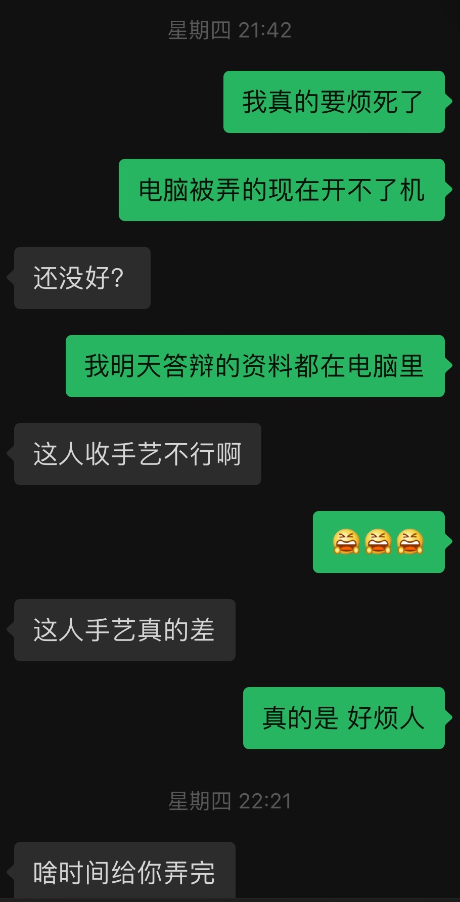
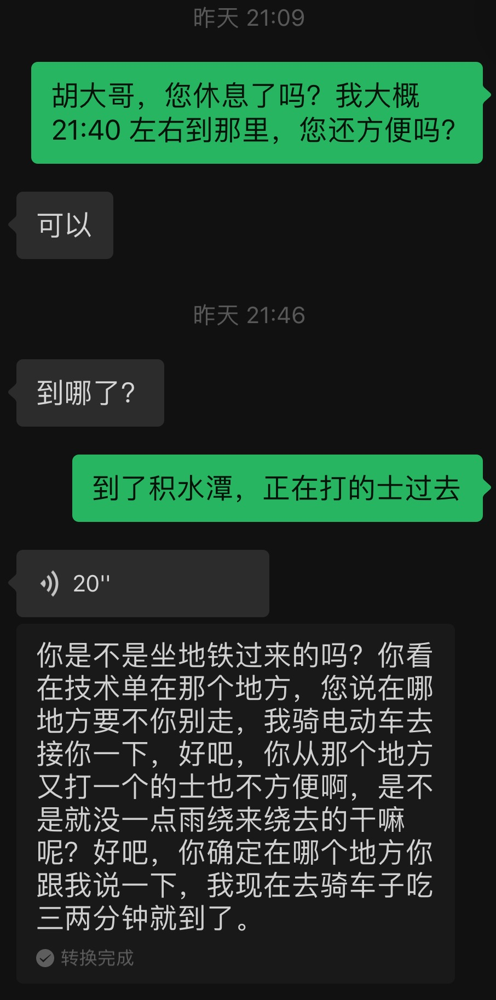
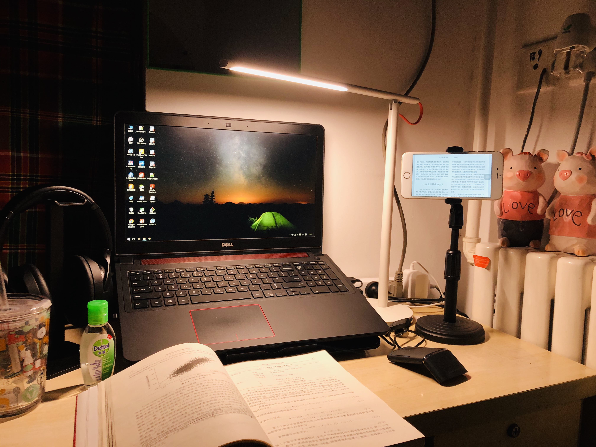

近来一周

<Music-I love Mondays>

从6月29出门到今天，正好一周时间。虽然只有一周，但是感觉经历比整个学期还丰富。先是 6.29 到 7.3 在小黄李租的公寓挤了几天，还弄完叻7.3毕业开题答辩，随后7.4给老朋友在武汉过完生日，之后7.5赶到北京，7.6办理实习入职。这一周里面，有几件事情还真是令人难忘。

## 最近几件小事

### 修电脑翻车

论文开题答辩的前一天，我“别出心裁”的把电脑拿回学校熟人那里换固态硬盘，结果电脑被弄的开不了机...令人抓狂的是，第二天答辩要用的材料都在电脑里，还没提前备份。结果在学校那边从16:00点等到23:00，当时真的是等到没脾气。

不过老板人也挺好，一直在给我想办法解决，最后放弃今晚带走电脑的想法，打算把我机械盘放老板电脑，把答辩资料拷贝出来。结果我原来硬盘没分区，受系统保护，资料加密拷贝不了。好在急中生智，进PE后才拷贝成。最后我终于拷到了资料，带着老板的电脑准备明早答辩。

当时回到住的地方已经23:30，本来和小黄李约了晚饭，结果晚饭直接弄成了宵夜。不过讲真，那晚吃的那份干锅包菜还挺香的。

### 飞机晚点

7.4在武汉给老朋友过完生日，第二天就赶飞机到北京，本来是计划16:35到北京，之后去找房东看房。结果因为暴雨天气的原因，飞机先是备降太原，后来又备降到呼和浩特白塔机场，好在只在呼和浩特等了一小时，随后又飞回了北京，当时落地已经将近21:00。加上坐地铁的时间，一直到22:00才和房东碰上面，胡大哥人也超好，我本来准备从积水潭下地铁打的过去找他，但考虑到晚上不好打车，他骑着小电动车过来接我了。

记得去年3月份过来北京实习，开始也是在这附近住下的，在小西天的和园青旅住了半个月，当时也是大晚上拖着行李箱找住的地方在哪里，不过这一次没有自己找，坐着胡大哥的电瓶车，唠着家常就到了。

到了准备租的房子，只简单看了一下，是在一个小区旁边的老平房，一个四周堆着杂物的院子里，靠里边横着一排矮塌的老房子，我准备租的是一个小单间，空间正好容纳一张单人床、一个桌子，中间还剩半步宽的过道。当时没有想太多，想着刚过来租房能省点是点，就盘算着租在这里得了。

已经将近十一点，胡大哥带我去附近一家宾馆休息。但是在宾馆登记的时候，老板听说从武汉来的，觉得各种登记很麻烦，就没让办理入住。最后还是回到租的房子将就住的一晚。

## 最后想说

### 实习第一天
今天是去实习的第一天，整体来说还是挺顺利的，上午7:30出发，8:30到清华东南门，花15分钟在门口的店喝了碗粥，到中央主楼正好9:00。晚上下完班回来把房间好好收拾了下，把桌面收拾的整齐了一下，然后就坐下来写这篇流水账。

发现无论在哪里，只要一方小桌子能够收拾整齐，能安静的看书、写点东西，就会感到踏实。

### 湖北汛情

今天在同学群里看见湖北的汛情越来越严峻，很多同学都已经奔赴了防汛的一线，希望大家都能平平安安。

