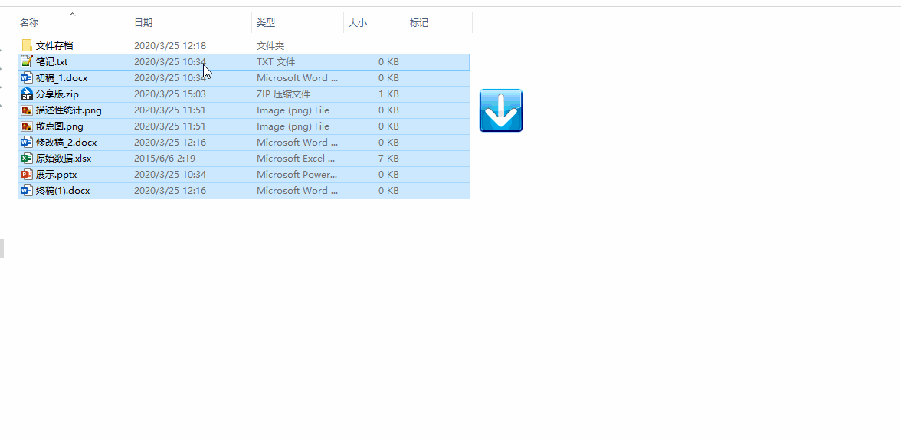

<music-걱정말아요 그대>

## 引言

整理下个人常用的效率工具，因为目前手头用的Windows系统，文中介绍的软件主要用于Windows系统，后面有时间再整理Mac上好用的工具。之所以将这些软件称之为“神器”，因为它们大多（并非全部，但是有的免费版已经够用）开源、免费和轻量，使用习惯后可以极大提高工作效率。

**下方表格是软件清单，我已经将这些软件的安装包整理好了，将百度云盘下载链接附在了文末**。整理不易，花了我近半个上午时间，前几天被邀请开通了付费阅读，所以今天也体验下新功能。

|软件|功能|
|:---:|:---:|
|Everything|文件搜索|
|Listary|文件检索|
| Seer|文件（夹）预览|
|DropIt|文件自动分类|
|Bandizip|文件解压缩工具|
|ReNamer|文件批量重命名|
|Iobit Uninstaller|软件卸载工具|
|Snipaste|截图工具|
|FastStone Capture|截图工具|
|GifCam|录制gif工具|
|LICEcap|录制gif工具|
|Inpaint|去水印工具|
|PotPlayer|视频播放器|
|SublimeText|文本编辑器|
|Ditto|剪贴板增强软件|
|Typora|Markdown编辑器|
|Qtranslate|翻译器|
|幕布|思维导图|
|f.lux|调节屏幕亮度|
|adsafe|弹窗拦截|
|gInk|屏幕标注工具|
## 软件介绍

### 文件管理类

#### Everything 文件搜索
大名鼎鼎的 Everything 就不过多介绍了，它是 Windows 上一款搜索引擎，能够基于文件名**快速**找到文件和文件夹位置。除此之外，Everything 还支持文件实时更新，而且还可以通过正则表达式来来搜索文件内容。 

使用指南：https://www.voidtools.com/zh-cn/support/everything/using_everything/

#### Listary 文件检索
Listary 和 Everything 都是用与文件检索，但是 Listary 更像是检索引擎，双击 `Ctrl` 后就可以调用软件，在检索框输入需要文件的关键字即可快速定位。除此之外，它还可以快速打开软件、调用浏览器搜索引擎。

使用介绍：https://sspai.com/post/52725

#### Seer 文件（夹）快速预览

Seer 是一款 Windows 下的文件预览工具，可以无需打开图片、音乐、视频、压缩包等文件就能预览到内容，只需点一下空格。

主页：http://1218.io/

#### Q-Dir 多窗格文件管理器
Q-Dir是Windows的多窗格文件管理器，它使文件管理更方便，最重要的是，对您来说更加舒适。 将多个窗口指向硬盘驱动器上的不同位置可以更轻松地将数据从一个文件夹移动或复制到另一个文件夹，并且还可以更快地进行浏览。 Q-Dir支持不同的布局，有2,3或4个窗格，每个窗格都可以单独配置。

#### DropIt 文件自动分类

这个在之前[杂乱文章自动分类](https://mp.weixin.qq.com/s/wrcWdo-XQNY_W1yGJ0ROEQ)一文中提及过，DropIt 是一款源于国外的开源、免费软件，似乎仅支持 Window 系统。预先设定好协议（规则），轻松拖拽就可以将文件自动分类。除了能自动分类外，它还支持批量压缩文件、给重要的文件加密、文件转格式和批量处理图片等功能。根据使用习惯，可以打造个人全自动的文件管理系统。

#### Bandizip 解压工具
Bandizip是一款来自韩国的开发商 Bandisoft 开发的解压缩软件，小巧、干净、免费、细节设计到位。

#### ReNamer 批量重命名
又名拖把命名器，ReNamer 将各项操作浓缩为相应规则，通过执行规则列表来重命名文件，明确的操作加上明确的执行顺序，大大降低了批量重命名的复杂度。

#### Iobit Uninstaller 软件卸载
非常好用的软件卸载工具，通过清晰的菜单可以看见每个软件安装的时间。卸载软件时，软件首先调用标准的卸载程序，之后会检查残留文件、注册表清理，以彻底将文件卸载，卸载完成后，还会显示已删除的文件数量和回收的磁盘空间。

### 图片视频类
#### Snipaste 截图工具
功能非常强大的截图软件，支持截图、贴图、图片标注等功能，还可以截图取色。

#### FastStone Capture 截图工具
可以滚动截图，很方便的截取屏幕长图。

#### GifCam 录制gif工具

GifCam是一款操作非常简单、界面非常简洁明了的GIF录制软件。它能够非常轻松的录制你想要的动态gif图片，录制好了后还可以对其进行编辑，优化。在录制的过程中用户可以随时改变窗口大小、位置，在编辑的时候也可以查看每一帧，并且可以对其进行增加和删除。

#### LICEcap 录制gif工具

一款屏幕录制工具，支持导出 GIF 动画图片格式，轻量级、使用简单，录制过程中可以随意改变录屏范围。LICEcap 非常轻量级，安装包不到 500KB。运行后会以窗口的方式显示在桌面，拖动选取一个合适的大小范围，点击 Record 选取保存路径就开始录屏了。LICEcap 在录屏过程中可以随时拖动窗口改变录屏范围，Stop 过后自动保存为 GIF 格式。

主页：https://www.cockos.com/licecap/

#### Inpaint 去水印工具
Inpaint虽然小巧但很实用，可以很方便的去除图片水印，它的原理是使用周围的像素重建所选区域。除了能去水印，还可以去除图片中多余的杂物，只要画笔涂上要去除的内容点击执行即可，使用方便。

使用指南：https://theinpaint.com/tutorials

#### PotPlayer 视频播放器
功能非常强大的视频播放器，内置解码器、自定义皮肤、实时翻译，具有丰富的自定义选项。

### 文档编辑类
#### SublimeText 编辑器

轻量、颜值高的文本编辑器，可以很方便的管理package，可以配置Python、Stata、Markdown和LaTex使用。

#### Ditto 剪贴板增强软件
Ditto 是一款开源、免费、强大的剪贴板增强工具。可以把复制过的所有内容保存起来（可以设定保存日期或条目总数），快捷地供后续调用。还可以合并粘贴，纯文本粘贴，支持分组、置顶、快速搜索、热键粘贴功能。并且，还可以通过网络共享剪贴板内容。

主页：https://ditto-cp.sourceforge.io/

#### Typora Markdown编辑器
Markdown编辑器，简洁美观，可以下载加载其他主题，可以很方便的将`md` 文件导出为 Word、PDF、HTML 等多种文件类型。

#### Qtranslate 翻译器
很便捷的翻译器，集成Google translate、有道翻译、百度翻译等多个翻译引擎，开启鼠标模式支持划词搜索、发音等功能。

#### 幕布 思维导图
从文字大纲生成思维导图，头脑风暴和讨论的时候使用很方便。

### 其他
#### f.lux 屏幕亮度调节
自动调节屏幕亮度，护眼。

#### adsafe 拦截弹窗
又名净网大师，用于拦截电脑弹窗广告。

#### gInk 屏幕标注工具
可以截图在屏幕上标注和画图，用来上课演示非常方便。

## 下载链接

链接：https://pan.baidu.com/s/1QtN7Sf5b61ennTqR1_uY7A 

提取码：f7uf