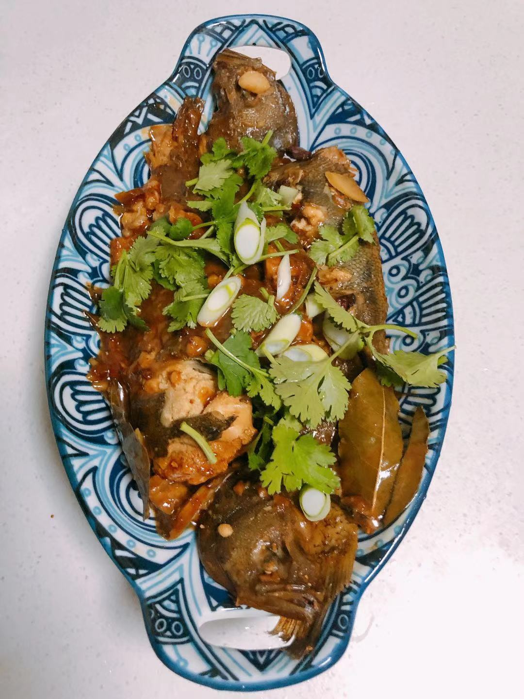
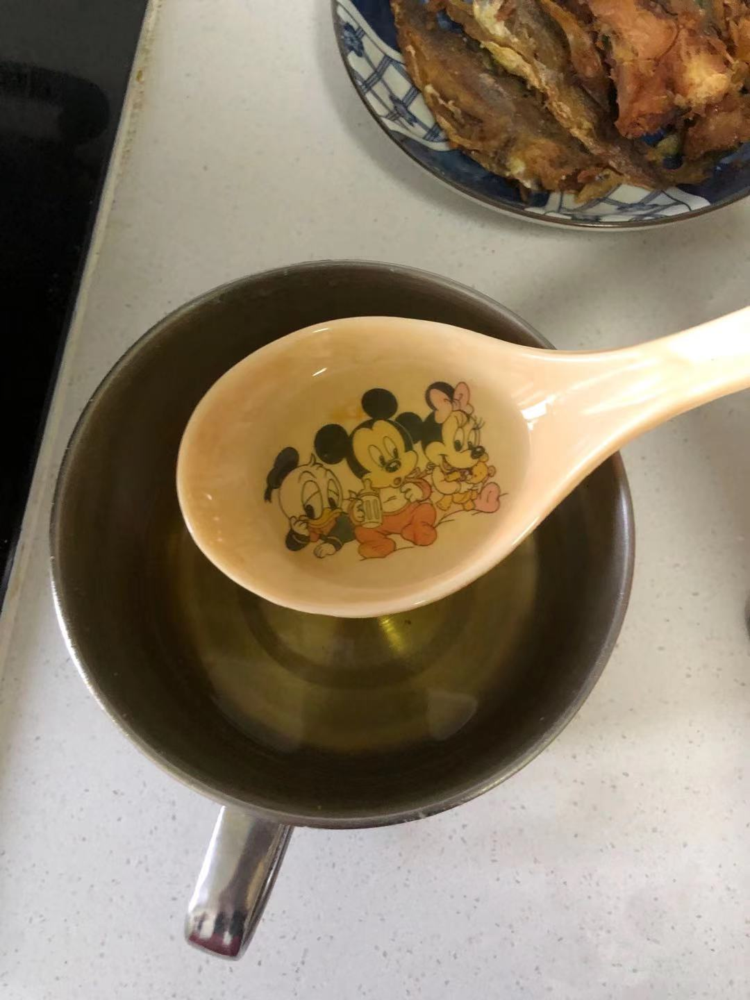
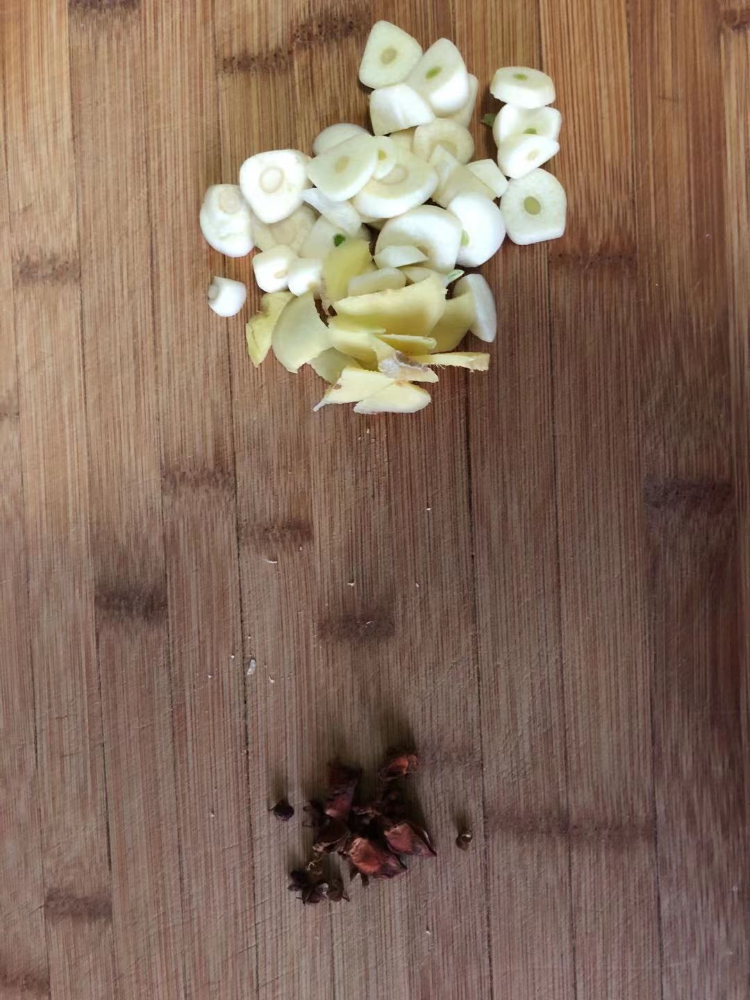
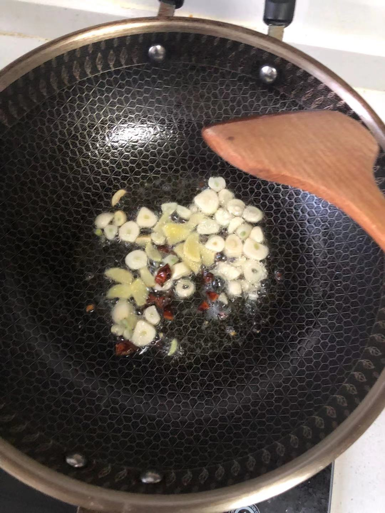
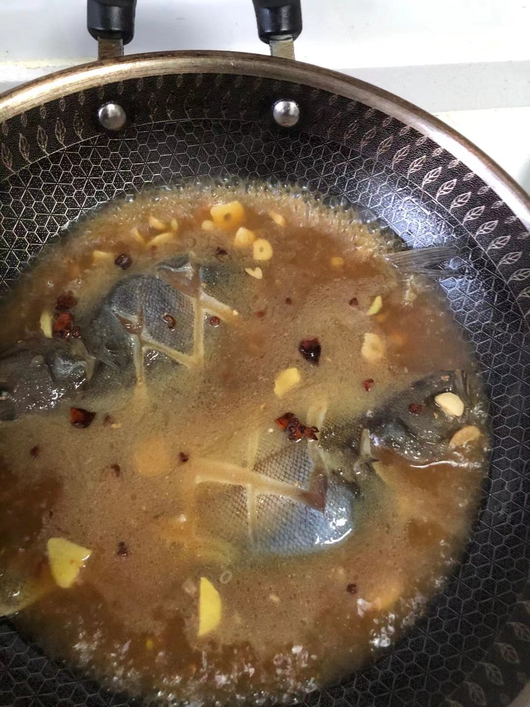
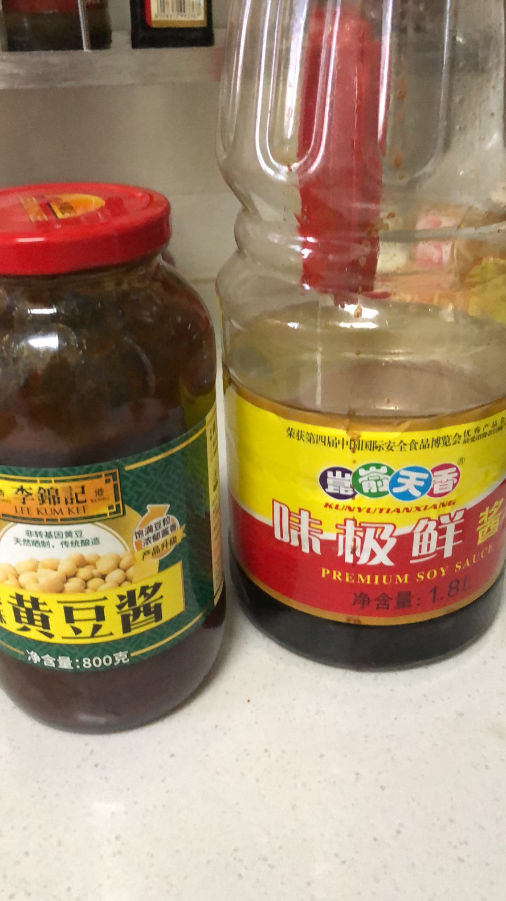
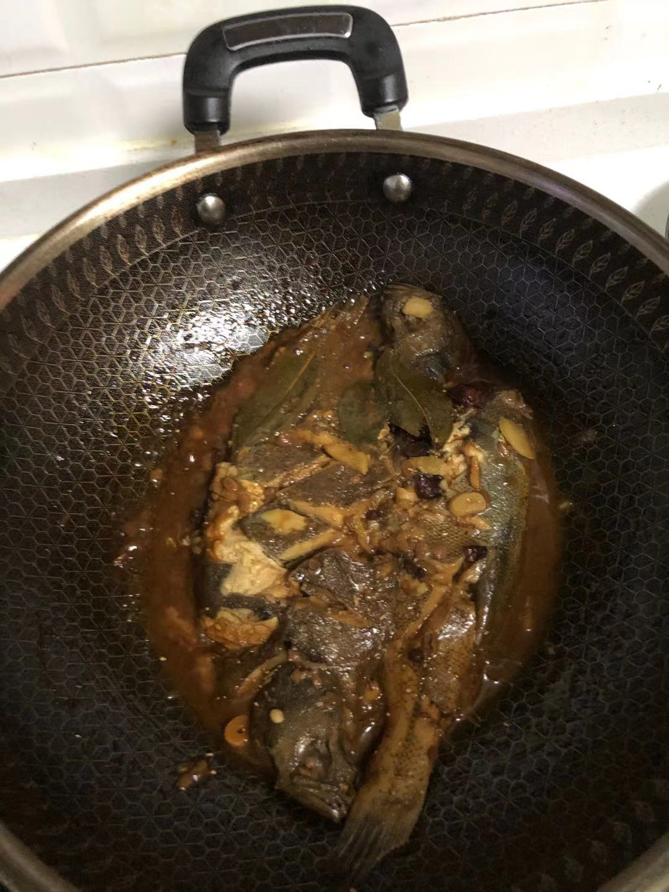
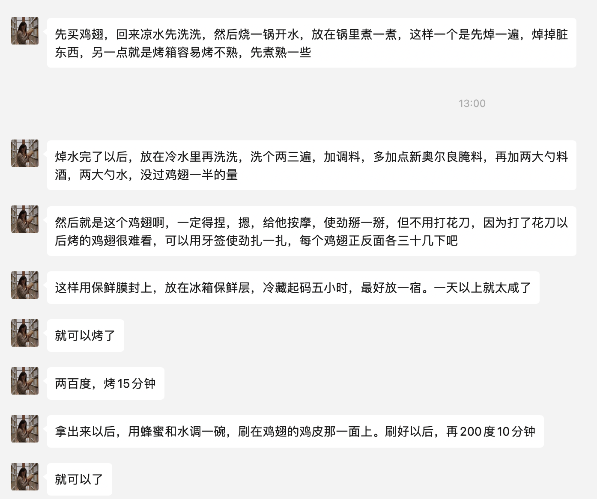

## 鱼

鱼肚子里的所有的内脏都不要，如果有鱼籽可以留下，鱼腮也不要，多洗几遍洗干净就可以做了。鱼背正反面可以来几个花刀，划几个口子。

<video id="video" controls="" preload="none" poster="./images/2-cover.jpg">
<source id="mp4" src="./images/2.mp4" type="video/mp4">
</video>
<video id="video" controls="" preload="none" poster="./images/3-cover.jpg">
<source id="mp4" src="./images/3.mp4" type="video/mp4">
</video>

做的话：

用姜蒜八角花椒爆锅，油大概是两小勺的量，不要太少。

先加水，把鱼没过的量就行，加**料酒，点点白醋，半勺白糖**，水烧开以后，放鱼，加点面酱提色。

盖上锅盖收汁，汤汁烧到不多的时候，起锅，少加点盐，不用太多，海鱼本来就有咸味。
<video id="video" controls="" preload="none" poster="./images/8-cover.jpg">
<source id="mp4" src="./images/8.mp4" type="video/mp4">
</video>

汤汁颜色最好深点，不要太浅，颜色这部分主要靠生抽和豆瓣酱。加了两勺酱油，还放了两片香叶，打算出锅再放一点蚝油。

<video id="video" controls="" preload="none" poster="./images/10-cover.jpg">
<source id="mp4" src="./images/10.mp4" type="video/mp4">
</video>
一共煮25分钟收汁才行，煮到汁特别特别浓又很少的程度才好吃。

## 奥尔良烤翅

先买鸡翅，回来凉水先洗洗，然后烧一锅开水，放在锅里煮一煮。这样：

- 一个是先焯一遍，焯掉脏东西，
- 另一点就是烤箱容易烤不熟，先煮熟一些

焯水完了以后，放在冷水里再洗洗，洗个两三遍，加调料，多加点**新奥尔良腌料**，再加两大勺**料酒**，两大勺**水**，没过鸡翅一半的量

然后就是这个鸡翅啊，一定得捏，摁，给他按摩，使劲掰一掰，但不用打花刀，因为打了花刀以后烤的鸡翅很难看，可以用牙签使劲扎一扎，每个鸡翅正反面各三十几下吧

这样用保鲜膜封上，放在冰箱保鲜层，冷藏起码**五小时**，最好放一宿。一天以上就太咸了

就可以烤了

两百度，烤15分钟

拿出来以后，用蜂蜜和水调一碗，刷在鸡翅的鸡皮那一面上。刷好以后，再200度10分钟，就可以了。

