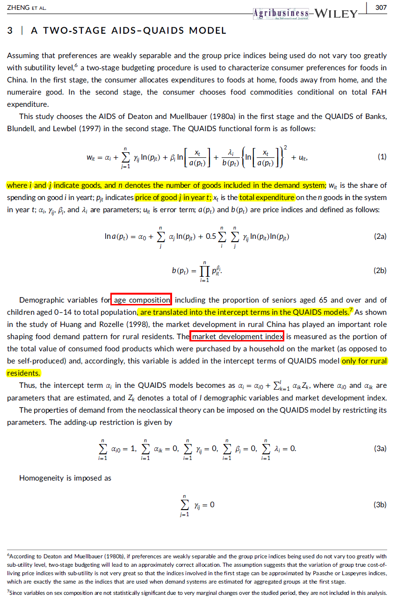
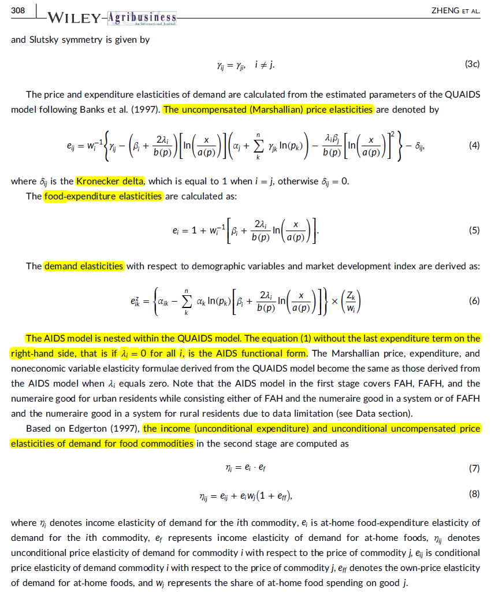
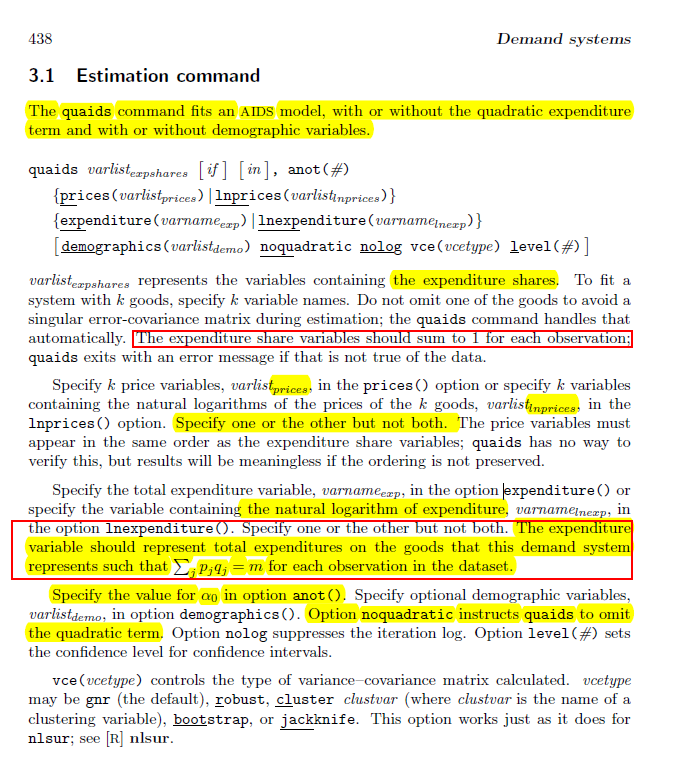

# QUAIDS Model





# `quaids` command

## Explanation



## Example

```
webuse food, clear

/*
First, create a random integer representing the number of children 
in each household and a random binary variable representing rural 
versus urban households so that we can demonstrate a model that includes demographics.
We then fit a quadratic AIDS model using α0 = 10.
*/

set seed 1
gen nkids = int(runiform()*4)
gen rural = (runiform() > 0.7)


quaids w1-w4, anot(10) prices(p1-p4) expenditure(expfd) ///
demographics(nkids rural) // need to spcify the value for \alpha_0

* Wald tests
test [eta]_b[eta_rural_1], notest
test [eta]_b[eta_rural_2], notest accumulate
test [eta]_b[eta_rural_3], notest accumulate
test [eta]_b[eta_rural_4], notest accumulate
test [rho]_b[rho_rural], accumulate

* Compute the expenditure elasticities for each household
estat expenditure e* 
summarize e_1-e_4

* Compute the uncompensated prices elasticities for rural and urban households 
estat uncompensated if rural, atmeans // atmeans: group-level means
matrix uprural = r(uncompelas)
estat uncompensated if !rural, atmeans
matrix upurban = r(uncompelas)

matrix list uprural
matrix list upurban

/*
Output：

uprural[4,4]
            c1          c2          c3          c4
r1  -.71245867  -.13705857  -.09058916  -.09155783
r2  -.18191573  -.71137762   .00549316  -.02571537
r3  -.37992121  -.01990578  -.57693539  -.07470768
r4  -.13712472  -.04801226  -.02494365  -.80164427

. matrix list upurban

upurban[4,4]
            c1          c2          c3          c4
r1  -.71465742  -.13979419     -.09222  -.09791097
r2  -.16774212  -.70701879   .00664392   -.0133375
r3  -.33612769  -.01253846   -.5892293  -.05958872
r4   -.1508913  -.05090295  -.02865442  -.81177966


Explanation:

The entry in row i, column j of each elasticity matrix represents the percentage change in the quantity of good i consumed for a 1% change in the price of good j. 

每个弹性矩阵的第i行第j列的值表示商品j的价格变化1％时，所消费的商品i数量的百分比变化。

Among rural consumers, a 1% increase in the price of good A raises consumption of good B by 0.33%.
*/
```
# References
[1] Poi B P. Easy demand-system estimation with quaids[J]. The Stata Journal, 2012, 12(3): 433-446.
[2] Zheng Z, Henneberry S R, Zhao Y, et al. Predicting the changes in the structure of food demand in China[J]. Agribusiness, 2019, 35(3): 301-328.
[3] 郑志浩, 高颖, 赵殷钰. 收入增长对城镇居民食物消费模式的影响[J]. 经济学 (季刊), 2015, 15(1): 263-288.
[4] 石明明, 江舟, 周小焱. 消费升级还是消费降级[J]. 中国工业经济, 2019 (7): 4.


