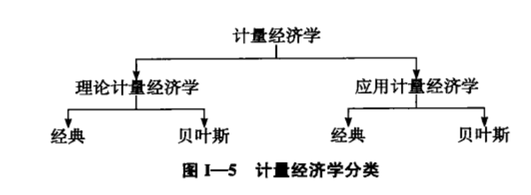

# 0. 引言

## 计量经济学方法论

传统计量经济学方法论按如下路线进行：

1. 理论或假说的陈述；
2. 理论的数学模型设定；
3. 统计或计量经济模型设定；
4. 获取数据；
5. 计量经济模型的参数估计；
6. 假设检验；
7. 预报或预测；
8. 利用模型进行控制或制定政策。

## 计量经济学的类型

# 1. 单方程回归模型

单方程回归模型：一个因变量被表达为一个或多个所谓解释变量的线性函数。

## 1.1 回归分析的性质

### 1.1.1 “回归”一词的历史渊源

### 1.1.2 回归的现代含义

回归分析是关于研究一个所谓的因变量对另一个或多个所谓解释变量的依赖关系，其用意在于通过后者（在重复抽样中）的已知或设定值，去估计和预测前者的（总体）均值。

### 1.1.3 统计关系与确定性关系

### 1.1.4 回归与因果关系

从逻辑上说，统计关系本身不可能意味着任何因果关系。

### 1.1.5 回归与相关

## 1.2 双变量回归分析：一些基本思想

### 1.2.2 总体回归函数的概念

### 1.2.3 “线性”一词的含义

### 1.2.4 PRF 的随机设定

### 1.2.5 随机干扰项的意义

### 1.2.6 样本回归函数

## 1.3 双变量回归模型：估计问题

### 1.3.1 普通最小二乘法

### 1.3.2 经典线性回归模型：最小二乘法的基本假定

### 1.3.3 最小二乘估计的精度或标准误

### 1.3.4 最小二乘估计量的性质：高斯-马尔可夫定理

### 1.3.5 判定系数 $r^2$：“拟合优度”的一个度量

---

## 【附录3A】

最小二乘估计的推导

最小二乘估计量的线性和无偏性质

最小二乘估计量的方差和标准误

$\hat \beta_1$ 和 $\hat \beta_2$ 的协方差

$\sigma^2$ 的最小二乘估计量

最小二乘估计量的最小方差性质

最小二乘估计量的一致性

---

## 1.4 经典正态线性回归模型

### 1.4.1 干扰项 $u_i$ 的概率分布

### 1.4.2 关于 $u_i$ 的正态性假定

### 1.4.3 在正态性假定下 OLS 估计量的性质

### 1.4.4 极大似然法

## 1.5 双变量回归：区间估计与假设检验

## 1.6 双变量线性回归模型的延伸

## 1.7 多元回归分析：估计问题

## 1.8 多元回归分析：推断问题

## 1.9 虚拟变量回归模型

# 2. 放松经典模型的假定

## 2.1 多重共线性：回归元相关会怎么样？

## 2.2 异方差性：误差方差不是常数会怎么样？

## 2.3 自相关：误差项相关会怎么样？

## 2.4 计量经济建模：模型设定和诊断检验

