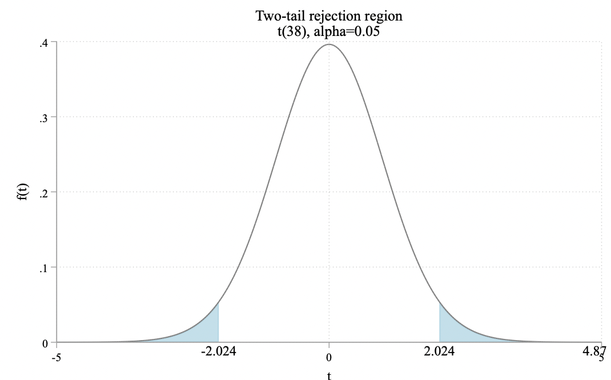

区间估计与假设检验

**假设检验是一种概率意义上的反证法。**首先假设原假设成立，然后看在原假设成立的前提下，是否导致不太可能发生“小概率事件”在一次抽样的样本中出现。

t 检验

t 统计量的通用公式为：
$$
t = \frac{估计量-假想值}{估计量的标准误}
$$

以双侧 t 检验为例，其步骤为：

- 计算： 计算 t 统计量 $|t_k|$ ；

- 查表：查看临界值 $t_{\alpha/2}(df)$ 。通常取 $\alpha=5\%$，则 $\alpha/2 = 2.5\%$，有时也使用 $\alpha = 1\%$ 或  $\alpha = 10\%$ ；
- 判断：如果 $|t_k| \geq t_{\alpha/2}(df)$ ，则 $t_k$ 落入“拒绝域”，故拒绝 $H_0$ 。反之，如果 $|t_k| < t_{\alpha/2}{(df)}$，则 $t_k$ 落入接受域，故接受 $H_0$ 。


有一元线性回归模型：

```Stata
use "http://www.principlesofeconometrics.com/poe4/data/stata/food.dta", clear

reg food_exp income
```

可得模型：
$$
food\_exp = 83.416 + 10.20964 \times income
$$
原假设 $H_0: \hat \beta_2 = 0, H_1 : \hat \beta_2 \neq 0$，数据样本 $N = 40 $ ，显著性水平为 $5\%$ 。

计算 t 统计量为：
$$
t = \frac{ 10.20964 - 0}{2.093264} = 4.8773781
$$
查看临界值：

```Stata
scalar tc975 = invttail(38, 0.025)
di "97.5百分位数上的临界值为：" tc975
// 97.5百分位数上的临界值为：2.0243942
```

判断：



t 统计量落入拒绝域，故拒绝原假设 $H_0: \hat \beta_2 = 0$ ，认为在 5% 的显著性水平下，$\hat \beta_2$ 显著不等于 0 。


置信区间

p 值

