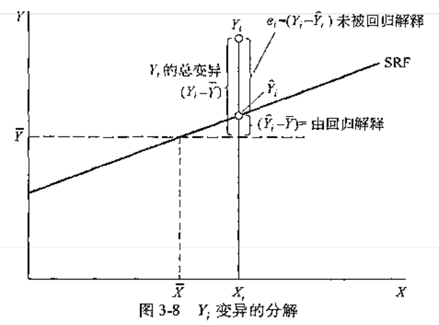

### 带截距项回归的 $R^2$

拟合优度用来判定样本回归曲线拟合真实 $Y$ 值的优劣程度，又称为判定系数。

（图片来源：古扎拉蒂《计量经济学精要》（第 4 版））

如上图所示，将 $Y_i$ 的总变异（TSS）分解为两部分，可以被回归分解（ESS） + 未被回归分解（RSS）。即：

$$
\underbrace{\sum_{i=1}^n (Y_i - \bar Y)^2}_{TSS}= \underbrace{\sum_{i=1}^n(\hat Y_i - \bar Y)^2}_{ESS}+ \underbrace{\sum_{i=1}^n (Y_i - \bar Y_i)^2}_{RSS}
$$

---

【注意】TSS、ESS 和 RSS 的叫法在不同的教材会有区别

在伍德里奇的教材中，总平方和（total sum of squares, SST）、解释平方和（explained sum of squares, SSE） 和残差平方和（residual sum of squares，SSR）。

在古扎拉蒂的教材中，总平方和（TSS）、解释平方和（ESS）、残差平方和（RSS）。

在 Stata 汇报的结果中：解释平方和（SS of Model）、残差平方和（SS of Residual）和 总平方和（SS of Total）。

---

那么，如何证明 $TSS = ESS + RSS$ 呢？

证明：将离差 $(y_i - \bar y)$ 写为 $(y_i - \hat y_i + \hat y_i - \bar y)$ ，则可将 TSS 写为：
$$
\sum_{i=1}^n (y_i - \bar y)^2 = \sum_{i=1}^n (y_i - \hat y_i + \hat y_i - \bar y)^2 = \sum_{i=1}^n (e_i + \hat y_i - \bar y)^2 \\
= \sum_{i=1}^n e_i^2 + \sum_{i=1}^n(\hat y_i - \bar y)^2 + 2 \color{red}{\sum_{i=1}^ne_i(\hat y_i - \bar y)}
$$
只需证明交叉项 $\sum_{i=1}^ne_i(\hat y_i - \bar y)=0$ 即可，而这由 OLS 的正交性所保证：
$$
\sum_{i=1}^n e_i(\hat y_i-\bar y) = \sum_{i=1}^n e_i \hat y_i - \sum_{i=1}^ne_i = 0 - 0 = 0
$$

故得证。

### 不带截距项回归的 $R^2$

### 调整 $R^2$

### 与 F 检验的关系

### 另一种理解（相关系数）

