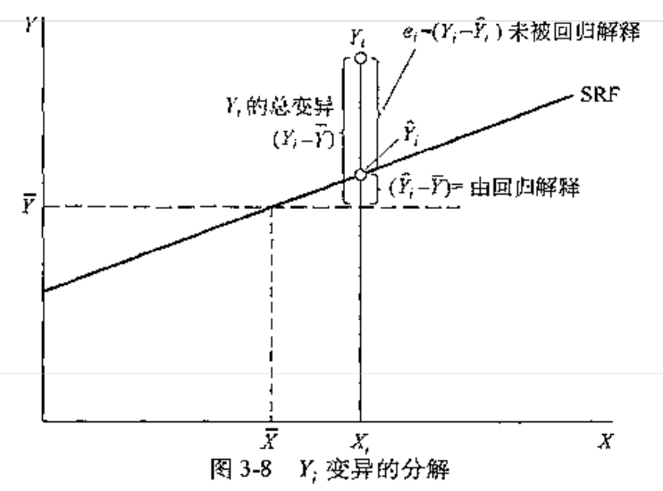
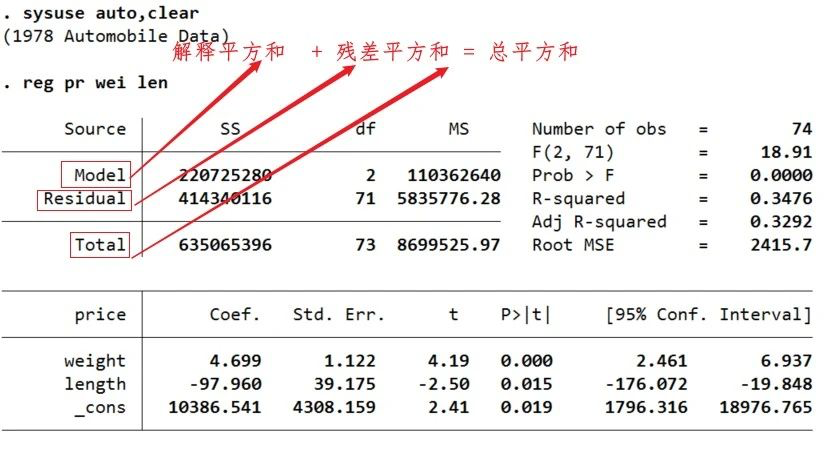
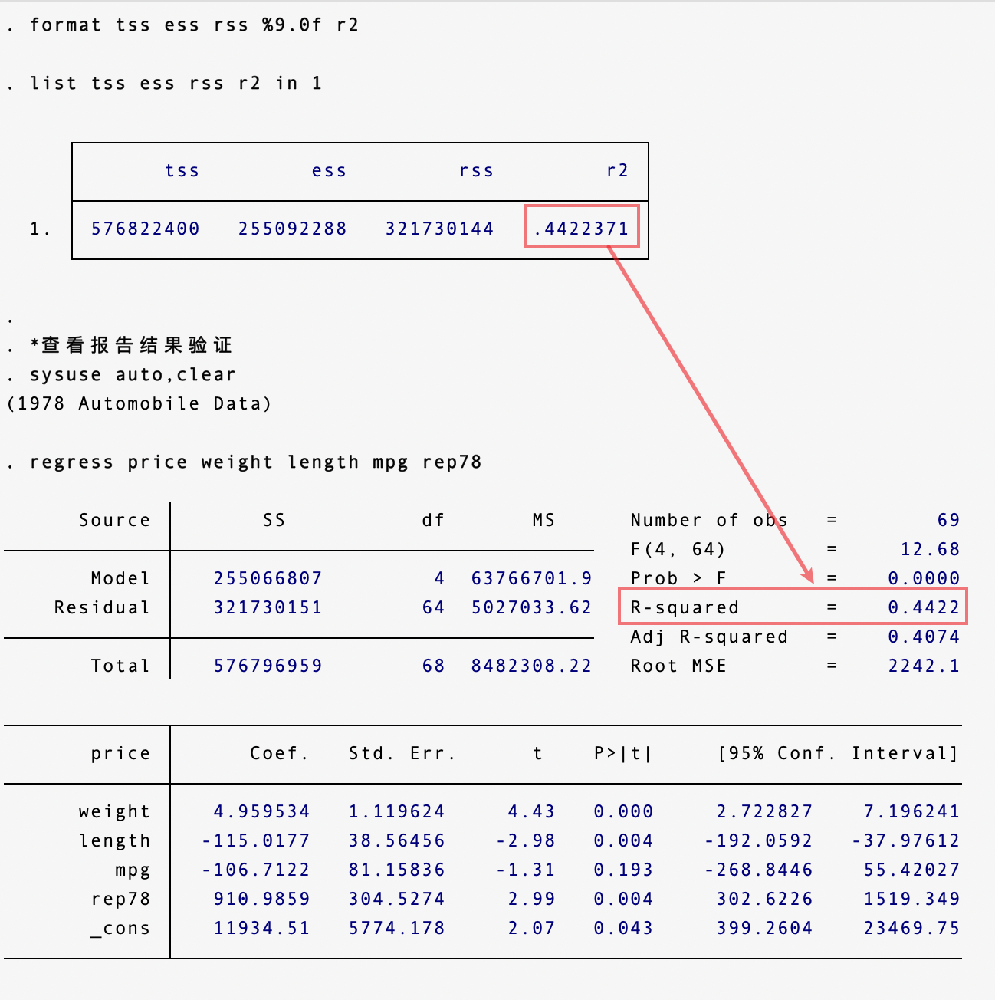
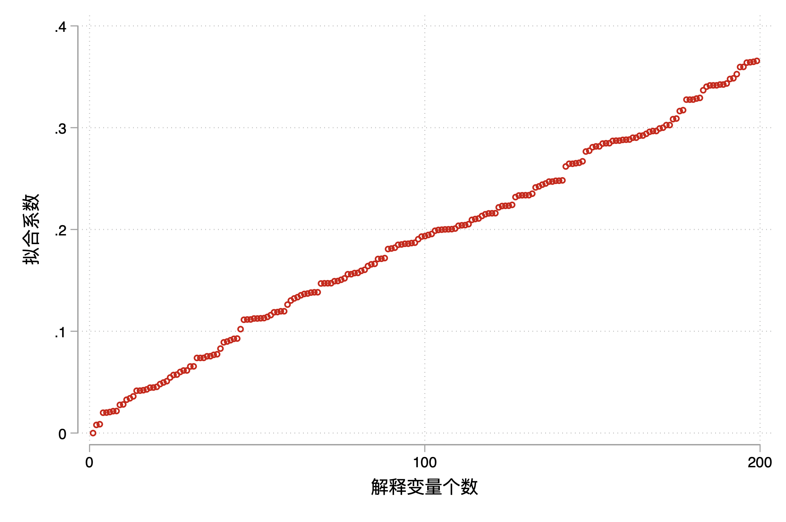
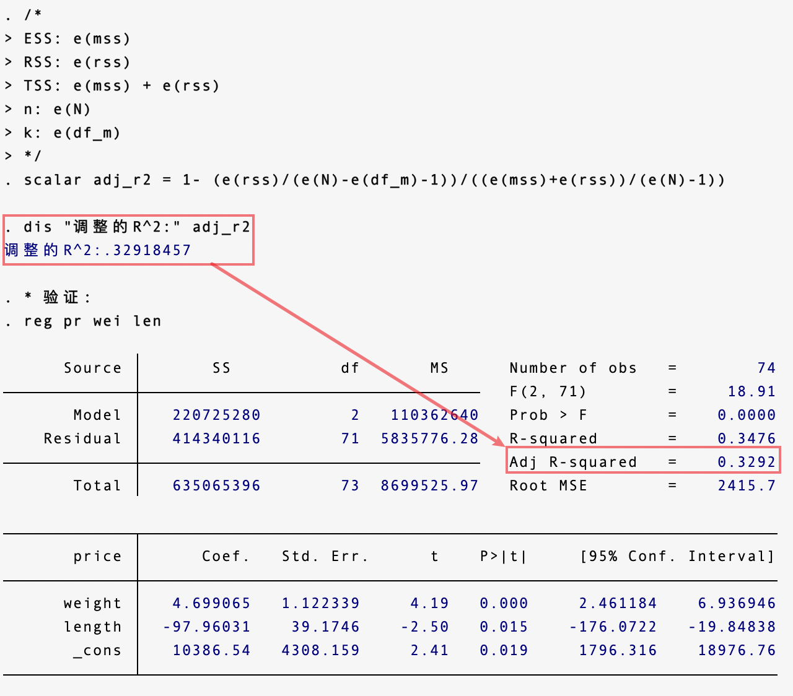
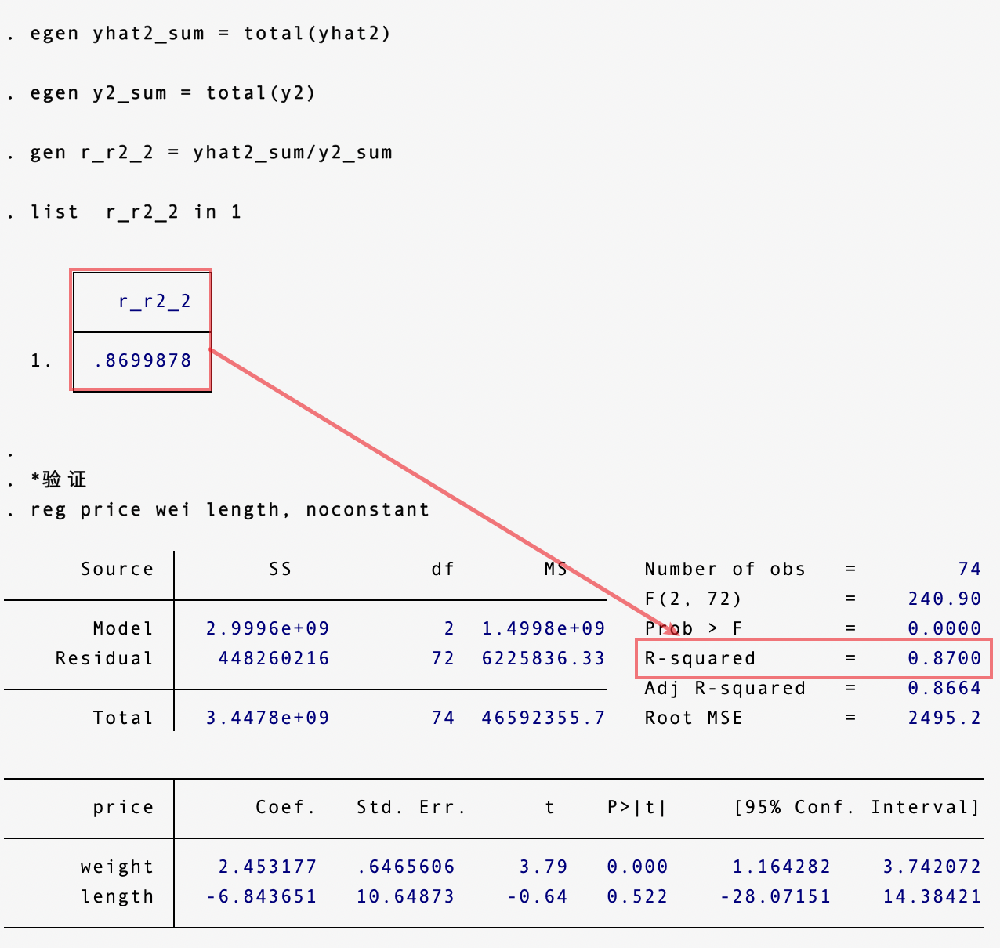
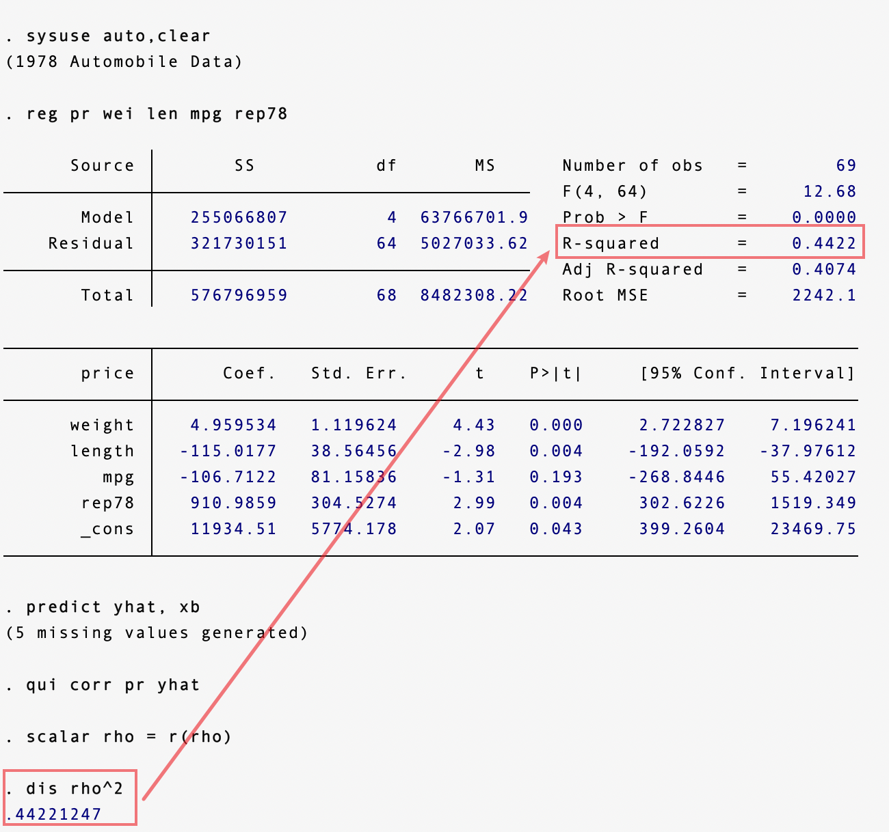

### 带截距项回归的 $R^2$

#### 定义

拟合优度用来判定 SRF 拟合真实 $Y$ 值的优劣程度，又称为判定系数。



（图片来源：古扎拉蒂《计量经济学精要》（第 4 版））

如上图所示，将 $Y_i$ 的总变异（TSS）分解为两部分，可以被回归分解（ESS） + 未被回归分解（RSS）。即：

$$
\underbrace{\sum_{i=1}^n (Y_i - \bar Y)^2}_{TSS}= \underbrace{\sum_{i=1}^n(\hat Y_i - \bar Y)^2}_{ESS}+ \underbrace{\sum_{i=1}^n (Y_i - \bar Y_i)^2}_{RSS}
$$

---

【注意】TSS、ESS 和 RSS 的叫法在不同的教材会有区别

在伍德里奇的教材中，总平方和（total sum of squares, SST）、解释平方和（explained sum of squares, SSE） 和残差平方和（residual sum of squares，SSR）。

在古扎拉蒂的教材中，总平方和（TSS）、解释平方和（ESS）、残差平方和（RSS）。

在 Stata 汇报的结果中：解释平方和（SS of Model）、残差平方和（SS of Residual）和 总平方和（SS of Total）。



---

#### 证明

问题：证明 $TSS = ESS + RSS$ 。

证明：将离差 $(y_i - \bar y)$ 写为 $(y_i - \hat y_i + \hat y_i - \bar y)$ ，则可将 TSS 写为：

$$
\sum_{i=1}^n (y_i - \bar y)^2 = \sum_{i=1}^n (y_i - \hat y_i + \hat y_i - \bar y)^2 = \sum_{i=1}^n (e_i + \hat y_i - \bar y)^2 \\
= \sum_{i=1}^n e_i^2 + \sum_{i=1}^n(\hat y_i - \bar y)^2 + 2 \color{red}{\sum_{i=1}^ne_i(\hat y_i - \bar y)}
$$

只需证明交叉项 $\sum_{i=1}^ne_i(\hat y_i - \bar y)=0$ 即可，而这由 OLS 的正交性所保证，即：

$$
\sum_{i=1}^n e_i(\hat y_i-\bar y) = \sum_{i=1}^n e_i \hat y_i - \sum_{i=1}^ne_i = 0 - 0 = 0
$$

故得证。

#### 计算

有了计算公式，我们试试自己手动计算带截距项回归的 $R^2$：

```Stata
*手工计算 R2
sysuse auto,clear
qui regress price weight length mpg rep78
predict y_hat
predict e,re
egen y_bar = mean(price)
egen ess = total((y_hat - y_bar)^2)
egen rss = total((price - y_hat)^2)
gen tss = ess + rss
gen r2 = ess/tss
format tss ess rss %9.0f r2
list tss ess rss r2 in 1

*查看报告结果验证
sysuse auto,clear
regress price weight length mpg rep78
```



#### 缺点

**拟合优度的缺点是：如果增加解释变量的数目，则 $R^2$ 只增不减，因为至少可让新增解释变量的系数为 0 而保持 $R^2$ 不变**。另一方面，通过最优地选择新增解释变量的系数（以及已有解释变量的系数），通常可以提高 $R^2$ 。

下面，我们用程序来看看，是不是解释变量 $R^2$ 越大：

```Stata
/* x 越多真的 r2 越大吗？
* 演示：在一个模型中逐步加入解释变量，并储存相应的 r2 。
当解释变量累计增加到200个时，R2的变化。
*/
clear
set obs 500
gen id = _n
gen r2 = .
gen y = int(10*runiform()) //生成被解释变量
forvalues i = 1/200 {
	gen x`i' = 10*runiform() //生成解释变量
}
forvalues c = 1/200{ //逐步加入解释变量
    if `c' == 1 {
        reg y x1
	}
    else{
        reg y x1-x`c'
    }
  replace  r2 = `e(r2)' in `c'
}
scatter r2 id if id < 200,xlabel(0(100)200) ///
ytitle("拟合系数") xtitle("解释变量个数")

```



可以看出，模型中随着解释变量个数的增加，拟合系数越来越高。

### 调整 $R^2$

#### 定义

因此，为了避免 $R^2$ 的这个缺点，引入调整 $R^2$ 对解释变量过多（模型不够简洁）进行惩罚，调整的 $R^2$ 就是在分子和分母上下除以自由度。

定义调整 $\bar R^2$ 为：

$$
\bar R^2 = 1 - \frac{RSS/(n-k-1)}{TSS/(n-1)}
$$

#### 何为自由度？

自由度是指当以样本的统计量来估计总体的参数时，样本中独立或能自由变化的数据的个数，称为该统计量的自由度。通常为 $df = n-k$ 。

比如，若存在两个变量 $a, b$，而 $a+b = 6$ 那么自由度为 1 。因为其实只有 $a$ 才能真正的自由变化，$b$ 会被 $a$ 的取值不同所限制（$b = 6 - a$）。

按自由度的定义：

TSS 自由度：TSS = $\sum (Y_i - \bar Y)^2$。$n$ 已知，$\bar y$ 已知，如果 $n-1$ 个 $Y_i$ 已知，那么最后一个也就不能随便变化了。因此只有 $n-1$ 个 $Y_i - \bar Y$ 是可变化的，最后一个则可以通过平均值与样本量确切的计算出来。所以 TSS 的自由度为 $n-1$ 。

ESS 自由度：$ESS = (\hat Y_i - \hat Y)^2$。对于每个 $\hat Y_i$ 可以有 $k+1$ 个 $\hat \beta$ 。但是 $\bar Y$ 平均值已知，正如一元线性回归中所看到的，$\bar Y = \beta_0 + \beta_1 \bar X$ ，这样又占据了一个自由度。所以 ESS 的自由度是 $k$ 。

RSS 自由度：$RSS = e_i^2$。回忆正规方程组，给定 $k+1$ 个方程，意味着 $k+1$ 个残差固定，所以对于残差平方和，自由度为 $n-(k+1)$ 。

#### 计算

```Stata
* 计算调整R^2
* 调整拟合优度
/*
adj_r2 = 1 - (RSS/df)/(TSS/df)
= 1 - ((RSS/n-k-1)/(TSS/(n-1))
*/
sysuse auto, clear
qui reg pr wei len
eret list
/*
ESS: e(mss)
RSS: e(rss)
TSS: e(mss) + e(rss)
n: e(N)
k: e(df_m)
*/
scalar adj_r2 = 1- (e(rss)/(e(N)-e(df_m)-1))/((e(mss)+e(rss))/(e(N)-1))
dis "调整的R^2:" adj_r2

* 验证:
sysuse auto, clear
qui reg pr wei len

```



### 不带截距项回归的 $R^2$

还有一种情况要注意，当模型没有截距项的时候，平方和分解公式不成立（只有一个一阶条件，无法保证 $\sum_{i=1}^n e_i = 0$），不宜使用 $R^2$ 来度量拟合优度。

记拟合值为 $\hat y_i = \hat \beta x_i$，残差仍与拟合值正交仍然成立：

$$
\sum_{i=1}^n \hat y_i e_i = \sum_{i=1}^n \hat \beta x_ie_i = \hat \beta \sum_{i=1} x_ie_i= \hat \beta \cdot0 = 0
$$

所以可以利用正交性将 $\sum_{i=1}^n y_i^2$ 分解为：

$$
\sum_{i=1} y_i^2 = \sum_{i=1}^n (\hat y_i + e_i)^2 = \sum_{i=1}^n \hat y_i^2 + 2\underbrace{\sum_{i=1}^n \hat y_ie_i}_{=0} + \sum_{i=1}^n e_i^2 = \sum_{i=1}^n \hat y_i^2 + \sum_{i=1}^n e_i^2
$$

$\sum_{i=1}^n \hat y_i^2$ 为可由模型解释的部分，而 $\sum_{i=1}^n e_i^2$ 为模型不可解释的部分。

定义非中心 $R^2$ （uncentered $R^2$）：

$$
R_{uc}^2 = \frac{\sum_{i=1}^n \hat y_i^2}{\sum_{i=1}^n y_i^2}
$$

如果无常数项，Stata 汇报的 $R^2$ 正是 $R_{uc}^2$ 。

#### 计算

```Stata
* 非中心拟合优度
* 手动计算
sysuse auto, clear
qui reg price wei length, noconstant
predict yhat, xb
gen yhat2 = yhat^2
gen y2 = price^2
egen yhat2_sum = total(yhat2)
egen y2_sum = total(y2)
gen r_r2_2 = yhat2_sum/y2_sum
list  r_r2_2 in 1

*验证
reg price wei length, noconstant
```



### 另一种理解

有常数项的情况下，拟合优度等于被解释变量 $y_i$ 与拟合值 $\hat y_i$ 之间相关系数的平方，即 $R^2 = [Corr(y_i,\hat y_i)]^2$ ，故记为 $R^2$ 。

```Stata
* R2的理解
sysuse auto,clear
reg pr wei len mpg rep78
predict yhat, xb
qui corr pr yhat
scalar rho = r(rho)
dis rho^2
```



### 参考资料

[1] 杰弗里·M·伍德里奇, 2015. 计量经济学导论（第 5 版）[M]. 北京: 中国人民大学出版社.

[2] 陈强, 2015. 计量经济学及 Stata 应用[M]. 高等教育出版社.

[3] 达莫道尔·N·古扎拉蒂, 道恩·C·波特, 2010. 经济计量学精要（第 4 版）[M]. 机械工业出版社.

[4] 李·C·阿迪金斯, 卡特·希尔, 2015. 应用 Stata 学习计量经济学原理（第 4 版）[M]. 重庆：重庆大学出版社.