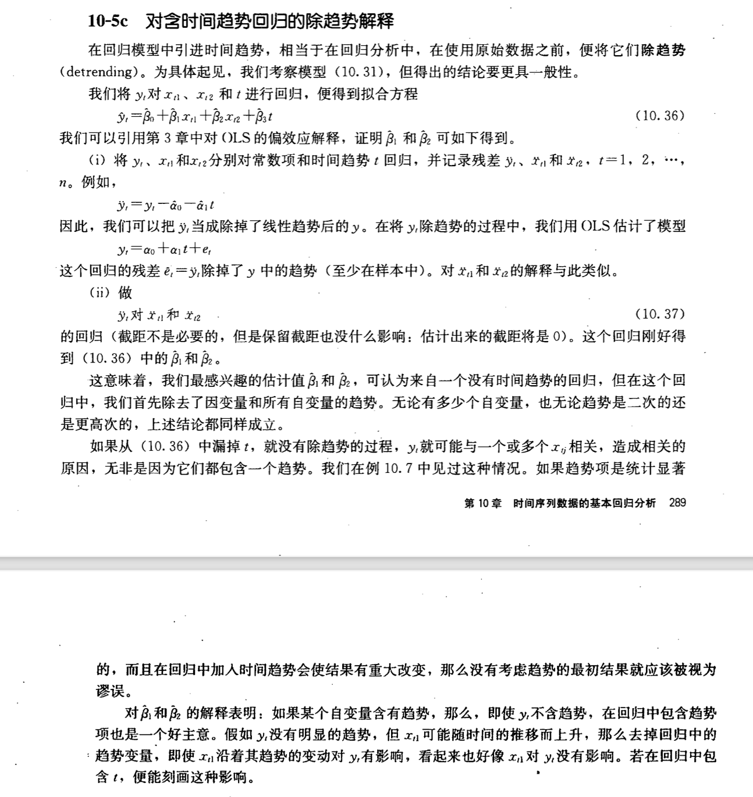

##  10. 时间序列基本回归分析

横截面数据的随机性在于不同样本得到不同的 OLS 估计量。

该如何理解时间序列数据的随机性？

我们能看到的只是之前时刻随机过程（stochastic process）的结果，而不能让时间倒转重新开始这个过程。一个时间序列过程的所有可能的实现集，便相当于横截面分析中的总体。

静态模型（static model）：
$$
y_t = \beta_0 + \beta_1z_t + u_t \quad t = 1,2,...,n
$$

$z_t$ 的一个变化对 $y_t$ 有直接影响，即 $\Delta y_t = \beta_1 \Delta z_t$ 。 

有限分布滞后模型（FDL）：容许一个或多个变量对 $y$ 的影响有一定时滞。

q 阶 FDL 模型基本形式为：
$$
y_t = \alpha_0 + \delta_0 z_t + \delta_1 z_{t-1} + \cdots + \delta_q z_{t-q} + u_t
$$

假设有**二阶** FDL ：
$$
y_t = \alpha_0 + \delta_0 z_t + \delta_1 z_{t-1} + \delta_2 z_{t-2} + u_i
$$
假设：
$$
\cdots, z_{t-2} = c, z_{t-1} = c, \color{red}{z_t = c+1}, z_{t+1} = c, z_{t+2} = c, \cdots
$$
假设每个时期误差项均为 0 。则有：
$$
y_{t-1} = \alpha_0 + \delta_0c+\delta_1c+\delta_2 c \\
y_t = \alpha_0 + \delta_0(c+1) +\delta_c + \delta_2 c \\
y_{t+1} = \alpha_0 + \delta_0 c + \delta_1 (c+1) + \delta_2 c \\
y_{t+2} = \alpha_0 + \delta_0 c + \delta_1 c + \delta_2 c \\
y_{t+3} = \alpha_0 + \delta_0 c + \delta_1 c + \delta_2 c
$$
由 $y_t - y_{t-1} = \delta_0$ ，表明 $\delta_0$ 是 $z$ 在 $t$ 时期提高一个单位所引起的 $y$ 的即期变化。 **$\delta_0$ 通常被称为冲击倾向（impact propensity）或冲击乘数（impact multiplier）。**

 $y_{t+3} = y_{t-1}$ ，在 $t+3$ 期回到了初始水平，这是因为假定 $z$ 只两期滞后。

短期倾向

长期倾向：所有变量 $z_{t-j}$ 的系数之和。

经典假设下 OLS 的有限样本性质

1.OLS 的无偏性

TS.1 线性于参数

随机过程 $\{(x_{t1},x_{t2},\cdots,x_{tk},y_t): t=1, 2, \cdots, n\}$ 服从线性模型：
$$
y_t = \beta_0 + \beta_1 x_{t1} + \cdots+\beta_kx_{tk}+u_t
$$
TS.2 无完全共线性

TS.3 零条件均值：
$$
E(u_t | x_{i1},\cdots,x_{ik}) = E(u_t | X_t) = 0
$$

- 同期外生性
- 变量严格外生

无偏性：TS.1~TS.3下，$E(\hat \beta_j) = \beta_j, j = 0,1,\cdots,k$ 。

TS.4 同方差性：$Var(u_t |X) = Var(u_t) = \sigma^2, t = 1,2,\cdots,n$ 。

TS.5 无序列相关：$Corr(u_t, u_s|X) = 0, \forall t \neq s $ 。

在时间序列高斯马尔可夫定理 TS.1~TS.5 下，以 $X$ 为条件，$\hat \beta_j$ 的条件方差为：
$$
Var(\hat \beta_j | X) = \sigma^2/[SST_j(1-R^2)], j=1,\cdots,k
$$
其中，$SST_j$ 是 $x_{tj}$ 的总平方和，$R_j^2$ 为由 $x_j$ 对所有其他自变量回归得到的 $R^2$ 。 

$\sigma^2$ 的无偏估计：TS.1～TS.5下，$\hat \sigma^2 = SSR/(n-k-1)$ 是$\sigma^2$ 的一个无偏估计 。

高斯马尔可夫定理：在 TS.1~TS.5 下，OLS 估计量是 BLUE 。

TS.6 正态性：$u_t |X \sim Normal(0,\sigma^2)$

正态抽样分布：在时间序列 CLM 假定 TS.1~TS.6 下，以 $X$ 为条件，OLS 估计量遵循正态分布。且在原假设下，t 统计量服从 t 分布，F 统计量服从 F 分布，通常构造的置信区间也是有效的。

函数形式、虚拟变量和指数

取对数之后

事件研究：某个特定事件是否会影响某项结果。如 $R_t^f = \beta_0 + \beta_1 R_t^m + \beta_2 d_t + u_t$ 。

指数、名义和实际经济变量的区别

趋势和季节性

趋势：

线性时间趋势：
$$
y_t = \alpha_0 + \color{red}{\alpha_1 \times t} + e_t, \quad t=1, 2, ... \\
=> \Delta y_t = y_t - y_{t-1} = \alpha_1
$$
指数趋势：
$$
\log(y_t) = \beta_0 +\beta_1 t + e_t, \quad t=1, 2, ... \\
=> \Delta \log(y_t) = \log(y_t) - \log(y_{t-1}) \approx (y_t-y_{t-1})/y_{t-1}
$$
二次时间趋势：
$$
y_1 = \alpha_0 + \alpha_1 t + \alpha_2 t^2 + e_t \\
=> \frac{\Delta y_t}{\Delta t} \approx \alpha_1 + 2\alpha_2t
$$
**伪回归问题**：仅因为每个变量都随着时间而增长，使得两个或多个趋势变量之关系的现象。增加一个时间趋势变量可以消除。

**对含时间趋势回归的除趋势（detrending）解释**（Wooldridge, p.302）

因变量有趋势时 $R^2$ 的计算：

将 $y_t$ 对 $t$ 回归，得到残差 $\ddot y_t$ ，再将 $\ddot y_t$ 对 $x_{t1}, x_{t3}, t$ 回归，此回归的 $R^2$ 是 $1 - \frac{RSS}{\sum_{i=1}^n \ddot y_t^2}$ ，能更好地反映出 $x_{t1}$ 和 $x_{t2}$ 在多大程度上解释 $y_t$ ，因为它过滤掉了时间趋势的影响。

季节性：

 如果一个时间序列是每月或每季度（甚至每周或每天）观测而得到的，它就有可能表现出季节性（seasonality）。**当面对一些未经季节调整的数据时，可以在模型中包括一组季节虚拟变量来解释因变量或自变量或二者中的季节性。**在回归中加进季节虚拟变量，可以被解释为将数据除季节性。 表现出季节性的时间序列也可能具有某种趋势，在这种情况下，应该估计一个既包含时间趋势变量又包含季节虚拟变量的回归模型。这个回归使用的是既除趋势又除季节性的序列。

## 11 . OLS 用于时间序列数据的其他问题

平稳和弱相关的时间序列

平稳与非平稳时间序列：

平稳随机过程：取不同的 $t$ ，$x_t$ 和 $x_1$ 有相同的分布。

协方差平稳过程：

弱相关时间序列

弱相关：对于一个平稳时间序列过程 $\{x_t:t=1,2,\cdots\}$，若随着 $h$ 无限增大，$x_t$ 和 $x_{t+h}$ 近乎独立，则称之为弱相关的（weakly dependent）。

在多元回归分析中，使用平稳而又弱相关的时间序列最为理想。

一阶移动平均过程（moving average process of order one, MA(1) ）：
$$
x_t = e_t + \alpha_1 e_{t-1}, t= 1, 2, ...
$$
$x_t$ 是 $e_t$ 和 $e_{t-1}$ 的一个加权平均。

一阶自回归过程（autoregressive process of order one，AR(1)） ：
$$
y_t = \rho_1 y_{t-1} + e_t, t = 1,2, ...
$$
若 $|\rho_1|<1$ ，则称 $y_t$ 是一个稳定的 AR(1) 过程。 

OLS 的渐近性质

 

回归分析中使用高度持续性时间序列

高度持续性时间序列

（1）随机游走

若 AR(1) 中 $\rho_1 = 1$ 则：
$$
y_t = y_{t-1} + e_t ,t =1,2,...
$$
上式即为随机游走（random walk）。

（2）带漂移随机游走
$$
y_t = \alpha_0 + y_{t-1} + e_t, t=1,2,...
$$
高度持续性时间序列的变换

差分平稳过程 I(1)

弱相关过程被称为 0 阶单整或 I(0)。实际上这意味着，在回归分析中使用它们之前，无须对这种序列进行任何处理:这种序列的均值已经满足标准的极限定理。

**单位根过程被称作一阶单整或 I(1)，**这意味着这个过程的一阶差分便是弱相关的(而且通常是平稳的)。I(1)时间序列常被称为差分平稳过程，可由于这个名称过于强调差分滞后的平稳性而不是强调差分的弱相关， 所以多少有些误导性。

判断时间序列是否是$I(1)$

若 $|\rho_1|<1$ ，则这个过程是 I(0)；若 $\rho_1 =1$ 便是 I(1) 。

将方程 $y_t = \alpha + \rho y_{t-1} +e_t, t=1,2,...$ 两边同时减去 $y_{t-1}$ ，并设 $\theta = \rho -1$：
$$
\Delta y_t = \alpha + \theta y_{t-1} +e_t
$$
$H_1: \theta < 0; H_0: \theta =0$。当 $H_0$ 成立时，$y_{t-1}$ 是 I(1) ，此时 t 统计量的渐进分布被称为 DF 分布。

**单位根的原假设：将 $\Delta y_t$ 对 $y_{t-1}, \Delta y_{t-1}, ..., \Delta y_{t-p}$ 回归，并对 $y_{t-1}$ 的系数 $\hat \theta$ 进行 t 检验。**

弱相关和强相关序列的统计检验：第 18 章

动态完备模型和无序列相关

## 12. 时间序列回归中的序列相关和异方差

序列相关的检验

回归元为严格外生时对 AR(1) 序列相关的 t 检验

经典假定条件下的德宾-沃森检验

回归元不是严格外生时 AR(1) 序列相关的检验

更高阶序列相关的检验

## 18. 时间序列高级专题

无限分布滞后模型

单位根检验（Wooldridge, p.517）

伪回归

协整和误差修正模型

预测

