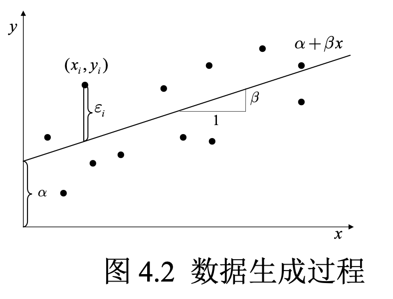
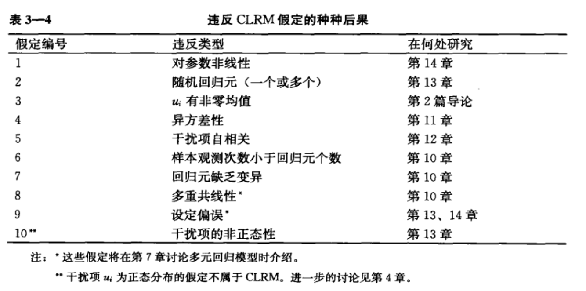

## 导论

### 第一节 计量经济学的任务

【哲学-认识的形成过程】我们对事物的认识总是从样本到整体、从局部到整体、从现象到本质。

计量经济学的主要任务之一就是通过数据 $\{x_i,y_i\}_{i=1}^n$ 来获取关于总体参数 $(\alpha, \beta)$ 的信息（陈强，2015）。



总体回归函数（PRF）：
$$
Y_i = \beta_1 + \beta_2 X_{2i} + \cdots+\beta_kX_{ki} + \epsilon_i \quad (i=1,\cdots, n)
$$
其中 $\{Y_i, X_{2i}, \dots, X_{ki}\}$ 为第 $i$ 次样本观测值，$\beta_i \quad (i=1,\dots,k)$ 为模型参数。对应的样本回归函数（SRF）：
$$
\hat Y_i = \hat \beta_1 + \hat \beta_2 X_{1i} + \cdots + \hat \beta X_{ki} \quad (i=1,\dots,n)
$$
### 第二节 建模的一般流程

### 第三节 数据的类型

横截面数据（n, T =1）

时间序列数据（n = 1，T）

面板数据（n，T）

不同数据包含着不同的信息，对应着不同的计量模型。

## 第二章 知识预备

### 第一节 数理基础

泰勒展开

期望

迭代期望定律

方差

协方差

相关系数

标准差与标准误

自由度

方差分析

常见的分布：正态分布、t 分布、F 分布、卡方分布

t 检验

区间估计与假设检验：置信区间

### 第二节 Stata 入门

绘图

结果汇报（实证论文向）

自定义表格输出


## 第三章 线性回归模型

### 第一节 模型设定

#### 一、基本形式（矩阵形式）

假设有 $n$ 位个体，$k$ 个解释变量。将 PRF 写成线性方程组的形式：
$$
\begin{cases}
Y_1 = \beta_1 + \beta_2 X_{21} + \cdots + \beta_k X_{k1} + \epsilon_1 \\
Y_2 = \beta_1 + \beta_2 X_{22} + \cdots + \beta_k X_{k2} + \epsilon_2 \\
\quad\quad\quad\quad\quad\quad\quad \vdots \\
Y_n = \beta_1 + \beta_2 X_{2n} + \cdots + \beta_k X_{kn} + \epsilon_n \\
\end{cases}
$$
可以采用矩阵形式表示为：
$$
Y = X \beta + \epsilon
$$
其中：
$$
Y = 
\begin{Bmatrix}
Y_1 \\ 
Y_2 \\
\vdots \\
Y_n
\end{Bmatrix},

X = 
\begin{Bmatrix}
1 & X_{21} & \cdots  & X_{k1} \\
1 & X_{22} & \cdots  & X_{k2} \\
\cdots & \cdots & \cdots & \cdots \\
1 & X_{2n} & \cdots  & X_{kn} 
\end{Bmatrix},
$$

$$
\beta = 
\begin{Bmatrix}
\beta_1 \\ 
\beta_2 \\
\vdots \\
\beta_n
\end{Bmatrix},

\epsilon = 
\begin{Bmatrix}
\epsilon_1 \\ 
\epsilon_2 \\
\vdots \\
\epsilon_n
\end{Bmatrix}。
$$

同理，可将 SRF 写成：
$$
Y = \hat Y + e = X \hat \beta + e
$$
其中：
$$
\hat Y = 
\begin{Bmatrix}
\hat Y_1 \\ 
\hat Y_2 \\
\vdots \\
\hat Y_n
\end{Bmatrix},

\hat \beta = 
\begin{Bmatrix}
\hat \beta_1 \\ 
\hat \beta_2 \\
\vdots \\
\hat \beta_n
\end{Bmatrix},

e = 
\begin{Bmatrix}
e_1 \\ 
e_2 \\
\vdots \\
e_n
\end{Bmatrix}。
$$

### 第二节 模型的估计

#### 一、OLS 推导

随机抽取 $n$ 观测值 $(Y_i, X_{2i}, \dots, X_{ki})_{i=1}^n$ ，样本回归函数：
$$
\hat Y_i = \hat \beta_1 + \hat \beta_2X_{2i} + \cdots + \hat \beta_k X_{ki} \quad (i=1,\dots,n)
$$
根据最小二乘原理，残差平方和 RSS 最小：
$$
Q(\hat \beta_1, \cdots,\hat \beta_k) = \sum (Y_i - \hat \beta_1 - \hat \beta_2 X_{2i}-\cdots-\hat \beta X_{ki})^2 \\
Q(\hat \beta_1,\dots,\hat \beta_k) \rarr min
$$
多元函数求极值的必要条件：
$$
\frac{\delta Q}{\delta \hat \beta_j} =0, \quad (j=1,\dots,k)
$$
有极值条件可得对应的正规方程组：
$$
\begin{cases}
\sum (Y_i - \hat \beta_1 - \hat \beta_2 X_{2i}-\cdots-\hat \beta_kX_{ki}) = 0 \\
\sum (Y_i - \hat \beta_1 - \hat \beta_2 X_{2i}-\cdots-\hat \beta_kX_{ki})X_{2i} = 0 \\
\quad\quad\quad\quad\quad\quad \cdots  \\
\sum (Y_i - \hat \beta_1 - \hat \beta_2 X_{2i}-\cdots-\hat \beta_kX_{ki})X_{ki} = 0
\end{cases}
$$
对应的简化式：
$$
\begin{cases}
\sum e_i = 0 \\
\sum e_iX_{2i} = 0 \\
\quad\quad \vdots \\
\sum e_iX_{ki} = 0
\end{cases}
$$
上式可以写成如下矩阵形式：
$$
X^T e = 0
$$
又：
$$
X^Te = X^T(Y - \hat Y) 
= X^T (Y-X\hat \beta) 
= X^T Y - X^T X \hat \beta 
= 0
$$
所以参数的最小二乘估计结果为：
$$
\hat \beta = (X^TX)^{-1}X^TY
$$
#### 二、偏回归系数

偏回归系数反映了在控制其他解释变量取值的条件下，特定解释变量对被解释变量的影响。

假设有多元回归模型：
$$
Y_i = \beta_1 + \beta_2 X_{2i} + \cdots + \beta_kX_{ki} + \epsilon_i \quad (i=1,\dots,n)
$$
以 $X_{2i}$ 的系数为例：
$$
\hat \beta_2 = \frac{\sum e_{2i}Y_i}{\sum e_{2i}^2}
$$
$e_{2i}$ 表示 $X_2$ 对 $X_3,\dots,X_k$ 的回归残差。直观上讲，它是在 $X_2$ 中剔除了其他解释变量的影响（Frisch-Waugh 定理）。

#### 三、平方和分解公式

拟合优度用来判定样本回归曲线拟合真实 $Y$ 值的优劣程度，又称为判定系数。


（图片来源：古扎拉蒂《计量经济学精要》（第 4 版））

如上图所示，将 $Y_i$ 的总变异（TSS）分解为两部分，可以被回归分解（ESS） + 未被回归分解（RSS）。即：

$$
\underbrace{\sum_{i=1}^n (Y_i - \bar Y)^2}_{TSS}= \underbrace{\sum_{i=1}^n(\hat Y_i - \bar Y)^2}_{ESS}+ \underbrace{\sum_{i=1}^n (Y_i - \bar Y_i)^2}_{RSS}
$$


---

【注意】TSS、ESS 和 RSS 的叫法在不同的教材会有区别

在伍德里奇的教材中，总平方和（total sum of squares, SST）、解释平方和（explained sum of squares, SSE） 和残差平方和（residual sum of squares，SSR）。

在古扎拉蒂的教材中，总平方和（TSS）、解释平方和（ESS）、残差平方和（RSS）。

在 Stata 汇报的结果中：解释平方和（SS of Model）、残差平方和（SS of Residual）和 总平方和（SS of Total）。


---

那么，如何证明 $TSS = ESS + RSS$ 呢？

证明：将离差 $(y_i - \bar y)$ 写为 $(y_i - \hat y_i + \hat y_i - \bar y)$ ，则可将 TSS 写为：
$$
\sum_{i=1}^n (y_i - \bar y)^2 = \sum_{i=1}^n (y_i - \hat y_i + \hat y_i - \bar y)^2 = \sum_{i=1}^n (e_i + \hat y_i - \bar y)^2 \\
= \sum_{i=1}^n e_i^2 + \sum_{i=1}^n(\hat y_i - \bar y)^2 + 2 \color{red}{\sum_{i=1}^ne_i(\hat y_i - \bar y)}
$$
只需证明交叉项 $\sum_{i=1}^ne_i(\hat y_i - \bar y)=0$ 即可，而这由 OLS 的正交性所保证：
$$
\sum_{i=1}^n e_i(\hat y_i-\bar y) = \sum_{i=1}^n e_i \hat y_i - \sum_{i=1}^ne_i = 0 - 0 = 0
$$

故得证。

带截距项回归的 $R^2$

调整 $R^2$

与 F 检验的关系

另一种理解（相关系数）

【问题】为什么没有常数项平方和分解公式不成立？

方差分析

方差分析(analysis of variance)，简写为 ANOVA ，指的是**利用对多个样本的方差的分析，得出总体均值是否相等的判定。**当回归模型中包含的解释变量都是虚拟变量时，这种模型被称为方差分析模型。

自由度

拟合优度

证明 ESS + RSS = TSS 。（Wooldridge：关键在 $Cov(\hat u_i,y_i) = 0$；陈强 Slides p.28：OLS 正交性 ）

调整拟合优度

除以自由度进行惩罚

非中心拟合优度

拟合优度与 F 统计量的关系（伍德里奇，p.123；证明见：陈强 slides, p.92）

### 第三节 基本假定（CLRM + 随机扰动项正态分布）

为得到 OLS 估计量的良好性质，CLRM 做出了如下假定：

对参数线性假定

零条件均值：$E(\epsilon) = 0$

同方差、不相关：$D(\epsilon) = \sigma^2I_n$

随机扰动项与解释变量不相关：$Cov(X_i,\epsilon_i) = 0$

观测期数大于解释变量个数: $n \geq k$

解释变量之间不存在完全共线性

随机扰动项服从正态分布：$\epsilon_i \sim N(0,\sigma^2)$ 




### 第三节 估计量的统计性质

线性

无偏性

有效性（最小方差性）

对扰动项方差的无偏估计：等于残差除以其自由度

### 第四节 模型的检验

回归系数的显著性检验

t 检验

回归方程的显著性检验


$$
F = \frac{(SSR_r - SSR_{ur})/q}{SSR_{ur}/(n-k-1)}
$$
其中，$SSR_r$ 为受约束模型的残差平方和，$SSR_{ur}$ 为不受约束模型的残差平方和。

区间估计与假设检验

**假设检验是一种概率意义上的反证法。**首先假设原假设成立，然后看在原假设成立的前提下，是否导致不太可能发生“小概率事件”在一次抽样的样本中出现。

t 检验

t 统计量的通用公式为：
$$
t = \frac{估计量-假想值}{估计量的标准误}
$$

以双侧 t 检验为例，其步骤为：

- 计算： 计算 t 统计量 $|t_k|$ ；

- 查表：查看临界值 $t_{\alpha/2}(df)$ 。通常取 $\alpha=5\%$，则 $\alpha/2 = 2.5\%$，有时也使用 $\alpha = 1\%$ 或  $\alpha = 10\%$ ；
- 判断：如果 $|t_k| \geq t_{\alpha/2}(df)$ ，则 $t_k$ 落入“拒绝域”，故拒绝 $H_0$ 。反之，如果 $|t_k| < t_{\alpha/2}{(df)}$，则 $t_k$ 落入接受域，故接受 $H_0$ 。


有一元线性回归模型：

```Stata
use "http://www.principlesofeconometrics.com/poe4/data/stata/food.dta", clear
reg food_exp income
```

可得模型：
$$
food\_exp = 83.416 + 10.20964 \times income
$$
原假设 $H_0: \hat \beta_2 = 0, H_1 : \hat \beta_2 \neq 0$，数据样本 $N = 40 $ ，显著性水平为 $5\%$ 。

计算 t 统计量为：
$$
t = \frac{ 10.20964 - 0}{2.093264} = 4.8773781
$$
查看临界值：

```Stata
scalar tc975 = invttail(38, 0.025)
di "97.5百分位数上的临界值为：" tc975
// 97.5百分位数上的临界值为：2.0243942
```

判断：


t 统计量落入拒绝域，故拒绝原假设 $H_0: \hat \beta_2 = 0$ ，认为在 5% 的显著性水平下，$\hat \beta_2$ 显著不等于 0 。

置信区间

p 值


### 第五节 预测

点预测

区间预测

### 第六节 线性回归模型的拓展

一、过原点回归

二、标准化变量回归

三、对数模型

双对数模型：X 每变动一个百分点，Y 平均变动 $\beta_1$ 个百分点；

对数线性模型：X 每变动一个单位，对应的 $Y$ 平均变动 $\beta_1$ 个百分比；

线性对数模型：X 每变动一个百分比，对应的 Y 平均变化 $0.01 \beta_1$ 个单位。

四、多次项回归

五、虚拟变量

### 第四章 违背经典假设的模型

### 第一节 多重共线性

一、定义及背景

考虑最小二乘估计量 $\hat \beta = (X'X)^{-1}X'Y$ ，当解释变量中共线性比较严重时，样本观测矩阵 $X$ 非列满秩，即 $rank(X) < k$ ，因此：
$$
rank(X) < k => rank(X'X) < k => |X'X| = 0
$$
如果 $X'X$ 为奇异矩阵，则无法求逆，对应的 $(X'X)^{-1}X'Y$ 无法求解。

举例：

产生原因：

二、后果

最小二乘估计仍然为 BLUE ，但是估计量的方差增大，估计精度降低；

参数的区间估计的置信区间变得更宽，也使得在假设检验时更容易接受原假设；

多个系数的 t 统计量的值倾向于不显著，但是 $R^2$ 却有可能很高；

最小二乘估计的结果此时对数据的变动非常敏感。

三、检测

1.多重共线性的经验特征：$R^2$ 很高，但是模型中很多解释变量的 t 值却不显著，或者部分解释变量的系数符号不正确。

2.方差膨胀因子：$VIF_j = \frac{1}{1-R_j^2}$

其中，$R_j^2$ 是用第 $j$ 个解释变量对其他解释变量做辅助回归，其拟合系数即记为 $R_j^2$ 。

**3.条件系数法（CI）：$CI = \sqrt{\frac{\lambda_{max}}{\lambda_{min}}}$** 

如果 $CI \in (0,10)$，可以认为无多重共线性；如果 $CI \in (10,30)$ ，存在中度多重共线性；$CI \in (30,+\infin)$ 存在严重的共线性。

四、补救

1.增加样本

通过增大样本容量，使得参数估计量的方差变小，克服多重共线性。

2.剔除变量

从理论出发：建模依据理论基础和分析问题的实际情况

从数据出发：按照统计标准确定变量

逐步回归法

3.逐步回归：

- 逐步添加

- 逐步删除
- 最优子集

4.岭回归（Ridge Regression）

岭回归的估计量为：$\hat \beta_{RR}(\lambda) = (X'X + \color{red}{\lambda I_k})^{-1}X'Y$ 

其中 $\lambda$ 为一正常数，也被称为岭参数。当 $\lambda = 0 $ 时，岭回归和最小二乘等价。

- 岭回归估计量 $\hat \beta_{RR}$ 不再是无偏估计
- 岭回归估计量 $\hat \beta_{RR}$ 的方差比 OLS 估计量 $\hat \beta$ 的方差要小

岭参数的选择：要使得方差较小而偏误又不能太大。

### 第二节 异方差

一、定义及背景

概念

**“条件异方差”**（简称“异方差”）是违背球型扰动假设的一种情形，即**条件方差 $Var(\epsilon_i|X)$ 依赖于 $i$ （ 为 $\sigma _i ^2$ ），而不是常数 $\sigma^2$ 。**

举例：

- （1）**考虑消费函数：**

$$
c_i = \alpha + \beta y_i + \epsilon_i
$$


其中，$c_i$ 为消费， $y_i$ 为收入。富人的消费计划较有弹性，而穷人的消费多为必需品，很少变动。富人的消费支出更难测量，包含较多测量误差。$Var(\epsilon_i|y_i)$ 可能随 $y_i$ 的上升而变大。

- （2）**企业的投资、销售收入与利润：**大型企业的商业活动可能动辄以亿元计，而小型企业则以万元计；因此，扰动项的规模也不相同。如将大、中、小型企业放在一起回归，可能存在异方差。
- （3） **组间异方差：**如果样本包含两组（类）数据，则可能存在组内同方差，但组间异方差的情形。比如，第一组为自我雇佣者（企业主、个体户）的收入，而第二组为打工族的收入；自我雇佣者的收入波动可能比打工族更大。
- （4） **组平均数：**如果数据本身就是组平均数，则大组平均数的方差通常要比小组平均数的方差小。比如，考虑全国各省的人均  GDP ，每个省一个数据。人口较多 的省份其方差较小，方差与人口数成反比。

产生原因：

- 模型中缺失某些解释变量
- 样本数据的观测误差
- 函数的形式不正确

二、后果

1. $\beta$ 估计量无偏：用 OLS估计所得参数估计量 $\hat \beta$ 仍具有无偏性，即 $E(\hat \beta) = \beta$ 。 
2. $\beta$ 估计量非有效：存在异方差时，$\hat \beta_{OLS}$ 不是 $\beta$ 的有效估计；直接计算 $Se(\hat \beta)$ 有误 。
3. t检验、F 检验失效

三、检测

1.残差图

观察**“残差 $e_i$ 与拟合值 $\hat y_i$ 的散点图”**或者**“残差 $e_i$ 与某个解释变量 $x_{ik}$ 的散点图”**。

2.Glejser 检验（戈里瑟检验）

首先对原模型做回归，得到残差 $e_i$ ，然后用残差的绝对值与解释变量的不同类型中函数做回归，如果这些函数关系在统计上显著，则认为模型中存在异方差。

3.Goldfeld-Quant 检验

适用于异方差的结构呈单调变化特征，当模型中异方差为递增型或递减型时，这种方法比较有效。

Goldfeld-Quant 检验步骤：

1. 以 $X_i$ 为索引，对样本进行升序排序；
2. 去掉中间 $c = \frac{n}{4}$ 个样本，将样本分为前后两个子样本，样本数各为 $\frac{n-c}{2}$ 。
3. 分别对前后两个子样本做回归得其残差，记为 $RSS_1$ 和 $RSS_2$ 。可以证明：$F = \frac{RSS_2}{RSS_1} \sim F(\frac{n-c}{2}-2, \frac{n-c}{2}-2)$ 。
4. 如果 $F > F_{\alpha}(\frac{n-c}{2}-2, \frac{n-c}{2}-2)$ ，则认为模型中存在异方差。

4.BP 检验

BP 检验步骤（伍德里奇《计量经济学导论》（第五版）p.225）

1. 使用 OLS 估计原模型 $y = \beta_0 + \beta_1 x_1 + \beta_2 x_2 + \cdots + \beta_kx_k + u$，得到OLS 残差平方 $\hat u^2$ （每次观测得到一个）。

2. 做 $\hat u^2 = \delta_0 + \delta_1 x_1 + \delta_2 x_2 + \cdots + \delta_k x_k + 误差$ 回归，记下此回归的 $R^2 \rarr R_{\hat u ^2}^2$ 。
3. 计算 F 统计量或者 LM 统计量并计算 p 值。（前者使用 $F_{k, n-k-1}$ 分布，后者使用 $\chi_k^2$ 分布）。**如果这个 p 值很小，即低于选定的显著性水平，那么就拒绝同方差性的原假设。**

如果 BP 检验得到一个足够小的 p 值，那么就应该采取修正措施，使用异方差-稳健标准误，或者 WLS 。

5.White 检验

怀特检验(White, 1980)在 BP 检验的辅助回归中加入所有的二次项（含平方项与交叉项）。

四、补救

1.稳健标准误

何谓“稳健标准误”？（伍德里奇《计量经济学导论》（第五版）p.219）

在一般多元回归模型：
$$
y = \beta_0 + \beta_1x_1 + \beta_2 x_2 + \cdots + \beta_k x_k + u
$$
在假定 MLR.1~MLR.4 下，$Var(\hat \beta_j)$ 的一个有效估计量是：
$$
\hat{Var(\hat \beta_j)} = \frac{\sum_{i=1}^n \hat r_{ij}^2 \hat u_i^2}{SSR_j^2}
$$
其中，$\hat r_{ij}^2$ 表示将 $x_j$ 对所有其他自变量做回归所得到的第 $i$ 个残差，而 $SSR_j$ 则是这个回归的残差平方和。上式的**平方根**被称为 $\hat \beta_j^2$ 的异方差-稳健标准误（heteroskedasticity-robust standard error）。

2.对数变换

3.WLS

### 第三节 自相关

概念

自相关是指扰动项自相关

产生原因：

- 经济变量的惯性
- 模型设定偏误：遗漏变量、不正确的函数形式
- 蛛网现象
- 数据加工：数据平滑处理和内插法补充数据

后果

- $\beta$ 估计量无偏
- $\sigma^2$ 的估计有偏
- $\beta$ 估计量非有效
- t, F 检验失效

检测

- 画图：$e_{t}$ 与 $e_{t-1}$ 
- Breusch-Godfrey 检验：
- Q 检验
- Durbin-Watson 检验

补救

- OLS + 异方差自相关稳健标准误
- 准差分法
- GLS
- 修改模型设定


## 第五章 模型的设定和诊断检验

模型选择的准则

设定误差的类型

- 遗漏重要解释变量——不足拟合
- 包含无关变量——过度拟合
- 错误的函数形式
- 测量误差

模型设定误差的后果

设定误差的检验


## 第六章 定性响应回归模型

引言

线性概率模型

令 $P_i$ 表示 $Y_i =1 |X_i$ 的概率，$1-P_i$ 表示 $Y_i = 0 |X_i$ 的概率，则：
$$
E(Y_i|X_i) = P_i = \beta_1 + \beta_2 X_i
$$

对于给定 $X_i,u_i$ 其服从贝努力分布而不是正态分布。

根据 $u_i$ 的分布可知：
$$
D(u_i) = P_i(1-P_i) = (\beta_1+\beta_2X_i)(1- \beta_1 - \beta_2X_i)
$$
随机扰动项的方差随解释变量的变化而变化。

面临的问题1：估计值的约束

从概率的定义可知 $0 < \beta_1+\beta_2X_i < 1$，对于样本回归函数：
$$
0 < \hat P_i = \hat \beta_1 +\hat \beta_2 X_i < 1
$$
在实际估计结果中很难保证。

面临的问题 2 ：$R^2$ 失效

Logit 模型
$$
P_i = \frac{1}{1 + \exp^{ -(\beta_1+\beta_2X_i)}}
$$
解释变量的变化所引起的概率变化是非线性的。但是：
$$
\ln(\frac{P_i}{1-P_i}) = \beta_1+\beta_2X_i
$$
$\frac{P_i}{1-P_i}$ 称为机会比率（odd ratio），$L_i = \ln(\frac{P_i}{1-P_i})$ 也被称为 Logit 。

引入随机扰动项，Logit 模型可表示为：
$$
L_i = \ln(\frac{P_i}{1-P_i}) = \beta_1+\beta_2X_i + u_i
$$


Probit 模型

三类模型的比较


## 第七章 时间序列模型


平稳非平稳，对应着不同的计量方法。

自相关系数、自相关图

- 平稳：
- 非平稳：
  - 单位根检验

时间序列比较重要的问题是存在自相关，因此会导致 CLRM 的经典假设失效。


##  第八章 面板数据模型

面板数据的类型：

- 平衡面板、非平衡面板
- 长面板、短面板

对异质性效应的不同处理方式，可以划分为：

- 混合回归（Pooled OLS）：不考虑个体的异质性特征（认为个体截距无差异）
- 固定效应：把异质性效应作为待估参数并入截距项，比如性别，某城市是否靠近河流等。
- 随机效应：把异质性效应并入随机扰动项

虚拟变量法（LSDV）：让每个个体有不同的截距

组内估计量（离差模型）

Hausman 检验：

---

对跨时期结构性变化的邹至庄检验

**两时期面板数据**

利用面板数据，把影响因变量的无法观测的因素分为两类：

- 一类是恒常不变的：固定效应
- 另一类随时间而变：特异性误差

$v_{it} = a_i + u_i$ ：复合误差 = 固定效应 + 异质性偏误


一阶差分去除 $a_i$ ：
$$
y_{i2} = (\beta_0 + \delta_0) + \beta_1 x_{i2} + a_i + u_{i2} \tag{1}
$$

$$
y_{i1} = \beta_0 + \beta_1 x_{i1} + a_i + u_{i1}\tag{2}
$$


用方程（1）减去方程（2）：
$$
(y_{i2} - y_{i1}) = \delta_0 + \beta_1 (x_{i2} - x_{i1}) + (u_{i2} - u_{i1})
$$
或者写为：
$$
\Delta y_i = \delta_0 + \beta_1 \Delta x_i + \Delta u_i
$$
求出的 $\beta_1$ 称为一阶差分估计量。


多于两期的差分法


一阶差分面板数据的潜在缺陷

## 第九章 因果推断（RCT）


## 参考资料

古扎拉蒂《计量经济学精要》（第 4 版）

古扎拉蒂《计量经济学基础》（第 5 版）

伍德里奇《计量经济学导论》（第 6 版）

陈强《计量经济学及 Stata 应用》

陈强《高级计量经济学及 Stata 应用》（第 2 版）

希尔《应用Stata学计量经济学》（第 4 版）

安格里斯特《基本无害的计量经济学》

安格里斯特《功夫计量》

赵西亮《基本有用的计量经济学》

