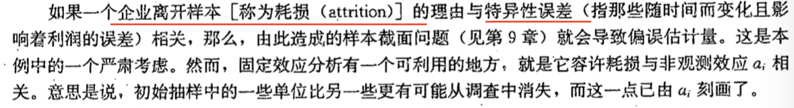
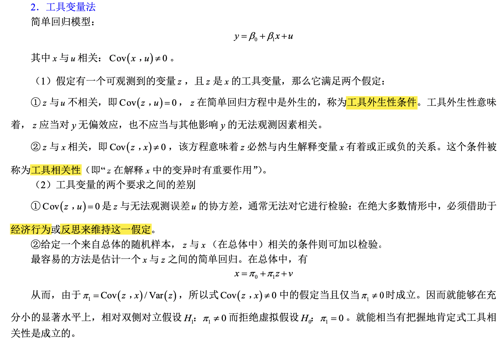

面板数据的类型：

- 平衡面板、非平衡面板
- 长面板、短面板

对异质性效应的不同处理方式，可以划分为：

- 混合回归（Pooled OLS）：不考虑个体的异质性特征（认为个体截距无差异）
- 固定效应：把异质性效应作为待估参数并入截距项，比如性别，某城市是否靠近河流等。
- 随机效应：把异质性效应并入随机扰动项

虚拟变量法（LSDV）：让每个个体有不同的截距

组内估计量（离差模型）

Hausman 检验：

---

在模型中添加年度虚拟变量、年度虚拟变量与主要解释变量之间的交互。

跨时结构性变化：邹至庄检验

对跨时期结构性变化的邹至庄检验

**两时期面板数据**

利用面板数据，把影响因变量的无法观测的因素分为两类：

- 一类是恒常不变的：固定效应
- 另一类随时间而变：特异性误差

$v_{it} = a_i + u_i$ ：复合误差 = 固定效应 + 异质性偏误

一阶差分去除 $a_i$ ：
$$
y_{i2} = (\beta_0 + \delta_0) + \beta_1 x_{i2} + a_i + u_{i2} \tag{1}
$$
$$
y_{i1} = \beta_0 + \beta_1 x_{i1} + a_i + u_{i1}\tag{2}
$$

用方程（1）减去方程（2）：
$$
(y_{i2} - y_{i1}) = \delta_0 + \beta_1 (x_{i2} - x_{i1}) + (u_{i2} - u_{i1})
$$
或者写为：
$$
\Delta y_i = \delta_0 + \beta_1 \Delta x_i + \Delta u_i
$$
**求出的 $\beta_1$ 称为一阶差分估计量。**
$$
\beta_1 = \bar \Delta y_{treat} - \bar \Delta y_{control}
$$
多于两期的差分法

一阶差分（FD）面板数据的潜在缺陷

为了消除不随时间而变化的非观测效应，将面板数据在不同时期进行差分以获得因果效应。但是若解释变量根本不随时间而变化，这种方法毫无用处。

## 14. 高级的面板数据方法

固定效应变换又称为**组内变换（组内估计量，within estimator）**，对每个 $i$ 求时间上的平均，再减去 $x_i$ 。

**组间估计量（between estimator）：**对每个解释变量都除去其时间均值，然后利用全部除时间均值后的变量做混合 OLS 回归。

用固定效应估计非观测效应模型时，怎么衡量拟合优度？

**虚拟变量回归（LSDV）**

估计非观测效应模型的方法：一是取数据的差分（FD）；二是除去时间均值（FE）。

固定效应（除去时间均值）还是一阶差分？（Wooldridge, p.401）

非平衡面板数据的固定效应法

固定效应：容许 $a_i$ 与 $x_{itj}$ 任意相关

随机效应模型：

假设有非观测效应模型：
$$
y_{it}= \beta_0 + \beta_1 x_{it1} + \cdots + \beta_kx_{itk} + a_i + u_{it} \tag{3}
$$
若非观测效应与每个解释变量在任何时期都无关：
$$
Cov(x_{itj}, a_i) = 0, t=1,2,...,T;j=1,2,...,k
$$
则方程（3）为随机效应模型。

随机效应还是固定效应？

Hausman 检验：同时使用 FE 和 RE，之后规范地检验时变解释变量系数的统计显著差别。

## 15. 工具变量估计与两阶段最小二乘法

面对可能发生的遗漏变量偏误(或无法观测异质性)的四种选择：

（1）可以忽略此问题，承受有偏而又不一致估计量的结果，若能把估计值与关键参数的偏误方向一同给出，则该方法便令人满意。

（2）可以试图为无法观测变量寻找并使用一个适宜的代理变量，该方法试图通过用代理变量取代无法观测变量来解决遗漏变量的问题，但并不是总可以找到一个好的代理。

（3）可以假定遗漏变量不随时间变化，运用固定效应或一阶差分方法。 

（4）将无法观测变量留在误差项中，但不是用 OLS 估计模型，而是运用一种承认存在遗漏变量的估计方法。这便是工具变量法所要做的。

工具变量的定义（Wooldridge, p.417）

IV 估计后计算 $R^2$ 

多元回归模型的 IV 估计

两阶段最小二乘

- 单个内生解释变量
- 多个内生解释变量
- 多重共线性与 2SLS

**变量误差问题**的 IV 解决方法

内生检验与过度识别约束检验

根据「内生解释变量」与「工具变量」间的数量关系，又可以分为以下几种情况：

- 不可识别 (unidentified)：工具变量数小于内生解释变量数；
- 恰好识别 (just or exactly indentified)：工具变量数等于内生解释变量数；
- 过度识别 (overindentified)：工具变量数大于内生解释变量数。

Sargan 检验

异方差条件下的 2SLS

## 16. 联立方程模型

联立性也能带来内生效

OLS 中的联立性偏误

结构方程的识别和估计

- 两方程联立模型的识别
- 使用 2SLS 进行估计

多于两个方程的系统：

- 三个及更多个方程联立模型的识别问题

## 17. 限值因变量模型和样本选择纠正

LPM

Logit

Probit

限值因变量模型（LDV）：取值范围明显受到限制的因变量。

泊松回归：Y 是计数变量

删截回归模型（censored regression model）和断尾回归模型（truncated regression model）

样本选择的纠正

