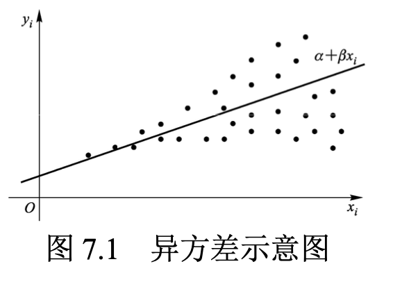
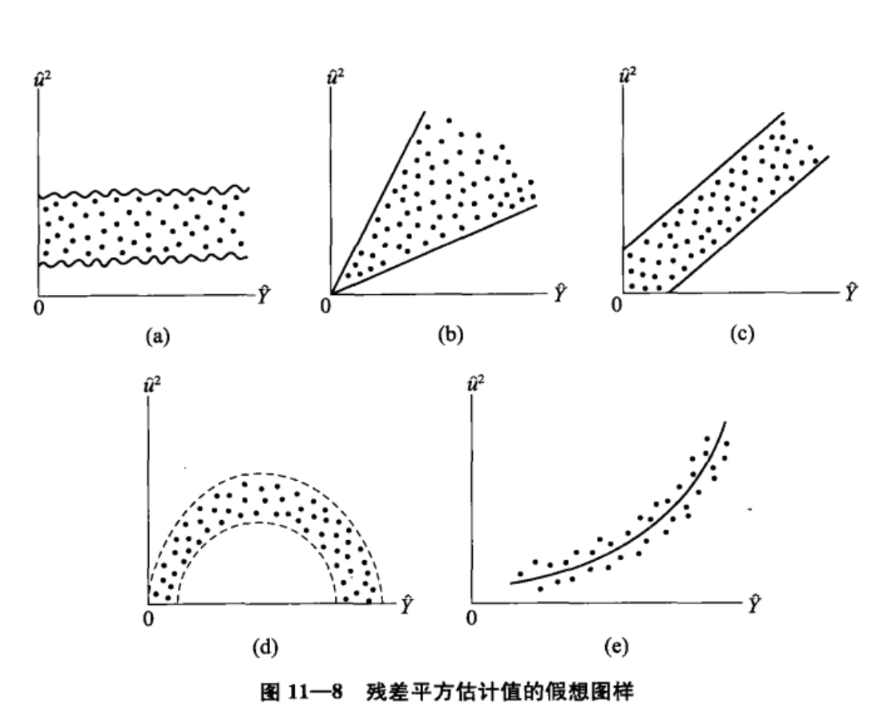

## 7. 异方差

### 7.1 异方差的后果

**“条件异方差”**（简称“异方差”）是违背球型扰动假设的一种情形，即**条件方差 $Var(\epsilon_i|X)$ 依赖于 $i$ （ 为 $\sigma _i ^2$ ），而不是常数 $\sigma^2$ 。**

在异方差的情况下：

- OLS 估计量依然无偏、一致且渐进正态。因为在证明这些性质时，未用到“同方差”的假定；
- OLS 估计量方差 $Var(\hat \beta|X)$ 的表达式不再是 $\sigma^2(X'X)^{-1}$ ，因为 $Var(\epsilon|X) \neq \sigma^2I$ 。**使用普通标准误的 t 检验、F 检验失效。**
- 高斯-马尔可夫定理不再成立，OLS 不再是 BLUE 。

---

【总结】异方差的后果

1. $\beta$ 估计量无偏：用 OLS估计所得参数估计量 $\hat \beta$ 仍具有无偏性，即 $E(\hat \beta) = \beta$ 。 
2. $\beta$ 估计量非有效：存在异方差时，$\hat \beta_{OLS}$ 不是 $\beta$ 的有效估计；直接计算 $Se(\hat \beta)$ 有误 。
3. t检验、F 检验失效

---


【举例】考虑一元回归 $y_i = \alpha + \beta x_i + \epsilon$，假设 $Var(\epsilon_i | X)$ 是解释变量 $x_i$ 的增函数，即 $x_i$ 越大则 $Var(\epsilon_i|X)$ 越大。



OLS 回归线在 $x_i$ 较小时可以较精确地估计，而在 $x_i$ 较大时则难以准确估计。

方差较大的数据包含的信息量较小，但 OLS 却对所有数据等量齐观进行处理，故异方差的存在使得 OLS 的效率降低。

在异方差的情况下，加权最小二乘法（Weigthed Least Square，WLS）才是 BLUE 。WLS 通过对不同数据所包含信息量的不同进行相应的处理以提高估计效率。比如，给予信息量大的数据更大的权重。

### 7.2 异方差的例子

- （1）**考虑消费函数：**

$$
c_i = \alpha + \beta y_i + \epsilon_i
$$


其中，$c_i$ 为消费， $y_i$ 为收入。富人的消费计划较有弹性，而穷人的消费多为必需品，很少变动。富人的消费支出更难测量，包含较多测量误差。$Var(\epsilon_i|y_i)$ 可能随 $y_i$ 的上升而变大。

- （2）**企业的投资、销售收入与利润：**大型企业的商业活动可能动辄以亿元计，而小型企业则以万元计；因此，扰动项的规模也不相同。如将大、中、小型企业放在一起回归，可能存在异方差。

- （3） **组间异方差：**如果样本包含两组（类）数据，则可能存在组内同方差，但组间异方差的情形。比如，第一组为自我雇佣者（企业主、个体户）的收入，而第二组为打工族的收入；自我雇佣者的收入波动可能比打工族更大。

- （4） **组平均数：**如果数据本身就是组平均数，则大组平均数的方差通常要比小组平均数的方差小。比如，考虑全国各省的人均  GDP ，每个省一个数据。人口较多 的省份其方差较小，方差与人口数成反比。

### 7.3 异方差的检验

#### 7.3.1 画残差图

观察**“残差 $e_i$ 与拟合值 $\hat y_i$ 的散点图”**或者**“残差 $e_i$ 与某个解释变量 $x_{ik}$ 的散点图”**。画图是直观方法，但不严格。



（图片来源：古扎拉蒂《计量经济学基础》（第五版）, p.377）

上图中，图（a） 未发现两变量之间有任何系统性关系，图（b）到图（e）表明两变量呈现一定的关系。图（c）表示呈现线性关系，图（d）和图（e）表示 $\hat u_i^2$ 与 $\hat Y_i^2$ 呈现二次关系。**利用图示虽然是非正式的方法，但是却有可能对数据进行变换，使变换后的数据不具有异方差性（如通过对数变换对原始数据进行压缩）。**

#### 7.3.2 BP 检验（Breusch and Pagan, 1979）

假设回归模型：
$$
y_i = \beta_1 + \beta_2x_{i2} + \cdots + \beta_Kx_{iK}+\epsilon_i
$$
记 $X_i = \begin{matrix}(1 & x_{i2} & \cdots & x_{iK}）\end{matrix}$ 。

**假设样本数据为 iid** ，则 $Var(\epsilon_i |X)= Var(\epsilon_i|X_i)$ 。

“条件同方差”的原假设为：
$$
H_0: Var(\epsilon_i|X_i) = \sigma^2
$$
由于 $Var(\epsilon_i|X_i) = E(\epsilon_{i}^2|X_i)-[\underbrace{E(\epsilon_i|X_i)}_{=0}]^2=E(\epsilon_i^2|X_i)$ ，原假设可写为：
$$
H_0: E(\epsilon_i^2|X_i) = \sigma_i^2
$$
**如果 $H_0$ 不成立**，则条件方差 $E(\epsilon_i^2|X_i)$ 是 $X_i$ 的函数，称为“条件方差函数”（conditional variance function）。

假设此条件方差函数为线性函数：
$$
\epsilon_i^2 = \delta_1+\delta_2x_{i2}+\cdots+\delta_Kx_{iK} + u_i
$$
故原假设可以简化为：
$$
H_0: \delta_2 = \cdots=\delta_K=0
$$
由于扰动项 $\epsilon_i$ 不可观测，故使用残差平方和 $e_i^2$ 替代，进行辅助回归（auxiliary regression）：
$$
e_i^2 = \delta_1 + \delta_2x_{i2} + \cdots+\delta_Kx_{iK} + error_{i}
$$
记此辅助回归的拟合优度为 $R^2$ 。$R^2$ 越高，则辅助回归方程越显著，越可拒绝 $H_0: \delta_2 = \cdots=\delta_K=0$ 。

Breusch and pagan(1979) 使用 LM 统计量，进行 LM 检验（Lagrange Multiplier Test）：
$$
LM = n R^2 \stackrel{d}{\rightarrow} \chi^2(K-1)
$$
如果 LM 大于 $\chi^2(K-1)$ 的临界值，则拒绝同方差的原假设。

---

【问题】为什么 LM 统计量是 $nR^2$ 呢?

**在大样本中，$nR^2$ 与检验整个方程显著性的 F 统计量渐近等价。**

首先，对于辅助回归，检验原假设 $H_0: \delta_2 = \cdots=\delta_K=0$ 的 F 统计量：
$$
F =\frac{R^2/(K-1)}{(1-R^2)/(n-K)} \sim F(K-1,n-K)
$$
其次，在大样本情况下，F 分布与 $\chi^2$ 分布是等价的。即：
$$
(K-1)F = \frac{(n-K)R^2}{(1-R^2)} \stackrel{d}{\rightarrow} \chi^2(K-1)
$$
在原假设 $H_0: \delta_2 = \cdots=\delta_K=0$ 成立的情况下，辅助回归方程常数项回归，故：

当 $n \rarr \infin$ 时，$R^2 \stackrel{p}{\rightarrow} 0$，而 $ (1-R^2) \stackrel{p}{\rightarrow} 1 $  。

因此：
$$
(K-1)F = \frac{(n-K)R^2}{(1-R^2)} \stackrel{p}{\rightarrow} (n-K)R^2
$$
在大样本下，$(n-K)R^2$ 与 $nR^2$ 并无差别，故 LM 检验与 F 检验渐近等价。

---


如果认为异方差主要依赖被解释变量拟合值 $\hat y_i$ ，可将辅助回归改为：
$$
e_i^2 = \delta_1 +\delta_2 \hat y_i + error_i
$$
然后检验 $H_0: \delta_2 = 0$ （可使用 F 或 LM 统计量）。

**Breusch and pagan(1979) 的最初检验假设扰动项 $\epsilon_i$ 服从正态分布，有一定的局限性。**Koenker(1981) 将此假定减弱为 iid ，使得 BP 检验在实际中较多采用。

---

【总结】BP 检验步骤（伍德里奇《计量经济学导论》（第五版）p.225）

1. 使用 OLS 估计原模型 $y = \beta_0 + \beta_1 x_1 + \beta_2 x_2 + \cdots + \beta_kx_k + u$，得到OLS 残差平方 $\hat u^2$ （每次观测得到一个）。

2. 做 $\hat u^2 = \delta_0 + \delta_1 x_1 + \delta_2 x_2 + \cdots + \delta_k x_k + 误差$ 回归，记下此回归的 $R^2 \rarr R_{\hat u ^2}^2$ 。
3. 计算 F 统计量或者 LM 统计量并计算 p 值。（前者使用 $F_{k, n-k-1}$ 分布，后者使用 $\chi_k^2$ 分布）。**如果这个 p 值很小，即低于选定的显著性水平，那么就拒绝同方差性的原假设。**

如果 BP 检验得到一个足够小的 p 值，那么就应该采取修正措施，使用异方差-稳健标准误，或者 WLS 。

---


#### 7.3.3 怀特检验（White, 1980）

BP 检验假设**条件方差函数为线性函数**，可能忽略了高次项。

怀特检验(White, 1980)在 BP 检验的辅助回归中加入所有的二次项（含平方项与交叉项）。

考虑以下二元回归：
$$
y_i = \beta_1 + \beta_2 x_{i2} + \beta_3 x_{i3} + \epsilon_i
$$
除常数项外，只有 $x_{i2}$ 和 $x_{i3}$ 两个解释变量，故二次项包括 $x_{i2}^2$ ，$x_{i3}^2$ 与 $x_{i2}x_{i3}$ 。

怀特检验的辅助回归为：
$$
e_i^2 = \delta_1 + \delta_2x_{i2} + \delta_3 x_{i3} + \delta_4 x_{i2}^2 + \delta_5x_{i3}^2 + \delta_6x_{i2}x_{i3} + error_{i}
$$
其中，$e_i^2$ 为二元回归方程的残差平方。

对原假设 $H_0: \delta_2 = \cdots=\delta_6=0$ 进行 F 检验或 LM 检验。

怀特检验可以检验任何形式的异方差；因为根据泰勒展开式，二次函数可很好地逼近任何光滑函数。

如果解释变量较多，则解释变量的二次项（含交叉项）将更多，在辅助回归中将损失较多样本容量。

### 7.4 异方差的处理

#### 7.4.1 使用“ OLS + 稳健标准误”

**如发现异方差，一种处理方法是，仍进行 OLS 回归（OLS 依然无偏、一致且渐近正态），但使用在异方差情况下也成立的稳健标准误。这是最简单，也是目前通用的方法。**

只要样本容量较大，即使在异方差的情况下，只要使用稳健标准误，则所有参数估计、假设检验均可照常进行。

---

【补充】何谓“稳健标准误”？（伍德里奇《计量经济学导论》（第五版）p.219）

在一般多元回归模型：
$$
y = \beta_0 + \beta_1x_1 + \beta_2 x_2 + \cdots + \beta_k x_k + u
$$
在假定 MLR.1~MLR.4 下，$Var(\hat \beta_j)$ 的一个有效估计量是：
$$
\hat{Var(\hat \beta_j)} = \frac{\sum_{i=1}^n \hat r_{ij}^2 \hat u_i^2}{SSR_j^2}
$$
其中，$\hat r_{ij}^2$ 表示将 $x_j$ 对所有其他自变量做回归所得到的第 $i$ 个残差，而 $SSR_j$ 则是这个回归的残差平方和。上式的**平方根**被称为 $\hat \beta_j^2$ 的异方差-稳健标准误（heteroskedasticity-robust standard error）。 

---


#### 7.4.2 加权最小二乘法（WLS）

方差较小的观测值包含的信息量较大。对于异方差的另一处理方法是，给予方差较小的观测值较大的权重，然后进行加权最小 二乘法估计。

**WLS 的基本思想是：通过变量转换，使得变换后的模型满足球形扰动项的假定（变为同方差），然后进行 OLS 估计，即为最有效率的 BLUE 。**

考虑线性回归模型：
$$
y_i = \beta_1 + \beta_2x_{i2} + \cdots+\beta_K x_{iK} + \epsilon_i
$$
*假定 $Var(\epsilon_i|x_i) \equiv \sigma_i^2 = \sigma_i^2v_i$ ，且 $\{v_i\}_{i=1}^n$ 已知。*

两边同乘权重 $1/\sqrt{v_i}$ 可得：
$$
\frac{y_i}{\sqrt{v_i}} = \beta_1\frac{1}{\sqrt{v_i}} + \beta_2\frac{x_{i2}}{\sqrt{v_i}} + \cdots+\beta_K \frac{x_{iK}}{\sqrt{v_i}} + \frac{\epsilon_i}{\sqrt{v_i}}
$$

新扰动项 $\epsilon_i/\sqrt{v_i}$ 不再有异方差，因为：
$$
Var(\epsilon_i/\sqrt{v_i}) = \frac{1}{v_i}Var(\epsilon_i) = \frac{\sigma^2v_i}{v_i} = \sigma^2
$$
对**乘以权数后的方程**进行 OLS 回归，即为 WLS 。

加权之后的回归方程满足球形扰动项的假定，故是 BLUE 。

可将 WLS 定义为最小化“加权残差平方和”，即：
$$
\min \quad \sum_{i=1}^n (e_i/\sqrt{v_i})^2 = \sum_{i=1}^n \frac{e_i^2}{v_i} 
$$
权重为 $1/v_i$ （即方差的倒数）（Stata也是如此约定）。

WLS 的 $R^2$ 通常没有太大的意义，它衡量的是变换之后的解释变量 $(x_{ik}/\sqrt{v_i})$  对变换之后的被解释变量 $(y_i/\sqrt{v_i})$ 的解释力。

#### 7.4.3 可行加权最小二乘法（FWLS）

使用 WLS 虽然可以得到 BLUE 估计，但是必须知道每位个体的方差，即 $\{\sigma_i^2\}_{i=1}^n$ 。实践中通常不知道 $\{\sigma_i^2\}_{i=1}^n$ ，故 WLS 事实上是不可行（infeasible）的。

**解决办法：先用样本数据估计 $\{\sigma_i^2\}_{i=1}^n$ ，然后再使用 WLS ，称为 “可行加权最小二乘法” （Feasible WLS，简称 FWLS ）。**

在进行 BP 检验时，进行如下辅助回归：
$$
e_i^2 = \delta_1 + \delta_2x_{i2} + \cdots + \delta_K x_{iK} + error_i
$$
其中，$e_i^2$ 为原方程的残差平方。

通过辅助回归的拟合值，可得 $\sigma_i^2$ 的估计值：
$$
\sigma_i^2 = \hat \delta_1 + \hat \delta_2 x_{i2} + \cdots + \hat \delta_K x_{iK}
$$
但可能出现 $\hat \delta_i^2 < 0$ 的情形，而方差不能为负。

为保证 $\hat \delta_i^2 > 0$，假设条件方差函数为对数形式：
$$
\ln{e_i^2} = \delta_1 + \delta_2x_{i2} + \cdots + \delta_kx_{iK} + error_i
$$
对此方程进行 OLS 回归，可得 $\ln{e_i^2}$ 的预测值，记为 $\ln{\hat \sigma_i^2}$ 。

**得到拟合值 $\hat \sigma_i^2 = exp(\ln{\hat \sigma_i^2})$ （一定为正）。**

以 $1/\hat \sigma_i^2$ 为权重对原方程进行 WLS 估计，记此估计量为 $\hat \beta_{FWLS}$ 。

#### 7.4.4 究竟使用“ OLS + 稳健标准误”还是 FWLS ？

理论上，WLS 是 BLUE 。

实践中的 FWLS 并非线性估计，因为权重 $1/\hat \sigma_i^2$ 也是 $y$ 的函数。

由于$\hat \beta_{FWLS}$ 是 $y$ 的非线性函数，一般有偏。$\hat \beta_{FWLS}$ 无资格参加 BLUE 的评选。

FWLS 的优点主要体现在大样本中。如果 $\hat \sigma_i^2$ 是 $\sigma_i^2$ 的一致估计，则 FWLS 一致，且在大样本下比 OLS 更有效率。

FWLS的缺点是必须估计条件方差函数$\hat \sigma_i^2(x_i)$，而通常不知道条件方差函数的具体形式。如果该函数的形式设定不正确，根据 FWLS 计算的标准误可能失效，导致不正确的统计推断。

使用“OLS + 稳健标准误”的好处是，对回归系数及标准误的估计都一致，不需要知道条件方差函数的形式。而且在 Stata 中的操作简单，在 `reg` 之后添加 `robust` 选项即可。

**“OLS + 稳健标准误”更为稳健（适用于一般的情形），而 FWLS 更有效率。**

Stock and Watson (2012)推荐，在大多数情况下应使用“OLS + 稳健标准误”。但 Wooldridge(2009)指出，如果存在严重的异方差，可通过 FWLS 提高估计效率。

如果对于条件异方差函数的具体形式没有把握，不知道经过加权处理之后的新扰动项 $\epsilon_i/\sqrt{v_i}$ 是否同方差，可在 WLS 回归时仍使用异方差稳健标准误，以保证 FWLS 标准误的有效性。

如果被解释变量取值为正，有时将被解释变量取对数，可以缓解异方差问题。

### 7.5 处理异方差的 Stata 命令及实例
```Stata
use ${d}/nerlove.dta, clear
/*
数据说明：此数据集包括以下变量:tc (总成本)，q (总产量)，pl (工资率)， pk (资本的使用成本) 与 pf (燃料价格)，以及相应的对数值 lntc， lnq，lnpl，lnpk 与 lnpf。
*/

reg lntc lnq lnpl lnpk lnpf


* 1.残差图 -rvfplot- (residual-versus-fitted plot)
rvfplot //残差与拟合值的散点图
rvpplot lnq // 残差与解释变量 lnq 的散点图

* 2.BP 检验
estat hettest, iid rhs 
/*
其中：
- “estat”指 post-estimation statistics(估计后统计量)，即在完成估计后所计算的后续统计量。 
- “hettest”表示 heteroskedasticity test。
- 选择项“iid”表示仅假定数据为 iid，而无须正态假定。
- 选择项“rhs”表示，使用方程右边的全部解释变量进行辅助回 归，默认使用拟合值 yˆ 进行辅助回归。

estat hettest [varlist], iid //指定使用 varlist 进行辅助回归
*/

quietly reg lntc lnq lnpl lnpk lnpf
estat hettest, iid  // 使用拟合值进行 BP 检验
estat hettest, iid rhs // 使用所有解释变量进行 BP 检验
estat hettest lnq, iid // 使用变量 lnq 进行 BP 检验
/*
结果解读：
各种形式 BP 检验的 p 值都等于 0.0000，故强烈拒绝同方差的原 假设，认为存在异方差。
*/

* 3.怀特检验
estat imtest, white // imtest:  information matrix test(信息矩阵检验)
/*结果解读：
p值(Prob>chi2)等于 0.0000，强烈拒绝同方差的原假设，认 为存在异方差。
*/

* 4.WLS
/*
得到扰动项方差的估计值 ${\hat \sigma_{i}^2}_{i=1}^n$ 后，可作为权重进行 WLS 估计。 假设已把 ${\hat \sigma_{i}^2}_{i=1}^n$ 存储在变量 var 上，可通过如下 Stata 命令来实现 WLS ：

reg y x1 x2 x3 [aw=1/var]

其中，“aw”表示 analytical weight，为扰动项方差(不是标准差)的倒数。
*/

quietly reg lntc lnq lnql lnpk lnpf
predict e1, residual
gen e2 = e1^2
gen lne2 = log(e2)
reg lne2 lnq // 假设 $\ln{\hat \sigma_{i}^2}$ 为变量 `lnq' 的线性函数进行辅助回归

/*
结果解读：变量lnq在1%水平上显著，但R2仅为0.1309，且常数项不显著 ( p值为 0.26)。
*/

reg lne2 lnq, noc //去掉常数项重新进行辅助回归
/*
结果解读：
R2上升为 0.7447(尽管无常数项的R2与有常数项的R2不可比)， 残差平方的变动与 lnq 高度相关。
*/

predict lne2f // 计算辅助回归的拟合值
gen e2f = exp(lne2f) //去掉对数后，即得到方差的估计值
reg lntc lnq lnpl lnpk lnpf [aw=1/e2f] // 使用方差估计值的倒数作为权重,WLS
/*
结果解读：
WLS 回归的结果显示，lnpk 的系数估计值由“-0.22”(OLS 估 计值)改进为“-0.09”(其理论值应为正数)。
使用 OLS 时，变量 lnpl 的 p 值为 0.13，在 10%的水平上也不显 著;使用 WLS 后，该变量的 p 值变为 0.002，在 1%的水平上显著 不为 0。
由于 Nerlove(1963)数据存在明显的异方差，使用 WLS 后提高了 估计效率。
*/

/*
如担心条件方差函数的设定不准确，导致加权后的新扰动项仍 有异方差，可使用稳健标准误进行 WLS 估计:
*/
reg lntc lnq lnpl lnpk lnpf [aw=1/e2f],r

/*
结果解读：
无论是否使用稳健标准误，WLS 的回归系数都相同，但标准误有所不同。
*/
```

### 7.6 Stata 命令的批处理

do文档的使用
```Stata
* WLS for Nerlove(1963)
capture log close
log using wls_nerlove,replace
set more off
use nerlove.dta, clear
reg lntc lnq lnpl lnpk lnpf
predict e1,r
gen e2=e1^2
gen lne2=log(e2)
reg lne2 lnq,noc
predict lne2f
gen e2f=exp(lne2f)

* Weighted least square regression
reg lntc lnq lnpl lnpk lnpf [aw=1/e2f]
reg lntc lnq lnpl lnpk lnpf [aw=1/e2f],r
log close
exit
```

