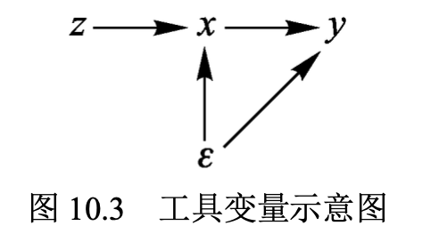

## 10. 工具变量法

内生性的来源包括遗漏变量偏差、联立方程偏差（双向因果关系），及测量误差偏差（measurement error bias）。

### 10.1 联立方程偏差

比如农产品市场均衡模型，供给和需求两个方程的解释变量是一样的。

### 10.2 测量误差偏差

假设真实模型为：
$$
y = \alpha + \beta x^* + \epsilon \tag{1}
$$
其中，$\beta \neq  0, Cov(x^*,\epsilon)=0$ 。

**$x^*$ 无法观测，只能观测到 $x$ **。二者满足以下关系：
$$
x = x^* + u \tag{2}
$$
其中，$Cov(x^*,\epsilon) = 0, Cov(x, u) = 0$ 。

将式（2）代入式（1）可得：
$$
y = \alpha + \beta(x - u) + \epsilon \\
= \alpha + \beta x +(\epsilon - \beta u)
$$
新扰动项 $(\epsilon - \beta u)$ 与解释变量 $x$ 存在相关性：
$$
Cov(x,\epsilon -\beta u) = Cov(x^* +u, \epsilon -\beta u) \\
=\underbrace{Cov(x^*,\epsilon)}_{=0} - 
\beta \underbrace{Cov(x^*,u)}_{=0} +
\underbrace{Cov(u,\epsilon)}_{=0} -
\beta Cov(u,u) \\
= -\beta Var(u) \neq 0
$$
故 OLS 不一致，称为“测量误差偏差”（measurement error bias）。

如果被解释变量存在测量误差，后果却不严重。比如，只要被解释变量的测量误差与解释变量不相关，则 OLS 依然一致。

---

【证明】只要被解释变量的测量误差 $v$ 与解释变量 $x$ 不相关，则 OLS 为一致估计量。

$E(\hat \beta) = \hat \beta$

---

### 10.3 工具变量法

OLS 不一致因内生变量与扰动项相关而引起。

**如能将内生变量分成两部分，一部分与扰动项相关，另一部分与扰动项不相关，可用与扰动项不相关的那部分得到一致估计。**

通常借助另外一个“工具变量”实现这种分离。

在回归方程中，一个有效的工具变量应满足以下两个条件：

- 相关性（relevance）：工具变量与**内生解释变量**相关，即 $Cov(z_t, p_t) \neq 0$ 
- 外生性（exogeneity）：工具变量与**扰动项**不相关，即 $Cov(z_t, u_t) = 0$ 

利用工具变量的这两个性质，可得到对回归系数 $\beta$ 的一致估计。

假设影响供给方程扰动项的因素可分解为两部分，即可观测的气温 $z_t$ 与不可观测的其他因素：
$$
q_t^s = \gamma + \delta p_t + \eta z_t + v_ts
$$
假定气温 $z_t$ 是前定变量，与需求方程的扰动项不相关，即 $Cov(z_t,u_t) = 0$ 。

由于气温 $z_t$ 的变化使得供给函数 $q_t^s$ 沿着需求曲线 $q_t^d$ 移动，故可估计需求函数 $q_t^d$ 。 

假设需求方程为：
$$
q_t = \alpha + \beta p_t + u_t
$$
两边同时求与 $z_t$ 的协方差：
$$
Cov(q_t,z_t) = Cov(\alpha+\beta p_t+u_t,z_t) 
= \beta Cov(p_t,z_t) + \underbrace{Cov(u_t,z_t)}_{=0} = \beta Cov(p_t,z_t)
$$
由于工具变量的外生性，故 $Cov(u_t,z_t) = 0$ 。

由于工具变量的相关性：$Cov(p_t,z_t) \neq 0$ 。

两边同除 $Cov(p_t,z_t)$：
$$
\beta = \frac{Cov(q_t,z_t)}{Cov(p_t,z_t)}
$$
以样本矩取代总体矩（**以样本协方差替代总体协方差**），可得一致的“工具变量估计量”（Instrumental Variable Estimator）:
$$
\hat \beta_{IV} = \frac{\hat{Cov(q_t,z_t)}}{\hat{Cov(p_t,z_t)}} = \frac{\sum_{i=1}^n (q_t-\bar q)(z_t - \bar z)}{\sum_{i=1}^n(p_t-\bar p)(z_t-\bar z)} \stackrel{p}{\longrightarrow} \frac{Cov(q_t,z_t)}{Cov(p_t,z_t)} = \beta
$$
$\bar q, \bar p, \bar z$ 分别为 $q,p,z$ 的样本均值。

如果工具变量与内生变量无关，$Cov(z_t,p_t)=0$ ，则无法定义工具变量法。

如果工具变量与内生变量的相关性很弱， $Cov(z_t,p_t) \approx 0$，会导致估计量 $\hat \beta_{IV}$ 的方差变得很大，称为“弱工具变量问题”。

### 10.4 二阶段最小二乘法

工具变量法一般通过“二阶段最小二乘法”（Two Stage Least Square, 2SLS 或 TSLS）来实现。

- 第一阶段回归：用内生解释变量对工具变量回归，即 $p_t \stackrel{OLS}{\longrightarrow} z_t$，得到拟合值 $\hat p_t$ 。

- 第二阶段回归：用被解释变量对第一阶段回归的拟合值进行回归，即 $q_t \stackrel{OLS}{\longrightarrow} \hat p_t$ 。

为什么这样做就能得到一致估计？

首先，将需求方程 $q_t = \alpha + \beta p_t + u_t$ 分解为：
$$
q_t = \alpha_0 + \beta \hat p_t + \underbrace{[u_t + \beta (p_t - \hat p_t)]}_{\equiv  \epsilon_t}
$$
这是第二阶段的回归，扰动项为 $\epsilon_t \equiv u_t + \beta(p_t - \hat p_t)$ 。 

在第二阶段的回归中，$\hat p_t$ 与扰动项 $\epsilon_t$ 不相关。

---

【命题】在第二阶段的回归中，$\hat p_t$ 与扰动项 $\epsilon_t$ 不相关。

【证明】由于 $\epsilon_t \equiv u_t + \beta(p_t - \hat p_t)$ ，故
$$
Cov(\hat p_t, \epsilon_t) = Cov(\hat p_t,u_t) + \beta Cov(\hat p_t , p_t - \hat p_t)
$$
首先，由于 $\hat p_t$ 是 $z_t$ 的线性函数（$\hat p_t $为第一阶段回归的拟合值），而 $Cov(z_t, u_t) = 0 $ （工具变量的外生性），故 $Cov(\hat p_t, u_t) = 0$ 。

其次，在第一阶段回归中，拟合值 $\hat p_t$ 与残差 $(p_t - \hat p_t)$ 正交 （OLS 的正交性），故 $Cov(\hat p_t, p_t - \hat p_t) = 0$ 。

---

第二阶段回归的解释变量 $\hat p_t$ 与扰动项 $\epsilon_t$ 不相关，故 2SLS 一致。


**2SLS 的实质：把内生解释变量 $p_t$** 分为两部分：

- 由工具变量 $z_t$ 所造成的外生部分 $(\hat p_t)$
- 及与扰动项相关的其余部分 $(p_t - \hat p_t)$ 

把解释变量 $q_t$ 对 $p_t$ 中的外生部分 $(\hat p_t)$ 进行回归，从而满足 OLS 对前定变量的要求而得到一致估计。

**如果存在多个工具变量，仍可用 2SLS 法。**

假设 $z_1$ 和 $z_2$ 为两个有效工具变量（满足相关性与外生性），则第一阶段回归变为：
$$
p = \alpha_0 + \alpha_1 z_1 + \alpha_2 z_2 + u
$$
可得拟合值 $\hat p = \hat \alpha_0 + \hat \alpha_1 z_1 + \hat \alpha_2 z_2$ ，而第二阶段回归不变。

考虑多个内生变量的情形：
$$
y = \beta _0 + \beta_1 x_1 + \beta_2 x_2 + \epsilon
$$
其中，$x_1$ 和 $x_2$ 均内生，都与 $\epsilon$ 相关。

由于有两个内生变量，至少需要两个工具变量，才能进行 2SLS 估计。

如只有一个工具变量 $z$ ，由第一阶段回归可得，$\hat x_1 = \hat \alpha_0 + \hat \alpha_1 z，\hat x_2 = \hat \gamma_0 + \hat \gamma_1 z$ 。

将 $\hat x_1$ 与 $\hat x_2$ 代入原方程：
$$
y = \beta_0 + \beta_1 \hat x_1 + \beta \hat x_2 + v_t
$$
$\hat x_1$ 与 $\hat x_2$ 都是 $z$ 的线性函数，故存在**严格多重共线性**。

**阶条件（order condition）：进行 2SLS 估计的必要条件是工具变量个数不少于内生解释变量的个数。**

根据阶条件是否满足可分为三种情况：

- 不可识别（unidentified）：工具变量个数小于内生解释变量个数；
- 恰好识别（just or exactly identified）：工具变量个数等于内生解释变量个数；
- 过度识别（overidentified）：工具变量个数大于内生解释变量个数。

在恰好识别和过度识别的情况下，都可使用 2SLS；在不可识别的情况下，无法使用 2SLS 。

进行 2SLS 估计，最好不要自己手工进行两次回归，而直接使用 Stata 命令。
 2SLS 的 Stata 命令格式为

```Stata
ivregress 2sls y x1 x2 (x3 = z1 z2),robust first 

/*
其中，“y”为被解释变量，“x1 x2”为外生解释变量，“x3”
为内生解释变量，而“z1 z2”为方程外的工具变量。
选择项“robust”表示使用异方差稳健的标准误(默认为普通 标准误);
选择项“first”表示显示第一阶段的回归结果。
*/
```

在球形扰动项的情况下，2SLS 是最有效率的工具变量法。

在异方差的情况下，存在更有效率的工具变量法，即“广义矩估计”(Generalized Method of Moments，GMM)。

GMM 是数理统计“矩估计”(Method of Moments，MM)的推广。 GMM 之于 2SLS，正如 GLS 与 OLS 的关系。 在恰好识别或同方差的情况下，GMM 等价于 2SLS。

### 10.5 弱工具变量

如果工具变量与内生变量仅微弱相关，$\hat \beta_{IV}$ 的方差将变得很大。

由于工具变量仅包含极少与内生变量有关的信息，利用这部分信息进行的工具变量法估计就不准确。

这种工具变量称为“弱工具变量”（weak instruments）。

为检验是否存在弱工具变量，可在第一阶段回归中，检验所有方程外的工具变量的系数是否联合为零。

假设原模型：
$$
y = \beta_0 + \beta_1 x+ \beta_2 w + \epsilon
$$
$y$ 为内生变量，$w$ 为外生变量。

假设有两个有效工具变量 $z_1,z_2$ ，第一阶段的回归为：
$$
x = \alpha_0 + \alpha_1 z_1 + \alpha_2 z_2 + \alpha_3 w + u
$$
检验 $H_0: \alpha_1 = \alpha_2 = 0$。由于工具变量的强弱连续变化，很难确定明确的检验标准。

经验规则：此检验的 F 统计量大于 10 ，则拒绝“存在弱工具变量”的原假设。

在 Stata 做完 2SLS 后，使用：

```Stata
estat firststage
```

 如果存在弱工具变量：

- 寻找更有效的工具变量；
- 使用对弱工具变量更不敏感的“有限信息最大似然估计法”（LIMT）。

```Stata
ivregress liml y x1 x2 (x3 = z1 z2)
```

### 10.6 对工具变量外生性的过度识别检验

排他性约束：排除工具变量除了通过内生变量而影响被解释变量的其他渠道。

**实践中，需找出工具变量影响被解释变量的所有其他可能渠道，然后一一排除，才能说明工具变量的外生性。**

Sargan 统计量：$nR^2 \stackrel{d}{\longrightarrow} \chi^2(m-r)$


过度识别检验的大前提是该模型至少恰好识别，即有效工具变量至少与内生解释变量一样多。

```Stata
estat overid
```

### 10.7 对解释变量内生性的豪斯曼检验:究竟该用 OLS 还是 IV

Hausman 检验的原假设为：$H_0: a所有解释变量均为外生变量$ 。

如果 $H_0$成立，则 OLS 与 IV 一致，在样本下 $\hat \beta_{IV}$ 与 $\hat \beta_{OLS}$ 都收敛于真实的参数值 $\beta$ ，故 $(\hat \beta_{IV} - \hat \beta_{OLS})$ 依概率收敛于 0 。

反之，如果 $H_0$ 不成立，则 IV 一致而 OLS 不一致，故 $(\hat \beta_{IV} - \hat \beta_{OLS})$ 不会收敛于 0 。

如果 $(\hat \beta_{IV} - \hat \beta_{OLS})$ 的距离很大，则倾向于拒绝原假设。

根据 Wald 检验原理，以二次型度量此距离：
$$
(\hat \beta_{IV} - \hat \beta_{OLS})'[\hat{Var(\hat \beta_{IV} - \hat \beta_{OLS})}]^{-1}(\hat \beta_{IV} - \hat \beta_{OLS}) \stackrel{d}{\longrightarrow}  \chi^2(r)
$$
其中，$r$ 为内生解释变量的个数，$[\hat{Var(\hat \beta_{IV} - \hat \beta_{OLS})}]^{-1}$ 为 $(\hat \beta_{IV} - \hat \beta_{OLS})$ 的协方差矩阵之样本估计值。

如果此 Hausman 统计量很大，超过了其渐近分布 $\chi^2(r)$ 的临界值，则拒绝“所有解释变量均外生”的原假设，认为存在内生变量，应用 IV 。

Stata 命令为：

```Stata
reg y x1 x2
est store ols

ivregress 2sls y x1 (x2 = z1 z2)
est store iv
hausman iv ols, constant sigmamore 
```

传统 Hausman 检验的缺点是：为简化 $[\hat{Var(\hat \beta_{IV} - \hat \beta_{OLS})}]$ 的计算，假设在 $H_0$ 成立的情况下，OLS 最优效率，故不适用异方差的情形。

改进的 Durbin-Wu-Hausman Test 在异方差的情况下也适用：

DWH 检验：

```Stata
ivregress 2sls y x1 (x2=z1 z2)
estat endogenous
```

###   10.8 如何获得工具变量

寻找工具变量的步骤大致可分为两步：

- 列出与内生解释变量相关的尽可能多的变量的清单；
- 从这一清单中剔除与扰动项相关的变量。

**要确保：z 对 y 的影响仅通过 x 起作用**，可以通过定性讨论来确定排他性约束。



对于时间序列数据或面板数据，常使用内生解释变量的滞后项作为工具变量。

### 10.9 工具变量法的 Stata 实例

```Stata
use ${d}/grilic.dta, clear

/*
数据说明：
此数据集的主要变量包括：lnw(工资对数)，s(教育年限)，expr(工 龄)，tenure(在现单位的工作年数)，iq(智商)，med(母亲的教育年 限)，kww(在“knowledge of the World of Work”测试中的成绩)， rns(美国南方虚拟变量，住在南方=1)，smsa(大城市虚拟变量，住 在大城市=1)。
*/

* 1.作为参照系，首先进行 OLS 回归，并使用稳健标准误
reg lnw s expr tenure rns smsa, r
/*
教育投资的年回报率高达 10.26%(似乎太高)，且在 1%的水 平上显著。可能遗漏“能力”，高估了教育的回报率
*/

* 2.引入智商(iq)作为“能力”的代理变量，再进行 OLS 回归
reg lnw s iq expr tenure rns smsa, r


* 3.由于用 iq 度量能力存在“测量误差”，故 iq 是内生变量。使用变量(med, kww)作为 iq 的工具变量。
/*
母亲的教育年限(med)与 KWW 测试成绩(kww)都与 iq 正相关; 并假设 med 与 kww 为外生
*/
ivregress 2sls lnw s expr tenure rns smsa (iq = med kww), r first
/*
教育投资回报率降为 6.08%，且在 1%水平上显著;比较合理。
*/

* 4.过度识别检验
estat overid
/*
p值为 0.697，故接受原假设，认为(med, kww)外生
*/

* 5.工具变量与内生变量的相关性
/*
从第一阶段的回归结果可知，工具变量(med, kww)对内生变量 iq 有较好解释力， p 值都小于 0.05。
正式检验须计算第一阶段回归的普通(非稳健) F 统计量
*/
// 使用普通标准误重新进行 2SLS 估计
quietly ivregress 2sls lnw s expr tenure rns smsa (iq=med kww)
estat firststage
/*
由于 F 统计量为 14.91，超过 10，故认为不存在弱工具变量
*/

* 6.使用对弱工具变量更不敏感的有限信息最大似然法(LIML)
ivregress liml lnw s expr tenure rns smsa (iq=med kww), r

/*
LIML 估计值与 2SLS 非常接近，侧面印证“不存在弱工具变量”
*/

* 7.使用工具变量法的前提是存在内生解释变量。为此进行豪斯 曼检验，原假设为“所有解释变量均为外生”
quietly reg lnw iq s expr tenure rns smsa
estimates store ols
quietly ivregress 2sls lnw s expr tenure rns smsa (iq=med kww)
estimates store iv
hausman iv ols,constant sigmamore
/*
传统的豪斯曼检验假定同方差，故在回归中未使用稳健标准误
p值(Prob>chi2)为 0.0499，可在 5%水平上拒绝“所有解释变 量均为外生”的原假设，认为 iq 内生
传统的豪斯曼检验在异方差下不成立，下面进行异方差稳健的 DWH 检验:
*/
estat endogenous
/*
根据 F 统计量与 \chi_2 统计量，二者在大样本下渐近等价。 二者的 p 值都小于 0.05，故认为 iq 内生
*/

* 8.汇报结果:将以上各种估计法的系数及标准误列在同一表格中，可使用以下命令
qui reg lnw s expr tenure rns smsa,r
est sto ols_no_iq
qui reg lnw iq s expr tenure rns smsa,r
est sto ols_with_iq
qui ivregress 2sls lnw s expr tenure rns smsa (iq=med kww),r
est sto tsls
qui ivregress liml lnw s expr tenure rns smsa (iq=med kww),r
est sto liml
estimates table ols_no_iq ols_with_iq tsls liml,b se
//用一颗星表示 10%的显著性，两颗星表示 5%的显著性，三 颗星表示 1%的显著性
estimates table ols_no_iq ols_with_iq tsls liml,star(0.1 0.05 0.01)

* ssc install estout, replace
esttab ols_no_iq ols_with_iq tsls liml using ${o}/iv.rtf,se r2 mtitle star(* 0.1 ** 0.05 *** 0.01)
/*
选择项“se”表示在括弧中显示标准误(默认显示t 统计量，如 果使用选择项“p”则显示 p 值)。
选择项“r2”表示显示R2。 选择项“mtitle”表示使用模型名称(model title)作为表中每列
的标题(默认使用被解释变量作为标题)
选择项“star(* 0.1 ** 0.05 *** 0.01)”表示以星号 表示显著性水平。
*/
```