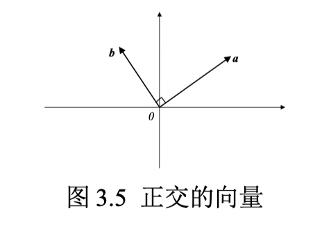
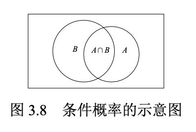
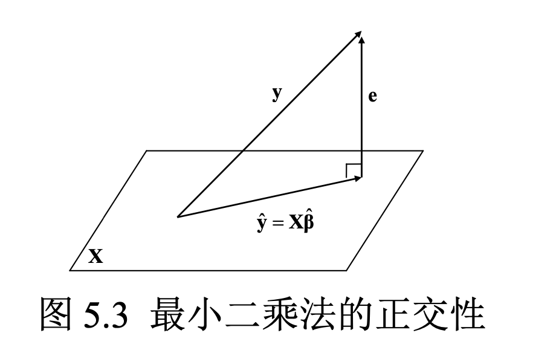

## 1. 导论

什么是计量经济学：

计量经济学是运用概率统计方法对经济变量之间的（因果）关系进行定量分析的科学。

经济数据的特点和类型

## 2. Stata 入门

（略）

## 3. 数学回顾

### 3.1 微积分

#### 3.1.1 导数

一阶导数：表示切线斜率

二阶导数：表示切线斜率的变化速度

#### 3.1.2 一元最优化

最小化问题：最小二乘法

最大化问题：极大似然估计

一元最大化问题的必要条件为：$f'(x) = 0$

最大化问题：$f''(x^*) \leq 0$

最小化问题：$f''(x^*) \geq 0$

#### 3.1.3 偏导数

对于多元函数 $y = f(x_1,x_2,x_3,..., x_n)$ ，在计算 $y$ 对 $x_1$ 的一阶偏导数时，将给定 $x_2,...,x_n$视为参数，则 $y=f(x_1, x_2, ...,x_n)$可以看成 $x_1$ 的一元函数 $y = f(x_1, \cdot)$ 。

#### 3.1.4 多元最优化

一阶条件要求再最优值 $x^*$ 处，所有偏导数均为 0 。

#### 3.1.5 积分

定积分的实质就是求和（无穷多项之和）。

### 3.2 线性代数

#### 3.2.1 矩阵

$A_{m \times n}$，$m$ 表示行，$n$ 表示列。

A中元素$a_{ij}$表示第 $i$ 行，第 $j$ 列元素。

零矩阵：所有元素都为 0 ，记为 $\bf{0}$ 。

#### 3.2.2 方阵

方阵：如果 $m=n $，则称 $A$ 为 $n$ 级方阵。

对称矩阵：如果满足$a_{ij} = a{ji}$，任意$(i,j=1,...,n)$，则称 $A$ 为对称矩阵。

对角矩阵：如果方阵 $A$ 的非主对角线元素全部为 0 。

单位矩阵：如果一个 $n$ 级对角矩阵的主对角线元素都为 1 。

#### 3.2.3 矩阵的转置

转置矩阵：将矩阵 $A=(a_{ij})_{mn}$ 的第 1 行变为第 1 列，第 2 行变为第 2 列，...... ，第 $m$ 行变为 $m$ 列，可得其转置矩阵，记为 $A^\prime$。

#### 3.2.4 向量

行向量：$m =1 $，则称矩阵 $A_{1 \times n}$ 为 n 维行向量；

列向量：如果 $n=1$，则矩阵 $A_{m \times 1}$ 为 m 维列向量。

向量是矩阵的特例。

考察 n 维列向量$a = (\begin{matrix} a_1 & a_2 &...&a_n\end{matrix})'$ 与 $b	 = (\begin{matrix} b_1 & b_2 &...&b_n\end{matrix})'$。

向量 $a$ 和 $b$ 的**内积**或**点乘**可定义为：

 $a'b \equiv (\begin{matrix} a_1 & a_2 &...&a_n\end{matrix})\begin{Bmatrix}b_1\\b_2\\...\\b_n\end{Bmatrix} \equiv a_1b_1 + a_2b_2+...+a_nb_n\equiv\sum_{i=1}^n a_ib_i$

如果$a'b=0$，则称向量 $a$ 和向量 $b$ **正交**，意味着两个向量在 n 维向量空间中相互垂直（夹角为 90 度）。



#### 3.2.5 矩阵的加法

如果两个矩阵的维度相同，则可相加。

对于$m\times n$ 级矩阵 $A = (a_{ij})_{m \times n}, B = (b_{ij})_{m \times n}$，矩阵 $A$与 $B$之和定义为两个矩阵相应元素之和，即：
$$
A + B = (a_{ij})_{m \times n} + (b_{ij})_{m \times n} = (a_{ij} + b_{ij})_{m \times n}
$$
矩阵加法满足以下规则：

- $A + 0 = A$（加上零矩阵不改变矩阵）
- $A+B=B+A$（加法交换律）
- $(A+B)+C = A+(B+C)$（加法结合律）
- $(A+B)' = A'+B'$（转置为线性运算）

#### 3.2.6 矩阵的数乘

矩阵 $A = (a_{ij})_{m \times n}$ 与实数 $k$ 的**数乘**定义为此实数与矩阵  $A = (a_{ij})_{m \times n}$ 每个元素的乘积：
$$
kA = k(a_{ij})_{m \times n} = (ka_{ij})_{m \times n}
$$

#### 3.2.7 矩阵的乘法

如果矩阵 $A$ 的**列数**与矩阵 $B$ 的**行数**相同，则可以定义**矩阵乘积** $A \times B$，简记为 $AB$ 。

假设矩阵 $A=(a_{ij})_{m \times n}$，矩阵$B=(b_{ij})_{n \times q}$，则矩阵乘积 $AB$ 的 $(i, j)$ 元素即为矩阵 $A$ 第 $i$ 行与矩阵 $B$ 的第 $j$ 列的内积：
$$
(AB)_{ij} \equiv (\begin{matrix}a_{i1} &a_{i2}&...&a_{in} \end{matrix})\begin{Bmatrix}b_{1j} \\b_{2j} \\ ... \\b_{nj}\end{Bmatrix} = \sum_{k=1}^n a_{ik}b_{kj}
$$
**矩阵乘法不满足交换律，即：$AB \neq BA$ 。**

在做矩阵乘法时，需区分**左乘**与**右乘**。$A$ 左乘 $B$为 $AB$，而 $A$ 右乘 $B$ 为 $BA$ 。

矩阵的乘法满足以下规则：

- $IA = A, IA = A$ （乘以单位矩阵不改变矩阵）
- $(AB)C=A(BC)$ （乘法结合律）
- $A(B+C)=AB+AC$ （乘法分配律）
- $(AB)'=B'A', (ABC)'=C'A'B'$ （转置与乘积的混合运算）

#### 3.2.8 线性方程组

考虑由 $n$ 个方程，$n$ 个未知数构成的线性方程组：
$$
\begin{cases}
a_{11}x_{1} + a_{12}x_2 + ... + a_{1n}x_{n} = b_1 \\
a_{21}x_{1} + a_{22}x_2 + ... + a_{2n}x_{n} = b_2  \\
 ... \\
a_{n1}x_{1} + a_{n2}x_2 + ... + a_{nn}x_{n} = b_n 
\end{cases}
$$
$(\begin{matrix} x_1 x_2 ... x_n \end{matrix})$ 为未知数。根据矩阵乘法定义，可将上式写为：
$$
\underbrace{
\begin{Bmatrix} 
a_{11} & a_{12} & ... & a_{1n} \\
a_{11} & a_{12} & ... & a_{1n} \\
\vdots & \vdots & \vdots & \vdots \\
a_{n1} & a_{n2} & ... & a_{nn}
\end{Bmatrix}
}_{A}
\underbrace{
\begin{Bmatrix}
x_1 \\
x_2 \\
\vdots \\
x_n
\end{Bmatrix}
}_{x}
=
\underbrace{
\begin{Bmatrix}
b_1 \\
b_2 \\
\vdots \\
b_n
\end{Bmatrix}
}_{b}
$$

记上式中的相应矩阵分别为$A, x$ 与 $b$ ，可得：
$$
Ax = b
$$

如将此方程左边的方阵 $A$ “除”到右边去，可得 $x$ 的解。为此引入**逆矩阵**的概念。

#### 3.2.9 逆矩阵

逆矩阵：对于 $n$ 级方阵 $A$ ，如果存在 $n$ 级方阵 $B$ ，使得 $AB=BA=I_n$，则称 $A$ 为可逆矩阵，或非退化矩阵，而 $B$ 为 $A$ 的逆矩阵，记为 $A^{-1}$ 。

逆矩阵的逆矩阵还是矩阵本身，即 $(A^{-1})^{-1} = A$ 。

方阵 $A$ 可逆的充分必要条件为其行列式 $|A| \neq 0$ 。

如果 $A$ 可逆，则其逆矩阵 $A^{-1}$ 是唯一的。

假设方程 $Ax=b$ 中的矩阵 $A$ 可逆，则在该方程两边**同时左乘其逆矩阵 $A^{-1}$** 可得：
$$
A^{-1}Ax = A^{-1}b \\
=> Ix = A^{-1}b  \\
=> x = A^{-1}b
$$
矩阵求逆满足以下规则：

- $(A^{-1})'=(A')^{-1}$ （求逆与转置可交换次序）
- $(AB)^{-1} = B^{-1}A^{-1}, (ABC)^{-1} = C^{-1}B^{-1}A^{-1}$ （求逆与成绩的混合运算）

#### 3.2.10 矩阵的秩

向量组 $\{a_1,a_2,...,a_K\}$ 的极大线性无关部分组所包含的向量个数称为该**向量的秩（Rank）**。

#### 3.2.11 二次型

### 3.3 概率与条件概率

#### 3.3.1 概率

概率为大量重复实验下，事件发生的频率趋向某个稳定值。

#### 3.3.2 条件概率

在 $B$ 发生的条件下，$A$ 发生的条件概率为：

$P(A|B) = \frac{P(AB)}{P(B)}$



#### 3.3.3 独立事件

如果条件概率等于无条件概率，$P(A|B)=P(A)$，即 $B$  是否发生不影响 $A$ 的发生，则称 $A, B$ 为相互独立的随机事件。

此时，$P(A|B) \equiv \frac{P(AB)}{P(B)} = P(A)$，故：
$$
P(AB) = P(A)P(B)
$$
也可将此式作为独立事件的定义。

#### 3.3.4 全概率公式

如果事件组 $\{B_1, B_2, ..., B_n\}(n \geq 2)$ 两两互不相容，但必有一件事发生，且每件事的发生概率均为正数，则对任何事件 $A$ （无论 $A$ 与$\{B_1, B_2, ..., B_n\}$ 是否有任何关系），都有：
$$
P(A) = \sum_{i=1}^n P(B_i)P(A|B_i)
$$
全概率公式把世界分成了 *n* 个可能的情形 $\{B_1, B_2, ..., B_n\}$ ，再把每种情况下的条件概率$P(A|B_i)$ “加权平均”而汇总成无条件概率（权重为每种情形发生的概率$P(B_i)$）。

### 3.4 分布与条件分布

离散型概率分布

连续型概率分布

多维随机向量的概率分布

条件分布

随机变量的数字特征

随机变量无关的三个层次概念

常用连续型统计分布

统计推断的思想

## 4. 一元线性回顾

### 4.1 一元线性回归模型

总体回归函数（PRF）与样本回归函数（SRF）

计量经济学的主要任务之一就是通过数据 $\{x_i,y_i\}_{i=1}^n$ 来获取关于总体参数 $(\alpha, \beta)$ 的信息。

### 4.2 OLS估计量的推导

目标：残差平方和最小
$$
\min_{\hat \alpha, \hat \beta} \sum_{i=1}^n e_{i}^2 = \sum_{i=1}^n (y_i-\hat \alpha -\hat \beta x_i)^2
$$
最后，求得：
$$
\hat \alpha = \bar y - \hat \beta \bar x \\
\hat \beta = \frac{\sum_{i=1}^n(x_i-\bar x)(y_i-\bar y)}{\sum_{i=1}^n(x_i-\bar x )^2}
$$

### 4.3 OLS 的正交性

正交：若内积空间中两向量的内积为 0 ，则称它们是正交的。

OLS **残差与解释变量及拟合值的正交性**是 OLS 的重要特征，为推导证明提供了方便。

### 4.4 平方和分解公式

平方和分解公式能够成立，正是由于 OLS 的正交性。
$$
\sum _{i=1}^n (y_i- \bar y)^2 = \sum _{i=1}^n (\hat y_i - \bar y)^2 + \sum_{i=1}^n e_{i}^2
$$


### 4.5 拟合优度

$$
R^2 = \frac{\sum _{i=1}^n ( \hat y_i-\bar y)^2}{\sum_{i=1}^n (y_i-\bar y)^2} = 1- \frac{\sum_{i=1}^n e_{i}^2}{\sum _{i=1}^n (\hat y_i - \bar y)^2}
$$

在有常数项的情况下，拟合优度等于被解释变量 $y_i$ 与拟合值 $\hat y_i$ 之间相关系数的平方，即 $R^2 = [Corr(y_i,\hat y_i)]^2$ ，故记为 $R^2$ 。

### 4.6 无常数项的回归

### 4.7 一元回归的 Stata 实例

```Stata
use grilic.dta, clear
reg lnw s
reg lnw s, noc // 无常数项回归
```

### 4.8 PRF与SRF: 蒙特卡洛法

```Stata
clear
set obs 30
set seed 10101

gen x = rnormal(3, 4)
gen e = rnormal(0, 9)
gen y = 1*x + e
reg y x

tw function PRF = 1+2*x, range(-5 15) || \\\
scatter y x || lfit y x, lp(dash)
```

## 5. 多元线性回归

### 5.1 二元线性回归

使用一元线性回归会存在遗漏变量的问题，所以需要纳入更多的解释变量。先来看二元线性回归：

最优化问题：残差平方和最小
$$
\min_{\hat \alpha, \hat \beta, \hat \gamma} \sum_{i=1}^n e_{i}^2 = \sum_{i=1}^n (y_i -\hat \alpha-\hat \beta x_{i1} -\hat \gamma x_{i2})^2
$$
寻找一个回归平面 $\hat y_{i} = \hat \alpha + \hat \beta x_{1i} + \hat \gamma x_{2i}$ ，即估计参数 $\hat \alpha, \hat \beta, \hat \gamma$ ，使得所有样本点 $\{(x_{i1},x_{2i},y_i)\}_{i=1}^n$ 离此回归平面最近。

求解：分别对 $\hat \alpha, \hat \beta, \hat \gamma$ 求偏导数，可得最小化的一阶条件，求解可得 $\hat \alpha, \hat \beta, \hat \gamma$ 的 OLS 估计量。

### 5.2 多元线性回归

基本形式：
$$
y_i = \beta_1 + \beta_2 x_{i2} + ... +\beta_Kx_{iK} + \epsilon_{i}
$$


**采用矩阵形式**，可将原模型写成：
$$
y_i = (\begin{matrix} 1 & x_{i2} & ... & x_{ik} \end{matrix}) \begin{Bmatrix} \beta_1 \\ \beta_2 \\ ... \\ \beta_K \end{Bmatrix} + \epsilon_i = \mathbf{X_{i}^\mathrm{'}} \mathbf{\beta} + \epsilon_i
$$


叠放后，将共同的参数向量 $\mathbf{\beta}$ 向右边提出：
$$
\mathbf{y} = ... =\mathbf{X \beta + \epsilon}
$$
其中，$\mathbf{X}$ 为 $n \times K$ 数据矩阵。

### 5.3 OLS 估计量的推导

$$
\mathbf{\hat \beta = (X^\mathrm{'}X)^{-1}X^\mathrm{'}y}
$$

### 5.4 OLS 的几何解释



拟合值$\mathbf{\hat y}$可视为被解释变量 $\mathbf{y}$ 向解释变量超平面 $\mathbf{X}$ 的投影 (projection)。**由于拟合值为解释变量的线性组合，即 $\mathbf{\hat y  = X \hat β}$ ，故拟合值向量 $\mathbf{\hat y}$正好在超平面 $\mathbf{X}$ 上**。根据 OLS 的正交性，残差向量$\mathbf{e}$与 $\mathbf{\hat y}$正交 。
### 5.5 拟合优度

#### 5.5.1 拟合优度

由于OLS的正交性，平方和分解公式依然成立。

拟合优度的缺点是：如果增加解释变量的数目，则$R^2$只增不减，因为至少可让新增解释变量的系数为0而保持$R^2$不变。

#### 5.5.2 调整拟合优度

引入调整$R^2$对解释变量过多（模型不够简洁）进行惩罚。

定义调整$\bar R^2$为：
$$
\bar R^2 = 1 - \frac{\sum_{i=1}^n e_{i}^2/(n-K)}{\sum_{i=1}^n(y_i-\bar y)^2/(n-1)}
$$

$\sum_{i=1}^n e_{i}^2$的自由度（degree of freedom）为$(n-K)$。

如果让$K$增多，有两个相反方向的变动。

$\bar R^2$的缺点是可能为负。

### 5.6 古典线性回归模型的假定

SLR.1 线性假定：每个解释变量对$y_i$的边际效应为常数。线性是指回归函数是参数（$\beta_1, ...,\beta_k$）的线性函数。

在现实中，如果边际效应可变，可以加入平方项或交叉项。

SLR.2 严格外生性：意味着在给定数据矩阵$\mathbf{X}$的情况下，扰动项$\epsilon_{i}$的条件期望为0。

SLR.3 不存在严格多重共线性

SLR.4 同方差性


### 5.7 OLS 的小样本性质

高斯-马尔克夫定理：在SLR.1~SLR.4之下，最小二乘法是最佳无偏估计量（Best Linear Unbiased Estimator, 简记BLUE），即在所有线性的无偏估计中，最小二乘法的方差最小。

- 线性性：OLS 估计量 $\mathbf{\hat \beta}$为线性估计量

- 无偏性
- 


### 5.8 对单个系数 t 检验

### 5.9 对线性假设的 F 检验

### 5.10  

### 用 Stata 进行多元回归的实例

用Stata进行二元回归：

```Stata
* 柯布道格拉斯生产函数
use cobb_douglas.dta, clear
list

regress lny lnk lnl
predict lny1
predict e, res

list lny lny1 e
line lny lny1 year, lp(solid dash)
```

### 


