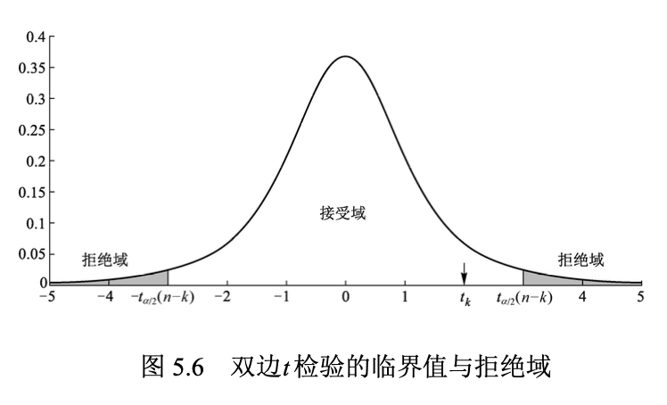
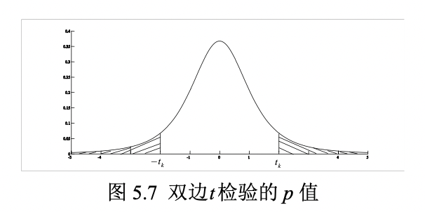
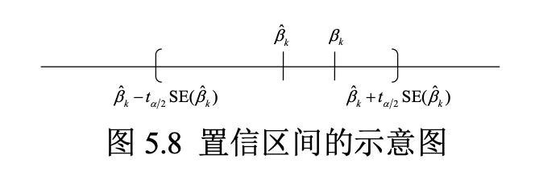
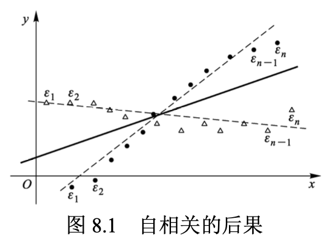
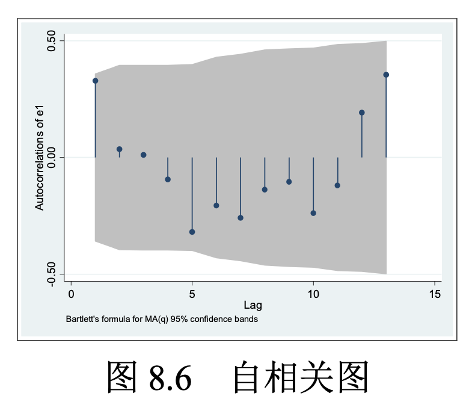

# 0. 前言

此文档为陈强《计量经济学与 Stata 应用》学习笔记，加 `*` 章节表示重要。

## 1. 导论

什么是计量经济学：

计量经济学是运用概率统计方法对经济变量之间的（因果）关系进行定量分析的科学。

经济数据的特点和类型

## 2. Stata 入门

（略）

## 3. 数学回顾

### 3.1 微积分

#### 3.1.1 导数

一阶导数：表示切线斜率

二阶导数：表示切线斜率的变化速度

#### 3.1.2 一元最优化

最小化问题：最小二乘法

最大化问题：极大似然估计

一元最大化问题的必要条件为：$f'(x) = 0$

最大化问题：$f''(x^*) \leq 0$

最小化问题：$f''(x^*) \geq 0$

#### 3.1.3 偏导数

对于多元函数 $y = f(x_1,x_2,x_3,..., x_n)$ ，在计算 $y$ 对 $x_1$ 的一阶偏导数时，将给定 $x_2,...,x_n$视为参数，则 $y=f(x_1, x_2, ...,x_n)$可以看成 $x_1$ 的一元函数 $y = f(x_1, \cdot)$ 。

#### 3.1.4 多元最优化

一阶条件要求再最优值 $x^*$ 处，所有偏导数均为 0 。

#### 3.1.5 积分

定积分的实质就是求和（无穷多项之和）。

### 3.2 线性代数

#### 3.2.1 矩阵

$A_{m \times n}$，$m$ 表示行，$n$ 表示列。

A中元素$a_{ij}$表示第 $i$ 行，第 $j$ 列元素。

零矩阵：所有元素都为 0 ，记为 $\bf{0}$ 。

#### 3.2.2 方阵

方阵：如果 $m=n $，则称 $A$ 为 $n$ 级方阵。

对称矩阵：如果满足$a_{ij} = a{ji}$，任意$(i,j=1,...,n)$，则称 $A$ 为对称矩阵。

对角矩阵：如果方阵 $A$ 的非主对角线元素全部为 0 。

单位矩阵：如果一个 $n$ 级对角矩阵的主对角线元素都为 1 。

#### 3.2.3 矩阵的转置

转置矩阵：将矩阵 $A=(a_{ij})_{mn}$ 的第 1 行变为第 1 列，第 2 行变为第 2 列，...... ，第 $m$ 行变为 $m$ 列，可得其转置矩阵，记为 $A^\prime$。

#### 3.2.4 向量

行向量：$m =1 $，则称矩阵 $A_{1 \times n}$ 为 n 维行向量；

列向量：如果 $n=1$，则矩阵 $A_{m \times 1}$ 为 m 维列向量。

向量是矩阵的特例。

考察 n 维列向量$a = (\begin{matrix} a_1 & a_2 &...&a_n\end{matrix})'$ 与 $b	 = (\begin{matrix} b_1 & b_2 &...&b_n\end{matrix})'$。

向量 $a$ 和 $b$ 的**内积**或**点乘**可定义为：

 $a'b \equiv (\begin{matrix} a_1 & a_2 &...&a_n\end{matrix})\begin{Bmatrix}b_1\\b_2\\...\\b_n\end{Bmatrix} \equiv a_1b_1 + a_2b_2+...+a_nb_n\equiv\sum_{i=1}^n a_ib_i$

如果$a'b=0$，则称向量 $a$ 和向量 $b$ **正交**，意味着两个向量在 n 维向量空间中相互垂直（夹角为 90 度）。


#### 3.2.5 矩阵的加法

如果两个矩阵的维度相同，则可相加。

对于$m\times n$ 级矩阵 $A = (a_{ij})_{m \times n}, B = (b_{ij})_{m \times n}$，矩阵 $A$与 $B$之和定义为两个矩阵相应元素之和，即：
$$
A + B = (a_{ij})_{m \times n} + (b_{ij})_{m \times n} = (a_{ij} + b_{ij})_{m \times n}
$$
矩阵加法满足以下规则：

- $A + 0 = A$（加上零矩阵不改变矩阵）
- $A+B=B+A$（加法交换律）
- $(A+B)+C = A+(B+C)$（加法结合律）
- $(A+B)' = A'+B'$（转置为线性运算）

#### 3.2.6 矩阵的数乘

矩阵 $A = (a_{ij})_{m \times n}$ 与实数 $k$ 的**数乘**定义为此实数与矩阵  $A = (a_{ij})_{m \times n}$ 每个元素的乘积：
$$
kA = k(a_{ij})_{m \times n} = (ka_{ij})_{m \times n}
$$

#### 3.2.7 矩阵的乘法

如果矩阵 $A$ 的**列数**与矩阵 $B$ 的**行数**相同，则可以定义**矩阵乘积** $A \times B$，简记为 $AB$ 。

假设矩阵 $A=(a_{ij})_{m \times n}$，矩阵$B=(b_{ij})_{n \times q}$，则矩阵乘积 $AB$ 的 $(i, j)$ 元素即为矩阵 $A$ 第 $i$ 行与矩阵 $B$ 的第 $j$ 列的内积：
$$
(AB)_{ij} \equiv (\begin{matrix}a_{i1} &a_{i2}&...&a_{in} \end{matrix})\begin{Bmatrix}b_{1j} \\b_{2j} \\ ... \\b_{nj}\end{Bmatrix} = \sum_{k=1}^n a_{ik}b_{kj}
$$
**矩阵乘法不满足交换律，即：$AB \neq BA$ 。**

在做矩阵乘法时，需区分**左乘**与**右乘**。$A$ 左乘 $B$为 $AB$，而 $A$ 右乘 $B$ 为 $BA$ 。

矩阵的乘法满足以下规则：

- $IA = A, IA = A$ （乘以单位矩阵不改变矩阵）
- $(AB)C=A(BC)$ （乘法结合律）
- $A(B+C)=AB+AC$ （乘法分配律）
- $(AB)'=B'A', (ABC)'=C'A'B'$ （转置与乘积的混合运算）

#### 3.2.8 线性方程组

考虑由 $n$ 个方程，$n$ 个未知数构成的线性方程组：
$$
\begin{cases}
a_{11}x_{1} + a_{12}x_2 + ... + a_{1n}x_{n} = b_1 \\
a_{21}x_{1} + a_{22}x_2 + ... + a_{2n}x_{n} = b_2  \\
 ... \\
a_{n1}x_{1} + a_{n2}x_2 + ... + a_{nn}x_{n} = b_n 
\end{cases}
$$
$(\begin{matrix} x_1 x_2 ... x_n \end{matrix})$ 为未知数。根据矩阵乘法定义，可将上式写为：
$$
\underbrace{
\begin{Bmatrix} 
a_{11} & a_{12} & ... & a_{1n} \\
a_{11} & a_{12} & ... & a_{1n} \\
\vdots & \vdots & \vdots & \vdots \\
a_{n1} & a_{n2} & ... & a_{nn}
\end{Bmatrix}
}_{A}
\underbrace{
\begin{Bmatrix}
x_1 \\
x_2 \\
\vdots \\
x_n
\end{Bmatrix}
}_{x}
=
\underbrace{
\begin{Bmatrix}
b_1 \\
b_2 \\
\vdots \\
b_n
\end{Bmatrix}
}_{b}
$$

记上式中的相应矩阵分别为$A, x$ 与 $b$ ，可得：
$$
Ax = b
$$

如将此方程左边的方阵 $A$ “除”到右边去，可得 $x$ 的解。为此引入**逆矩阵**的概念。

#### 3.2.9 逆矩阵

逆矩阵：对于 $n$ 级方阵 $A$ ，如果存在 $n$ 级方阵 $B$ ，使得 $AB=BA=I_n$，则称 $A$ 为可逆矩阵，或非退化矩阵，而 $B$ 为 $A$ 的逆矩阵，记为 $A^{-1}$ 。

逆矩阵的逆矩阵还是矩阵本身，即 $(A^{-1})^{-1} = A$ 。

方阵 $A$ 可逆的充分必要条件为其行列式 $|A| \neq 0$ 。

如果 $A$ 可逆，则其逆矩阵 $A^{-1}$ 是唯一的。

假设方程 $Ax=b$ 中的矩阵 $A$ 可逆，则在该方程两边**同时左乘其逆矩阵 $A^{-1}$** 可得：
$$
A^{-1}Ax = A^{-1}b \\
=> Ix = A^{-1}b  \\
=> x = A^{-1}b
$$
矩阵求逆满足以下规则：

- $(A^{-1})'=(A')^{-1}$ （求逆与转置可交换次序）
- $(AB)^{-1} = B^{-1}A^{-1}, (ABC)^{-1} = C^{-1}B^{-1}A^{-1}$ （求逆与成绩的混合运算）

#### 3.2.10 矩阵的秩

向量组 $\{a_1,a_2,...,a_K\}$ 的极大线性无关部分组所包含的向量个数称为该**向量的秩（Rank）**。

#### 3.2.11 二次型

### 3.3 概率与条件概率

#### 3.3.1 概率

概率为大量重复实验下，事件发生的频率趋向某个稳定值。

#### 3.3.2 条件概率

在 $B$ 发生的条件下，$A$ 发生的条件概率为：

$P(A|B) = \frac{P(AB)}{P(B)}$


#### 3.3.3 独立事件

如果条件概率等于无条件概率，$P(A|B)=P(A)$，即 $B$  是否发生不影响 $A$ 的发生，则称 $A, B$ 为相互独立的随机事件。

此时，$P(A|B) \equiv \frac{P(AB)}{P(B)} = P(A)$，故：
$$
P(AB) = P(A)P(B)
$$
也可将此式作为独立事件的定义。

#### 3.3.4 全概率公式

如果事件组 $\{B_1, B_2, ..., B_n\}(n \geq 2)$ 两两互不相容，但必有一件事发生，且每件事的发生概率均为正数，则对任何事件 $A$ （无论 $A$ 与$\{B_1, B_2, ..., B_n\}$ 是否有任何关系），都有：
$$
P(A) = \sum_{i=1}^n P(B_i)P(A|B_i)
$$
全概率公式把世界分成了 *n* 个可能的情形 $\{B_1, B_2, ..., B_n\}$ ，再把每种情况下的条件概率$P(A|B_i)$ “加权平均”而汇总成无条件概率（权重为每种情形发生的概率$P(B_i)$）。

### 3.4 分布与条件分布

离散型概率分布

连续型概率分布

多维随机向量的概率分布

条件分布

随机变量的数字特征

随机变量无关的三个层次概念

常用连续型统计分布

统计推断的思想

## 4. 一元线性回顾

### 4.1 一元线性回归模型

总体回归函数（PRF）与样本回归函数（SRF）

计量经济学的主要任务之一就是通过数据 $\{x_i,y_i\}_{i=1}^n$ 来获取关于总体参数 $(\alpha, \beta)$ 的信息。

### 4.2 OLS估计量的推导

**目标：残差平方和最小**
$$
\min_{\hat \alpha, \hat \beta} \sum_{i=1}^n e_{i}^2 = \sum_{i=1}^n (y_i-\hat \alpha -\hat \beta x_i)^2
$$
此最小化问题的一阶条件为：
$$
\begin{cases}
\frac{\delta}{\delta \hat \alpha} \sum_{i=1}^n e_i^2 = -2\sum_{i=1}^n (y_i - \hat \alpha - \hat \beta x_i) = 0 \\
\frac{\delta}{\delta \hat \beta} \sum_{i=1}^n e_i^2 = -2  \sum_{i=1}^n (y_i - \hat \alpha - \hat \beta x_i) x_i = 0
\end{cases}
$$
消去方程左边的 $-2$ ，可得：
$$
\begin{cases}
\sum_{i=1}^n (y_i - \hat \alpha - \hat \beta x_i) = 0 \\
\sum_{i=1}^n (y_i - \hat \alpha - \hat \beta x_i)x_i = 0
\end{cases}
$$
对上式各项分别求和，移项可得：
$$
\begin{cases}
n \hat \alpha + \hat \beta \sum_{i=1}^n x_i = \sum_{i=1}^n y_i \\
\hat \alpha\sum_{i=1}^n x_i + \hat \beta \sum_{i=1}^n x_i^2 = \sum_{i=1}^n x_iy_i
\end{cases}
$$
上式为“正规方程组”。记 $\bar y = \frac{1}{n}\sum_{i=1}^n y_i, \bar x = \frac{1}{n} \sum_{i=1}^n x_i$ ，则：
$$
\hat \alpha = \bar y - \hat \beta \bar x
$$
将上式带入可得：
$$
(\bar y - \hat \beta\bar x)\sum_{i=1}^n x_i + \hat \beta \sum_{i=1}^n x_i^2 = \sum_{i=1}^n x_iy_i
$$
合并同类项，移项可得：
$$
\hat \beta (\sum_{i=1}^n x_i^2 - \bar x \sum_{i=1}^n x_i) = \sum_{i=1}^n x_iy_i - \bar y \sum_{i=1}^n x_i
$$
使用关系式 $\sum_{i=1}^n x_i = n \bar x$ ，求解 $\hat \beta$ ：
$$
\hat \beta = \frac{\sum_{i=1}^n x_iy_i - n \bar{xy}}{\sum_{i=1}^n x_i^2-n \bar x^2}
$$
更直观的写为离差形式：
$$
\hat \beta = \frac{\sum_{i=1}^n(x_i-\bar x)(y_i-\bar y)}{\sum_{i=1}^n(x_i-\bar x )^2}
$$

最后，求得：
$$
\hat \alpha = \bar y - \hat \beta \bar x \\\hat \beta = \frac{\sum_{i=1}^n(x_i-\bar x)(y_i-\bar y)}{\sum_{i=1}^n(x_i-\bar x )^2}
$$

### 4.3 OLS 的正交性

正交：若内积空间中两向量的内积为 0 ，则称它们是正交的。

OLS **残差与解释变量及拟合值的正交性**是 OLS 的重要特征，为推导证明提供了方便。

### 4.4 平方和分解公式

平方和分解公式能够成立，正是由于 OLS 的正交性。

$$
\underbrace{\sum_{i=1}^n (y_i-\bar y)^2}_{TSS}= \underbrace{\sum_{i=1}^n(\hat y_i-\bar y)^2}_{ESS}+ \underbrace{\sum_{i=1}^n e_{i}^2}_{RSS}
$$

---

【证明】平方和分解公式

将离差 $(y_i - \bar y)$ 写为 $(y_i - \hat y_i + \hat y_i - \bar y)$ ，则可将 TSS 写为：
$$
\sum_{i=1}^n (y_i - \bar y)^2 = \sum_{i=1}^n (y_i - \hat y_i + \hat y_i - \bar y)^2 = \sum_{i=1}^n (e_i + \hat y_i - \bar y)^2 \\
= \sum_{i=1}^n e_i^2 + \sum_{i=1}^n(\hat y_i - \bar y)^2 + 2 \sum_{i=1}^ne_i(\hat y_i - \bar y)
$$
只需证明交叉项 $\sum_{i=1}^ne_i(\hat y_i - \bar y)=0$ 即可，而这由 OLS 的正交性所保证：
$$
\sum_{i=1}^n e_i(\hat y_i-\bar y) = \sum_{i=1}^n e_i \hat y_i - \sum_{i=1}^ne_i = 0 - 0 = 0
$$
如果没有常数项，则无法保证 $\sum_{i=1}^n e_i = 0$ ，故平方和分解公式不成立。

---

### 4.5 拟合优度

$$
0 \leq R^2 \equiv \frac{\sum_{i=1}^n(\hat y_i - \bar y)^2}{\sum_{i=1}^n (y_i-\bar y)^2} = 1 - \frac{\sum_{i=1}^ne_{i}^2}{\sum_{i=1}^n (y_i-\bar y)^2} \leq 1
$$

在有常数项的情况下，拟合优度等于被解释变量 $y_i$ 与拟合值 $\hat y_i$ 之间相关系数的平方，即 $R^2 = [Corr(y_i,\hat y_i)]^2$ ，故记为 $R^2$ 。


### 4.6 无常数项的回归

### 4.7 一元回归的 Stata 实例

```Stata
use grilic.dta, clear
reg lnw s
reg lnw s, noc // 无常数项回归
```

### 4.8 PRF与SRF: 蒙特卡洛法

```Stata
clear
set obs 30
set seed 10101

gen x = rnormal(3, 4)
gen e = rnormal(0, 9)
gen y = 1*x + e
reg y x

tw function PRF = 1+2*x, range(-5 15) || \\\
scatter y x || lfit y x, lp(dash)
```

## 5. 多元线性回归

### 5.1 二元线性回归

使用一元线性回归会存在遗漏变量的问题，所以需要纳入更多的解释变量。先来看二元线性回归：
$$
y_i = \alpha + \beta x_{i1} + \gamma x_{i2} + \epsilon_{i} \quad (i = 1,...,n)
$$
$x_{i1}$ 与 $x_{i2}$ 为解释变量，$\alpha$ 为截距项；

$\beta$ 为在给定 $x_2$ 条件下，$x_1$ 对 $y$ 的边际效应（忽略扰动项 $\epsilon_i$）。

$\gamma$ 为在给定 $x_1$ 条件下，$x_2$ 对 $y$ 的边际效应。


最优化问题：残差平方和最小
$$
\min_{\hat \alpha, \hat \beta, \hat \gamma} \sum_{i=1}^n e_{i}^2 = \sum_{i=1}^n (y_i -\hat \alpha-\hat \beta x_{i1} -\hat \gamma x_{i2})^2
$$
寻找一个回归平面 $\hat y_{i} = \hat \alpha + \hat \beta x_{1i} + \hat \gamma x_{2i}$ ，即估计参数 $\hat \alpha, \hat \beta, \hat \gamma$ ，使得所有样本点 $\{(x_{i1},x_{2i},y_i)\}_{i=1}^n$ 离此回归平面最近。

求解：分别对 $\hat \alpha, \hat \beta, \hat \gamma$ 求偏导数，可得最小化的一阶条件，求解可得 $\hat \alpha, \hat \beta, \hat \gamma$ 的 OLS 估计量。

### 5.2 多元线性回归

基本形式：
$$
y_i = \beta_1 + \beta_2 x_{i2} + ... +\beta_Kx_{iK} + \epsilon_{i} \quad (i=1,...,n)
$$

$x_{i1}$ 为个体 $i$ 的第 1 个解释变量，$x_{i2}$ 为个体 $i$ 的第 2 个解释变量，以此类推。上式中，令 $x_{i1} \equiv 1$ （恒等于 1 ），代表常数项。 

**采用矩阵形式**，可将原模型写成：
$$
y_i = (\begin{matrix} 1 & x_{i2} & ... & x_{ik} \end{matrix}) \begin{Bmatrix} \beta_1 \\ \beta_2 \\ ... \\ \beta_K \end{Bmatrix} + \epsilon_i = \mathbf{x_{i}^\mathrm{'}} \mathbf{\beta} + \epsilon_i
$$

将所有这 $n$ 个方程叠放：
$$
\begin{Bmatrix}
y_1 = x_1'\beta+\epsilon_1 \\
y_2 = x_2'\beta+\epsilon_2 \\
\vdots
y_n = x_n'\beta+\epsilon_n
\end{Bmatrix}
$$
将共同的参数向量 $\mathbf{\beta}$ 向右边提出：
$$
\mathbf{y} = 
\begin{Bmatrix}
y_1 \\ y_2 \\ \vdots \\y_n
\end{Bmatrix}=
\underbrace{
\begin{Bmatrix}
x_1' \\ x_2' \\ \vdots \\x_n'
\end{Bmatrix}
}_{X}\beta+
\underbrace{
\begin{Bmatrix}
\epsilon_1 \\ \epsilon_2 \\ \vdots \\\epsilon_n
\end{Bmatrix}
}_{\epsilon}
=\mathbf{X \beta + \epsilon}
$$
其中，$y=(\begin{matrix} y_1 & y_2 & \cdots & y_n \end{matrix})'$ 为**被解释变量**构成的列向量；

$\epsilon=(\begin{matrix} \epsilon_1 & \epsilon_2 & \cdots & \epsilon_n \end{matrix})'$ 为**所有扰动项**构成的列向量；

$\mathbf{X}$ 为 $n \times K$ 数据矩阵。其第 $i$ 行包含全体 $i$ 的全部解释变量，而第 $k$ 列包含第 $k$ 个解释变量的全部观测值，即
$$
X = 
\begin{Bmatrix} 
1 & x_{12} & \cdots & x_{1K} \\
1 & x_{22} & \cdots & x_{2K} \\
\cdots & \cdots & \cdots & \cdots \\
1 & x_{n2} & \cdots & x_{nK}
\end{Bmatrix}_{n \times K}
$$

### * 5.3 OLS 估计量的推导

$$
\mathbf{\hat \beta = (X^\mathrm{'}X)^{-1}X^\mathrm{'}y}
$$

### 5.4 OLS 的几何解释


拟合值 $\mathbf{\hat y}$ 可视为被解释变量 $\mathbf{y}$ 向解释变量超平面 $\mathbf{X}$ 的投影 (projection)。**由于拟合值为解释变量的线性组合，即 $\mathbf{\hat y  = X \hat β}$ ，故拟合值向量  $\mathbf{\hat y}$ 正好在超平面 $\mathbf{X}$  上**。根据 OLS 的正交性，残差向量 $\mathbf{e}$ 与 $\mathbf{\hat y}$ 正交 。
### 5.5 拟合优度

#### 5.5.1 拟合优度

由于OLS的正交性，平方和分解公式依然成立：
$$
\underbrace{
\sum_{i=1}^n (y_i-\bar y)^2
}_{TSS}
= 
\underbrace{
\sum_{i=1}^n(\hat y_i-\bar y)^2
}_{ESS}
+ 
\underbrace{
\sum_{i=1}^n e_{i}^2
}_{RSS}
$$
**拟合优度的缺点是：如果增加解释变量的数目，则 $R^2$ 只增不减，因为至少可让新增解释变量的系数为 0 而保持 $R^2$ 不变**。

另一方面，通过最优地选择新增解释变量的系数（以及已有解释变量的系数），通常可以提高 $R^2$ 。

#### 5.5.2 调整拟合优度

引入调整 $R^2$ 对解释变量过多（模型不够简洁）进行惩罚。

定义调整 $\bar R^2$ 为：
$$
\bar R^2 = 1 - \frac{\sum_{i=1}^n e_{i}^2/(n-K)}{\sum_{i=1}^n(y_i-\bar y)^2/(n-1)}
$$

$\sum_{i=1}^n e_{i}^2$ 的自由度（degree of freedom）为$(n-K)$；$\sum_{i=1}^n(y_i-\bar y)^2$ 的自由度为 $(n-1)$ 。

---

【问题】为何 $\sum_{i=1}^n e_{i}^2$ 的自由度（degree of freedom）为$(n-K)$ ?

虽然  $\sum_{i=1}^n e_{i}^2$ 由 $n$ 个随机变量 $\{e_1,...,e_n\}$ 所构成，但 $\{e_1,...,e_n\}$ 受由 $K$ 个方程组成的正规方程组的约束，故只有其中 $(n-K)$ 个残差是（自由）独立的。

【问题】为何 $\sum_{i=1}^n(y_i-\bar y)^2$ 的自由度为 $(n-1)$  ?

虽然 $\sum_{i=1}^n(y_i-\bar y)^2$ 由 $n$ 个离差 $\{(y_1 - \bar y), ..., (y_n - \bar y)\}$ 所构成，但这些离差和必然为 0 ，即 $\sum_{i=1}^n (y_i - \bar y) =0$，故只有其中 $(n-1)$ 个离差是（自由）独立的。 

---

如果让 $K$ 增多，有两个相反方向的变动。

**$\bar R^2$ 的缺点是可能为负。**

**$R^2$ 和 $\bar R^2$ 只能反映拟合优度的好坏，评估回归方程是否显著应该使用 F 检验。**

如果回归模型无常数项，则仍需使用“非中心$R^2$（uncentered $R^2$）：
$$
R_{uc}^2 \equiv \frac{\sum_{i=1}^n \hat y_{i}^2}{\sum_{i=1}^n y_{i}^2}
$$

### 5.6 古典线性回归模型的假定

**SLR.1 线性（linearity）假定**

每个解释变量对 $y_i$ 的**边际效应**为常数。如 $\frac{\delta y_i}{\delta x_{i2}}=\beta_2$ （忽略扰动项 $\epsilon_i$）。

在现实中，如果边际效应可变，可以加入平方项（如 $x_{i2}^2$）或交叉项（$x_{i2}x_{i3}$）。

（平方项）考虑回归方程：
$$
\ln{w_i} = \beta_1 + \beta_2s_i+\beta_3s_{i}^2+\epsilon_i
$$

$\ln{w_i}$ 为工资对数，$s_i$ 为教育年限。教育年限对工资对数的边际效应为：
$$
\frac{\delta \ln{w_i}}{\delta s_i} = \beta_2 + 2 \beta_3s_i
$$
如果 $\beta_3 < 0 $，则存在教育投资回报率递减；反之，则存在教育投资回报率递增。

（交叉项）考虑生产函数方程：

$$
y_i = \beta_1 + \beta_2k_i + \beta_3 l_i + \beta_4 k_i \times l_i + \epsilon_i
$$

$y$ 为产出，$k$ 为资本，$l$为劳动力， $k \times l$ 为资本与劳动力的互动项。劳动的边际产出为$\frac{\delta y_i}{\delta l_i} = \beta_3 + \beta_4k_i$ （忽略扰动项）。
如果 $\beta_4 > 0$ 则说明资本与劳动力是互补的，即随着资本上升，劳动力的边际产出也增加。

**线性假定的本质要求是，回归函数是参数（$\beta_1, ...,\beta_k$）的线性函数。**

**SLR.2 严格外生性（strict exogeneity）要求**
$$
E(\epsilon_i | X) = E(\epsilon_i | x_1, \cdots, x_n) = 0 \quad (i = 1, \cdots, n)
$$
严格外生性意味着在给定数据矩阵 $\mathbf{X}$ 的情况下，扰动项 $\epsilon_{i}$ 的条件期望为 0 。

---

【定义】如果随机变量 $x, y$ 满足 $E(xy) = 0$，则称 $x,y$ 正交（orthogonal）。

根据此定义，可证明解释变量与扰动项正交。因为：
$$
0 = Cov(x_{jk}, \epsilon_i) = E(x_{jk}\epsilon_i) - E(x_{jk})\underbrace{E(\epsilon_i)}_{=0} = E(x_{jk}\epsilon_i)
$$

---

**SLR.3 不存在严格多重共线性（strict multicollinearity）**

即数据矩阵 $X$ 满列秩（full column rank）。数据矩阵的各列向量为线性无关，即不存在某个解释变量为另一解释变量的倍数，或可由解释变量线性表现的情形。

### 5.7 OLS 的小样本性质

在满足 SLR.1~SLR.3 的条件下， OLS 估计量具有以下良好性质：

- 线性性：OLS 估计量 $\mathbf{\hat \beta}$为线性估计量；
- 无偏性：$E(\hat \beta | X) = \beta$，即 $\hat \beta$ 不会系统地高估或低估 $\beta$；
- 估计量 $\hat \beta$ 的协方差矩阵

---

【证明】无偏性

抽样误差为：

$\hat \beta - \beta = (X'X)^{-1}X'y - \beta = (X'X)^{-1}X'(X\beta+\epsilon)-\beta=(X'X)^{-1}X'\epsilon \equiv A \epsilon$

记 $A \equiv (X'X)^{-1}X'$ 。给定解释变量 $X$ ，对上式两边求条件期望，根据严格外生性可得：
$$
E(\hat \beta -\beta | X) = E(A\epsilon|X) = A \underbrace{E(\epsilon|X)}_{=0} = 0
$$
移项可得：$E(\hat \beta |X) = \beta$ 。

在此证明中，严格外生性不可或缺。

使用迭代期望定律，可进一步证明，无条件期望 $E(\hat \beta) = \beta$ ，因为：
$$
E(\hat \beta) = E_{X}E(\hat \beta|X) = E_{X}(\beta) = \beta
$$
---

SLR.4 球型扰动项（spherical disturbance）假定

球型扰动项（spherical disturbance）满足同方差、无自相关性质，扰动项 $\epsilon$ 的协方差矩阵可写为：
$$
Var(\epsilon|X) = \sigma^2I_{n} = 
\begin{Bmatrix} 
\sigma^2 & 0 & \cdots & 0 \\
0 & \sigma^2 & \cdots & 0 \\
\vdots & \vdots & \ddots & \vdots \\
0 & 0 & \cdots & \sigma^2
\end{Bmatrix}
$$
协方差矩阵 $Var(\epsilon |X)$ 的主对角线元素都等于 $\sigma^2$ ，即满足条件同方差（同方差），若不满足则存在异方差。

协方差矩阵 $Var(\epsilon |X)$ 的非主对角线元素都等于 0 ，故不同个体的扰动项之间无自相关，反之则存在自相关。

球型扰动项假定是证明协方差表达式 $\sigma^2(X'X)^{-1}$ 的关键（无偏性不依赖于球型扰动项）。

**高斯-马尔克夫定理：在 SLR.1~SLR.4 之下，最小二乘法是最佳无偏估计量（Best Linear Unbiased Estimator, 简记BLUE），即在所有线性的无偏估计中，最小二乘法的方差最小。**

### 5.8 对单个系数 t 检验

SLR.5 在给定 $X$ 的情况下，$\epsilon|X$ 的条件分布为正态，即 $\epsilon|X \sim N(0, \sigma^2I_n)$ 。

**假设检验是一种概率意义上的反证法。**首先假设原假设成立，然后看在原假设成立的前提下，是否导致不太可能发生“小概率事件”在一次抽样的样本中出现。

---

【定理】t 统计量的分布

在 SLR.1~SLR.5 均满足，且原假设 $H_0:\beta_k =c$ 也成立的情况下，t 统计量服从自由度为 $(n-K)$ 的 t 分布：
$$
t_k \equiv \frac{\hat \beta_k-c}{SE(\hat \beta_k)} \sim t(n-K)
$$
$SE(\hat \beta_k) \equiv \sqrt{s^2(X'X)_{kk}^{-1}}$ 为 $\hat \beta_k$ 的标准误。

更一般地，t 统计量的通用公式为：
$$
t = \frac{估计量-假想值}{估计量的标准误}
$$

---

#### 5.8.1 t 检验的步骤

**第一步：**计算 t 统计量 $t_k = \frac{\hat \beta_k-c}{SE(\hat \beta_k)} \sim t(n-K)$，记其具体取值为 $t_k$ 。
**第二步：**计算显著性水平为 $\alpha$ 的临界值 $t_{\alpha/2}(n-K)$ ，其中 $t_{\alpha/2}(n-K)$ 的定义为：
$$
P\{T > t_{\alpha/2}(n-K) \} = P\{T < t_{\alpha/2}(n-K)\} = \alpha/2
$$

其中，随机变量 $T \sim t(n-K)$ 。

随机变量 $T$ 大于 $t_{\alpha/2}(n-K)$ ，或小于 $-t_{\alpha/2}(n-K)$ 的概率都是 $\alpha/2$，如下图：



通常取 $\alpha=5\%$，则 $\alpha/2 = 2.5\%$，有时也使用 $\alpha = 1\%$ 或  $\alpha = 10\%$ 。

**第三步：**如果 $|t_k| \geq t_{\alpha/2}(n-K)$ ，则 $t_k$ 落入“拒绝域”，故拒绝 $H_0$ 。反之，如果 $|t_k| < t_{\alpha/2}(n-K)$，则 $t_k$ 落入接受域，故接受 $H_0$ 。 

#### 5.8.2 计算 p 值

【定义】**称原假设可被拒绝的最小显著性水平为此假设检验问题的 p 值。**p 值越小，则越倾向于拒绝原假设。如选定显著性水平为 5% ，只要 p 值比 0.05 小，即可拒绝原假设。

在双边 $t$ 检验中，给定 $t$ 统计量的样本观测值 $t_k$ ，此假设检验问题的 p 值为：
$$
p值 \equiv P(|T|>|t_k|)
$$
其中，随机变量 $T \sim t(n-K)$ 。

给定 t 统计量 $t_k$ ，则 p 值衡量比 $|t_k|$ 更大的 t 分布两端的尾部概率，如下图：



如果 p 值为 0.05 ，则正好可以在 5% 的显著性水平上拒绝原假设，但无法在 4.9% 的显著性水平上拒绝原假设。

#### 5.8.3 计算置信区间

置信区间：参数最可能的取值范围。

假设置信区间为 $(1-\alpha)$ （比如 $\alpha = 5\%$，则 $1-\alpha=95\%$），即要找到置信区间，使得该区间覆盖真实参数 $\beta_k$ 的概率为 $(1-\alpha)$ 。

由于 $t_k = \frac{\hat \beta_k - \beta_k}{SE(\hat \beta_k)} \sim t(n-K)$ ，故 t 统计量落入接受域的概率为 $(1-\alpha)$ ：
$$
P \{-t_{\alpha/2} < \frac{\hat \beta_k - \beta_k}{SE(\hat \beta_k)} < t_{\alpha/2}\} = 1 - \alpha
$$
其中，$t_{\alpha/2}$ 为显著性水平为 $\alpha$ 的临界值。将不等式变形可得：
$$
[\hat \beta_k - t_{\alpha/2}SE(\hat \beta_k),\hat \beta_k + t_{\alpha/2}SE(\hat \beta_k) ]
$$
此置信区间以点估计 $\hat \beta_k$ 为中心，区间半径为 $t_{\alpha/2}SE(\hat \beta_k)$ 。



标准误 $SE(\hat \beta_k)$ 越大，对 $\beta_k$ 的估计越不准确，置信区间也越宽。

置信区间是随机区间，随着样本不用而不同。**如果置信区间为 95% ，抽样 100 次，得到 100 个置信区间，大约 95 个置信区间能覆盖到真实参数 $\beta_k$ 。**

#### 5.8.4 单边检验

#### 5.8.5 第 I 类错误与第 II 类错误

第 I 类错误：虽然原假设为真，但却根据观测数据做出了拒绝原假设的错误判断，即为“弃真”。

第 II 类错误：虽然原假设为假，但却根据观测数据做出了接受原假设的错误判断，即为“存伪”。

### 5.9 对线性假设的 F 检验

### 5.10  F 统计量的似然比原理表达式

### 5.11 预测

### 5.12 用 Stata 进行多元回归的实例

#### 5.12.1 用Stata进行二元回归

```Stata
* 柯布道格拉斯生产函数
use cobb_douglas.dta, clear
list

regress lny lnk lnl
predict lny1
predict e, res

list lny lny1 e
line lny lny1 year, lp(solid dash)
```

#### 5.12.2 多元回归的 Stata 实例

```Stata
* 多元回归
use ${d}/grilic.dta, clear
reg lnw s expr tenure smsa rns

vce // 回归系数的协方差矩阵
reg lnw s expr tenure smsa rns, noc //无常数项回归
reg lnw s expr tenure smsa if rns // only rns == 1
reg lnw s expr tenure smsa if ～rns // only rns == 0
reg lnw s expr tenure smsa rns if s>=12 // only 中学以上
reg lnw s expr tenure smsa if s>=12 & rns // 中学以上且住在南方

quietly reg lnw s expr tenure smsa rns
predict lnw1 // 拟合值
predict e, residual //残差
```

#### 5.12.3 假设检验

```Stata
* t 检验
test s = 0.1 // H_0: \beta_2 = 0.1
/*
 ( 1)  s = .1
       F(  1,   752) =    0.20
            Prob > F =    0.6515
解读：由于 t 分布的平方为 F 分布，故 Stata 统一汇报 F 统计量及其 p 值。 
上表显示，p 值 = 0.6515 ，故无法拒绝原假设。
*/

*手工计算 t 统计量
/*
t = \frac{估计值 - 假想值}{估计值的标准误} = \frac{0.102643 - 0.1}{0.0058488} = 0.45188757 \sim t(n-K) = t
*/

dis (0.102643 - 0.1)/0.0058488 // 0.45188757
ttable 752 // ttable [df]

/*
       Critical Values of Student's t
       .10     .05     .025    .01     .005    .0005  1-tail
 df    .20     .10     .050    .02     .010    .0010  2-tail
752   1.283   1.647   1.963   2.331   2.582    3.304

解读：在 5% 的显著性水平下，0.45188757 < 1.963 ，落入接受域，接受原假设。
*/

* 由于默认为双边检验，故可计算此 t 统计量对应的 p 值如下:

dis ttail(752,0.45188757)*2 // 0.65148029

/*
表示自由度为 752 的 t 分布比 0.45188757 更大的右侧尾部概率，正好是反向累积分布函数。
*/

* 单边检验

dis ttail(752, 0.45188757) // .32574014
/*
如果已知双边检验的p值，在做单边检验时(假设t统计量的符号 与替代假设的方向相同)，一般只需将双边检验的p值除以 2，即 可得到单边检验的 p 值，然后得到单边检验的结果。
*/

test expr = tenure // H_0: \beta_3 = \beta_4
/*
由于p值 = 0.8208，可轻松接受原假设。
*/

test expr + tenure = s // H_0: \beta_3 + \beta_4 = \beta_2
/*
由于 p 值 = 0.0031，故可在 1%的显著性水平上拒绝原假设，即认为\beta_3 + \beta_4 \neq \beta_2。
*/
```

## 6. 大样本 OLS

## 7. 异方差

### 7.1 异方差的后果

**“条件异方差”（**简称“异方差”）是违背球型扰动假设的一种情形，即条件方差 $Var(\epsilon_i|X)$ 依赖于 $i$ ，而不是常数 $\sigma^2$ 。

在异方差的情况下：

- OLS 估计量依然无偏、一致且渐进正态。因为在证明这些性质时，未用到“同方差”的假定；
- OLS 估计量方差 $Var(\hat \beta|X)$ 的表达式不再是 $\sigma^2(X'X)^{-1}$ ，因为 $Var(\epsilon|X) \neq \sigma^2I$ 。使用普通标准误的 t 检验、F 检验失效。
- 高斯-马尔可夫定理不再成立，OLS 不再是 BLUE 。

【举例】考虑一元回归 $y_i = \alpha + \beta x_i + \epsilon$，假设 $Var(\epsilon_i | X)$ 是解释变量 $x_i$ 的增函数，即 $x_i$ 越大则 $Var(\epsilon_i|X)$ 越大。


OLS 回归线在 $x_i$ 较小时可以较精确地估计，而在 $x_i$ 较大时则难以准确估计。方差较大的数据包含的信息量较小，但 OLS 却对所有数据等量齐观进行处理，故异方差的存在使得 OLS 的效率降低。

在异方差的情况下，加权最小二乘法（Weigthed Least Square，WLS）才是 BLUE 。WLS 通过对不同数据所包含信息量的不同进行相应的处理以提高估计效率。比如，给予信息量大的数据更大的权重。

### 7.2 异方差的例子

（1）考虑消费函数：
$$
c_i = \alpha + \beta y_i + \epsilon_i
$$


其中，$c_i$ 为消费， $y_i$ 为收入。富人的消费计划较有弹性，而穷人的消费多为必需品，很少变动。富人的消费支出更难测量，包含较多测量误差。$Var(\epsilon_i|y_i)$ 可能随 $y_i$ 的上升而变大。

（2）企业的投资、销售收入与利润：大型企业的商业活动可能动辄以亿元计，而小型企业则以万元计；因此，扰动项的规模也不相同。如将大、中、小型企业放在一起回归，可能存在异方差。

（3） 组间异方差：如果样本包含两组(类)数据，则可能存在组内同方差，但组间异方差的情形。比如，第一组为自我雇佣者（企业主、个体户）的收入，而第二组为打工族的收入；自我雇佣者的收入波动可能比打工族更大。

（4） 组平均数：如果数据本身就是组平均数，则大组平均数的方差通常要比小组平均数的方差小。比如，考虑全国各省的人均  GDP ，每个省一个数据。人口较多 的省份其方差较小，方差与人口数成反比。

### 7.3 异方差的检验

#### 7.3.1 画残差图

观察**“残差 $e_i$ 与拟合值 $\hat y_i$ 的散点图”**或者**“残差 $e_i$ 与某个解释变量 $x_{ik}$ 的散点图”**。

#### 7.3.2 BP 检验（Breusch and pagan, 1979）

假设回归模型：
$$
y_i = \beta_1 + \beta_2x_{i2} + \cdots + \beta_Kx_{ik}+\epsilon_i
$$
记 $x_i = \begin{matrix}(1 & x_{i2} & \cdots x_{iK}）\end{matrix}$ 。

假设样本数据为 iid，则 $Var(\epsilon_i |X)= Var(\epsilon_i|x_i)$ 。

“条件同方差”的原假设为：
$$
H_0: Var(\epsilon_i|x_i) = \sigma^2
$$
由于 $Var(\epsilon_i|x_i) = E(\epsilon_{i}^2|x_i)-[\underbrace{E(\epsilon_i^2|x_i)^2}_{=0}]=E(\epsilon_i^2|x_i)$ ，原假设可写为：
$$
H_0: E(\epsilon_i^2|x_i) = \sigma_i^2
$$
如果 $H_0$ 不成立，则条件方差 $E(\epsilon_i^2|x_i)$ 是 $x_i$ 的函数，称为“条件方差函数”。

假设此条件方差函数为线性函数：
$$
\epsilon_i^2 = \delta_1+\delta_2x_{i2}+\cdots+\delta_Kx_{iK} + u_i
$$
故原假设可以简化为：
$$
H_0: \delta_2 = \cdots=\delta_K=0
$$
由于扰动项 $\epsilon_i$ 不可观测，故使用残差平方和 $e_i^2$ 替代，进行辅助回归：
$$
e_i^2 = \delta_1 + \delta_2x_{i2} + \cdots+\delta_Kx_{iK} + error_{i}
$$
记此辅助回归的拟合优度为 $R^2$ 。$R^2$ 越高，则辅助回归方程越显著，越可拒绝 $H_0: \delta_2 = \cdots=\delta_K=0$ 。

Breusch and pagan(1979) 使用 LM 统计量，进行 LM 检验：
$$
LM = n R^2 \stackrel{d}{\rightarrow} \chi^2(K-1)
$$
如果 LM 大于 $\chi^2(K-1)$ 的临界值，则拒绝同方差的原假设。

如果认为异方差主要依赖被解释变量拟合值 $\hat y_i$ ，可将辅助回归改为：
$$
e_i^2 = \delta_1 +\delta_2 \hat y_i + error_i
$$
然后检验 $H_0: \delta_2 = 0$ （可使用 F 或 LM 统计量）。

**Breusch and pagan(1979) 的最初检验假设扰动项 $\epsilon_i$ 服从正态分布，有一定的局限性。**

#### 7.3.3 怀特检验（White, 1980）

BP 检验假设**条件方差函数为线性函数**，可能忽略了高次项。

怀特检验(White, 1980)在 BP 检验的辅助回归中加入所有的 二次项（含平方项与交叉项）。

考虑以下二元回归：
$$
y_i = \beta_1 + \beta_2 x_{i2} + \beta_3 x_{i3} + \epsilon_i
$$
除常数项外，只有 $x_{i2}$ 和 $x_{i3}$ 两个解释变量，故二次项包括 $x_{i2}^2$ ，$x_{i3}^2$ 与 $x_{i2}x_{i3}$ 。

怀特检验的辅助回归为：
$$
e_i^2 = \delta_1 + \delta_2x_{i2} + \delta_3 x_{i3} + \delta_4 x_{i2}^2 + \delta_5x_{i3}^2 + \delta_6x_{i2}x_{i3} + error_{i}
$$
其中，$e_i^2$ 为二元回归方程的残差平方。

对原假设 $H_0: \delta_2 = \cdots=\delta_6=0$ 进行 F 检验或 LM 检验。

怀特检验可以检验任何形式的异方差；因为根据泰勒展开式，二次函数可很好地逼近任何光滑函数。

如果解释变量较多，则解释变量的二次项（含交叉项）将更多，在辅助回归中将损失较多样本容量。

### 7.4 异方差的处理

#### 7.4.1 使用“ OLS + 稳健标准误”

如发现异方差，一种处理方法是，仍进行 OLS 回归（OLS 依然无偏、一致且渐近正态），但使用在异方差情况下也成立的稳健标准误。这是最简单，也是目前通用的方法。

只要样本容量较大，即使在异方差的情况下，只要使用稳健标准误，则所有参数估计、假设检验均可照常进行。

#### 7.4.2 加权最小二乘法（WLS）

方差较小的观测值包含的信息量较大。对于异方差的另一处理方法是，给予方差较小的观测值较大的权重，然后进行加权最小 二乘法估计。

WLS 的基本思想是：通过变量转换，使得变换后的模型满足球形扰动项的假定(变为同方差)，然后进行 OLS 估计，即为最有效率的 BLUE。

考虑线性回归模型：
$$
y_i = \beta_1 + \beta_2x_{i2} + \cdots+\beta_k x_{ik} + \epsilon_i
$$
假定 $Var(\epsilon_i|x_i) \equiv \sigma_i^2 = \sigma_i^2v_i$ ，且 $\{v_i\}_{i}^n$ 已知。

两边同乘权重 $1/\sqrt{v_i}$ 可得：
$$
\frac{y_i}{\sqrt{v_i}} = \beta_1\frac{1}{\sqrt{v_i}} + \beta_2\frac{x_{i2}}{\sqrt{v_i}} + \cdots+\beta_k \frac{x_{ik}}{\sqrt{v_i}} + \frac{\epsilon_i}{\sqrt{v_i}}
$$

新扰动项 $\epsilon_i/\sqrt{v_i}$ 不再有异方差，因为：
$$
Var(\epsilon_i/\sqrt{v_i}) = \frac{1}{v_i}Var(\epsilon_i) = \frac{\sigma^2v_i}{v_i} = \sigma^2
$$
对乘以权数后的方程进行 OLS 回归，即为 WLS 。

加权之后的回归方程满足球形扰动项的假定，即是 BLUE 。

可将 WLS 定义为最小化“加权残差平方和”，即：
$$
\min \quad \sum_{i=1}^n (e_i/\sqrt{v_i})^2 = \sum_{i=1}^n \frac{e_i^2}{v_i} 
$$
权重为 $1/v_i$ （即方差的倒数）（Stata也是如此约定）。

WLS 的 $R^2$ 通常没有太大的意义，它衡量的是变换之后的解释变量 $(x_{ik}/\sqrt{v_i})$  对变换之后的被解释变量 $(y_i/\sqrt{v_i})$ 的解释力。

#### 7.4.3 可行加权最小二乘法（FWLS）

使用 WLS 虽然可以得到 BLUE 估计，但是必须知道每位个体的方差，即 $\{\sigma_i^2\}_{i=1}^n$ 。实践中通常不知道 $\{\sigma_i^2\}_{i=1}^n$ ，故 WLS 事实上是不可行（infeasible）的。

解决办法：先用样本数据估计 $\{\sigma_i^2\}_{i=1}^n$ ，然后再使用 WLS ，称为 “可行加权最小二乘法” （Feasible WLS，简称 FWLS ）。

在进行 BP 检验时，进行如下辅助回归：
$$
e_i^2 = \delta_1 + \delta_2x_{i2} + \cdots + \delta_kx_{iK} + error_i
$$
其中，$e_i^2$ 为原方程的残差平方。

通过辅助回归的拟合值，可得 $\sigma_i^2$ 的估计值：
$$
\sigma_i^2 = \hat \delta_1 + \hat \delta_2 x_{i2} + \cdots + \hat \delta_K x_{iK}
$$
但可能出现 $\hat \delta_i^2 < 0$ 的情形，而方差不能为负。

为保证 $\hat \delta_i^2 > 0$，假设条件方差函数为对数形式：
$$
\ln{e_i^2} = \delta_1 + \delta_2x_{i2} + \cdots + \delta_kx_{iK} + error_i
$$
对此方程进行 OLS 回归，可得 $\ln{e_i^2}$ 的预测值，记为 $\ln{\hat \sigma_i^2}$ 。

得到拟合值 $\hat \sigma_i^2 = exp(\ln{\hat \sigma_i^2})$ （一定为正）。

以 $1/\hat \sigma_i^2$ 为权重对原方程进行 WLS 估计，记此估计量为 $\hat \beta_{FWLS}$ 。

#### 7.4.4 究竟使用“ OLS + 稳健标准误”还是 FWLS ？

理论上，WLS 是 BLUE 。

实践中的 FWLS 并非线性估计，因为权重 $1/\hat \sigma_i^2$ 也是 $y$ 的函数。

由于$\hat \beta_{FWLS}$ 是 $y$ 的非线性函数，一般有偏。$\hat \beta_{FWLS}$ 无资格参加 BLUE 的评选。

FWLS 的优点主要体现在大样本中。如果 $\hat \sigma_i^2$ 是 $\sigma_i^2$ 的一致估计，则 FWLS 一致，且在大样本下比 OLS 更有效率。

FWLS的缺点是必须估计条件方差函数$\hat \sigma_i^2(x_i)$，而通常不知道条件方差函数的具体形式。如果该函数的形式设定不正确，根据 FWLS 计算的标准误可能失效，导致不正确的统计推断。

使用“OLS + 稳健标准误”的好处是，对回归系数及标准误的估计都一致，不需要知道条件方差函数的形式。而且在 Stata 中的操作简单，在 `reg` 之后添加 `robust` 选项即可。

**“OLS + 稳健标准误”更为稳健（适用于一般的情形），而 FWLS 更有效率。**

Stock and Watson (2012)推荐，在大多数情况下应使用“OLS + 稳健标准误”。但 Wooldridge(2009)指出，如果存在严重的异方差，可通过 FWLS 提高估计效率。

如果对于条件异方差函数的具体形式没有把握，不知道经过加权处理之后的新扰动项 $\epsilon_i/\sqrt{v_i}$ 是否同方差，可在 WLS 回归时仍使用异方差稳健标准误，以保证 FWLS 标准误的有效性。

如果被解释变量取值为正，有时将被解释变量取对数，可以缓解异方差问题。

### 7.5 处理异方差的 Stata 命令及实例
```Stata
use ${d}/nerlove.dta, clear
/*
数据说明：此数据集包括以下变量:tc (总成本)，q (总产量)，pl (工资率)， pk (资本的使用成本) 与 pf (燃料价格)，以及相应的对数值 lntc， lnq，lnpl，lnpk 与 lnpf。
*/

reg lntc lnq lnpl lnpk lnpf


* 残差图 -rvfplot- (residual-versus-fitted plot)
rvfplot //残差与拟合值的散点图
rvpplot lnq // 残差与解释变量 lnq 的散点图

* BP 检验
estat hettest, iid rhs 
/*
其中：
- “estat”指 post-estimation statistics(估计后统计量)，即在完成估计后所计算的后续统计量。 
- “hettest”表示 heteroskedasticity test。
- 选择项“iid”表示仅假定数据为 iid，而无须正态假定。
- 选择项“rhs”表示，使用方程右边的全部解释变量进行辅助回 归，默认使用拟合值 yˆ 进行辅助回归。

estat hettest [varlist], iid //指定使用 varlist 进行辅助回归
*/

quietly reg lntc lnq lnpl lnpk lnpf
estat hettest, iid  // 使用拟合值进行 BP 检验
estat hettest, iid rhs // 使用所有解释变量进行 BP 检验
estat hettest lnq, iid // 使用变量 lnq 进行 BP 检验
/*
结果解读：
各种形式 BP 检验的 p 值都等于 0.0000，故强烈拒绝同方差的原 假设，认为存在异方差。
*/

* 怀特检验
estat imtest, white // imtest:  information matrix test(信息矩阵检验)
/*结果解读：
p值(Prob>chi2)等于 0.0000，强烈拒绝同方差的原假设，认 为存在异方差。
*/

* WLS
/*
得到扰动项方差的估计值 ${\hat \sigma_{i}^2}_{i=1}^n$ 后，可作为权重进行 WLS 估计。 假设已把 ${\hat \sigma_{i}^2}_{i=1}^n$ 存储在变量 var 上，可通过如下 Stata 命令来实现 WLS ：

reg y x1 x2 x3 [aw=1/var]

其中，“aw”表示 analytical weight，为扰动项方差(不是标准差)的倒数。
*/
quietly reg lntc lnq lnql lnpk lnpf
predict e1, residual
gen e2 = e1^2
gen lne2 = log(e2)
reg lne2 lnq // 假设 $\ln{\hat \sigma_{i}^2}$ 为变量 `lnq' 的线性函数进行辅助回归
/*
结果解读：变量lnq在1%水平上显著，但R2仅为0.1309，且常数项不显著 ( p值为 0.26)。
*/

reg lne2 lnq, noc //去掉常数项重新进行辅助回归
/*
结果解读：
R2上升为 0.7447(尽管无常数项的R2与有常数项的R2不可比)， 残差平方的变动与 lnq 高度相关。
*/

predict lne2f // 计算辅助回归的拟合值
gen e2f = exp(lne2f) //去掉对数后，即得到方差的估计值
reg lntc lnq lnpl lnpk lnpf [aw=1/e2f] // 使用方差估计值的倒数作为权重,WLS
/*
结果解读：
WLS 回归的结果显示，lnpk 的系数估计值由“-0.22”(OLS 估 计值)改进为“-0.09”(其理论值应为正数)。
使用 OLS 时，变量 lnpl 的 p 值为 0.13，在 10%的水平上也不显 著;使用 WLS 后，该变量的 p 值变为 0.002，在 1%的水平上显著 不为 0。
由于 Nerlove(1963)数据存在明显的异方差，使用 WLS 后提高了 估计效率。
*/

/*
如担心条件方差函数的设定不准确，导致加权后的新扰动项仍 有异方差，可使用稳健标准误进行 WLS 估计:
*/
reg lntc lnq lnpl lnpk lnpf [aw=1/e2f],r

/*
结果解读：
无论是否使用稳健标准误，WLS 的回归系数都相同，但标准误有所不同。
*/
```

### 7.6 Stata 命令的批处理

do文档的使用
```Stata
* WLS for Nerlove(1963)
capture log close
log using wls_nerlove,replace
set more off
use nerlove.dta, clear
reg lntc lnq lnpl lnpk lnpf
predict e1,r
gen e2=e1^2
gen lne2=log(e2)
reg lne2 lnq,noc
predict lne2f
gen e2f=exp(lne2f)

* Weighted least square regression
reg lntc lnq lnpl lnpk lnpf [aw=1/e2f]
reg lntc lnq lnpl lnpk lnpf [aw=1/e2f],r
log close
exit
```

## 8. 自相关

### 8.1 自相关的后果

违反球形扰动项的另一情形是扰动项存在自相关。

对于扰动项 $\{\epsilon_1,\cdots,\epsilon_n\}$ ，如果存在 $i \neq j$，使得 $E(\epsilon_i\epsilon_j | X) \neq 0$ ，即协方差矩阵 $Var(\epsilon|X)$ 的非主对角线元素不全为 0 ，则存在“自相关”或“序列相关”。

在自相关的情况下：

- OLS 估计量依然无偏、一致且渐近正态，因为证明这些性质时，并未用到“无自相关”的假定。
- OLS 估计量方差 $Var(\hat \beta | X)$ 的表达式不再是 $\sigma^2(X'X)^{-1}$ ，因为 $Var(\epsilon|X) \neq \sigma^2I$ 。使用普通标准误的 t 检验、F 检验失效。
- 高斯-马尔可夫定理不再成立，OLS 不再是 BLUE 。

假设扰动项存在正自相关，即 $E(\epsilon_i\epsilon_j|X) > 0 $，则如下图：



实线表示真实的总体回归线。

如果 $\epsilon_1 > 0$ ，由于扰动项存在正自相关，则 $\epsilon_2 > 0$ 的可能性也很大。如果 $\epsilon_{n-1} < 0$ ，则 $\epsilon_n < 0$ 的可能性也就很大。 样本回归线（虚线）很可能左侧翘起、右侧下垂，使得对回归线斜率的估计过小。

反之，如果 $\epsilon_1 < 0$，由于扰动项存在正自相关，故 $\epsilon_2 < 0$ 的可能性也很大。如果 $\epsilon_{n-1} > 0$ （图中右边小圆点），则 $\epsilon_n > 0$ 的可能性也就很大。 样本回归线（虚线）很可能左侧下垂、右侧翘起，使得对回归线斜率的估计过大。

由于自相关的存在，使得样本回归线上下摆动幅度增大，导致 参数估计变得不准确。从信息角度，由于 OLS 估计忽略了扰动项自相关所包含的信息， 故不是最有效率的估计方法。

### 8.2 自相关的例子

（1）时间序列：由于经济活动通常具有连续性或持久性，自相关在时间序列中较常见。例如：

- 相邻两年的 GDP 增长率、通货膨胀率。 
- 某意外事件或新政策的效应需要随时间逐步释放出来。
- 最优资本存量需要通过若干年的投资才能逐渐达到(滞后的调整过程)。

（2）横截面数据：截面数据不易出现自相关，但相邻的观测单位 之间也可能存在“溢出效应”(spillover effect 或 neighborhood effect)，这种自相关也称为“空间自相关”(spatial autocorrelation)。例如：

- 相邻的省份、国家之间的经济活动相互影响(通过贸易、投 资、劳动力流动等）。
- 相邻地区的农业产量受到类似天气变化的影响。
- 同一社区内的房屋价格存在相关性。


（3）对数据的人为处理：如果数据中包含移动平均数(moving average)、内插值或季节调整时，可从理论上判断存在自相关。

统计局提供的某些数据可能事先经过了人为处理。


（4） 设定误差(misspecification)：如果模型设定中遗漏了某个自 相关的解释变量，并被纳入到扰动项中，会引起扰动项的自相关。

### 8.3 自相关的检验

#### 8.3.1 画图

由于残差 $\{e_t\}_{t=1}^n$ 可大致视为扰动项的实现值 $\{e_{t}\}_{t=1}^n$ ，故可通过残差来考察扰动项的自相关。

一个直观的方法是将 $e_t$ 与残差滞后 $e_{t-1}$ 画成散点图。

也可以计算残差的各阶样本相关系数。比如残差的一阶相关系数 $\hat \rho_1$ ，二阶相关系数 $\hat \rho_2$ ，乃至 $k$ 阶相关系数 $\hat \rho_k$ 。

相关系数 $\hat \rho_k$ 是滞后阶数 $k$ 的函数，将 $(k, \hat \rho_k)$ 画图，可得残差的自相关图。



#### 8.3.2 BG检验（Breusch, 1978; Godfrey, 1978）

#### 8.3.3 Q 检验

#### 8.3.4 DW 检验（Durbin and Watson， 1950）

### 8.4 自相关的处理

#### 8.4.1 使用“OLS + 异方差自相关稳健的标准误”

#### 8.4.2 准差分法

#### 8.4.3 广义最小二乘法（GLS）

#### 8.4.4 修改模型设定

### 8.5 处理自相关的 Stata 命令及实例

#### 8.5.1 时间序列算子

#### 8.5.2 画残差图

#### 8.5.3 BG 检验

#### 8.5.4 Q 检验

#### 8.5.5 DW 检验

#### 8.5.6 HAC 稳健标准误

#### 8.5.7 处理一阶自相关的 FGLS


## 9. 模型设定与数据问题

### 9.1 遗漏变量

由于某些数据难以获得，遗漏变量现象几乎难以避免。

假设真实的模型（true model） 为：
$$
y = \alpha + \beta x_1 + \gamma x_2 + \epsilon
$$
其中，解释变量 $x_1, x_2$ 与扰动项 $\epsilon$ 不相关。

### 9.2 无关变量

### 9.3 建模策略：“由大到小”还是“由小到大”

### 9.4 解释变量个数的选择

### 9.5 Stata 操作实例


###   