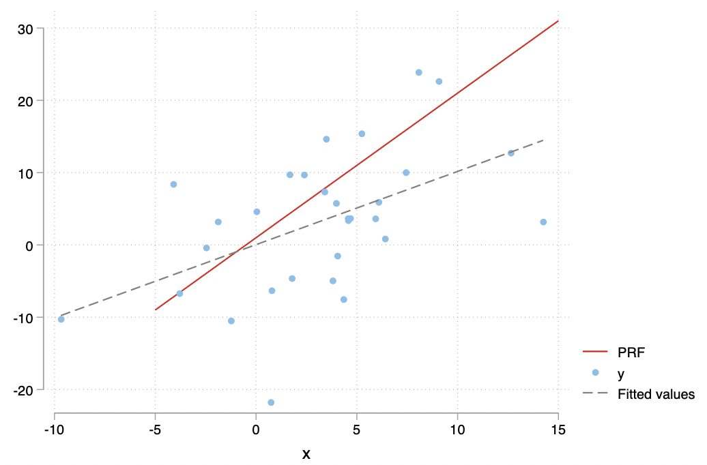
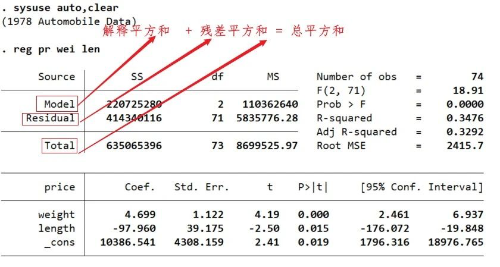

> 经济学研究似乎并不需要任何极高的特殊天赋。与更高深的哲学或纯科学相比，经济学不是......一门极其容易的学科吗？一门容易的学科，但这个学科中很少有人能出类拔萃！这个悖论的解释也许在于杰出的经济学家应该具有各种天赋的罕见的结合。在某种程度上，他应该是数学家、历史学家、政治家和哲学家。他必须了解符号并用文字表达出来。他必须根据一般性来深入思考特殊性，并在思绪奔放的同时触及抽象与具体。他必须根据过去、为着未来而研究现在。他必须考虑到人性或人的制度的每一部分。他必须同时保持果断而客观的情绪，像艺术家一样冷漠而不流俗，但有时又要像政治家一样脚踏实地。（凯恩斯）

## 0. 前言

此文档为陈强《计量经济学与 Stata 应用》学习笔记，加 `*` 章节表示重要。

## 1. 导论

什么是计量经济学：

计量经济学是运用概率统计方法对经济变量之间的（因果）关系进行定量分析的科学。

经济数据的特点和类型

## 2. Stata 入门

（略）

## 3. 数学回顾

### 3.1 微积分

#### 3.1.1 导数

一阶导数：
$$
\frac{dy}{dx} \equiv f'(x) \equiv \lim_{\Delta x \rightarrow 0} \frac{\Delta y}{\Delta x} \equiv \frac{f(x+\Delta x) - f(x)}{\Delta x}
$$

几何上，表示 $f(x)$ 在 $x$ 处的切线斜率。

二阶导数：
$$
\frac{d^2y}{d^2x} \equiv f''(x) \equiv \frac{d(\frac{dy}{dx})}{dx} \equiv [f'(x)]'
$$

几何上，表示切线斜率的变化速度，即曲线 $f(x)$ 的弯曲程度。

---

【补充】常见求导公式；复合函数求导

---

#### 3.1.2 一元最优化

最小化问题：最小二乘法

最大化问题：极大似然估计

一元最优化问题（极值）的必要条件为：$f'(x^*) = 0$

最大化问题：$f''(x^*) \leq 0$

最小化问题：$f''(x^*) \geq 0$

#### 3.1.3 偏导数

对于多元函数 $y = f(x_1,x_2,x_3,..., x_n)$ ，在计算 $y$ 对 $x_1$ 的一阶偏导数时，将给定 $x_2,...,x_n$视为参数，则 $y=f(x_1, x_2, ...,x_n)$可以看成 $x_1$ 的一元函数 $y = f(x_1, \cdot)$ 。

在经济学中，边际效用、生产要素的边际产出都是通过求偏导得到。

#### 3.1.4 多元最优化

考虑无约束的多元最大化问题：
$$
\max_x f(x) \equiv f(x_1,x_2,...,x_n)
$$
其中，$x \equiv (x_1,x_2,...,x_n)$ 。

一阶条件要求在最优值 $x^*$ 处，所有偏导数为 0 ：
$$
\frac{\delta f(x^*)}{\delta x_1} = \frac{\delta f(x^*)}{\delta x_2} = 
\cdots
\frac{\delta f(x^*)}{\delta x_n} = 0
$$

#### 3.1.5 积分

考虑计算连续函数 $y=f(x)$ 在区间 $[a,b]$ 上的面积：


将区间 $[a,b]$ 划分为 $n$ 等份，即 $[a,x_1], (x_1,x_2], \cdots, (x_{n-1}, b]$ ，从每个区间 $[x_{i-1},x_i]\quad(i=1,2,...,n)$ 中任取一点 $\xi_i$ （记 $a$ 为 $x_0$，而 $b$ 为 $x_n$ ）。

每个区间的长度为 $\Delta x \equiv \frac{b-a}{n} $ ，此面积近似等于 $\sum_{i=1}^n f(\xi_i)\Delta$ 。

不断细分这些区间，让 $n \rightarrow \infty$ ，可得此面积的精确值，即函数 $f(x)$ 在区间 $[a,b]$ 上的定积分（definite integral）: 
$$
\int_a^b f(x)dx \equiv \lim_{n \rightarrow \infty } \sum_{i=1}^n f(\xi_i)\Delta x
$$
在极限处，将 $\Delta x$ 记为 $dx$ ，将求和符号 $\sum$ 记为 $\int$ 。

定积分的实质就是求和（无穷多项之和）。

### 3.2 线性代数

#### 3.2.1 矩阵

$A_{m \times n}$，$m$ 表示行(row dimension)，$n$ 表示列(column dimension)。

A中元素$a_{ij}$表示第 $i$ 行，第 $j$ 列元素。

零矩阵(zero matrix)：所有元素都为 0 ，记为 $\bf{0}$ 。

#### 3.2.2 方阵

方阵(square matrix)：如果 $m=n $，则称 $A$ 为 $n$ 级方阵。

对称矩阵(symmetric matrix)：满足$a_{ij} = a{ji}$，任意$(i,j=1,...,n)$，则称 $A$ 为对称矩阵。

对角矩阵(diagonal matrix)：方阵 $A$ 的非主对角线元素全部为 0 。

单位矩阵(identity matrix)：一个 $n$ 级对角矩阵的主对角线元素都为 1 。

#### 3.2.3 矩阵的转置

转置矩阵(transpose)：将矩阵 $A=(a_{ij})_{mn}$ 的第 1 行变为第 1 列，第 2 行变为第 2 列，...... ，第 $m$ 行变为 $m$ 列，可得其转置矩阵，记为 $A^\prime$。

#### 3.2.4 向量

行向量(row vector)：$m =1 $，则称矩阵 $A_{1 \times n}$ 为 n 维行向量；

列向量(column vector)：如果 $n=1$，则矩阵 $A_{m \times 1}$ 为 m 维列向量。

向量是矩阵的特例。

考察 n 维列向量$a = (\begin{matrix} a_1 & a_2 &...&a_n\end{matrix})'$ 与 $b	 = (\begin{matrix} b_1 & b_2 &...&b_n\end{matrix})'$。

向量 $a$ 和 $b$ 的**内积**(inner product)或**点乘**(dot product)可定义为：

 $a'b \equiv (\begin{matrix} a_1 & a_2 &...&a_n\end{matrix})\begin{Bmatrix}b_1\\b_2\\...\\b_n\end{Bmatrix} \equiv a_1b_1 + a_2b_2+...+a_nb_n\equiv\sum_{i=1}^n a_ib_i$

如果$a'b=0$，则称向量 $a$ 和向量 $b$ **正交**，意味着两个向量在 n 维向量空间中相互垂直（夹角为 90 度）。


#### 3.2.5 矩阵的加法

**如果两个矩阵的维度相同，则可相加。**

对于$m\times n$ 级矩阵 $A = (a_{ij})_{m \times n}, B = (b_{ij})_{m \times n}$，矩阵 $A$与 $B$之和定义为两个矩阵相应元素之和，即：
$$
A + B = (a_{ij})_{m \times n} + (b_{ij})_{m \times n} = (a_{ij} + b_{ij})_{m \times n}
$$
矩阵加法满足以下规则：

- $A + 0 = A$（加上零矩阵不改变矩阵）
- $A+B=B+A$（加法交换律）
- $(A+B)+C = A+(B+C)$（加法结合律）
- $(A+B)' = A'+B'$（转置为线性运算）

#### 3.2.6 矩阵的数乘

矩阵 $A = (a_{ij})_{m \times n}$ 与实数 $k$ 的**数乘**定义为此实数与矩阵  $A = (a_{ij})_{m \times n}$ 每个元素的乘积：
$$
kA = k(a_{ij})_{m \times n} = (ka_{ij})_{m \times n}
$$

#### 3.2.7 矩阵的乘法

如果矩阵 $A$ 的**列数**与矩阵 $B$ 的**行数**相同，则可以定义**矩阵乘积** $A \times B$，简记为 $AB$ 。

假设矩阵 $A=(a_{ij})_{m \times n}$，矩阵$B=(b_{ij})_{n \times q}$，则矩阵乘积 $AB$ 的 $(i, j)$ 元素即为矩阵 $A$ 第 $i$ 行与矩阵 $B$ 的第 $j$ 列的内积：
$$
(AB)_{ij} \equiv (\begin{matrix}a_{i1} &a_{i2}&...&a_{in} \end{matrix})\begin{Bmatrix}b_{1j} \\b_{2j} \\ ... \\b_{nj}\end{Bmatrix} = \sum_{k=1}^n a_{ik}b_{kj}
$$
**矩阵乘法不满足交换律，即：$AB \neq BA$ 。**

在做矩阵乘法时，需区分**左乘**与**右乘**。$A$ 左乘 $B$为 $AB$，而 $A$ 右乘 $B$ 为 $BA$ 。

矩阵的乘法满足以下规则：

- $IA = A, IA = A$ （乘以单位矩阵不改变矩阵）
- $(AB)C=A(BC)$ （乘法结合律）
- $A(B+C)=AB+AC$ （乘法分配律）
- $(AB)'=B'A', (ABC)'=C'A'B'$ （转置与乘积的混合运算）

#### 3.2.8 线性方程组

考虑由 $n$ 个方程，$n$ 个未知数构成的线性方程组：
$$
\begin{cases}
a_{11}x_{1} + a_{12}x_2 + ... + a_{1n}x_{n} = b_1 \\
a_{21}x_{1} + a_{22}x_2 + ... + a_{2n}x_{n} = b_2  \\
\quad\quad\quad\quad\quad\quad \cdots \\
a_{n1}x_{1} + a_{n2}x_2 + ... + a_{nn}x_{n} = b_n 
\end{cases}
$$
$(\begin{matrix} x_1 x_2 ... x_n \end{matrix})$ 为未知数。根据矩阵乘法定义，可将上式写为：
$$
\underbrace{
\begin{Bmatrix} 
a_{11} & a_{12} & ... & a_{1n} \\
a_{11} & a_{12} & ... & a_{1n} \\
\vdots & \vdots & \vdots & \vdots \\
a_{n1} & a_{n2} & ... & a_{nn}
\end{Bmatrix}
}_{A}
\underbrace{
\begin{Bmatrix}
x_1 \\
x_2 \\
\vdots \\
x_n
\end{Bmatrix}
}_{x}
=
\underbrace{
\begin{Bmatrix}
b_1 \\
b_2 \\
\vdots \\
b_n
\end{Bmatrix}
}_{b}
$$

记上式中的相应矩阵分别为$A, x$ 与 $b$ ，可得：
$$
Ax = b
$$

如将此方程左边的方阵 $A$ “除”到右边去，可得 $x$ 的解。为此引入**逆矩阵**的概念。

#### 3.2.9 逆矩阵

逆矩阵：对于 $n$ 级方阵 $A$ ，如果存在 $n$ 级方阵 $B$ ，使得 $AB=BA=I_n$，则称 $A$ 为可逆矩阵，或非退化矩阵，而 $B$ 为 $A$ 的逆矩阵，记为 $A^{-1}$ 。

逆矩阵的逆矩阵还是矩阵本身，即 $(A^{-1})^{-1} = A$ 。

方阵 $A$ 可逆的充分必要条件为其行列式 $|A| \neq 0$ 。

如果 $A$ 可逆，则其逆矩阵 $A^{-1}$ 是唯一的。

假设方程 $Ax=b$ 中的矩阵 $A$ 可逆，则在该方程两边**同时左乘其逆矩阵 $A^{-1}$** 可得：
$$
A^{-1}Ax = A^{-1}b \\
=> Ix = A^{-1}b  \\
=> x = A^{-1}b
$$
矩阵求逆满足以下规则：

- $(A^{-1})'=(A')^{-1}$ （求逆与转置可交换次序）
- $(AB)^{-1} = B^{-1}A^{-1}, (ABC)^{-1} = C^{-1}B^{-1}A^{-1}$ （求逆与成绩的混合运算）

#### 3.2.10 矩阵的秩

向量组 $\{a_1,a_2,...,a_K\}$ 的极大线性无关部分组所包含的向量个数称为该**向量的秩（Rank）**。

#### 3.2.11 二次型

所谓二次型，就是 $x_1, x_2, ..., x_n$ 的二次齐次多项式：
$$
f(x_1, x_2, ..., x_n) = a_{11}x_1^2 + 2a_{12}x_1x_2 + \cdots + 2a_{1n}x_1x_n \\
\quad\quad\quad\quad\quad\quad\quad\quad\quad\quad+a_{22}x_2^2 + \cdots + 2a_{2n}x_2x_n \\
\quad\quad\quad\quad\quad\quad\quad\quad+ \cdots \quad \cdots \quad \cdots \quad \cdots \\
\quad\quad\quad\quad\quad\quad\quad\quad\quad\quad\quad\quad\quad\quad\quad\quad\quad+ a_{nn}x_n^2
$$
任何二次型，都可写为 $x'Ax$ 的形式，其中 $A$ 为对称矩阵。

【举例】考虑一般的二维二次型：
$$
f(x_1,x_2) = a_{11}x_1^2 + 2a_{12}x_1x_2 + a_{22}x_2^2
$$
此二次型可以写为：
$$
f(x_1,x_2)=(x_1 \quad x_2)\begin{Bmatrix}a_{11} & a_{12} \\a_{21} & a_{22} \end{Bmatrix} \begin{Bmatrix} x_1 \\ x_2\end{Bmatrix}
$$
其中，$a_{21} = a_{12}$ 。

### 3.3 概率与条件概率

#### 3.3.1 概率

概率为大量重复实验下，事件发生的频率趋向某个稳定值。

#### 3.3.2 条件概率

在 $B$ 发生的条件下，$A$ 发生的条件概率为：

$P(A|B) = \frac{P(AB)}{P(B)}$


【举例】一个透明袋子中有 2 个红球，1 个黑球。

$$
A: 抽到红球; B: 抽到黑球 \\
P(A) = \frac{2}{3}; P(B) = \frac{1}{3} \\
AB: 第一次抽出来红球，且第二次抽出黑球。 \\
P(AB) = \frac{2 \times 1}{3 \times 2} = \frac{1}{3}  \quad (排列组合)\\
A|B: 已经抽出黑球的情况下，第二次抽出红球。 \\ 
P(A|B) = 1
$$


#### 3.3.3 独立事件

如果条件概率等于无条件概率，$P(A|B)=P(A)$，即 $B$  是否发生不影响 $A$ 的发生，则称 $A, B$ 为相互独立的随机事件。

此时，$P(A|B) \equiv \frac{P(AB)}{P(B)} = P(A)$，故：
$$
P(AB) = P(A)P(B)
$$
也可将此式作为独立事件的定义。

#### 3.3.4 全概率公式

如果事件组 $\{B_1, B_2, ..., B_n\}(n \geq 2)$ 两两互不相容，但必有一件事发生，且每件事的发生概率均为正数，则对任何事件 $A$ （无论 $A$ 与$\{B_1, B_2, ..., B_n\}$ 是否有任何关系），都有：
$$
P(A) = \sum_{i=1}^n P(B_i)P(A|B_i)
$$
全概率公式把世界分成了 *n* 个可能的情形 $\{B_1, B_2, ..., B_n\}$ ，再把每种情况下的条件概率$P(A|B_i)$ “加权平均”而汇总成无条件概率（权重为每种情形发生的概率$P(B_i)$）。

### 3.4 分布与条件分布

#### 3.4.1 离散型概率分布

#### 3.4.2 连续型概率分布

#### 3.4.3 多维随机向量的概率分布

#### 3.4.4 条件分布

#### 3.4.5 随机变量的数字特征

#### 3.4.6 迭代期望定律

#### 3.4.7 随机变量无关的三个层次概念

#### 3.4.8 常用连续型统计分布

#### 3.4.9 统计推断的思想

## 4. 一元线性回归

### 4.1 一元线性回归模型

总体回归函数（PRF）与样本回归函数（SRF）



可使用蒙特卡洛法进行模拟，所谓“蒙特卡罗法”(Monte Carlo Methods，MC)，是通过计算机模拟，从总体抽取大量随机样本的计算方法。

```Stata
* PRF 和 SRF：蒙特卡罗模拟
clear
set obs 30
set seed 10101

gen x = rnormal(3, 4)
gen e = rnormal(0, 9)
gen y = 1*x + e //Data Generation Process
reg y x

tw function PRF = 1+2*x, range(-5 15) || ///
scatter y x || lfit y x, lp(dash)
```

计量经济学的主要任务之一就是通过数据 $\{x_i,y_i\}_{i=1}^n$ 来获取关于总体参数 $(\alpha, \beta)$ 的信息。

### 4.2 OLS估计量的推导

**目标：残差平方和最小**
$$
\min_{\hat \alpha, \hat \beta} \sum_{i=1}^n e_{i}^2 = \sum_{i=1}^n (y_i-\hat \alpha -\hat \beta x_i)^2
$$
此最小化问题的一阶条件为：
$$
\begin{cases}
\frac{\delta}{\delta \hat \alpha} \sum_{i=1}^n e_i^2 = -2\sum_{i=1}^n (y_i - \hat \alpha - \hat \beta x_i) = 0 \\
\frac{\delta}{\delta \hat \beta} \sum_{i=1}^n e_i^2 = -2  \sum_{i=1}^n (y_i - \hat \alpha - \hat \beta x_i) x_i = 0
\end{cases}
$$
消去方程左边的 $-2$ ，可得：
$$
\begin{cases}
\sum_{i=1}^n (y_i - \hat \alpha - \hat \beta x_i) = 0 \\
\sum_{i=1}^n (y_i - \hat \alpha - \hat \beta x_i)x_i = 0
\end{cases}
$$
对上式各项分别求和，移项可得：
$$
\begin{cases}
n \hat \alpha + \hat \beta \sum_{i=1}^n x_i = \sum_{i=1}^n y_i \\
\hat \alpha\sum_{i=1}^n x_i + \hat \beta \sum_{i=1}^n x_i^2 = \sum_{i=1}^n x_iy_i
\end{cases}
$$
上式为“正规方程组”。记 $\bar y = \frac{1}{n}\sum_{i=1}^n y_i, \bar x = \frac{1}{n} \sum_{i=1}^n x_i$ ，则：
$$
\hat \alpha = \bar y - \hat \beta \bar x
$$
将上式带入可得：
$$
(\bar y - \hat \beta\bar x)\sum_{i=1}^n x_i + \hat \beta \sum_{i=1}^n x_i^2 = \sum_{i=1}^n x_iy_i
$$
合并同类项，移项可得：
$$
\hat \beta (\sum_{i=1}^n x_i^2 - \bar x \sum_{i=1}^n x_i) = \sum_{i=1}^n x_iy_i - \bar y \sum_{i=1}^n x_i
$$
使用关系式 $\sum_{i=1}^n x_i = n \bar x$ ，求解 $\hat \beta$ ：
$$
\hat \beta = \frac{\sum_{i=1}^n x_iy_i - n \bar{xy}}{\sum_{i=1}^n x_i^2-n \bar x^2}
$$
更直观的写为离差形式：
$$
\hat \beta = \frac{\sum_{i=1}^n(x_i-\bar x)(y_i-\bar y)}{\sum_{i=1}^n(x_i-\bar x )^2}
$$

最后，求得：
$$
\hat \alpha = \bar y - \hat \beta \bar x \\\hat \beta = \frac{\sum_{i=1}^n(x_i-\bar x)(y_i-\bar y)}{\sum_{i=1}^n(x_i-\bar x )^2}
$$

### 4.3 OLS 的正交性

**正交：若内积空间中两向量的内积为 0 ，则称它们是正交的。**

OLS **残差与解释变量及拟合值的正交性**是 OLS 的重要特征，为推导证明提供了方便。

### 4.4 平方和分解公式


(图片来源：古扎拉蒂《经济计量学精要》（第四版）p.54)

由上图可知，$Y$ 的观测值围绕其均值（total variation）可分解为两部分，一部分来自回归线（ESS），另一部分来自随机扰动（RSS）。

---

【注释】TSS、ESS 和 RSS 的叫法在不同的教材会有区别

在伍德里奇的教材中，定义总平方和（total sum of squares, SST）、解释平方和（explained sum of squares, SSE） 和残差平方和（residual sum of squares，SSR）。

在古扎拉蒂的教材中，定义总平方和（TSS）、解释平方和（ESS）、残差平方和（RSS）。

在 Stata 汇报的结果中：解释平方和（SS of Model）、残差平方和（SS of Residual）和 总平方和（SS of Total）。



---

平方和分解公式能够成立，正是由于 OLS 的正交性。

$$
\underbrace{\sum_{i=1}^n (y_i-\bar y)^2}_{TSS}= \underbrace{\sum_{i=1}^n(\hat y_i-\bar y)^2}_{ESS}+ \underbrace{\sum_{i=1}^n e_{i}^2}_{RSS}
$$

---

【证明】平方和分解公式

将离差 $(y_i - \bar y)$ 写为 $(y_i - \hat y_i + \hat y_i - \bar y)$ ，则可将 TSS 写为：
$$
\sum_{i=1}^n (y_i - \bar y)^2 = \sum_{i=1}^n (y_i - \hat y_i + \hat y_i - \bar y)^2 = \sum_{i=1}^n (e_i + \hat y_i - \bar y)^2 \\
= \sum_{i=1}^n e_i^2 + \sum_{i=1}^n(\hat y_i - \bar y)^2 + 2 \color{red}{\sum_{i=1}^ne_i(\hat y_i - \bar y)}
$$
只需证明交叉项 $\sum_{i=1}^ne_i(\hat y_i - \bar y)=0$ 即可，而这由 OLS 的正交性所保证：
$$
\sum_{i=1}^n e_i(\hat y_i-\bar y) = \sum_{i=1}^n e_i \hat y_i - \sum_{i=1}^ne_i = 0 - 0 = 0
$$
**如果没有常数项，则无法保证 $\sum_{i=1}^n e_i = 0$ ，故平方和分解公式不成立。此时，使用非中心 $R^2$ （uncentered $R^2$）。**

---

### 4.5 拟合优度

$$
0 \leq R^2 \equiv \frac{\sum_{i=1}^n(\hat y_i - \bar y)^2}{\sum_{i=1}^n (y_i-\bar y)^2} = 1 - \frac{\sum_{i=1}^ne_{i}^2}{\sum_{i=1}^n (y_i-\bar y)^2} \leq 1
$$

有常数项的情况下，拟合优度等于被解释变量 $y_i$ 与拟合值 $\hat y_i$ 之间相关系数的平方，即 $R^2 = [Corr(y_i,\hat y_i)]^2$ ，故记为 $R^2$ 。

$R^2$ 只反映了拟合程度的好坏，评估回归方程是否显著应使用 F 检验。​

### 4.6 无常数项的回归

无常数项的一元线性回归模型可以写为：
$$
y_i = \beta x_i + \epsilon_i \quad（i=1, ..., n）
$$
依然进行 OLS 估计，最小化残差平方和为：
$$
\min_{\hat \beta} \sum_{i=1}^n e_i^2 = \sum_{i=1}^n (y_i - \hat \beta x_i)^2 
$$
一阶条件为：
$$
\frac{d}{d \hat \beta} \sum_{i=1}^n e_i^2 = -2 \sum_{i=1}^n (y_i - \hat \beta x_i) x_i = 0
$$
消去方程左边 $-2$ ，可得：
$$
\sum_{i=1}^n (y_i - \hat \beta x_i) x_i = 0
$$
求解 $\hat \beta$ 可得：
$$
\hat \beta = \frac{\sum_{i=1}^n x_iy_i}{\sum_{i=1}^n x_i^2}
$$
如果回归模型无常数项，则平方和分解公式不成立，不宜使用 $R^2$ 来度量拟合优度。

记 $e_i = y_i - \hat \beta x_i$，则正规方程可写为：
$$
\sum_{i=1}^n x_ie_i = 0
$$
 记拟合值为 $\hat y_i \equiv \hat \beta x_i$，则容易证明残差仍与拟合值正交：
$$
\sum_{i=1}^n \hat y_i e_i = \sum_{i=1}^n \hat \beta x_ie_i = \hat \beta \sum_{i=1} x_ie_i= \hat \beta \cdot0 = 0
$$
仍可利用 OLS 的正交性将 $\sum_{i=1}^n y_i^2$ 分解为：
$$
\sum_{i=1} y_i^2 = \sum_{i=1}^n (\hat y_i + e_i)^2 = \sum_{i=1}^n \hat y_i^2 + 2\underbrace{\sum_{i=1}^n \hat y_ie_i}_{=0} + \sum_{i=1}^n e_i^2 = \sum_{i=1}^n \hat y_i^2 + \sum_{i=1}^n e_i^2
$$
$\sum_{i=1}^n \hat y_i^2$ 为可由模型解释的部分，而 $\sum_{i=1}^n e_i^2$ 为模型不可解释的部分。

定义非中心 $R^2$ ：
$$
R_{uc}^2 = \frac{\sum_{i=1}^n \hat y_i^2}{\sum_{i=1}^n y_i^2}
$$
如果无常数项，Stata 汇报的 $R^2$ 正是 $R_{uc}^2$ 。  

### 4.7 一元回归的 Stata 实例

```Stata
use ${d}/grilic.dta, clear
/*
数据说明：此数据集包括 758 位美国年轻男子的教育投资回报率数据
*/
reg lnw s
reg lnw s, noc // 无常数项回归
```

### 4.8 PRF与SRF: 蒙特卡洛法

```Stata
/*
PRF: y_i = 1 + 2x_i + \epsilon_i \quad (i=1, ..., 30)
解释变量：$x_i ~ N(3, 2^2)$，扰动项 $\epsilon_i ~ N(0,3^2)$，样本容量为 30 。
*/

clear
set obs 30
set seed 10101

gen x = rnormal(3, 4)
gen e = rnormal(0, 9)
gen y = 1*x + e
reg y x

tw function PRF = 1+2*x, range(-5 15) || ///
scatter y x || lfit y x, lp(dash)
```

## 5. 多元线性回归

### 5.1 二元线性回归

使用一元线性回归会存在遗漏变量的问题，所以需要纳入更多的解释变量。

假设二元线性回归模型：
$$
y_i = \alpha + \beta x_{i1} + \gamma x_{i2} + \epsilon_{i} \quad (i = 1,...,n)
$$
$x_{i1}$ 与 $x_{i2}$ 为解释变量，$\alpha$ 为截距项；

$\beta$ 为在给定 $x_2$ 条件下，$x_1$ 对 $y$ 的边际效应（忽略扰动项 $\epsilon_i$）。

$\gamma$ 为在给定 $x_1$ 条件下，$x_2$ 对 $y$ 的边际效应。

**最优化问题：残差平方和最小**
$$
\min_{\hat \alpha, \hat \beta, \hat \gamma} \sum_{i=1}^n e_{i}^2 = \sum_{i=1}^n (y_i -\hat \alpha-\hat \beta x_{i1} -\hat \gamma x_{i2})^2
$$
寻找一个回归平面 $\hat y_{i} = \hat \alpha + \hat \beta x_{1i} + \hat \gamma x_{2i}$ ，即估计参数 $\hat \alpha, \hat \beta, \hat \gamma$ ，使得所有样本点 $\{(x_{i1},x_{2i},y_i)\}_{i=1}^n$ 离此回归平面最近。

求解：分别对 $\hat \alpha, \hat \beta, \hat \gamma$ 求偏导数，可得最小化的一阶条件，求解可得 $\hat \alpha, \hat \beta, \hat \gamma$ 的 OLS 估计量。

### 5.2 多元线性回归

基本形式：
$$
y_i = \beta_1 + \beta_2 x_{i2} + ... +\beta_Kx_{iK} + \epsilon_{i} \quad (i=1,...,n)
$$

$x_{i1}$ 为个体 $i$ 的第 1 个解释变量，$x_{i2}$ 为个体 $i$ 的第 2 个解释变量，以此类推。上式中，令 $x_{i1} \equiv 1$ （恒等于 1 ），代表常数项。 

**采用矩阵形式**，可将原模型写成：
$$
y_i = (\begin{matrix} 1 & x_{i2} & ... & x_{ik} \end{matrix}) \begin{Bmatrix} \beta_1 \\ \beta_2 \\ \vdots \\ \beta_K \end{Bmatrix} + \epsilon_i = \mathbf{x_{i}^\mathrm{'}} \mathbf{\beta} + \epsilon_i
$$

将所有这 $n$ 个方程叠放：
$$
\begin{Bmatrix}
y_1 = x_1'\beta+\epsilon_1 \\
y_2 = x_2'\beta+\epsilon_2 \\
\vdots \\
y_n = x_n'\beta+\epsilon_n
\end{Bmatrix}
$$
将共同的参数向量 $\mathbf{\beta}$ 向右边提出：
$$
\mathbf{y} = 
\begin{Bmatrix}
y_1 \\ y_2 \\ \vdots \\y_n
\end{Bmatrix}=
\underbrace{
\begin{Bmatrix}
x_1' \\ x_2' \\ \vdots \\x_n'
\end{Bmatrix}
}_{X}\beta+
\underbrace{
\begin{Bmatrix}
\epsilon_1 \\ \epsilon_2 \\ \vdots \\\epsilon_n
\end{Bmatrix}
}_{\epsilon}
=\mathbf{X \beta + \epsilon}
$$
其中，$y=(\begin{matrix} y_1 & y_2 & \cdots & y_n \end{matrix})'$ 为**被解释变量**构成的列向量；

$\epsilon=(\begin{matrix} \epsilon_1 & \epsilon_2 & \cdots & \epsilon_n \end{matrix})'$ 为**所有扰动项**构成的列向量；

$\mathbf{X}$ 为 $n \times K$ 数据矩阵。其第 $i$ 行包含全体 $i$ 的全部解释变量，而第 $k$ 列包含第 $k$ 个解释变量的全部观测值，即
$$
X = 
\begin{Bmatrix} 
1 & x_{12} & \cdots & x_{1K} \\
1 & x_{22} & \cdots & x_{2K} \\
\cdots & \cdots & \cdots & \cdots \\
1 & x_{n2} & \cdots & x_{nK}
\end{Bmatrix}_{n \times K}
$$

### 5.3 OLS 估计量的推导

对于多元回归模型，OLS 估计量的最小化问题为：
$$
\min_{\hat \beta_1, \cdots,\hat \beta_K} \quad \sum_{i=1}^n e_i^2 = \sum_{i=1}^n (y_i - \hat \beta_1 - \hat \beta_2 x_{i2} - \hat \beta_3 x_{i3} - \cdots - \hat \beta_K x_{iK})^2
$$
一阶条件为：
$$
\begin{cases}
\frac{\delta}{\delta \hat \beta_1} \sum_{i=1}^n e_i^2 = -2 \sum_{i=1}^n (y_i - \hat \beta_1 - \hat \beta_2 x_{i2} - \cdots - \hat \beta_K x_{iK}) = 0 \\
\frac{\delta}{\delta \hat \beta_2} \sum_{i=1}^n e_i^2 = -2 \sum_{i=1}^n (y_i - \hat \beta_1 - \hat \beta_2 x_{i2} - \cdots - \hat \beta_K x_{iK})x_{i2} = 0  \\
\qquad \qquad \qquad \qquad \qquad \qquad\qquad\vdots \\
\frac{\delta}{\delta \hat \beta_K} \sum_{i=1}^n e_i^2 = -2 \sum_{i=1}^n (y_i - \hat \beta_1 - \hat \beta_2 x_{i2} - \cdots - \hat \beta_K x_{iK})x_{iK} = 0  
\end{cases}
$$
消去方程左边的 “-2” 可得：
$$
\begin{cases}
\sum_{i=1}^n (y_i - \hat \beta_1 - \hat \beta_2 x_{i2} - \cdots - \hat \beta_K x_{iK}) = 0 \\
\sum_{i=1}^n x_{i2} (y_i - \hat \beta_1 - \hat \beta_2 x_{i2} - \cdots - \hat \beta_K x_{iK}) = 0  \\
\qquad \qquad \qquad \qquad\qquad\vdots \\
\sum_{i=1}^n x_{iK}(y_i - \hat \beta_1 - \hat \beta_2 x_{i2} - \cdots - \hat \beta_K x_{iK}) = 0  
\end{cases}
$$
这是包含 $K$ 个未知数 $(\hat \beta_1, \hat \beta_2, \cdots, \hat \beta_K)$ 与 $K$ 个方程的联立方程组，称为 “正规方程组” （normal equations）。

满足此正规方程组的 $\hat \beta \equiv \begin{matrix}(\hat \beta_1 & \hat \beta_2 & \cdots & \hat \beta_K) \end{matrix}$ 称为 OLS 估计量。

由于残差 $e_i \equiv y_i - \hat \beta_1 - \hat \beta_2 x_{i2} - \cdots - \hat \beta_Kx_{iK}$ ，故正规方程组可写为：
$$
\begin{cases}
\sum_{i=1}^n e_i = 0 \\
\sum_{i=1}^n x_{i2}e_i = 0 \\
\qquad\quad  \vdots\\
\sum_{i=1}^n x_{iK}e_i = 0 
\end{cases}
$$
上式每一方程都是乘积求和的形式，可用向量内积表示。

第 1 个方程可写为：
$$
\sum_{i=1}^n e_i = \begin{matrix}(1&1&\cdots&1)\end{matrix}\begin{Bmatrix}e_1 \\e_2\\\vdots\\e_n\end{Bmatrix} = 0
$$
第 2 个方程可写为：
$$
\sum_{i=1}^n x_{i2}e_i = \begin{matrix}(x_{12}&x_{22}&\cdots&x_{n2})\end{matrix}\begin{Bmatrix}e_1 \\e_2\\\vdots\\e_n\end{Bmatrix} = 0
$$
依此类推，第 K 个方程可写为：
$$
\sum_{i=1}^n x_{iK}e_i = \begin{matrix}(x_{1K}&x_{2K}&\cdots&x_{nK})\end{matrix}\begin{Bmatrix}e_1 \\e_2\\\vdots\\e_n\end{Bmatrix} = 0
$$
残差向量 $e \equiv \begin{matrix}(e_1&e_2&\cdots&e_n)\end{matrix}$ 与每个解释变量都正交，这是 OLS 估计量的一大特征。将以上内积以矩阵形式表示：
$$
\underbrace{
\begin{Bmatrix}
1 & 1 & \cdots & 1 \\
x_{12}&x_{22}&\cdots&x_{n2} \\
\cdots &\cdots&\cdots&\cdots \\
x_{1K}&x_{2K}&\cdots&x_{nK}
\end{Bmatrix}
}_{X'}
\underbrace{
\begin{Bmatrix}
e_1 \\
e_2 \\
\vdots \\
e_{n}
\end{Bmatrix}
}_{e}
=
\underbrace{
\begin{Bmatrix}
0 \\
0 \\
\vdots \\
0
\end{Bmatrix}
}_{0}
$$
$X'$ 为数据矩阵 $X$ 的转置。正规方程组可简洁的写为：
$$
X'e = 0
$$
从 $e_i = y_i - (\hat \beta_1 + \hat \beta_2 x_{i2} + \hat \beta_3 x_{i3} + \cdots + \hat \beta_K x_{iK})$ 出发，可将残差向量写为：
$$
e = y - X \hat \beta
$$
代入正规方程组可得：
$$
X'(y-X\hat \beta) = 0
$$
乘开并移项可知，最小二乘估计量 $\hat \beta$ 满足：
$$
(X'X)_{K \times K} \hat \beta_{K \times 1} = X'_{K\times n} y_{n \times 1}
$$
假设 $(X'X)^{-1}$ 存在，求解 OLS 估计量：
$$
\mathbf{\hat \beta = (X^\mathrm{'}X)^{-1}X^\mathrm{'}y}
$$

这就是多元回归 OLS 的估计量。

### 5.4 OLS 的几何解释


拟合值 $\mathbf{\hat y}$ 可视为被解释变量 $\mathbf{y}$ 向解释变量超平面 $\mathbf{X}$ 的投影 (projection)。**由于拟合值为解释变量的线性组合，即 $\mathbf{\hat y  = X \hat β}$ ，故拟合值向量  $\mathbf{\hat y}$ 正好在超平面 $\mathbf{X}$  上**。根据 OLS 的正交性，残差向量 $\mathbf{e}$ 与 $\mathbf{\hat y}$ 正交 。
### 5.5 拟合优度

#### 5.5.1 拟合优度

由于OLS的正交性，平方和分解公式依然成立：
$$
\underbrace{
\sum_{i=1}^n (y_i-\bar y)^2
}_{TSS}
= 
\underbrace{
\sum_{i=1}^n(\hat y_i-\bar y)^2
}_{ESS}
+ 
\underbrace{
\sum_{i=1}^n e_{i}^2
}_{RSS}
$$
**拟合优度的缺点是：如果增加解释变量的数目，则 $R^2$ 只增不减，因为至少可让新增解释变量的系数为 0 而保持 $R^2$ 不变**。

另一方面，通过最优地选择新增解释变量的系数（以及已有解释变量的系数），通常可以提高 $R^2$ 。

#### 5.5.2 调整拟合优度

引入调整 $R^2$ 对解释变量过多（模型不够简洁）进行惩罚。

定义调整 $\bar R^2$ 为：
$$
\bar R^2 = 1 - \frac{\sum_{i=1}^n e_{i}^2/(n-K)}{\sum_{i=1}^n(y_i-\bar y)^2/(n-1)}
$$

$\sum_{i=1}^n e_{i}^2$ 的自由度（degree of freedom）为$(n-K)$；$\sum_{i=1}^n(y_i-\bar y)^2$ 的自由度为 $(n-1)$ 。

---

【问题】为何 $\sum_{i=1}^n e_{i}^2$ 的自由度（degree of freedom）为$(n-K)$ ?

虽然  $\sum_{i=1}^n e_{i}^2$ 由 $n$ 个随机变量 $\{e_1,...,e_n\}$ 所构成，但 $\{e_1,...,e_n\}$ 受由 $K$ 个方程组成的正规方程组的约束，故只有其中 $(n-K)$ 个残差是（自由）独立的。

【问题】为何 $\sum_{i=1}^n(y_i-\bar y)^2$ 的自由度为 $(n-1)$  ?

虽然 $\sum_{i=1}^n(y_i-\bar y)^2$ 由 $n$ 个离差 $\{(y_1 - \bar y), ..., (y_n - \bar y)\}$ 所构成，但这些离差和必然为 0 ，即 $\sum_{i=1}^n (y_i - \bar y) =0$，故只有其中 $(n-1)$ 个离差是（自由）独立的。 

---

如果让 $K$ 增多，有两个相反方向的变动。

**$\bar R^2$ 的缺点是可能为负。**

**$R^2$ 和 $\bar R^2$ 只能反映拟合优度的好坏，评估回归方程是否显著应该使用 F 检验。**

如果回归模型无常数项，则仍需使用“非中心$R^2$（uncentered $R^2$）：
$$
R_{uc}^2 \equiv \frac{\sum_{i=1}^n \hat y_{i}^2}{\sum_{i=1}^n y_{i}^2}
$$

### 5.6 古典线性回归模型的假定

**SLR.1 线性（linearity）假定**

每个解释变量对 $y_i$ 的**边际效应**为常数。如 $\frac{\delta y_i}{\delta x_{i2}}=\beta_2$ （忽略扰动项 $\epsilon_i$）。

在现实中，如果边际效应可变，可以加入平方项（如 $x_{i2}^2$）或交叉项（$x_{i2}x_{i3}$）。

（平方项）考虑回归方程：
$$
\ln{w_i} = \beta_1 + \beta_2s_i+\beta_3s_{i}^2+\epsilon_i
$$

$\ln{w_i}$ 为工资对数，$s_i$ 为教育年限。教育年限对工资对数的边际效应为：
$$
\frac{\delta \ln{w_i}}{\delta s_i} = \beta_2 + 2 \beta_3s_i
$$
如果 $\beta_3 < 0 $，则存在教育投资回报率递减；反之，则存在教育投资回报率递增。

（交叉项）考虑生产函数方程：

$$
y_i = \beta_1 + \beta_2k_i + \beta_3 l_i + \beta_4 k_i \times l_i + \epsilon_i
$$

$y$ 为产出，$k$ 为资本，$l$为劳动力， $k \times l$ 为资本与劳动力的互动项。劳动的边际产出为$\frac{\delta y_i}{\delta l_i} = \beta_3 + \beta_4k_i$ （忽略扰动项）。
如果 $\beta_4 > 0$ 则说明资本与劳动力是互补的，即随着资本上升，劳动力的边际产出也增加。

**线性假定的本质要求是，回归函数是参数（$\beta_1, ...,\beta_k$）的线性函数。**

**SLR.2 严格外生性（strict exogeneity）要求**
$$
E(\epsilon_i | X) = E(\epsilon_i | x_1, \cdots, x_n) = 0 \quad (i = 1, \cdots, n)
$$
严格外生性意味着在给定数据矩阵 $\mathbf{X}$ 的情况下，扰动项 $\epsilon_{i}$ 的条件期望为 0 。

---

【定义】如果随机变量 $x, y$ 满足 $E(xy) = 0$，则称 $x,y$ 正交（orthogonal）。

根据此定义，可证明解释变量与扰动项正交。因为：
$$
0 = Cov(x_{jk}, \epsilon_i) = E(x_{jk}\epsilon_i) - E(x_{jk})\underbrace{E(\epsilon_i)}_{=0} = E(x_{jk}\epsilon_i)
$$

---

**SLR.3 不存在严格多重共线性（strict multicollinearity）**

即数据矩阵 $X$ 满列秩（full column rank）。数据矩阵的各列向量为线性无关，即不存在某个解释变量为另一解释变量的倍数，或可由解释变量线性表现的情形。

### 5.7 OLS 的小样本性质

在满足 SLR.1~SLR.3 的条件下， OLS 估计量具有以下良好性质：

- 线性性：OLS 估计量 $\mathbf{\hat \beta}$为线性估计量；
- 无偏性：$E(\hat \beta | X) = \beta$，即 $\hat \beta$ 不会系统地高估或低估 $\beta$；
- 估计量 $\hat \beta$ 的协方差矩阵

---

【证明】无偏性

抽样误差为：

$\hat \beta - \beta = (X'X)^{-1}X'y - \beta = (X'X)^{-1}X'(X\beta+\epsilon)-\beta=(X'X)^{-1}X'\epsilon \equiv A \epsilon$

记 $A \equiv (X'X)^{-1}X'$ 。给定解释变量 $X$ ，对上式两边求条件期望，根据严格外生性可得：
$$
E(\hat \beta -\beta | X) = E(A\epsilon|X) = A \underbrace{E(\epsilon|X)}_{=0} = 0
$$
移项可得：$E(\hat \beta |X) = \beta$ 。

在此证明中，严格外生性不可或缺。

使用迭代期望定律，可进一步证明，无条件期望 $E(\hat \beta) = \beta$ ，因为：
$$
E(\hat \beta) = E_{X}E(\hat \beta|X) = E_{X}(\beta) = \beta
$$
---

**SLR.4 球型扰动项（spherical disturbance）假定**

球型扰动项（spherical disturbance）满足同方差、无自相关性质，扰动项 $\epsilon$ 的协方差矩阵可写为：
$$
Var(\epsilon|X) = \sigma^2I_{n} = 
\begin{Bmatrix} 
\sigma^2 & 0 & \cdots & 0 \\
0 & \sigma^2 & \cdots & 0 \\
\vdots & \vdots & \ddots & \vdots \\
0 & 0 & \cdots & \sigma^2
\end{Bmatrix}
$$
协方差矩阵 $Var(\epsilon |X)$ 的主对角线元素都等于 $\sigma^2$ ，即满足条件同方差（同方差），若不满足则存在异方差。

协方差矩阵 $Var(\epsilon |X)$ 的非主对角线元素都等于 0 ，故不同个体的扰动项之间无自相关，反之则存在自相关。

球型扰动项假定是证明协方差表达式 $\sigma^2(X'X)^{-1}$ 的关键（无偏性不依赖于球型扰动项）。

**高斯-马尔克夫定理：在 SLR.1~SLR.4 之下，最小二乘法是最佳无偏估计量（Best Linear Unbiased Estimator, 简记BLUE），即在所有线性的无偏估计中，最小二乘法的方差最小。**

### 5.8 对单个系数 t 检验

**SLR.5 在给定 $X$ 的情况下，$\epsilon|X$ 的条件分布为正态，即 $\epsilon|X \sim N(0, \sigma^2I_n)$ 。**

**假设检验是一种概率意义上的反证法。**首先假设原假设成立，然后看在原假设成立的前提下，是否导致不太可能发生“小概率事件”在一次抽样的样本中出现。

---

【定理】t 统计量的分布

在 SLR.1~SLR.5 均满足，且原假设 $H_0:\beta_k =c$ 也成立的情况下，t 统计量服从自由度为 $(n-K)$ 的 t 分布：
$$
t_k \equiv \frac{\hat \beta_k-c}{SE(\hat \beta_k)} \sim t(n-K)
$$
$SE(\hat \beta_k) \equiv \sqrt{s^2(X'X)_{kk}^{-1}}$ 为 $\hat \beta_k$ 的标准误。

更一般地，t 统计量的通用公式为：
$$
t = \frac{估计量-假想值}{估计量的标准误}
$$

---

#### 5.8.1 t 检验的步骤

**第一步：**计算 t 统计量 $t_k = \frac{\hat \beta_k-c}{SE(\hat \beta_k)} \sim t(n-K)$，记其具体取值为 $t_k$ 。
**第二步：**计算显著性水平为 $\alpha$ 的临界值 $t_{\alpha/2}(n-K)$ ，其中 $t_{\alpha/2}(n-K)$ 的定义为：
$$
P\{T > t_{\alpha/2}(n-K) \} = P\{T < t_{\alpha/2}(n-K)\} = \alpha/2
$$

其中，随机变量 $T \sim t(n-K)$ 。

随机变量 $T$ 大于 $t_{\alpha/2}(n-K)$ ，或小于 $-t_{\alpha/2}(n-K)$ 的概率都是 $\alpha/2$，如下图：


通常取 $\alpha=5\%$，则 $\alpha/2 = 2.5\%$，有时也使用 $\alpha = 1\%$ 或  $\alpha = 10\%$ 。

**第三步：**如果 $|t_k| \geq t_{\alpha/2}(n-K)$ ，则 $t_k$ 落入“拒绝域”，故拒绝 $H_0$ 。反之，如果 $|t_k| < t_{\alpha/2}(n-K)$，则 $t_k$ 落入接受域，故接受 $H_0$ 。 

#### 5.8.2 计算 p 值

【定义】**称原假设可被拒绝的最小显著性水平为此假设检验问题的 p 值。**p 值越小，则越倾向于拒绝原假设。如选定显著性水平为 5% ，只要 p 值比 0.05 小，即可拒绝原假设。

在双边 $t$ 检验中，给定 $t$ 统计量的样本观测值 $t_k$ ，此假设检验问题的 p 值为：
$$
p值 \equiv P(|T|>|t_k|)
$$
其中，随机变量 $T \sim t(n-K)$ 。

给定 t 统计量 $t_k$ ，则 p 值衡量比 $|t_k|$ 更大的 t 分布两端的尾部概率，如下图：


如果 p 值为 0.05 ，则正好可以在 5% 的显著性水平上拒绝原假设，但无法在 4.9% 的显著性水平上拒绝原假设。

#### 5.8.3 计算置信区间

置信区间：参数最可能的取值范围。

假设置信区间为 $(1-\alpha)$ （比如 $\alpha = 5\%$，则 $1-\alpha=95\%$），即要找到置信区间，使得该区间覆盖真实参数 $\beta_k$ 的概率为 $(1-\alpha)$ 。

由于 $t_k = \frac{\hat \beta_k - \beta_k}{SE(\hat \beta_k)} \sim t(n-K)$ ，故 t 统计量落入接受域的概率为 $(1-\alpha)$ ：
$$
P \{-t_{\alpha/2} < \frac{\hat \beta_k - \beta_k}{SE(\hat \beta_k)} < t_{\alpha/2}\} = 1 - \alpha
$$
其中，$t_{\alpha/2}$ 为显著性水平为 $\alpha$ 的临界值。将不等式变形可得：
$$
[\hat \beta_k - t_{\alpha/2}SE(\hat \beta_k),\hat \beta_k + t_{\alpha/2}SE(\hat \beta_k) ]
$$
此置信区间以点估计 $\hat \beta_k$ 为中心，区间半径为 $t_{\alpha/2}SE(\hat \beta_k)$ 。


标准误 $SE(\hat \beta_k)$ 越大，对 $\beta_k$ 的估计越不准确，置信区间也越宽。

置信区间是随机区间，随着样本不用而不同。**如果置信区间为 95% ，抽样 100 次，得到 100 个置信区间，大约 95 个置信区间能覆盖到真实参数 $\beta_k$ 。**

#### 5.8.4 单边检验

#### 5.8.5 第 I 类错误与第 II 类错误

第 I 类错误：虽然原假设为真，但却根据观测数据做出了拒绝原假设的错误判断，即为“弃真”。

第 II 类错误：虽然原假设为假，但却根据观测数据做出了接受原假设的错误判断，即为“存伪”。

### 5.9 对线性假设的 F 检验

### 5.10  F 统计量的似然比原理表达式

### 5.11 预测

### 5.12 用 Stata 进行多元回归的实例

#### 5.12.1 用Stata进行二元回归

```Stata
* 柯布道格拉斯生产函数
use cobb_douglas.dta, clear
list

regress lny lnk lnl
predict lny1
predict e, res

list lny lny1 e
line lny lny1 year, lp(solid dash)
```

#### 5.12.2 多元回归的 Stata 实例

```Stata
* 多元回归
use ${d}/grilic.dta, clear
reg lnw s expr tenure smsa rns

vce // 回归系数的协方差矩阵
reg lnw s expr tenure smsa rns, noc //无常数项回归
reg lnw s expr tenure smsa if rns // only rns == 1
reg lnw s expr tenure smsa if ～rns // only rns == 0
reg lnw s expr tenure smsa rns if s>=12 // only 中学以上
reg lnw s expr tenure smsa if s>=12 & rns // 中学以上且住在南方

quietly reg lnw s expr tenure smsa rns
predict lnw1 // 拟合值
predict e, residual //残差
```

#### 5.12.3 假设检验

```Stata
* t 检验
test s = 0.1 // H_0: \beta_2 = 0.1
/*
 ( 1)  s = .1
       F(  1,   752) =    0.20
            Prob > F =    0.6515
解读：由于 t 分布的平方为 F 分布，故 Stata 统一汇报 F 统计量及其 p 值。 
上表显示，p 值 = 0.6515 ，故无法拒绝原假设。
*/

*手工计算 t 统计量
/*
t = \frac{估计值 - 假想值}{估计值的标准误} = \frac{0.102643 - 0.1}{0.0058488} = 0.45188757 \sim t(n-K) = t
*/

dis (0.102643 - 0.1)/0.0058488 // 0.45188757
ttable 752 // ttable [df]

/*
       Critical Values of Student's t
       .10     .05     .025    .01     .005    .0005  1-tail
 df    .20     .10     .050    .02     .010    .0010  2-tail
752   1.283   1.647   1.963   2.331   2.582    3.304

解读：在 5% 的显著性水平下，0.45188757 < 1.963 ，落入接受域，接受原假设。
*/

* 由于默认为双边检验，故可计算此 t 统计量对应的 p 值如下:

dis ttail(752,0.45188757)*2 // 0.65148029

/*
表示自由度为 752 的 t 分布比 0.45188757 更大的右侧尾部概率，正好是反向累积分布函数。
*/

* 单边检验

dis ttail(752, 0.45188757) // .32574014
/*
如果已知双边检验的p值，在做单边检验时(假设t统计量的符号 与替代假设的方向相同)，一般只需将双边检验的p值除以 2，即 可得到单边检验的 p 值，然后得到单边检验的结果。
*/

test expr = tenure // H_0: \beta_3 = \beta_4
/*
由于p值 = 0.8208，可轻松接受原假设。
*/

test expr + tenure = s // H_0: \beta_3 + \beta_4 = \beta_2
/*
由于 p 值 = 0.0031，故可在 1%的显著性水平上拒绝原假设，即认为\beta_3 + \beta_4 \neq \beta_2。
*/
```

## 6. 大样本 OLS

## 7. 异方差

### 7.1 异方差的后果

**“条件异方差”**（简称“异方差”）是违背球型扰动假设的一种情形，即**条件方差 $Var(\epsilon_i|X)$ 依赖于 $i$ （ 为 $\sigma _i ^2$ ），而不是常数 $\sigma^2$ 。**

在异方差的情况下：

- OLS 估计量依然无偏、一致且渐进正态。因为在证明这些性质时，未用到“同方差”的假定；
- OLS 估计量方差 $Var(\hat \beta|X)$ 的表达式不再是 $\sigma^2(X'X)^{-1}$ ，因为 $Var(\epsilon|X) \neq \sigma^2I$ 。**使用普通标准误的 t 检验、F 检验失效。**
- 高斯-马尔可夫定理不再成立，OLS 不再是 BLUE 。

---

【总结】异方差的后果

1. $\beta$ 估计量无偏：用 OLS估计所得参数估计量 $\hat \beta$ 仍具有无偏性，即 $E(\hat \beta) = \beta$ 。 
2. $\beta$ 估计量非有效：存在异方差时，$\hat \beta_{OLS}$ 不是 $\beta$ 的有效估计；直接计算 $Se(\hat \beta)$ 有误 。
3. t检验、F 检验失效

---


【举例】考虑一元回归 $y_i = \alpha + \beta x_i + \epsilon$，假设 $Var(\epsilon_i | X)$ 是解释变量 $x_i$ 的增函数，即 $x_i$ 越大则 $Var(\epsilon_i|X)$ 越大。


OLS 回归线在 $x_i$ 较小时可以较精确地估计，而在 $x_i$ 较大时则难以准确估计。

方差较大的数据包含的信息量较小，但 OLS 却对所有数据等量齐观进行处理，故异方差的存在使得 OLS 的效率降低。

在异方差的情况下，加权最小二乘法（Weigthed Least Square，WLS）才是 BLUE 。WLS 通过对不同数据所包含信息量的不同进行相应的处理以提高估计效率。比如，给予信息量大的数据更大的权重。

### 7.2 异方差的例子

- （1）**考虑消费函数：**

$$
c_i = \alpha + \beta y_i + \epsilon_i
$$


其中，$c_i$ 为消费， $y_i$ 为收入。富人的消费计划较有弹性，而穷人的消费多为必需品，很少变动。富人的消费支出更难测量，包含较多测量误差。$Var(\epsilon_i|y_i)$ 可能随 $y_i$ 的上升而变大。

- （2）**企业的投资、销售收入与利润：**大型企业的商业活动可能动辄以亿元计，而小型企业则以万元计；因此，扰动项的规模也不相同。如将大、中、小型企业放在一起回归，可能存在异方差。

- （3） **组间异方差：**如果样本包含两组（类）数据，则可能存在组内同方差，但组间异方差的情形。比如，第一组为自我雇佣者（企业主、个体户）的收入，而第二组为打工族的收入；自我雇佣者的收入波动可能比打工族更大。

- （4） **组平均数：**如果数据本身就是组平均数，则大组平均数的方差通常要比小组平均数的方差小。比如，考虑全国各省的人均  GDP ，每个省一个数据。人口较多 的省份其方差较小，方差与人口数成反比。

### 7.3 异方差的检验

#### 7.3.1 画残差图

观察**“残差 $e_i$ 与拟合值 $\hat y_i$ 的散点图”**或者**“残差 $e_i$ 与某个解释变量 $x_{ik}$ 的散点图”**。画图是直观方法，但不严格。


（图片来源：古扎拉蒂《计量经济学基础》（第五版）, p.377）

上图中，图（a） 未发现两变量之间有任何系统性关系，图（b）到图（e）表明两变量呈现一定的关系。图（c）表示呈现线性关系，图（d）和图（e）表示 $\hat u_i^2$ 与 $\hat Y_i^2$ 呈现二次关系。**利用图示虽然是非正式的方法，但是却有可能对数据进行变换，使变换后的数据不具有异方差性（如通过对数变换对原始数据进行压缩）。**

#### 7.3.2 BP 检验（Breusch and Pagan, 1979）

假设回归模型：
$$
y_i = \beta_1 + \beta_2x_{i2} + \cdots + \beta_Kx_{iK}+\epsilon_i
$$
记 $X_i = \begin{matrix}(1 & x_{i2} & \cdots & x_{iK}）\end{matrix}$ 。

**假设样本数据为 iid** ，则 $Var(\epsilon_i |X)= Var(\epsilon_i|X_i)$ 。

“条件同方差”的原假设为：
$$
H_0: Var(\epsilon_i|X_i) = \sigma^2
$$
由于 $Var(\epsilon_i|X_i) = E(\epsilon_{i}^2|X_i)-[\underbrace{E(\epsilon_i|X_i)}_{=0}]^2=E(\epsilon_i^2|X_i)$ ，原假设可写为：
$$
H_0: E(\epsilon_i^2|X_i) = \sigma_i^2
$$
**如果 $H_0$ 不成立**，则条件方差 $E(\epsilon_i^2|X_i)$ 是 $X_i$ 的函数，称为“条件方差函数”（conditional variance function）。

假设此条件方差函数为线性函数：
$$
\epsilon_i^2 = \delta_1+\delta_2x_{i2}+\cdots+\delta_Kx_{iK} + u_i
$$
故原假设可以简化为：
$$
H_0: \delta_2 = \cdots=\delta_K=0
$$
由于扰动项 $\epsilon_i$ 不可观测，故使用残差平方和 $e_i^2$ 替代，进行辅助回归（auxiliary regression）：
$$
e_i^2 = \delta_1 + \delta_2x_{i2} + \cdots+\delta_Kx_{iK} + error_{i}
$$
记此辅助回归的拟合优度为 $R^2$ 。$R^2$ 越高，则辅助回归方程越显著，越可拒绝 $H_0: \delta_2 = \cdots=\delta_K=0$ 。

Breusch and pagan(1979) 使用 LM 统计量，进行 LM 检验（Lagrange Multiplier Test）：
$$
LM = n R^2 \stackrel{d}{\rightarrow} \chi^2(K-1)
$$
如果 LM 大于 $\chi^2(K-1)$ 的临界值，则拒绝同方差的原假设。

---

【问题】为什么 LM 统计量是 $nR^2$ 呢?

**在大样本中，$nR^2$ 与检验整个方程显著性的 F 统计量渐近等价。**

首先，对于辅助回归，检验原假设 $H_0: \delta_2 = \cdots=\delta_K=0$ 的 F 统计量：
$$
F =\frac{R^2/(K-1)}{(1-R^2)/(n-K)} \sim F(K-1,n-K)
$$
其次，在大样本情况下，F 分布与 $\chi^2$ 分布是等价的。即：
$$
(K-1)F = \frac{(n-K)R^2}{(1-R^2)} \stackrel{d}{\rightarrow} \chi^2(K-1)
$$
在原假设 $H_0: \delta_2 = \cdots=\delta_K=0$ 成立的情况下，辅助回归方程常数项回归，故：

当 $n \rarr \infin$ 时，$R^2 \stackrel{p}{\rightarrow} 0$，而 $ (1-R^2) \stackrel{p}{\rightarrow} 1 $  。

因此：
$$
(K-1)F = \frac{(n-K)R^2}{(1-R^2)} \stackrel{p}{\rightarrow} (n-K)R^2
$$
在大样本下，$(n-K)R^2$ 与 $nR^2$ 并无差别，故 LM 检验与 F 检验渐近等价。

---


如果认为异方差主要依赖被解释变量拟合值 $\hat y_i$ ，可将辅助回归改为：
$$
e_i^2 = \delta_1 +\delta_2 \hat y_i + error_i
$$
然后检验 $H_0: \delta_2 = 0$ （可使用 F 或 LM 统计量）。

**Breusch and pagan(1979) 的最初检验假设扰动项 $\epsilon_i$ 服从正态分布，有一定的局限性。**Koenker(1981) 将此假定减弱为 iid ，使得 BP 检验在实际中较多采用。

---

【总结】BP 检验步骤（伍德里奇《计量经济学导论》（第五版）p.225）

1. 使用 OLS 估计原模型 $y = \beta_0 + \beta_1 x_1 + \beta_2 x_2 + \cdots + \beta_kx_k + u$，得到OLS 残差平方 $\hat u^2$ （每次观测得到一个）。

2. 做 $\hat u^2 = \delta_0 + \delta_1 x_1 + \delta_2 x_2 + \cdots + \delta_k x_k + 误差$ 回归，记下此回归的 $R^2 \rarr R_{\hat u ^2}^2$ 。
3. 计算 F 统计量或者 LM 统计量并计算 p 值。（前者使用 $F_{k, n-k-1}$ 分布，后者使用 $\chi_k^2$ 分布）。**如果这个 p 值很小，即低于选定的显著性水平，那么就拒绝同方差性的原假设。**

如果 BP 检验得到一个足够小的 p 值，那么就应该采取修正措施，使用异方差-稳健标准误，或者 WLS 。

---


#### 7.3.3 怀特检验（White, 1980）

BP 检验假设**条件方差函数为线性函数**，可能忽略了高次项。

怀特检验(White, 1980)在 BP 检验的辅助回归中加入所有的二次项（含平方项与交叉项）。

考虑以下二元回归：
$$
y_i = \beta_1 + \beta_2 x_{i2} + \beta_3 x_{i3} + \epsilon_i
$$
除常数项外，只有 $x_{i2}$ 和 $x_{i3}$ 两个解释变量，故二次项包括 $x_{i2}^2$ ，$x_{i3}^2$ 与 $x_{i2}x_{i3}$ 。

怀特检验的辅助回归为：
$$
e_i^2 = \delta_1 + \delta_2x_{i2} + \delta_3 x_{i3} + \delta_4 x_{i2}^2 + \delta_5x_{i3}^2 + \delta_6x_{i2}x_{i3} + error_{i}
$$
其中，$e_i^2$ 为二元回归方程的残差平方。

对原假设 $H_0: \delta_2 = \cdots=\delta_6=0$ 进行 F 检验或 LM 检验。

怀特检验可以检验任何形式的异方差；因为根据泰勒展开式，二次函数可很好地逼近任何光滑函数。

如果解释变量较多，则解释变量的二次项（含交叉项）将更多，在辅助回归中将损失较多样本容量。

### 7.4 异方差的处理

#### 7.4.1 使用“ OLS + 稳健标准误”

**如发现异方差，一种处理方法是，仍进行 OLS 回归（OLS 依然无偏、一致且渐近正态），但使用在异方差情况下也成立的稳健标准误。这是最简单，也是目前通用的方法。**

只要样本容量较大，即使在异方差的情况下，只要使用稳健标准误，则所有参数估计、假设检验均可照常进行。

---

【补充】何谓“稳健标准误”？（伍德里奇《计量经济学导论》（第五版）p.219）

在一般多元回归模型：
$$
y = \beta_0 + \beta_1x_1 + \beta_2 x_2 + \cdots + \beta_k x_k + u
$$
在假定 MLR.1~MLR.4 下，$Var(\hat \beta_j)$ 的一个有效估计量是：
$$
\hat{Var(\hat \beta_j)} = \frac{\sum_{i=1}^n \hat r_{ij}^2 \hat u_i^2}{SSR_j^2}
$$
其中，$\hat r_{ij}^2$ 表示将 $x_j$ 对所有其他自变量做回归所得到的第 $i$ 个残差，而 $SSR_j$ 则是这个回归的残差平方和。上式的**平方根**被称为 $\hat \beta_j^2$ 的异方差-稳健标准误（heteroskedasticity-robust standard error）。 

---


#### 7.4.2 加权最小二乘法（WLS）

方差较小的观测值包含的信息量较大。对于异方差的另一处理方法是，给予方差较小的观测值较大的权重，然后进行加权最小 二乘法估计。

**WLS 的基本思想是：通过变量转换，使得变换后的模型满足球形扰动项的假定（变为同方差），然后进行 OLS 估计，即为最有效率的 BLUE 。**

考虑线性回归模型：
$$
y_i = \beta_1 + \beta_2x_{i2} + \cdots+\beta_K x_{iK} + \epsilon_i
$$
*假定 $Var(\epsilon_i|x_i) \equiv \sigma_i^2 = \sigma_i^2v_i$ ，且 $\{v_i\}_{i=1}^n$ 已知。*

两边同乘权重 $1/\sqrt{v_i}$ 可得：
$$
\frac{y_i}{\sqrt{v_i}} = \beta_1\frac{1}{\sqrt{v_i}} + \beta_2\frac{x_{i2}}{\sqrt{v_i}} + \cdots+\beta_K \frac{x_{iK}}{\sqrt{v_i}} + \frac{\epsilon_i}{\sqrt{v_i}}
$$

新扰动项 $\epsilon_i/\sqrt{v_i}$ 不再有异方差，因为：
$$
Var(\epsilon_i/\sqrt{v_i}) = \frac{1}{v_i}Var(\epsilon_i) = \frac{\sigma^2v_i}{v_i} = \sigma^2
$$
对**乘以权数后的方程**进行 OLS 回归，即为 WLS 。

加权之后的回归方程满足球形扰动项的假定，故是 BLUE 。

可将 WLS 定义为最小化“加权残差平方和”，即：
$$
\min \quad \sum_{i=1}^n (e_i/\sqrt{v_i})^2 = \sum_{i=1}^n \frac{e_i^2}{v_i} 
$$
权重为 $1/v_i$ （即方差的倒数）（Stata也是如此约定）。

WLS 的 $R^2$ 通常没有太大的意义，它衡量的是变换之后的解释变量 $(x_{ik}/\sqrt{v_i})$  对变换之后的被解释变量 $(y_i/\sqrt{v_i})$ 的解释力。

#### 7.4.3 可行加权最小二乘法（FWLS）

使用 WLS 虽然可以得到 BLUE 估计，但是必须知道每位个体的方差，即 $\{\sigma_i^2\}_{i=1}^n$ 。实践中通常不知道 $\{\sigma_i^2\}_{i=1}^n$ ，故 WLS 事实上是不可行（infeasible）的。

**解决办法：先用样本数据估计 $\{\sigma_i^2\}_{i=1}^n$ ，然后再使用 WLS ，称为 “可行加权最小二乘法” （Feasible WLS，简称 FWLS ）。**

在进行 BP 检验时，进行如下辅助回归：
$$
e_i^2 = \delta_1 + \delta_2x_{i2} + \cdots + \delta_K x_{iK} + error_i
$$
其中，$e_i^2$ 为原方程的残差平方。

通过辅助回归的拟合值，可得 $\sigma_i^2$ 的估计值：
$$
\sigma_i^2 = \hat \delta_1 + \hat \delta_2 x_{i2} + \cdots + \hat \delta_K x_{iK}
$$
但可能出现 $\hat \delta_i^2 < 0$ 的情形，而方差不能为负。

为保证 $\hat \delta_i^2 > 0$，假设条件方差函数为对数形式：
$$
\ln{e_i^2} = \delta_1 + \delta_2x_{i2} + \cdots + \delta_kx_{iK} + error_i
$$
对此方程进行 OLS 回归，可得 $\ln{e_i^2}$ 的预测值，记为 $\ln{\hat \sigma_i^2}$ 。

**得到拟合值 $\hat \sigma_i^2 = exp(\ln{\hat \sigma_i^2})$ （一定为正）。**

以 $1/\hat \sigma_i^2$ 为权重对原方程进行 WLS 估计，记此估计量为 $\hat \beta_{FWLS}$ 。

#### 7.4.4 究竟使用“ OLS + 稳健标准误”还是 FWLS ？

理论上，WLS 是 BLUE 。

实践中的 FWLS 并非线性估计，因为权重 $1/\hat \sigma_i^2$ 也是 $y$ 的函数。

由于$\hat \beta_{FWLS}$ 是 $y$ 的非线性函数，一般有偏。$\hat \beta_{FWLS}$ 无资格参加 BLUE 的评选。

FWLS 的优点主要体现在大样本中。如果 $\hat \sigma_i^2$ 是 $\sigma_i^2$ 的一致估计，则 FWLS 一致，且在大样本下比 OLS 更有效率。

FWLS的缺点是必须估计条件方差函数$\hat \sigma_i^2(x_i)$，而通常不知道条件方差函数的具体形式。如果该函数的形式设定不正确，根据 FWLS 计算的标准误可能失效，导致不正确的统计推断。

使用“OLS + 稳健标准误”的好处是，对回归系数及标准误的估计都一致，不需要知道条件方差函数的形式。而且在 Stata 中的操作简单，在 `reg` 之后添加 `robust` 选项即可。

**“OLS + 稳健标准误”更为稳健（适用于一般的情形），而 FWLS 更有效率。**

Stock and Watson (2012)推荐，在大多数情况下应使用“OLS + 稳健标准误”。但 Wooldridge(2009)指出，如果存在严重的异方差，可通过 FWLS 提高估计效率。

如果对于条件异方差函数的具体形式没有把握，不知道经过加权处理之后的新扰动项 $\epsilon_i/\sqrt{v_i}$ 是否同方差，可在 WLS 回归时仍使用异方差稳健标准误，以保证 FWLS 标准误的有效性。

如果被解释变量取值为正，有时将被解释变量取对数，可以缓解异方差问题。

### 7.5 处理异方差的 Stata 命令及实例
```Stata
use ${d}/nerlove.dta, clear
/*
数据说明：此数据集包括以下变量:tc (总成本)，q (总产量)，pl (工资率)， pk (资本的使用成本) 与 pf (燃料价格)，以及相应的对数值 lntc， lnq，lnpl，lnpk 与 lnpf。
*/

reg lntc lnq lnpl lnpk lnpf


* 1.残差图 -rvfplot- (residual-versus-fitted plot)
rvfplot //残差与拟合值的散点图
rvpplot lnq // 残差与解释变量 lnq 的散点图

* 2.BP 检验
estat hettest, iid rhs 
/*
其中：
- “estat”指 post-estimation statistics(估计后统计量)，即在完成估计后所计算的后续统计量。 
- “hettest”表示 heteroskedasticity test。
- 选择项“iid”表示仅假定数据为 iid，而无须正态假定。
- 选择项“rhs”表示，使用方程右边的全部解释变量进行辅助回 归，默认使用拟合值 yˆ 进行辅助回归。

estat hettest [varlist], iid //指定使用 varlist 进行辅助回归
*/

quietly reg lntc lnq lnpl lnpk lnpf
estat hettest, iid  // 使用拟合值进行 BP 检验
estat hettest, iid rhs // 使用所有解释变量进行 BP 检验
estat hettest lnq, iid // 使用变量 lnq 进行 BP 检验
/*
结果解读：
各种形式 BP 检验的 p 值都等于 0.0000，故强烈拒绝同方差的原 假设，认为存在异方差。
*/

* 3.怀特检验
estat imtest, white // imtest:  information matrix test(信息矩阵检验)
/*结果解读：
p值(Prob>chi2)等于 0.0000，强烈拒绝同方差的原假设，认 为存在异方差。
*/

* 4.WLS
/*
得到扰动项方差的估计值 ${\hat \sigma_{i}^2}_{i=1}^n$ 后，可作为权重进行 WLS 估计。 假设已把 ${\hat \sigma_{i}^2}_{i=1}^n$ 存储在变量 var 上，可通过如下 Stata 命令来实现 WLS ：

reg y x1 x2 x3 [aw=1/var]

其中，“aw”表示 analytical weight，为扰动项方差(不是标准差)的倒数。
*/

quietly reg lntc lnq lnql lnpk lnpf
predict e1, residual
gen e2 = e1^2
gen lne2 = log(e2)
reg lne2 lnq // 假设 $\ln{\hat \sigma_{i}^2}$ 为变量 `lnq' 的线性函数进行辅助回归

/*
结果解读：变量lnq在1%水平上显著，但R2仅为0.1309，且常数项不显著 ( p值为 0.26)。
*/

reg lne2 lnq, noc //去掉常数项重新进行辅助回归
/*
结果解读：
R2上升为 0.7447(尽管无常数项的R2与有常数项的R2不可比)， 残差平方的变动与 lnq 高度相关。
*/

predict lne2f // 计算辅助回归的拟合值
gen e2f = exp(lne2f) //去掉对数后，即得到方差的估计值
reg lntc lnq lnpl lnpk lnpf [aw=1/e2f] // 使用方差估计值的倒数作为权重,WLS
/*
结果解读：
WLS 回归的结果显示，lnpk 的系数估计值由“-0.22”(OLS 估 计值)改进为“-0.09”(其理论值应为正数)。
使用 OLS 时，变量 lnpl 的 p 值为 0.13，在 10%的水平上也不显 著;使用 WLS 后，该变量的 p 值变为 0.002，在 1%的水平上显著 不为 0。
由于 Nerlove(1963)数据存在明显的异方差，使用 WLS 后提高了 估计效率。
*/

/*
如担心条件方差函数的设定不准确，导致加权后的新扰动项仍 有异方差，可使用稳健标准误进行 WLS 估计:
*/
reg lntc lnq lnpl lnpk lnpf [aw=1/e2f],r

/*
结果解读：
无论是否使用稳健标准误，WLS 的回归系数都相同，但标准误有所不同。
*/
```

### 7.6 Stata 命令的批处理

do文档的使用
```Stata
* WLS for Nerlove(1963)
capture log close
log using wls_nerlove,replace
set more off
use nerlove.dta, clear
reg lntc lnq lnpl lnpk lnpf
predict e1,r
gen e2=e1^2
gen lne2=log(e2)
reg lne2 lnq,noc
predict lne2f
gen e2f=exp(lne2f)

* Weighted least square regression
reg lntc lnq lnpl lnpk lnpf [aw=1/e2f]
reg lntc lnq lnpl lnpk lnpf [aw=1/e2f],r
log close
exit
```

## 8. 自相关

### 8.1 自相关的后果

违反球形扰动项的另一情形是扰动项存在自相关。

对于扰动项 $\{\epsilon_1,\cdots,\epsilon_n\}$ ，如果存在 $i \neq j$，使得 $E(\epsilon_i\epsilon_j | X) \neq 0$ ，即协方差矩阵 $Var(\epsilon|X)$ 的非主对角线元素不全为 0 ，则存在“自相关”或“序列相关”。

在自相关的情况下：

- OLS 估计量依然无偏、一致且渐近正态，因为证明这些性质时，并未用到“无自相关”的假定。
- OLS 估计量方差 $Var(\hat \beta | X)$ 的表达式不再是 $\sigma^2(X'X)^{-1}$ ，因为 $Var(\epsilon|X) \neq \sigma^2I$ 。使用普通标准误的 t 检验、F 检验失效。
- 高斯-马尔可夫定理不再成立，OLS 不再是 BLUE 。

假设扰动项存在正自相关，即 $E(\epsilon_i\epsilon_j|X) > 0 $，则如下图：


实线表示真实的总体回归线。

如果 $\epsilon_1 > 0$ ，由于扰动项存在正自相关，则 $\epsilon_2 > 0$ 的可能性也很大。如果 $\epsilon_{n-1} < 0$ ，则 $\epsilon_n < 0$ 的可能性也就很大。 样本回归线（虚线）很可能左侧翘起、右侧下垂，使得对回归线斜率的估计过小。

反之，如果 $\epsilon_1 < 0$，由于扰动项存在正自相关，故 $\epsilon_2 < 0$ 的可能性也很大。如果 $\epsilon_{n-1} > 0$ （图中右边小圆点），则 $\epsilon_n > 0$ 的可能性也就很大。 样本回归线（虚线）很可能左侧下垂、右侧翘起，使得对回归线斜率的估计过大。

由于自相关的存在，使得样本回归线上下摆动幅度增大，导致 参数估计变得不准确。从信息角度，由于 OLS 估计忽略了扰动项自相关所包含的信息， 故不是最有效率的估计方法。

### 8.2 自相关的例子

（1）时间序列：由于经济活动通常具有连续性或持久性，自相关在时间序列中较常见。例如：

- 相邻两年的 GDP 增长率、通货膨胀率。 
- 某意外事件或新政策的效应需要随时间逐步释放出来。
- 最优资本存量需要通过若干年的投资才能逐渐达到(滞后的调整过程)。

（2）横截面数据：截面数据不易出现自相关，但相邻的观测单位 之间也可能存在“溢出效应”(spillover effect 或 neighborhood effect)，这种自相关也称为“空间自相关”(spatial autocorrelation)。例如：

- 相邻的省份、国家之间的经济活动相互影响(通过贸易、投 资、劳动力流动等）。
- 相邻地区的农业产量受到类似天气变化的影响。
- 同一社区内的房屋价格存在相关性。


（3）对数据的人为处理：如果数据中包含移动平均数(moving average)、内插值或季节调整时，可从理论上判断存在自相关。

统计局提供的某些数据可能事先经过了人为处理。


（4） 设定误差(misspecification)：如果模型设定中遗漏了某个自 相关的解释变量，并被纳入到扰动项中，会引起扰动项的自相关。

### 8.3 自相关的检验

#### 8.3.1 画图

由于残差 $\{e_t\}_{t=1}^n$ 可大致视为扰动项的实现值 $\{e_{t}\}_{t=1}^n$ ，故可通过残差来考察扰动项的自相关。

一个直观的方法是将 $e_t$ 与残差滞后 $e_{t-1}$ 画成散点图。

也可以计算残差的各阶样本相关系数。比如残差的一阶相关系数 $\hat \rho_1$ ，二阶相关系数 $\hat \rho_2$ ，乃至 $k$ 阶相关系数 $\hat \rho_k$ 。

相关系数 $\hat \rho_k$ 是滞后阶数 $k$ 的函数，将 $(k, \hat \rho_k)$ 画图，可得残差的自相关图。


#### 8.3.2 BG 检验（Breusch, 1978; Godfrey, 1978）

#### 8.3.3 Q 检验

#### 8.3.4 DW 检验（Durbin and Watson， 1950）

### 8.4 自相关的处理

#### 8.4.1 使用“OLS + 异方差自相关稳健的标准误”

#### 8.4.2 准差分法

#### 8.4.3 广义最小二乘法（GLS）

#### 8.4.4 修改模型设定

### 8.5 处理自相关的 Stata 命令及实例

#### 8.5.1 时间序列算子

#### 8.5.2 画残差图

#### 8.5.3 BG 检验

#### 8.5.4 Q 检验

#### 8.5.5 DW 检验

#### 8.5.6 HAC 稳健标准误

#### 8.5.7 处理一阶自相关的 FGLS


## 9. 模型设定与数据问题

### 9.1 遗漏变量

由于某些数据难以获得，遗漏变量现象几乎难以避免。

假设真实的模型（true model） 为：
$$
y = \alpha + \beta x_1 + \gamma x_2 + \epsilon
$$
其中，解释变量 $x_1, x_2$ 与扰动项 $\epsilon$ 不相关。

而实际估计的模型为：
$$
y = \alpha + \beta x_1 = u
$$
遗漏变量 $x_2$ 被归入扰动项 $u = \gamma x_2 + \epsilon$ 。

遗漏变量是否一定导致不一致的估计？

考虑两种情形：

- （1）遗漏变量 $x_2$ 与解释变量 $x_1$ 不相关，即 $Cov(x_1, x_2) = 0$ 

扰动项 $u = \gamma x_2 + u$ 与解释变量 $x_1$ 不相关，因为：
$$
Cov(x_1, u) = Cov(x_1, \gamma x_2 + u) = \gamma Cov(x_1,x_2) + Cov(x_1, \epsilon) = 0 + 0 = 0
$$
虽然存在遗漏变量，但 OLS 依然可以一致地估计回归系数。但是由于遗漏变量 $x_2$ 被归入扰动项之中，可能增大扰动项的方差，影响 OLS 估计的精度。

- （2）遗漏变量 $x_2$ 与解释变量 $x_1$ 相关，即 $Cov(x_1, x_2) \neq 0$ 

根据大样本理论，OLS 估计不一致，称为“遗漏变量偏差” (omitted variable bias)。比如，研究教育投资回报时，个人能力因无法观测而遗漏，但能力与教育年限正相关。

**存在遗漏变量本身并不要紧；关键在于遗漏变量不能与方程 的解释变量相关。**

解决遗漏变量偏差的方法主要有：

- 加入尽可能多的控制变量(control variable)；
- **随机实验与自然实验**；
- 工具变量法；
- 使用面板数据。

### 9.2 无关变量

与遗漏变量相反的情形是，在回归方程中加入了与被解释变量无关的变量。假设真实的模型为：
$$
y = \alpha + \beta x_1 + \epsilon
$$
其中，$Cov(x_1, \epsilon) = 0$ 。而实际估计的模型为：
$$
y = \alpha + \beta x_1 + \gamma x_2 + (\epsilon - \gamma x_2)
$$
由于真实参数 $\gamma = 0$ （$x_2$ 对 $y$ 无影响），故可将模型写成：
$$
y = \alpha + \beta x_1 + \gamma x_2 + \epsilon
$$
由于 $x_2$ 与 $y$ 无关，根据“无关变量”的定义，$x_2$ 与 $y$ 的扰动项 $\epsilon$ 无关，即 $Cov(x_2, \epsilon) = 0$ 。

**扰动项 $\epsilon$ 与所有解释变量均无关，故 OLS 一致。但引入无关变量后，受无关变量的干扰，估计量 $\hat \beta$ 的方差一般会增大。**

### 9.3 建模策略：“由大到小”还是“由小到大”

“由小到大”(specific to general)的建模方式首先从最简单的小模型开始，逐渐增加解释变量。比如，先将被解释变量 $y$ 对关键解释变量 $x$ 回归，然后再加入其他控制变量 $z$ 。 但小模型很可能存在遗漏变量偏差，系数估计不一致，$t$ 检验、$F$ 检验都失效，很难确定如何取舍变量。

“由大到小”(general to specific)的建模方式从尽可能大的模型开始，收集所有可能的解释变量，再逐步剔除不显著的解释变量（可依次剔除最不显著，即 $p$ 值最大的变量）。

虽然冒着包含无关变量的危险，但危害性没有遗漏变量严重。 但在实际操作上，很难找到与被解释变量相关的所有解释变量。实证研究中，常采用以上两种策略的折中方案。

### 9.4 解释变量个数的选择

确定解释变量可供选择的权衡标准如下：

（1）校正的可决系数 $\bar{R}^2$ ：选择解释变量的个数 $K$ 以最大化  $\bar{R}^2$ 。

（2）“赤池信息准则”(Akaike Information Criterion，AIC)：选择解释变量的个数 $K$，使得目标函数最小化:
$$
\min_{K} AIC = \ln{(\frac{SSR}{n})} + \frac{2}{n}K
$$
其中，$SSR$ 为残差平方和 $\sum_{i=1}^n e_i^2$ 。第一项对模型拟合优度的奖励（减少残差平方和 $SSR$），第二项对解释变量过度的惩罚（为解释变量个数 $K$ 的增函数），当 $K$ 上升时，第一项下降而第二项上升。

（3）“贝叶斯信息准则”(Bayesian Information Criterion，BIC)或 “施瓦茨信息准则”(Schwarz Information Criterion，SIC 或 SBIC)：选择解释变量的个数 $K$，使得目标函数最小化：
$$
\min_{K} BIC = \ln{\frac{SSR}{n}} + \frac{\ln{n}}{n}K
$$
BIC 准则与 AIC 准则仅第二项有差别。

一般来说，$\ln{n} > 2$，故 BIC 准则对于解释变量过多的惩罚比 AIC 准则更为严厉。BIC 准则更强调模型的简洁性。

由于现实样本通常有限，而 BIC 准则可能导致模型过小（对解释 变量过多的惩罚太严厉），故 AIC 准则依然很常用。

```Stata
estat ic // information criterion
```

（4）“由大到小序贯 t 规则”(general-to-specific sequential t rule)。

这种方法常用于时间序列模型，比如 $AR(p)$ 。

首先，设最大滞后期 $p_{max}$，令 $\hat p = p_{max}$ 进行估计，并对最后一阶系数的显著性进行 $t$ 检验。

如果接受该系数为 0，则令 $\hat p = p_{max}-1$ ，重新进行估计，再对（新的）最后一阶系数的显著性进行 $t$ 检验，如果显著，则停止；否则， 令 ;  $\hat p = p_{max}-2$；以此类推。

### 9.5 对函数形式的检验

很多经济关系是非线性的。多元线性回归可看作是非线性关系的一阶线性近似。如果存在非线性项，但被遗漏，则会导致遗漏变量偏差，这是模型设定误差的一种形式。

假设真实模型为：
$$
y = \alpha + \beta x + (\gamma x^2 + \epsilon)
$$
其中，$Cov(x,\epsilon) = 0$，而平方项 $\gamma x^2$ 被遗漏。

解释变量与扰动项相关：
$$
Cov(x,\gamma x^2+\epsilon) = \gamma Cov(x,x^2) + Cov(x, \epsilon) = \gamma Cov(x, x^2) = 0
$$
遗漏高次项会导致遗漏变量偏差。

“Ramsey’s RESET检验”(Regression Equation Specification Error Test)(Ramsey, 1969)的基本思想:如果怀疑遗漏非线性项，就把非线性项引入方程，检验其系数是否显著。

假设线性回归模型为：
$$
y = \alpha + \beta x_1 + \gamma x_2 + \epsilon
$$
记此回归的拟合值为：
$$
\hat y = \hat \alpha + \hat \beta x_1 + \hat \gamma x_2
$$
考虑辅助回归：
$$
y = \alpha + \beta x_1 + \gamma x_2 + \delta_2 \hat y^2 + \delta_3 \hat y^3 + \delta_4 \hat y^4 + \epsilon
$$
对 $H_0: \delta_2 = \delta_3 = \delta_4 = 0$ 作 F 检验。

如果拒绝 $H_0$ ，说明模型中应有高次项；

如果接受 $H_0$ ，则可使用线性模型。

RESET 检验的缺点是，在拒绝 $H_0$ 的情况下，并不提供具体遗漏哪些高次项的信息。

也可直接将解释变量 $x_1$ 与 $x_2$ 的高次项放回辅助回归中，比如：
$$
y = \alpha + \beta x_1 + \gamma x_2 + \delta_2 x_1^2 + \delta_3x_2^2 + \delta_4x_1x_2 + \epsilon
$$
然后检验 $H_0: \delta_3 = \delta_3 = \delta_4 = 0$ 。

关于如何确定回归方程的函数形式，最好从经济理论出发。在缺乏理论指导的情况下，可先从线性模型出发，然后进行 RESET 检验，看是否应加入非线性项。

```Stata
/*
estat ovtest,rhs
其中，“ovtest”表示 omitted variable test，因为遗漏高次项的 后果类似于遗漏解释变量。
选择项“rhs”表示使用解释变量的幂为非线性项，即方程(9.16); 默认使用yˆ2, yˆ3, yˆ4为非线性项，即方程(9.15)。
以数据集 grilic.dta 为例。
*/
use ${d}/grilic.dta, clear
qui reg lnw s expr tenure smsa rns
estat ovtest
estat ovtest,rhs // 直接使用解释变量的高次项进行 RESET 检验

gen expr2 = expr^2
reg lnw s expr expr2 tenure smsa rns
estat ovtest,rhs
```


### 9.6 多重共线性

如果在解释变量中，某一解释变量可由其他解释变量线性表出，则存在“严格多重共线性”(strict multicollinearity) 。

此时数据矩阵 $X$ 不满列秩，$(X'X)^{-1}$ 不存在，无法定义 OLS 估计量 $\hat \beta = (X'X)^{-1}X'y$ 。

比如，解释变量 $x_2$ 正好是解释变量 $x_3$ 的两倍，则无法区分 $x_2$ 与 $x_3$ 对被解释变量 $y$ 的影响。

严格多重共线性在现实中较少出现，实践中更常见的是近似（非严格）的多重共线性，简称“多重共线性”或“共线性”。

**多重共线性的主要表现是：如果将第 $k$ 个解释变量 $x_k$ 对其余解释变量 $\{x_1,\cdots,x_{k-1},x_{k+1},\cdots,x_K\}$  进行回归，所得可决系数（记为 $R_k^2$）较高。**

在多重共线性的情况下，OLS 仍是 BLUE ，因为高斯-马尔可夫定理并未排除多重共线性的情形。

多重共线性的通常症状是，虽然整个回归方程的 $R^2$ 较大、F 检验也很显著，但单个系数的 t 检验却不显著。

另一症状是，增减解释变量使得系数估计值发生较大变化（比如，加入的解释变量与已有解释变量构成多重共线性）。

如果两个（或多个）解释变量之间高度相关，则不易区分它们对被解释变量的单独影响力。

在严格多重共线性的极端情况下，一个变量刚好是其他变量的倍数，则完全无法区分。

$R_k^2$ 越高，解释变量 $x_k$ 与其他解释变量的共线性严重，则 $x_k$ 的系数估计量 $\hat \beta_k$ 的方差越大。

方差 $Var(\hat \beta_k | X)$ 与 $(1-R_k^2)$ 成反比。

定义解释变量 $x_k$ 的方差膨胀因子（Variance Inflation Factor, VIF）为：
$$
VIF_k \equiv \frac{1}{1-R_k^2}
$$
可将方差写为：
$$
Var(\hat \beta_k | X) = VIF \cdot\frac{\sigma^2}{S_k}
$$
方差膨胀因子 $VIF_k$ 越大，$x_k$ 的多重共线性问题越严重，其方差 $Var(\hat \beta_k | X)$ 将变得越大。

对于 $K$ 个解释变量 $\{x_1,\cdots,x_K\}$ ，可计算相应的方差膨胀因子 $\{VIF_1, \cdots, VIF_K\}$ 。

**判断是否存在多重共线性的经验规则是，$\{VIF_1, \cdots, VIF_K\}$的最大值不应超过 10。**

> 求解 “$10 = \frac{1}{1-R_k^2}$” 可知，相应的 $R_k^2$ 不应超过 0.9 。

解释变量 $x_k$ 的多重共线性越严重，$R_k^2$ 越接近于 1，方差膨胀因子 $VIF_k$ 将急剧上升。

```Stata
* 在Stata中画函数考察VIF_k对R_k^2的依赖性

twoway function VIF=1/(1-x),xtitle(R2) xline(0.9,lp(dash)) yline(10,lp(dash)) xlabel(0.1(0.1)1) ylabel(10 100 200 300)

/*
其中，选择项“xtitle(R2)”指示横轴的标题为 R2; “xline(0.9,lp(dash))”与“yline(10,lp(dash))” 分 别表示在横轴 0.9 与纵轴 10 的位置画一条虚线; “xlabel(0.1(0.1)1)”表示在横轴上，从 0.1 至 1，每隔 0.1 的位置给出标签;“ylabel(10 100 200 300)”表示在纵轴 上 10、100、200 与 300 的位置给出标签
*/
```

如果存在多重共线性，可采取的处理方式：

- 如不关心具体的回归系数，只关心整个方程的预测能力，可不必理会多重共线性(假设整个方程显著)。多重共线性的主要后果是使得对单个变量的贡献估计不准，但所有变量的整体效应仍可 较准确地估计。
- 如关心具体的回归系数，但多重共线性并不影响所关心变量 的显著性，也可不必理会。在方差膨胀的情况下，系数依然显著;如没有多重共线性，只 会更显著。
- 如多重共线性影响所关心变量的显著性，应设法进行处理。比如，增大样本容量，剔除导致严重共线性的变量，将变量标准化，或对模型设定进行修改。

如回归方程中包含解释变量的多项式(比如，$\beta x+ \gamma x^2$ )，通常导致多重共线性。可能的解决方法是将变量标准化，即减去均值，除以标准差:

$$
\tilde x = \frac{x - \bar x}{s_x}
$$

$\bar x$ 为变量 $x$ 的样本均值，$s_x$ 为样本标准差，$\tilde x$ 为标准化之后的变量；然后，以 $\tilde x$ 及其平方 $\tilde x^2$ 作为解释变量。

```Stata
use ${d}/grilic.dta, clear
qui reg lnw s expr tenure iq smsa rns
estat vif
/*
最大的 VIF 为 1.12，远小于 10，不必担心多重共线性。
*/
gen s2=s^2
reg lnw s s2 expr tenure smsa rns
estat vif
/*
变量 s 与 s2 的 VIF 分别达到 167.07 与 166.30，远大于 10，存 在多重共线性。
*/
reg s2 s
/*
R2高达0.9939，说明s与s2所包含信息基本相同，导致严重的 多重共线性。
*/
sum s 
gen sd = (s - r(mean))/r(sd)
gen sd2 = sd^2
reg lnw sd sd2 expr tenure smsa rns
/*
标准化的线性项(sd)在 1%水平上显著为正，而标准化的平方项 (sd2)不显著;多重共线性似乎有所缓解。
*/
est vif
/*
VIF 的最大值仅为 1.32，基本不存在多重共线性。
*/
reg sd2 sd //R2仅为0.1745
/*
由于 sd2 在上面的回归中不显著，去掉 sd2，再次回归
*/
reg lnw sd expr tenure smsa rns
/*
sd 的回归系数为 0.2291，似乎偏高。
但 sd 为标准化的变量，故 sd 变化一单位，等于 s 变化一个标 准差，即 2.231828 年
*/
* 以此推算 s 的系数，即教育投资的年回报率应为
dis .2290816/2.231828
* 再次对比未将变量 s 标准化的回归:
reg lnw s expr tenure smsa rns
/*
是否将变量 s 标准化，对于回归结果(回归系数、标准误)没有任 何实质性影响。
*/
```


### 9.7 极端数据

如果样本数据中的少数观测值离大多数观测值很远，可能对

OLS 的回归系数产生很大影响。

这些数据称为“极端观测值”(outliers) 或“高影响力数据”(influential data)。


```Stata
use ${d}/nerlove.dta, clear
reg lntc lnq lnpl lnpk lnpf
replace lnq=lnq*100 if _n==1 //制造异常值
/*
人为制造极端值后，回归系数的估计值变化很大，所有系数都 变得不显著，R2也从0.926降为0.0256 (R2变为负数)。
*/
reg lntc lnq lnpl lnpk lnpf if _n>1
```

**如何发现极端值？**

对于一元回归，可以画 $(x,y)$ 的散点图来考察，但对多元回归行不通。

某个观测值的影响力可通过去掉此观测值对回归系数的影响来衡量。

记 $\hat \beta$ 为全样本的 OLS 估计值，而 $\hat \beta^{(i)}$ 为去掉第 $i$ 个观测值后的 OLS 估计值，关心 $(\hat \beta - \hat \beta^{(i)})$ 的变化幅度及如何决定。

定义第 i 个观测数据对回归系数的“影响力”或“杠杆作用” (leverage)为：
$$
lev_i \equiv x_i'(X'X)^{-1}x_i
$$
其中，$x_i \equiv \begin{matrix}(1 &x_{i2} & \cdots & x_{iK})'\end{matrix}$ 包含个体 $i$ 的全部解释变量，而 $X = \begin{matrix}(x_1 & x_2 & \cdots &x_n)'\end{matrix}$ 为数据矩阵。

$lev_i$ 与 $(\hat \beta - \hat \beta^{(i)})$ 存在如下关系：
$$
\hat \beta - \hat \beta^{(i)} = (\frac{1}{1-lev_i})(X'X)^{-1}x_ie_i
$$
$lev_i$ 越大，则 $(\hat \beta - \hat \beta^{(i)})$ 的变化越大。

所有观测数据的影响力 $lev_i$ 满足：

- $0 \leq lev_i \leq 1, \quad (i=1,...,n)$;
- $\sum_{i=1}^n lev_i = K$（解释变量个数）；

因此，影响力 $lev_i$ 的平均值为 $(K/n)$ 。

如果某些数据的 $lev_i$ 比平均值$(K/n)$ 高很多，则可能对回归系数有很大影响。

```Stata
/*
predict lev,leverage
此命令将计算所有观测数据的影响力，并记为变量lev (可自行 命名)
*/
use ${d}/nerlove.dta, clear
qui reg lntc lnq lnpl lnpk lnpf
predict lev, leverage
sum lev
dis r(max)/r(mean)
*lev 的最大值是其平均值的 3.41 倍，似乎不大。
gsort -lev
list lev in 1/3

/*再次人为制造极端数据，将第一个观测值的产量对数(lnq)乘以100，然后计算 lev
*/
replace lnq=lnq*100 if _n==1
qui reg lntc lnq lnpl lnpk lnpf . predict lev1,lev
sum lev1
dis r(max)/r(mean)
/* 
lev 的最大值是其平均值的 28.42 倍，故存在极端观测值。
*/
```

**如何处理极端值？**

首先，应检查是否因数据输入有误导致极端观测值。

其次，对极端观测值的个体进行背景调查，看是否由与研究课题无关的特殊现象所致，必要时可删除极端数据。

最后，比较稳健的做法是同时汇报“全样本”(full sample)与删 除极端数据后的“子样本”(subsample)的回归结果，让读者自己做判断。


### 9.8 虚拟变量

虚拟变量陷阱：如在方程中包含 M 个虚拟变量，**会产生严格多重共线性**。因为 如果将这 M 个虚拟变量在数据矩阵 $X$ 中对应的列向量相加，就会得到与常数项完全相同的向量，即 $(1 \cdots 1)'$ （因为 M 类中必居其一）。如模型中没有常数项，可放入 M 个虚拟变量。

考虑有关中国经济的时间序列模型：
$$
y_t = \alpha + \beta x_t + \epsilon_t \quad (t=1950, \cdots, 2000)
$$
经济结构可能在 1978 年后有变化，引入虚拟变量：
$$
D_t = 
\begin{cases}
1, 若 t \geq 1978  \\
0, 其他
\end{cases}
$$
引入虚拟变量的几种情形：

（1）仅引入虚拟变量 $D_t$ 本身，回归方程为：
$$
y_t = \alpha + \beta x_t + \gamma D_t + \epsilon_t
$$
该模型等价于：
$$
y_t = 
\begin{cases}
\alpha + \beta x_t + \epsilon_t, \quad 若 t < 1978 \\
(\alpha + \gamma) + \beta x_t + \epsilon_t，\quad 若 t \geq 1978
\end{cases}
$$
仅引入虚拟变量 $D_t$ 本身，相当于在不同时期给予不同截距项。


（2）引入虚拟变量 $D_t$ ，以及虚拟变量与解释变量的“互动项” (interaction term) $D_tx_t$，回归方程为：
$$
y_t = \alpha + \beta x_t + \gamma D_t + \delta D_tx_t + \epsilon_t
$$
该模型等价于：
$$
y_t = 
\begin{cases}
\alpha + \beta x_t + \epsilon_t, \quad 若 t < 1978 \\
(\alpha+\gamma)+(\beta+\delta)x_t + \epsilon_t, \quad 若 t \geq 1978
\end{cases}
$$
引入虚拟变量以及虚拟变量与解释变量的“互动项” ，相当于在不同时期使用不同的截距项与斜率。


（3）如果仅仅引入互动项，则仅改变斜率(比较少见)。

```Stata
* 生成虚拟变量
gen d=(year>=1978)
/*
其中，“( )”表示对括弧内的表达式“year>=1978”进行逻 辑判断。如果此表达式为真，则取值为 1;反之，取值为 0
*/
tabulate province, generate(prov)
```

### 9.9 经济结构变动的检验

对于时间序列数据而言，模型系数的稳定性很重要。如果存在“结构变动”（structural break）但未加考虑，也是模型的设定误差。

考虑结构变动已知的情形：检验中国经济是否在 1978 年发生结构变动。

定义第 1 个时期为 $1950 \leq t \leq 1978$，第 2 个时期为 $1978 \leq t \leq 2010$ 。

两个时期对应的回归方程为：
$$
y_t = \alpha_1 + \beta_1 x_t + \epsilon_t \quad (1950 \leq t \leq 1978) \\
y_t = \alpha_2 + \beta_2 x_t + \epsilon_t \quad (1978 \leq t \leq 2010) \\
$$
原假设：经济结构在两个时期内没有变化，即 $H_0: \alpha_1 = \alpha_2, \beta_1 = \beta_2$，共有两个约束。

如有 $K$ 个解释变量（包含常数项）,则 $H_0$ 共有 $K$ 个约束。

在无约束的情况下，对两个时期，分别进行回归。

在有约束的情况下，可将模型合并为：
$$
y_t = \alpha + \beta x_t + \epsilon_t \quad(1950 \leq t \leq 2010)
$$
其中，$\alpha = \alpha_1 = \alpha_2, \beta = \beta_1 = \beta_2$ 。

可将所有样本数据合在一起回归。

传统的“邹检验”（Chow，1960）通过三个回归来检验“无结构变动”的原假设。

- 回归整个样本，$1950 \leq t \leq 2010$，得到残差平方和，记为 $SSR^*$ 。
- 回归第 1 部分子样本，$1950 \leq t \leq 1978$，得到残差平方和，记为 $SSR_1$ 。
- 回归第 2 部分子样本，$1978 \leq t \leq 2010$，得到残差平方和，记为 $SSR_2$ 。

将整个样本一起回归为“有约束 OLS”，其残差平方和为$SSR^*$。将样本一分为二，分别进行回归为“无约束 OLS”，其残差平方和为：$SSR = SSR_1 + SSR_2$。

$SSR^* \geq SSR = SSR_1 + SSR_2$，因为有约束 OLS 的拟合优度比无约束 OLS 更差。

如 $H_0$ 成立（无结构变动），则 $(SSR^* - SSR_1 -SSR_2)$ 应较小；施加约束后，不应使残差平方和上升很多。如 $(SSR^* - SSR_1 -SSR_2)$ 很大，则倾向于认为 $H_0$ 不成立，存在结构变动。

在对 m 个线性约束进行联合检验时，似然比检验原理的 F 统计量为：
$$
F = \frac{(SSR^*-SSR)/m}{SSR/(n-K)}\sim F(m,n-K)
$$
其中，$SSR$ 为无约束的残差平方和，$SSR^*$ 为有约束的残差平方和， $n$ 为样本容量，而 $K$ 为无约束回归的参数个数。

回到检验结构变动的情形，如果有 $K$ 个解释变量（含常数项），则共有 $K$ 个约束条件，而无约束回归的参数个数为$2K$ 。

检验结构变动的 F 统计量：
$$
F = \frac{(SSR^*-SSR_1-SSR_2)/K}{(SSR_1+SSR_2)/(n-2K)} \sim F(K,n-2K)
$$
其中，$n$ 为样本容量，$K$ 为有约束回归的参数个数（含常数项）。

对于一元回归的例子，$K =2$ 。

检验结构变动的另一方法是引入虚拟变量，并检验所有虚拟变量以及其与解释变量交叉项的系数的联合显著性。

对于 $K=2$ 的情形，可进行如下回归：
$$
y_t = \alpha + \beta x_t + \gamma D_t + \delta D_t x_t + \epsilon_t
$$
 检验联合假设 $H_0: \gamma = \delta = 0$ 。

所得 F 统计量与邹检验完全相同，故虚拟变量法与邹检验等价。

与邹检验相比，虚拟变量法的优点包括：

- 只需生成虚拟变量即可检验，十分方便；
- 邹检验在“球形扰动项”的假设下得到，并不适用于异方差或自相关的情形（在异方差或自相关的情况下，仍可使用虚拟变量法，只要在估计方程 $y_t = \alpha + \beta x_t + \gamma D_t + \delta D_t x_t + \epsilon_t$ 时，使用异方差自相关稳健的 HAC 标准误即可）；
- 如发现结构变动，邹检验不提供究竟是截距项还是斜率变 动的信息，虚拟变量法可提供这些信息。

```Stata
* 结构变动
use ${d}/consumption.dta,clear
* 先看中国 1978—2013 年“居民人均消费”(c)与“人均国内总产 值”(y)的年度(year)时间趋势图
twoway connect c y year,msymbol(circle) msymbol(triangle)
twoway connect c y year,msymbol(circle) msymbol(triangle) xlabel(1980(10)2010) xline(1992)

/*
考察简单的消费函数:c_t= \alpha + \beta x_1 + \epsilon_t
首先，使用传统的邹检验来检验消费函数是否在 1992 年发生结 构变动。
分别对整个样本、1992 年之前及之后的子样本进行回归，获得 其残差平方和:
*/
reg c y
scalar ssr=e(rss)
reg c y if year<1992
scalar ssr1=e(rss)
reg c y if year>=1992
scalar ssr2=e(rss)
* 由于n=36，K=2，n- 2K = 32，可计算F 统计量如下:
di ((ssr-ssr1-ssr2)/2)/((ssr1+ssr2)/32) //15.394558

/*
其次，使用虚拟变量法进行结构变动的检验。
生成虚拟变量 d (对于 1992 年及以后，d=1;反之，d=0);以及 虚拟变量 d 与人均收入 y 的互动项 yd:
*/
gen d=(year>1991)
gen yd=y*d
reg c y d yd
test d yd
/*
虚拟变量法所得 F 统计量为 15.39，与邹检验完全相同。 p值为 0.0000，可在 1%水平上拒绝“无结构变动”的原假设。
上述检验仅在球形扰动项(同方差、无自相关)的情况下才成立。
*/

* 下面进行异方差与自相关的检验
qui reg c y
estat imtest,white
tsset year
estat bgodfrey //BG 检验
/*
可在 5%的水平上拒绝“同方差”的原假设。
可在 1%水平上强烈拒绝“无自相关”的原假设。
*/
dis 36^(1/4) // 计算 HAC 标准误的截断参数
newey c y d yd,lag(3) //将截断参数设为 3，进行 Newey-West 回归。
test d yd
/*
p值为 0.0000，可在 1%水平上拒绝“无结构变动”的原假设， 认为中国的消费函数在 1992 年发生了结构变动。
*/

```


### 9.10 缺失数据与线性插值

在数据缺失不严重的情况下，为保持样本容量，可采用“线性插值”(linear interpolation)的方法补上缺失数据。

已知 $x_{t-1}$ 与 $x_{t+1}$ ，但缺失 $x_t$ 的数据，则 $x_t$ 对时间 $t$ 的线性插值为：
$$
\hat x_t = \frac{x_{t-1} + x_{t+1}}{2}
$$
更一般地，假设与 $x$ （通常为时间）对应的 $y$ 缺失，而最临近的两个点分别为 $(x_0, y_0)$ 与 $(x_1, y_1)$ ，且 $x_0 < x< x_1$ ，则 $y$ 对 $x$ 的线性插值 $\hat y$ 满足：


$$
\frac{\hat y - y_0}{x - x_0} = \frac{y_1 - y_0}{x_1 - x_0}
$$
整理可得：
$$
\hat y = \frac{y_1-y_0}{x_1-x_0}(x-x_0)+y_0
$$


线性插值的基本假设是变量以线性速度均匀变化。如变量 $y$ 有指数增长趋势(比如 GDP )，应先取对数，再用 $\ln{y}$ 进行线性插值，以避免偏差。

如需要以原变量 $y$ 进行回归，可将线性插值的对数值 $\hat{\ln{y}}$ 取反对数(antilog)，即计算 $exp(\hat{\ln {y}})$ 。

```Stata
* 线性插值
/*
ipolate y x,gen(newvar)
其中，“ipolate”表示 interpolate，即将变量 y 对变量 x 进行 线性插值，并将插值的结果记为新变量 newvar。
*/

use ${d}/consumption.dta,clear
* 假设 1980 年、1990 年、2000 年及 2010 年的人均 GDP 数据缺失。
gen y1=y
replace y1=. if year==1980 | year==1990 | year==2000 | year==2010

* 直接用 y1 对 year 进行线性插值，将结果记为 y2
ipolate y1 year,gen(y2)

/*
由于人均 GDP 有指数增长趋势，故更好的做法是，先对 y1 取
对数，进行线性插值，再取反对数，将结果记为 y3。
*/
gen lny1=log(y1)
ipolate lny1 year,gen(lny3)
gen y3=exp(lny3)


* 对比这两种方法的效果
list year y y2 y3 if year==1980 | year==1990 | year==2000 | year==2010
/*
对比结果：
直接插值的结果 y2 倾向于高估真实值 y，整体估计效果不如先 取对数再插值的结果 y3 (1980 年的结果是例外)。
*/
```


### 9.11 变量单位的选择

在选择变量单位时，应尽量避免变量间的数量级差别过于悬殊，以免出现计算机运算的较大误差。
 比如，通货膨胀率通常小于 1，而如果模型中有 GDP 这个变量，则 GDP 应该使用亿或万亿作为单位。

否则，变量 GDP 的取值将是通货膨胀率的很多倍，即数据矩阵 $X$ 中某列的数值是另一列的很多倍，可能使计算机在对$(X'X)^{-1}$ 进行数值计算时出现较大误差。

电脑的存储空间有限，实际上只能作近似计算，即精确到小数点后若干位。

### Stata 操作实例

```Stata
* 解释变量个数的选择
*********************
use ${d}/icecream.dta,clear
quietly reg consumption temp price income
estat ic
/*
加入气温的一阶滞后项(L.temp)，重新估计。
*/

qui reg consumption temp L.temp price income
estat ic
/*
增加解释变量 L.temp 后，AIC 与 BIC 都下降了
*/
/*
加入气温的二阶滞后项(L2.temp)，重新估计。
*/
qui reg consumption temp L.temp L2.temp price income
estat ic
/*
加入气温的二阶滞后项后，AIC 与 BIC 比仅包括气温的滞后项上升了。
*/
reg consumption temp L.temp L2.temp price income
/*
L2.temp 的系数高度不显著( p 值为 0.556)。
令\hat p = p_{max}-1 (去掉L2.temp)，重新估计。
*/
reg consumption temp L.temp price income
/*
L.temp 的系数在 1%水平上显著( p值为 0.006)，故最终选择 \hat p = 1 ;此结果与信息准则的结果相同。
*/

* 对函数形式的检验
*********************
/*
estat ovtest,rhs
其中，“ovtest”表示 omitted variable test，因为遗漏高次项的 后果类似于遗漏解释变量。
选择项“rhs”表示使用解释变量的幂为非线性项，即方程(9.16); 默认使用yˆ2, yˆ3, yˆ4为非线性项，即方程(9.15)。
以数据集 grilic.dta 为例。
*/
use ${d}/grilic.dta, clear
qui reg lnw s expr tenure smsa rns
estat ovtest
estat ovtest,rhs // 直接使用解释变量的高次项进行 RESET 检验

gen expr2 = expr^2
reg lnw s expr expr2 tenure smsa rns
estat ovtest,rhs


* 多重共线性
*********************
twoway function VIF=1/(1-x),xtitle(R2) xline(0.9,lp(dash)) yline(10,lp(dash)) xlabel(0.1(0.1)1) ylabel(10 100 200 300)

/*
其中，选择项“xtitle(R2)”指示横轴的标题为 R2; “xline(0.9,lp(dash))”与“yline(10,lp(dash))” 分 别表示在横轴 0.9 与纵轴 10 的位置画一条虚线; “xlabel(0.1(0.1)1)”表示在横轴上，从 0.1 至 1，每隔 0.1 的位置给出标签;“ylabel(10 100 200 300)”表示在纵轴 上 10、100、200 与 300 的位置给出标签
*/

use ${d}/grilic.dta, clear
qui reg lnw s expr tenure iq smsa rns
estat vif
/*
最大的 VIF 为 1.12，远小于 10，不必担心多重共线性。
*/
gen s2=s^2
reg lnw s s2 expr tenure smsa rns
estat vif
/*
变量 s 与 s2 的 VIF 分别达到 167.07 与 166.30，远大于 10，存 在多重共线性。
*/
reg s2 s
/*
R2高达0.9939，说明s与s2所包含信息基本相同，导致严重的 多重共线性。
*/
sum s 
gen sd = (s - r(mean))/r(sd)
gen sd2 = sd^2
reg lnw sd sd2 expr tenure smsa rns
/*
标准化的线性项(sd)在 1%水平上显著为正，而标准化的平方项 (sd2)不显著;多重共线性似乎有所缓解。
*/
estat vif
/*
VIF 的最大值仅为 1.32，基本不存在多重共线性。
*/
reg sd2 sd //R2仅为0.1745
/*
由于 sd2 在上面的回归中不显著，去掉 sd2，再次回归
*/
reg lnw sd expr tenure smsa rns
/*
sd 的回归系数为 0.2291，似乎偏高。
但 sd 为标准化的变量，故 sd 变化一单位，等于 s 变化一个标 准差，即 2.231828 年
*/
* 以此推算 s 的系数，即教育投资的年回报率应为
dis .2290816/2.231828
* 再次对比未将变量 s 标准化的回归:
reg lnw s expr tenure smsa rns
/*
是否将变量 s 标准化，对于回归结果(回归系数、标准误)没有任 何实质性影响。
*/


* 极端数据
*********************
/*
predict lev,leverage
此命令将计算所有观测数据的影响力，并记为变量lev (可自行 命名)
*/
use ${d}/nerlove.dta, clear
qui reg lntc lnq lnpl lnpk lnpf
predict lev, leverage
sum lev
dis r(max)/r(mean)
*lev 的最大值是其平均值的 3.41 倍，似乎不大。
gsort -lev
list lev in 1/3

/*再次人为制造极端数据，将第一个观测值的产量对数(lnq)乘以100，然后计算 lev
*/
replace lnq=lnq*100 if _n==1
qui reg lntc lnq lnpl lnpk lnpf 
predict lev1,lev
sum lev1
dis r(max)/r(mean)
/* 
lev 的最大值是其平均值的 28.42 倍，故存在极端观测值。
*/

* 虚拟变量
**************
gen d=(year>=1978)
/*
其中，“( )”表示对括弧内的表达式“year>=1978”进行逻 辑判断。如果此表达式为真，则取值为 1;反之，取值为 0
*/
tabulate province, generate(prov)


* 经济结构变动
*************
use ${d}/consumption.dta,clear
* 先看中国 1978—2013 年“居民人均消费”(c)与“人均国内总产 值”(y)的年度(year)时间趋势图
twoway connect c y year,msymbol(circle) msymbol(triangle)
twoway connect c y year,msymbol(circle) msymbol(triangle) xlabel(1980(10)2010) xline(1992)

/*
考察简单的消费函数:c_t= \alpha + \beta x_1 + \epsilon_t
首先，使用传统的邹检验来检验消费函数是否在 1992 年发生结 构变动。
分别对整个样本、1992 年之前及之后的子样本进行回归，获得 其残差平方和:
*/
reg c y
scalar ssr=e(rss)
reg c y if year<1992
scalar ssr1=e(rss)
reg c y if year>=1992
scalar ssr2=e(rss)
* 由于n=36，K=2，n- 2K = 32，可计算F 统计量如下:
di ((ssr-ssr1-ssr2)/2)/((ssr1+ssr2)/32) //15.394558

/*
其次，使用虚拟变量法进行结构变动的检验。
生成虚拟变量 d (对于 1992 年及以后，d=1;反之，d=0);以及 虚拟变量 d 与人均收入 y 的互动项 yd:
*/
gen d=(year>1991)
gen yd=y*d
reg c y d yd
test d yd
/*
虚拟变量法所得 F 统计量为 15.39，与邹检验完全相同。 p值为 0.0000，可在 1%水平上拒绝“无结构变动”的原假设。
上述检验仅在球形扰动项(同方差、无自相关)的情况下才成立。
*/

* 下面进行异方差与自相关的检验
qui reg c y
estat imtest,white
tsset year
estat bgodfrey //BG 检验
/*
可在 5%的水平上拒绝“同方差”的原假设。
可在 1%水平上强烈拒绝“无自相关”的原假设。
*/
dis 36^(1/4) // 计算 HAC 标准误的截断参数
newey c y d yd,lag(3) //将截断参数设为 3，进行 Newey-West 回归。
test d yd
/*
p值为 0.0000，可在 1%水平上拒绝“无结构变动”的原假设， 认为中国的消费函数在 1992 年发生了结构变动。
*/


* 线性插值
**************
/*
ipolate y x,gen(newvar)
其中，“ipolate”表示 interpolate，即将变量 y 对变量 x 进行 线性插值，并将插值的结果记为新变量 newvar。
*/

use ${d}/consumption.dta,clear
* 假设 1980 年、1990 年、2000 年及 2010 年的人均 GDP 数据缺失。
gen y1=y
replace y1=. if year==1980 | year==1990 | year==2000 | year==2010

* 直接用 y1 对 year 进行线性插值，将结果记为 y2
ipolate y1 year,gen(y2)

/*
由于人均 GDP 有指数增长趋势，故更好的做法是，先对 y1 取
对数，进行线性插值，再取反对数，将结果记为 y3。
*/
gen lny1=log(y1)
ipolate lny1 year,gen(lny3)
gen y3=exp(lny3)


* 对比这两种方法的效果
list year y y2 y3 if year==1980 | year==1990 | year==2000 | year==2010
/*
对比结果：
直接插值的结果 y2 倾向于高估真实值 y，整体估计效果不如先 取对数再插值的结果 y3 (1980 年的结果是例外)。
*/

```

## 10. 工具变量法

内生性的来源包括遗漏变量偏差、联立方程偏差(双向因果关 系)，及测量误差偏差(measurement error bias)。

### 10.1 联立方程偏差

### 10.2 测量误差偏差

假设真实模型为：
$$
y = \alpha + \beta x^* + \epsilon
$$
其中，$\beta \neq  0, Cov(x^*,\epsilon)=0$ 。

$x^*$ 无法观测，只能观测到 $x$ ,二者满足以下关系：
$$
x = x^* + u
$$
其中，$Cov(x^*,\epsilon) = 0, Cov(x, u) = 0$ 。

根据上面两式可得：
$$
y = \alpha + \beta x +(\epsilon - \beta u)
$$
新扰动项 $(\epsilon - \beta u)$ 与解释变量 $x$ 存在相关性：
$$
Cov(x,\epsilon -\beta u) = Cov(X^* +u, \epsilon -\beta u) \\
=\underbrace{Cov(x^*,\epsilon)}_{=0} - 
\beta \underbrace{Cov(x^*,u)}_{=0} +
\underbrace{Cov(u,\epsilon)}_{=0} -
\beta Cov(u,u) \\
= -\beta Var(u) \neq 0
$$
故 OLS 不一致，称为“测量误差偏差”（measurement error bias）。

如果被解释变量存在测量误差，后果却不严重。比如，只要被解释变量的测量误差与解释变量不相关，则 OLS 依然一致。

### 10.3 工具变量法

OLS 不一致因内生变量与扰动项相关而引起。

**如能将内生变量分成两部分，一部分与扰动项相关，另一部分与扰动项不相关，可用与扰动项不相关的那部分得到一致估计。**

通常借助另外一个“工具变量”实现这种分离。

在回归方程中，一个有效的工具变量应满足以下两个条件：

- 相关性（relevance）：工具变量与**内生解释变量**相关，即 $Cov(z_t, p_t) \neq 0$ 。
- 外生性（exogeneity）：工具变量与**扰动项**不相关，即 $Cov(z_t, u_t) = 0$ 。

利用工具变量的这两个性质，可得到对回归系数 $\beta$ 的一致估计。

假设方程为：
$$
q_t = \alpha + \beta p_t + u_t
$$
两边同时求与 $z_t$ 的协方差：
$$
Cov(q_t,z_t) = Cov(\alpha+\beta p_t+u_t,z_t) 
= \beta Cov(p_t,z_t) + \underbrace{Cov(u_t,z_t)}_{=0} = \beta Cov(p_t,z_t)
$$
由于工具变量的外生性，故 $Cov(u_t,z_t) = 0$ 。

由于工具变量的相关性：$Cov(p_t,z_t) \neq 0$ 。

两边同除 $Cov(p_t,z_t)$：
$$
\beta = \frac{Cov(q_t,z_t)}{Cov(p_t,z_t)}
$$
以样本矩取代总体矩（以样本协方差替代总体协方差），可得一致的“工具变量估计量”（Instrumental Variable Estimator）:
$$
\hat \beta_{IV} = \frac{\hat{Cov(q_t,z_t)}}{\hat{Cov(p_t,z_t)}} = \frac{\sum_{i=1}^n (q_t-\bar q)(z_t - \bar z)}{\sum_{i=1}^n(p_t-\bar p)(z_t-\bar z)} \stackrel{p}{\longrightarrow} \frac{Cov(q_t,z_t)}{Cov(p_t,z_t)} = \beta
$$
$\bar q, \bar p, \bar z$ 分别为 $q,p,z$ 的样本均值。

如果工具变量与内生变量无关，$Cov(z_t,p_t)=0$ ，则无法定义工具变量法；如果工具变量与内生变量的相关性很弱， $Cov(z_t,p_t) \approx 0$，会导致估计量 $\hat \beta_{IV}$ 的方差变得很大，称为“弱工具变量问题”。

### 10.4 二阶段最小二乘法

工具变量法一般通过“二阶段最小二乘法”（Two Stage Least Square, 2SLS 或 TSLS）来实现。

- 第一阶段回归：用内生解释变量对工具变量回归，即 $p_t \stackrel{OLS}{\longrightarrow} z_t$，得到拟合值 $\hat p_t$ 。

- 第二阶段回归：用被解释变量对第一阶段回归的拟合值进行回归，即 $q_t \stackrel{OLS}{\longrightarrow} \hat p_t$ 。

为什么这样做就能得到一致估计？

首先，将需求方程 $q_t = \alpha + \beta p_t + u_t$ 分解为：
$$
q_t = \alpha_0 + \beta \hat p_t + \underbrace{[u_t + \beta (p_t - \hat p_t)]}_{\equiv  \epsilon_t}
$$
这是第二阶段的回归，扰动项为 $\epsilon_t \equiv u_t + \beta(p_t - \hat p_t)$ 。 

在第二阶段的回归中，$\hat p_t$ 与扰动项 $\epsilon_t$ 不相关。

---

【命题】在第二阶段的回归中，$\hat p_t$ 与扰动项 $\epsilon_t$ 不相关。

【证明】由于 $\epsilon_t \equiv u_t + \beta(p_t + \hat p_t)$ ，故
$$
Cov(\hat p_t, \epsilon_t) = Cov(\hat p_t,u_t) + \beta Cov(\hat p_t , p_t - \hat p_t)
$$
首先，由于 $\hat p_t$ 是 $z_t$ 的线性函数（$\hat p_t $为第一阶段回归的拟合值），而 $Cov(z_t, u_t) = 0 $ （工具变量的外生性），故 $Cov(\hat p_t, u_t) = 0$ 。

其次，在第一阶段回归中，拟合值 $\hat p_t$ 与残差 $(p_t - \hat p_t)$ 正交 （OLS 的正交性），故 $Cov(\hat p_t, p_t - \hat p_t) = 0$ 。

---

第二阶段回归的解释变量 $\hat p_t$ 与扰动项 $\epsilon_t$ 不相关，故 2SLS 一致。

**2SLS 的实质：把内生解释变量 $p_t$** 分为两部分，由工具变量 $z_t$ 所造成的外生部分 $(\hat p_t)$，及与扰动项相关的其余部分 $(p_t - \hat p_t)$ ；把解释变量 $q_t$ 对 $p_t$ 中的外生部分 $(\hat p_t)$ 进行回归，从而满足 OLS 对前定变量的要求而得到一致估计。

**如果存在多个工具变量，仍可用 2SLS 法。**

假设 $z_1$ 和 $z_2$ 为两个有效工具变量（满足相关性与外生性），则第一阶段回归变为：
$$
p = \alpha_0 + \alpha_1 z_1 + \alpha_2 z_2 + u
$$
可得拟合值 $\hat p = \hat \alpha_0 + \hat \alpha_1 z_1 + \hat \alpha_2 z_2$ ，而第二阶段回归不变。

考虑多个内生变量的情形：
$$
y = \beta _0 + \beta_1 x_1 + \beta_2 x_2 + \epsilon
$$
其中，$x_1$ 和 $x_2$ 均内生，都与 $\epsilon$ 相关。

由于有两个内生变量，至少需要两个工具变量，才能进行 2SLS 估计。

如只有一个工具变量 $z$ ，由第一阶段回归可得，$\hat x_1 = \hat \alpha_0 + \hat \alpha_1 z，\hat x_2 = \hat \gamma_0 + \hat \gamma_1 z$ 。

将 $\hat x_1$ 与 $\hat x_2$ 代入原方程：
$$
y = \beta_0 + \beta_1 \hat x_1 + \beta \hat x_2 + v_t
$$
$\hat x_1$ 与 $\hat x_2$ 都是 $z$ 的线性函数，故存在严格多重共线性。

阶条件（order condition）：进行 2SLS 估计的必要田间是工具变量个数不少于内生解释变量的个数。

根据阶条件是否满足可分为三种情况：

- 不可识别（unidentified）：工具变量个数小于内生解释变量个数；
- 恰好识别（just or exactly identified）：工具变量个数等于内生解释变量个数；
- 过度识别（overidentified）：工具变量个数大于内生解释变量个数。

在恰好识别和过度识别的情况下，都可使用 2SLS；在不可识别的情况下，无法使用 2SLS 。


进行 2SLS 估计，最好不要自己手工进行两次回归，而直接使用Stata 命令。
 2SLS 的 Stata 命令格式为

```Stata
ivregress 2sls y x1 x2 (x3 = z1 z2),robust first 

/*
其中，“y”为被解释变量，“x1 x2”为外生解释变量，“x3”
为内生解释变量，而“z1 z2”为方程外的工具变量。
选择项“robust”表示使用异方差稳健的标准误(默认为普通 标准误);
选择项“first”表示显示第一阶段的回归结果。
*/
```

在球形扰动项的情况下，2SLS 是最有效率的工具变量法。

在异方差的情况下，存在更有效率的工具变量法，即“广义 矩估计”(Generalized Method of Moments，GMM)。

GMM 是数理统计“矩估计”(Method of Moments，MM)的推广。 GMM 之于 2SLS，正如 GLS 与 OLS 的关系。 在恰好识别或同方差的情况下，GMM 等价于 2SLS。

### 10.5 弱工具变量

### 10.6 对工具变量外生性的过度识别检验

### 10.7 对解释变量内生性的豪斯曼检验:究竟该用 OLS 还是 IV

###   10.8 如何获得工具变量

### 10.9 工具变量法的 Stata 实例

```Stata
use ${d}/grilic.dta, clear

/*
数据说明：
此数据集的主要变量包括：lnw(工资对数)，s(教育年限)，expr(工 龄)，tenure(在现单位的工作年数)，iq(智商)，med(母亲的教育年 限)，kww(在“knowledge of the World of Work”测试中的成绩)， rns(美国南方虚拟变量，住在南方=1)，smsa(大城市虚拟变量，住 在大城市=1)。
*/

* 1.作为参照系，首先进行 OLS 回归，并使用稳健标准误
reg lnw s expr tenure rns smsa, r
/*
教育投资的年回报率高达 10.26%(似乎太高)，且在 1%的水 平上显著。可能遗漏“能力”，高估了教育的回报率
*/

* 2.引入智商(iq)作为“能力”的代理变量，再进行 OLS 回归
reg lnw s iq expr tenure rns smsa, r


* 3.由于用 iq 度量能力存在“测量误差”，故 iq 是内生变量。使用变量(med, kww)作为 iq 的工具变量。
/*
母亲的教育年限(med)与 KWW 测试成绩(kww)都与 iq 正相关; 并假设 med 与 kww 为外生
*/
ivregress 2sls lnw s expr tenure rns smsa (iq = med kww), r first
/*
教育投资回报率降为 6.08%，且在 1%水平上显著;比较合理。
*/

* 4.过度识别检验
estat overid
/*
p值为 0.697，故接受原假设，认为(med, kww)外生
*/

* 5.工具变量与内生变量的相关性
/*
从第一阶段的回归结果可知，工具变量(med, kww)对内生变量 iq 有较好解释力， p 值都小于 0.05。
正式检验须计算第一阶段回归的普通(非稳健) F 统计量
*/
// 使用普通标准误重新进行 2SLS 估计
quietly ivregress 2sls lnw s expr tenure rns smsa (iq=med kww)
estat firststage
/*
由于 F 统计量为 14.91，超过 10，故认为不存在弱工具变量
*/

* 6.使用对弱工具变量更不敏感的有限信息最大似然法(LIML)
ivregress liml lnw s expr tenure rns smsa (iq=med kww), r

/*
LIML 估计值与 2SLS 非常接近，侧面印证“不存在弱工具变量”
*/

* 7.使用工具变量法的前提是存在内生解释变量。为此进行豪斯 曼检验，原假设为“所有解释变量均为外生”
quietly reg lnw iq s expr tenure rns smsa
estimates store ols
quietly ivregress 2sls lnw s expr tenure rns smsa (iq=med kww)
estimates store iv
hausman iv ols,constant sigmamore
/*
传统的豪斯曼检验假定同方差，故在回归中未使用稳健标准误
p值(Prob>chi2)为 0.0499，可在 5%水平上拒绝“所有解释变 量均为外生”的原假设，认为 iq 内生
传统的豪斯曼检验在异方差下不成立，下面进行异方差稳健的 DWH 检验:
*/
estat endogenous
/*
根据 F 统计量与 \chi_2 统计量，二者在大样本下渐近等价。 二者的 p 值都小于 0.05，故认为 iq 内生
*/

* 8.汇报结果:将以上各种估计法的系数及标准误列在同一表格中，可使用以下命令
qui reg lnw s expr tenure rns smsa,r
est sto ols_no_iq
qui reg lnw iq s expr tenure rns smsa,r
est sto ols_with_iq
qui ivregress 2sls lnw s expr tenure rns smsa (iq=med kww),r
est sto tsls
qui ivregress liml lnw s expr tenure rns smsa (iq=med kww),r
est sto liml
estimates table ols_no_iq ols_with_iq tsls liml,b se
//用一颗星表示 10%的显著性，两颗星表示 5%的显著性，三 颗星表示 1%的显著性
estimates table ols_no_iq ols_with_iq tsls liml,star(0.1 0.05 0.01)

* ssc install estout, replace
esttab ols_no_iq ols_with_iq tsls liml using ${o}/iv.rtf,se r2 mtitle star(* 0.1 ** 0.05 *** 0.01)
/*
选择项“se”表示在括弧中显示标准误(默认显示t 统计量，如 果使用选择项“p”则显示 p 值)。
选择项“r2”表示显示R2。 选择项“mtitle”表示使用模型名称(model title)作为表中每列
的标题(默认使用被解释变量作为标题)
选择项“star(* 0.1 ** 0.05 *** 0.01)”表示以星号 表示显著性水平。
*/
```

## 11. 二值选择模型

### 11.1 二值选择模型

线性概率模型（Linear Probability Model, LPM）：
$$
y_i = \beta_1 x_{i1} + \beta_2 x_{i2} + \cdots+\beta_Kx_{iK} = x_i'\beta+\epsilon_i \quad (i=1,\cdots,n)
$$
其中，解释变量 $x_i \equiv (x_{i1} \quad x_{i2} \quad \cdots x_{iK})'$，而参数 $\beta \equiv (\beta_1 \quad \beta_2 \quad \cdots \beta_K)'$ 。

LPM的优点：计算方便，容易得到边际效应（即回归系数）。

LPM的缺点：所作的预测值可能出现 $\hat y >1$ 或 $\hat y < 0$ 。


为使 $ \hat y$ 介于 $[0,1]$ ，在给定 $x$ 的情况下，考虑 $y$ 的两点分布概率：
$$
\begin{cases}
P(y=1|x) = \color{blue}{F(x,\beta)} \\
P(y=0 | x) = 1 - \color{blue}{F(x,\beta)}
\end{cases}
$$
 函数 $\color{blue}{F(x,\beta)}$ 称为连接函数（link function），因为它将 $x$ 与 $y$ 连接起来。

**选择合适的连接函数（比如某随机变量的累积分布函数），可保证 $0\leq \hat y \leq 1$ ，并将 $\hat y$ 理解为 “$y=1$” 发生的概率。**因为：
$$
E(y|x) = 1\cdot P(y=1|x) + 0 \cdot P(y=0|x) = P(y=1|x)
$$
如果 $F(x,\beta)$ 为标准正态的累积分布函数，则：
$$
P(y=1|x) = F(x,\beta) = \Phi(x'\beta) = \int_{-\infty}^{x'\beta} \phi(t)dt
$$
$\phi(\cdot)$ 和 $\Phi(\cdot)$ 分别为标准正态分布的密度与累积分布函数；此模型为 Probit 。

如果 $F(x,\beta)$ 为逻辑分布（logistic distribution）的累积分布函数： 
$$
P(y=1|x) = F(x,\beta) = \Lambda(x'\beta) \equiv \frac{exp(x'\beta)}{1+exp(x'\beta)}
$$
其中，函数 $\Lambda(\cdot)$ 的定义为 $\Lambda(z) = \frac{exp(z)}{1+exp(z)}$ ；此模型为 Logit 。

逻辑分布的密度函数关于原点对称，期望为 0，方差为 $\pi^2/3$  （大于标准正态的方差），具有厚尾（fat tails）。

Probit 与 Logit 都很常用，二者的估计结果（比如边际效应）通常很接近。

Logit 模型的优势在于，逻辑分布的累积分布函数有解析表达式（标准正态没有），故计算 Logit 更为方便；而且 Logit 的回归系数更易解释其经济意义。


### 11.2 最大似然估计的原理

Probit 与 Logit 模型本质上都是非线性模型，无法通过变量转换变为线性模型。对于非线性模型，常使用最大似然估计法（Maximum Likelihood Estimation，MLE 或 ML）。


### 11.3 二值选择模型的 MLE 估计

### 11.4 边际效应

在非线性模型中，估计量 $\hat \beta_{ML}$ 一般并非边际效应。

以 Probit 模型为例，计算变量 $x_k$ 的边际效应：
$$
\frac{\delta P(y=1|x)}{\delta x_k} = \frac{\delta \Phi(x'\beta)}{\delta x_k} = \frac{\delta \Phi(x'\beta)}{\delta(x'\beta)} \cdot\frac{\delta(x'\beta)}{\delta x_k} = \phi(x'\beta) \cdot\beta_k
$$
由于 Probit 与 Logit 所用分布函数不同，其参数估计值不直接可比。需分别计算二者的边际效应，然后比较。

对于非线性模型，边际效应通常不是常数，随着向量 $x$ 而变。

非线性模型常用的边际效应概念：

- （1）平均边际效应 (average marginal effect)：分别计算在每个样 本观测值上的边际效应，然后进行简单算术平均。

- （2）样本均值处的边际效应 (marginal effect at mean)：计算在 $x = \bar x$ 处的边际效应。
- （3） 在某代表值处的边际效应 (marginal effect at a representative value)：给定 $x^*$ ，计算在 $x = x^*$ 处的边际效应。

在非线性模型中，样本均值处的个体行为并不等于样本中个 体的平均行为(average behavior of individuals differs from behavior of the average individual)。**对于政策分析而言，使用平均边际效应( Stata 的默认方法)，或 在某代表值处的边际效应通常更有意义。**

### 11.5 回归系数的经济意义

$\hat \beta_{ML}$ 并非边际效应，那代表什么含义？

对于 Logit 模型，记事件发生的概率为 $p\equiv P(y=1|x)$ ，则事件不发生的概率为 $1-p = P(y=0|x)$ 。

由于 $p=\frac{exp(x'\beta)}{1+exp(x'\beta)}，1-p = \frac{1}{1+exp(x'\beta)}$ ，故事件发生与不发生的几率比为：
$$
\frac{p}{1-p} = exp(x'\beta)
$$
$\frac{p}{1-p}$ 称为“几率比”（odd ratio）或相对风险（relative risk）。

对上式两边取对数：
$$
\ln{(\frac{p}{1-p})} = \ln{exp(x'\beta)} = x'\beta= \beta_1x_1 + \cdots + \beta_K x_K
$$
$\ln{(\frac{p}{1-p})}$ 称为 “对数几率比”（log-odd ratio）。

回归系数 $\hat \beta_j$ 表示，变量 $x_j$ 增加一个微小量引起对数几率比的边际变化。取对数意味着百分比的变化，故可把 $\hat \beta_j$ 视为半弹性（semi-elasticity），即 $x_j$ 增加一单位引起几率比 $(\frac{p}{1-p})$ 的变化百分比。

【举例】$\hat \beta_j = 0.12$ ，意味着 $x_j$ 增加 1 单位引起几率比增加 12% 。

$exp(\hat \beta_j) = e^{0.12} = 1.13$ ，表示当 $x_j$ 增加一单位时，新几率比时原几率比的 1.13 倍，或增加 13% ，因为 $exp(\hat \beta_j) -1 = 1.13 -1 = 0.13 $ 。 

如果 $\hat \beta_j$ 较小，则 $exp(\hat \beta_j) - 1 \approx \hat \beta_j$ （将 $exp(\hat \beta_j)$ 泰勒展开），以上两种方法基本等价。 

### 11.6 拟合优度

### 11.7 准最大似然估计

### 11.8 三类渐进等价的大样本检验

### 11.9 其他离散选择模型

(1) 多值选择(multiple choices):比如，对交通方式的选择(步行、 骑车、自驾车、打的、地铁)，对不同职业的选择，对手机品牌的 选择。

(2) 计数数据(count data):有时被解释变量只能取非负整数。比 如，企业在某段时间内获得的专利数;某人在一定时间内去医院 看病的次数;某省在一年内发生煤矿事故的次数。

(3) 排序数据(ordered data):有些离散数据有着天然的排序。比 如，公司债券的评级(AAA, AA, A, B, C 级)，对“春节联欢晚会” 的满意度(很满意、满意、不满意、很不满意)。

对于以上离散数据，一般也不宜直接进行 OLS 回归，主要估计 方法仍为 MLE。

由于离散选择模型主要用于微观经济学的实证研究中，故是“微观计量经济学”(Microeconometrics)的重要组成部分。

除了离散数据外，微观计量经济学还关注的另一类数据类型为 “受限被解释变量”(limited dependent variable)，即被解释变量的

取值范围受到限制(包括断尾回归、归并回归与样本选择模型等)。

### 11.10 二值选择模型的 Stata 命令与实例

```Stata
* 二值模型的 Stata 命令
probit y x1 x2 x3,r //probit 模型 
logit y x1 x2 x3,r or // logit 模型 
/*
选择项“r”表示使用稳健标准误(默认为普通标准误);
选择项“or”表示显示几率比(odds ratio)，不显示回归系数。
*/

*完成 Probit 或 Logit 估计后，可进行预测，计算准确预测的百 分比，或计算边际效应:

predict y1 // 计算发生概率的预测值，记为y1 
estat clas  //计算准确预测的百分比，clas 表示classification
margins,dydx(*) //计算所有解释变量的平均边际效应,“*”代表所有解释变量
margins,dydx(*) atmeans //计算所有解释变量在样本均值处的边际效应 
margins,dydx(*) at(x1=0) // 计算所有解释变量在 x1 = 0 处的平均边际效应
margins,dydx(x1) //计算解释变量 x1 的平均边际效应
margins,eyex(*) //计算平均弹性，其中的两个“e”均
指 elasticity
margins,eydx(*) //计算平均半弹性， x 变化一单位引起y 变化几个单位 
margins,dyex(*) //计算平均半弹性，x 变化 1%引起 y 变化百分之几
```

```Stata
use ${d}/titanic.dta, clear
/* 数据描述：
此数据集由 Dawson(1995)提供，原始数据来自英国贸易委员会 (British Board of Trade)在沉船之后的调查。
该数据集的被解释变量为 survive(存活=1，死亡=0);
解释变量包括 child(儿童=1，成年=0)，female(女性=1，男性=0)， class1(头等舱=1，其他=0)，class2(二等舱=1，其他=0)，class3(三 等舱=1，其他=0)，class4(船员=1，其他=0)。
*/
list 
/*
原始数据只有 24 个观测值，但每个观测值可能重复多次;其重 复次数以最后一列变量 freq 表示。
第一行数据显示，乘坐三等舱的男孩死亡者有 35 人;第二行数 据显示，乘坐三等舱的女孩死亡者有 17 人;以此类推。
对于观测值重复的数据，在估计时，须以重复次数(freq)作为 权重才能得到正确结果。
其效果相当于在数据文件中，将第一行数据重复 35 次，第二行 数据重复 17 次，以此类推 (不同于以方差倒数为权重的 WLS)

假设观测值的重复次数记录于变量 freq，在 Stata 中，可通过 在命令的最后加上“[fweight=freq]”来实现加权计算或估计; 其中“fweight”指“frequency weight”(频数权重)
*/
sum [fweight=freq]
/*
样本容量为 2201(旅客与船员总人数)，而非 24。从变量 survive 的平均值可知，平均存活率为 0.32。
*/

* 分别计算小孩、女士以及各等舱旅客的存活率
sum survive if child [fweight=freq]
sum survive if female [fweight=freq]
sum survive if class1 [fweight=freq]
sum survive if class2 [fweight=freq]
sum survive if class3 [fweight=freq]
sum survive if class4 [fweight=freq]
/*
小孩、女士、一等舱、二等舱的存活率分别为 0.52、0.73、0.62、 0.41，高于平均存活率;三等舱、船员的存活率分别为 0.25、0.24， 低于平均存活率。
*/

* LPM 模型
reg survive child female class1 class2 class3 [fweight=freq],r

/*
将虚拟变量 class4(船员)作为参照类别，不放入回归方程。

儿童(child)、妇女(female)与头等舱旅客(class1)的存活概率均显 著更高，三等舱旅客(class3)的存活概率显著更低，二等舱旅客 (class2)的存活概率与船员无显著差异。
*/

* Logit 模型
logit survive child female class1 class2 class3 [fweight=freq],nolog // 选择项“nolog”表示不显示 MLE 数值计算的迭代过程
/*
Logit 估计结果在显著性方面与 OLS 完全一致
准R2为 0.20。检验整个方程显著性的LR统计量(LR chi2(5)) 为 559.40， p 值为 0.000，整个方程高度显著
*/
logit survive child female class1 class2 class3 [fweight=freq],nolog r // 稳健标准误

logit survive child female class1 class2 class3 [fweight=freq],or nolog // 汇报几率比
/*
儿童的生存几率比是成年人的近3倍(几率比2.89)，妇女的存活 几率比是男人的 11 倍多(几率比 11.25)，头等舱旅客的存活几率比 是船员的 2.36 倍，三等舱旅客的存活几率比只是船员的 39.8%; 二等舱旅客的存活几率比也略低于船员(几率比 0.85)，但此差别不 显著
*/

* 计算平均边际效应
margins, dydx(*)
/*
Logit 模型的平均边际效应与 OLS 回归系数相差不大。
*/

*作为演示，计算在样本均值处的边际效应
margins, dydx(*) atmeans
/*
在样本均值处的边际效应与平均边际效应有所不同
*/

* 计算模型准确预测的比率
estat clas
/*
正确预测的比率为 (349 + 1364)/2201 = 77.83 %。
根据 Logit 回归结果，预测每位乘客的存活概率，记为变量 prob。
*/

predict prob
list prob survive freq if class1==1 & child==0 & female==1
/*
Ms. Rose(头等舱、成年、女性) 的存活概率高达 88.5%。从频率上看，在所有头等舱 的 144 位成年女性中，只有 4 位死亡。
*/

list prob survive freq if class3==1 & child==0 & female==0
/*
Mr. Jack (三等舱、成年、男性)的存活概率仅有 10.4%。从频率上看，在所有三等舱的 462 位成年男性中，只有 75 位生还。
*/

* Probit 模型
probit survive child female class1 class2 class3 [fweight=freq],nolog
margins,dydx(*)
estat clas
/*
Probit的平均边际效应、准R2与正确预测比率与Logit十分接近， 基本等价。
*/

predict prob1
corr prob prob1
/*
Probit 与 Logit 对个体存活概率的预测相关系数高达 0.9997，基本无差异。
*/
```

## 12. 面板数据

### 12.1 面板数据的特点

面板数据（panel data or longitudinal data）：既有横截面维度（ n 位个体）；又有时间维度 （ T 个时期）。

短面板（short panel）：T 小，n 大。

长面板（long panel）：T 大，n 小。

动态面板（dynamic panel）：解释变量包括被解释变量的滞后项；反之，称为静态面板（static panel）。

平衡面板（balanced panel）：每个时期在样本中的个体完全一样；反之，称为非平衡面板（unbalanced panel）。

面板数据的主要优点：

- 有助于解决遗漏变量问题；
- 提供更多个体动态行为的信息；
- 样本容量大：同时有截面与时间维度，面板数据的样本容量通常更大，可提高估计精度。

面板数据带来问题：样本数据通常不满足 iid 假定，因为同一个体在不同期的扰动项一般存在自相关；面板数据收集成本较高，不易获得。

### 12.2 面板数据的估计策略

一个极端策略是，将面板看成截面数据进行混合回归(pooled regression)，即要求样本中每位个体拥有完全相同的回归方程。混合回归的缺点是，忽略个体不可观测的异质性(heterogeneity)，而该异质性可能与解释变量相关，导致估计不一致。

另一极端策略是，为每位个体估计单独的回归方程。分别回归的缺点是，忽略个体的共性，可能没有足够大的样本 容量。

实践中常采用折衷的策略，即假定个体的回归方程拥有相同的斜率，但可有不同截距项，以捕捉异质性。


这种模型被称为“个体效应模型”（individual-specific effects model）：
$$
y_{it} = x'_{it}\beta + z'_{it}\delta + u_i + \epsilon_{it} \quad (i=1,...,n; t = 1,...,T)
$$
$z_{i}$ 为不随时间而变的个体特征（$z_{it} = z_i, \forall t$），比如性别；

$x_{it}$ 可以随个体及时间而变（time-varying）。

扰动项由 $(u_i + \epsilon_{it})$ 两部分构成，称为“复合扰动项”（composite error term）。

- 不可观测的随机变量 $u_i$ 是代表个体异质性的截距项，即“个体效应”（individual effects）。

-  $\epsilon_{it}$ 随个体与时间而改变的扰动项，称为“idiosyncratic error”。

一般假设 $\{\epsilon_{it}\}$ 为独立同分布，且与 $u_i$ 不相关。 

如果 $u_i$ 与某个解释变量相关，则进一步称为“固定效应模型” （Fixed Effects Model，简记 FE）。此时 OLS 不一致。解决方法是转换模型，消去 $u_i$ 获得一致估计。 

如果 $u_i$ 与所有解释变量 $(x_{it}$ , $z_i)$ 均不相关，则进一步称为“随机效应模型”（Random Effects Model，简记 RE）。

### 12.3 混合回归

如果所有个体都拥有完全一样的回归方程，则 $u_1 = u_2 = \cdots = u_n$ 。

将相同的个体效应统一记为 $\alpha$ ，则固定效应模型方程可写为：
$$
y_{it} = \alpha+ x'_{it}\beta + z'_{it}\delta + \epsilon_{it} \quad (i=1,...,n; t = 1,...,T)
$$
其中，$x_{it}$ 不包括常数项。把所有数据放在一起，像横截面数据那样进行 OLS 回归，故称“混合回归”（pooled regression）。

虽可假设不同个体的扰动项相互独立，但同一个体在不同时期的扰动项之间往往自相关。

每位个体不同时期的所有观测值构成一个“聚类”(cluster)。

样本观测值可分为不同的聚类，在同一聚类里的观测值互相相关，不同聚类之间的观测值不相关，称为“聚类样本”(cluster sample)。

对于聚类样本，仍可进行 OLS 估计，但需使用“聚类稳健的标准误”(cluster-robust standard errors)，形式上也是夹心估计量，表达式更为复杂。

对于样本容量为 $nT$ 的平衡面板，共有 $n$ 个聚类，而每个聚类中 包含 $T$ 期观测值。

使用聚类稳健标准误的前提是，聚类中的观测值数目 $T$ 较小， 而聚类数目 $n$ 较大( $n \rightarrow \infty$)；此时聚类稳健标准误是真实标准误的一致估计。

聚类稳健标准误更适用于时间维度 $T$ 比截面维度 $n$ 小的短面板。 在推导过程中未假定同方差，故聚类稳健标准误也是异方差稳健的。

**混合回归的基本假设是不存在个体效应，对此须进行统计检验。**

### 12.4 固定效应模型：组内估计量

考虑固定效应模型：
$$
y_{it} = x'_{it}\beta + z'_i\delta + u_i + \epsilon_{it}
$$
其中，$u_i$ 与某解释变量相关，故 OLS 不一致。

解决方法：通过模型变换，消掉个体效应 $u_i$ 。

给定个体 $i$ ，方程两边对时间取平均：
$$
\bar y_i = \bar x'_i \beta + z'_i \delta + u_i + \bar \epsilon_i
$$
其中，$\bar y_i \equiv \frac{1}{T}\sum_{t=1}^T y_{it}$ ，$\bar x_i, \bar \epsilon _i$ 的定义类似。

将原方程减去平均方程，可得离差形式：
$$
y_{it} - \bar y_i = (x_{it} - \bar x_i)'\beta+(\epsilon_{it} - \bar \epsilon_i)
$$
$z_i, u_i$ 被消去。定义 $\tilde y_{it} = y_{it} - \bar y_{it}, \tilde x_{it} = x_{it} - \bar x_{it}, \tilde \epsilon_{it} = \epsilon_{it} - \bar \epsilon_{it}$ ，则：
$$
\tilde y_{it} = \tilde x'_{it}\beta + \tilde \epsilon_{it}
$$
只要新扰动项 $\tilde \epsilon_{it}$ 与新解释变量 $\tilde x_{it}$ 不相关，则 OLS 一致，称为固定效应估计量 （Fixed Effects Estimator），记为 $\hat \beta_{FE}$ 。

$\hat \beta_{FE}$ 主要使用每位个体的组内离差信息，也称“组内估计量” （within estimator）。即使 $u_i $ 与 $x_{it}$ 相关，只要使用组内估计量，即可得到一致估计，这是面板数据的一大优势。

由于可能存在组内自相关，应使用以每位个体为聚类的聚类稳健标准误。

在离差变换过程中，$z'_{i}\delta$ 也消掉，无法估计 $\delta$ 。

$\hat \beta_{FE}$ 无法估计不随时间而变的变量之影响，这是 FE 的一大缺点。

为保证 $(\epsilon_{it}-\bar \epsilon_i)$ 与 $(x_{it} - \bar x_i)$ 不相关，须假定个体 $i$ 满足严格外生性（比前定变量或同期外生的假定更强），即 $E(\epsilon_{it}|x_{i1},...,x_{iT}) = 0$ ，因为 $\bar x_i$ 中包含了所有 $(x_{i1},...,x_{iT})$ 的信息。

### 12.5 固定效应模型：LSDV 法

个体固定效应 $u_i$ ，传统上视个体 $i$ 的待估参数，即个体 $i$ de 截距项。

对于 $n$ 位个体的 $n$ 个不同截距项，可在方程中引入 $(n-1)$ 个个体虚拟变量来实现：
$$
y_{it} = \alpha + x'_{it} \beta+ z'_{it}\delta + \sum_{i=2}^n \gamma_iD_i + \epsilon_{it}
$$
其中，个体虚拟变量 $D_2 =1 $，如果为个体 2 ；否则， $D_2 = 0$ 。其他 $(D_3,...,D_n)$ 的定义类似。

用 OLS 估计此方程，称为最小二乘虚拟变量法（Least Square Dummy Variable, LSDV）。 

LSDV 法的估计结果与组内估计量 FE 完全相同。

正如线性回归与离差形式的回归在某种意义上等价：
$$
y_i = \alpha + \beta x_i + \epsilon_i \iff y_i - \bar y = \beta(x_i-\bar x) + (\epsilon_i - \bar \epsilon)
$$
做完 LSDV 后，如发现某些个体的虚拟变量不显著而删去，则 LSDV 的结果就不会与 FE 相同。

LSDV 的好处是，可得到对个体异质性 $u_i$ 的估计。

LSDV 法的缺点是，如果 $n$ 很大，须在回归方程中引入很多虚拟变量，可能超出 Stata 所允许的变量个数。

---

【补充】Stata 允许的变量个数

```Stata
help limits
```


---

### 12.6 固定效应模型：一阶差分法

对于固定效应模型，还可对原方程两边进行一阶差分，消去个体效应 $u_i$：
$$
y_{it} - y_{i,t-1} = (x_{it}-x_{i,t-1})'\beta + (\epsilon_{it} - \epsilon_{i, t-1})
$$
使用 OLS 即可得到“一阶差分估计量”（First Differencing Estimator），记为 $\hat \beta_{FD}$ 。

只要扰动项的一阶差分 $(\epsilon_{it} - \epsilon_{i,t-1})$ 与解释变量的一阶差分 $(x_{it}-x_{i,t-1})$ 不相关，则 $\hat \beta_{FD}$ 一致。

此一致性条件比保证 $\hat \beta_{FE}$ 一致的严格外生性假定更弱。

如果 $T=2$ ，则 $ \hat \beta_{FD}= \hat \beta_{FE}$ 。

对于$T=2$ ，如果 $\{\epsilon_{it}\}$ 为独立同分布，则 $\hat \beta_{FE}$ 比 $\hat \beta_{FD}$ 更有效率。

实践中 ， 主要用 $\hat \beta_{FE}$ ， 较少用 $\hat \beta_{FD}$ 。

### 12.7 时间固定效应

个体固定效应模型解决了不随时间而变(time invariant)但随个体而异的遗漏变量问题。还可能存在不随个体而变(individual invariant)，但随时间而变 (time varying)的遗漏变量问题。比如，企业经营的宏观经济环境。

在个体固定效应模型中加入时间固定效应（$\lambda_t$）：
$$
y_{it} = x'_{it}\beta + z'_{i}\delta+\lambda_t+u_i+\epsilon_{it}
$$
其中，$\lambda_t$ 随时间而变，但不随个体而变。

可视 $\lambda_t$ 为第 $t$ 期特有的截距项，并解释为“第 $t$ 期”对 $y$ 的效应：故称 $\{\lambda_1,\cdots,\lambda_T\}$ 为“时间固定效应”（time fixed effects）。

使用 LSDV 法，对每个时期定义一个虚拟变量，把 $(T-1)$ 个时间虚拟变量包括在回归方程中：
$$
y_{it} = \alpha+ x'_{it}\beta + z'_{i}\delta+ \sum_{t=2}^T \gamma _tD_t +u_i+\epsilon_{it}
$$
时间虚拟变量 $D_2 = 1$，如果 $t=2$；否则，$D_2 = 0$；以此类推。

上式既考虑了个体固定效应，又考虑了时间固定效应，称为“双向固定效应”（Two-way FE）。

可通过检验这些时间虚拟变量的联合显著性来判断是否应使用双向固定效应模型。

如果仅考虑个体固定效应，称为“单向固定效应”(One-way FE)。

又是为节省参数（比如，时间维度 $T$ 较大），可引入时间趋势项，以代替上述 $(T-1)$ 个时间虚拟变量：
$$
y_{it} = x'_{it}\beta+z'_I\delta+\gamma t+u_i+\epsilon_{it}
$$
上式隐含假定，每个时期的时间效应相等，即每期均增加 $\gamma $ 。

如果此假定不太可能成立，应在方程中加入时间虚拟变量。


### 12.8 随机效应模型

### 12.9 组间估计量

### 12.10 拟合优度的度量

### 12.11 非平衡面板

### 12.12 究竟该用固定效应还是随机效应模型

### 12.13 面板数据的 Stata 命令及实例

```Stata
use ${d}/lin_1992.dta, clear
/*
数据说明：
取自 Lin(1992)对家庭联产承包责任 制(household responsibility system)与中国农业增长的经典研究。
该省际面板包含中国 28 个省 1970—1987 年有关种植业的数据。
被解释变量为“种植业产值对数”(ltvfo，1980 年不变价格)。
解释变量包括:耕地面积对数(ltlan，千亩)，种植业劳动力
(ltwlab)，机械动力与畜力对数(ltpow，千马力)，化肥使用量对数
(ltfer，千吨)，截止年底采用家庭联产承包制的生产队比重(hrs)
农村消费者价格与农村工业投入品价格之比的一阶滞后(mipric1， 1950 年=100)，超额收购价格与农村工业投入品价格之比(giprice， 1950 年=100)，复种指数(mci，播种面积除以耕地面积)，非粮食 作物占播种面积比重(ngca)，时间趋势(t)，province(省)，year(年)。
为解决异方差问题，Lin (1992)将种植业产量、耕地面积、种植 业劳动力、机械动力与畜力、化肥使用量这些传统的投入与产出 变量都除以每省的生产队数目(team)。
两个价格变量 mipric1 与 giprice 为全国性指标，各省都一样， 只随时间变化。
*/

xtset provice year
xtdes
xtsum ltvfo ltlan ltwlab ltpow ltfer hrs mipric1 giprice mci ngca
xtline ltvfo

* 混合回归

* 固定效应

* 随机效应

* 豪斯曼检验

* 组间估计量

```


## 13. 平稳时间序列

### 13.1 时间序列的自相关

### 13.2 一阶自回归

### 13.3 高阶自回归

### 13.4 自回归分布滞后模型

### 13.5 误差修正模型

### 13.6 移动平均 ARMA 模型

### 13.7 脉冲响应函数

### 13.8 向量自回归过程

### 13.9 VAR 的脉冲响应函数

### 13.10 格兰杰因果检验

### 13.11 VAR 的 Stata 命令及实例

### 13.12 时间趋势项

### 13.13 季节调整

### 13.14 日期数据的导入

## 14. 单位根与协整

### 14.1 非平稳序列

### 14.2 ARMA 的平稳性

### 14.3 VAR 的平稳性

### 14.4 单位根所带来的问题

### 14.5 单位根检验

### 14.6 单位根的 Stata 实例

### 14.7 协整的思想与初步检验

### 14.8 协整的最大似然估计

### 14.9 协整分析的 Stata 实例

## 15. 如何做实证研究

 