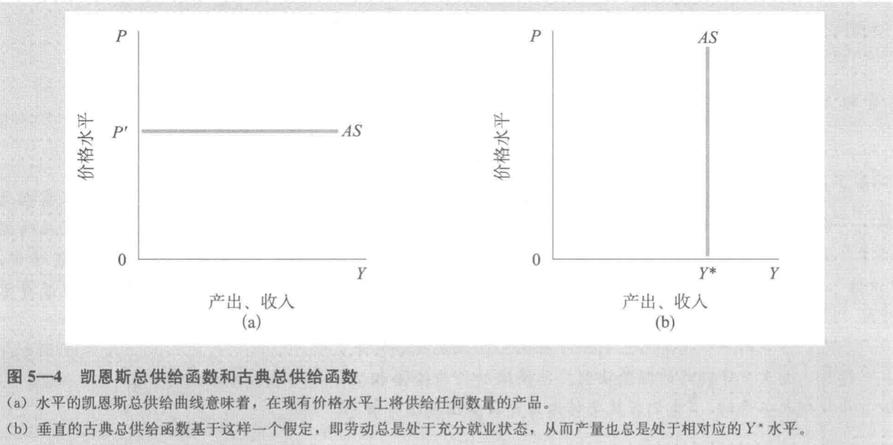

1.导论

2.国民收入核算

2.1 产出的生产与对生产要素的支付

GDP、GNP 和 GNI

要素报酬

2.2 支出与需求的构成

基本的国民收入核算恒等式：
$$
Y \equiv C + I + G + NX
$$
2.3 一些重要的恒等式

2.4 国内生产总值的衡量

最终产品与增加值

当期产出

计量 GDP 时的问题

2.5 通货膨胀与价格指数
实际 GDP 与名义 GDP

通货膨胀与物价

价格指数

- GDP 平减指数
- 消费价格指数与生产价格指数

失业

利率和实际利率

汇率

3.增长和积累

**增长核算**解释产出增长中的各部分归因于哪些不同生产要素（资本、劳动等）的增长。**增长理论**帮助我们理解经济决策如何控制生产要素的积累，例如，当前的储蓄率如何影响未来的资本存量。

增长核算

使用生产函数研究增长的两个来源。产出增长是通过要素投入的增加和源于技术进步所导致的生产率提高，以及劳动来实现的。$Y = AF(K,N)$ 。

$\Delta Y/Y = [(1-\theta) \times\Delta N/N] + (\theta \times \Delta K / K) + \Delta A /A$

**增长核算方程的推导**

增长的经验估算

索洛剩余

增长理论：新古典模型

新古典增长理论将注意力集中于资本积累以及它与储蓄决策等方面的联系。这方面的研究以索洛的贡献最为著名。

内生增长理论则将注意力集中于技术进步的决定要素上。

新古典增长理论从**稳态均衡**假定开始，经济的稳态均衡就是人均 GDP 于人均资本结合在经济保持静止状态之处，也就是人均经济变量不再改变之处，即 $\Delta y = 0$，且 $k = 0 $ 。

4.增长与政策

增长理论：内生增长

趋同

增长政策

人口增长与马尔萨斯

5.总供给与总需求

宏观经济学关注整体经济的行为，即关注繁荣与衰退、经济中产品与劳务的总产出、通货膨胀率与失业率。本章关注构成经济周期的短期波动。

总供给曲线

总供给曲线描述了对于给定的价格水平，厂商愿意提供的产量。短期 AS 曲线是水平的（凯恩斯的总供给曲线，Keynesian aggregate supply curve）；长期 AS 曲线是垂直的（古典总供给曲线，classical aggregate supply curve）。

古典总供给曲线

凯恩斯总供给曲线

摩擦性失业和自然失业率

总供给曲线和价格调整机制

总需求曲线

总需求曲线显示了商品市场与货币市场同时处于均衡状态下的价格水平与产出水平的结合。

不同供给假定下的总需求政策

- 凯恩斯情况
- 古典情况

供给学派经济学

长期内将总供给和总需求放在一起

6.总供给和菲利普斯曲线

通货膨胀和失业

滞胀、预期通货膨胀及附加预期的菲利普斯曲线

理性预期革命

工资-失业关系：为什么工资是黏性的？

从菲利普斯曲线到总供给曲线

供给冲击

失业与通货膨胀：评估权衡

7.失业

贝弗里奇曲线

失业的解剖

充分就业

失业的代价

8.通货膨胀

通货膨胀的成本

通货膨胀与指数化：防止通货膨胀影响的经济

轻微通货膨胀对经济有好处吗？

9.政策预览

10.收入与支出

总需求与均衡产出

消费函数与总需求

乘数

政府部门

预算

充分就业的预算盈余

11.货币、利息与收入

商品市场与 IS 曲线

货币市场与 LM 曲线

商品市场与货币市场的均衡

总需求曲线的推导

IS-LM 模型的规范分析

12.货币政策与财政政策

货币政策

零利率约束与非常规货币政策

财政政策与挤出

产出结构与政策组合

实践中的政策组合

国际联系

消费与储蓄

投资支出

货币需求

联邦储蓄、货币与信用

政策

金融市场与资产价格

国家债务

衰退与萧条

通货膨胀与恶性通货膨胀

国际调整与相互依存

前沿课题

