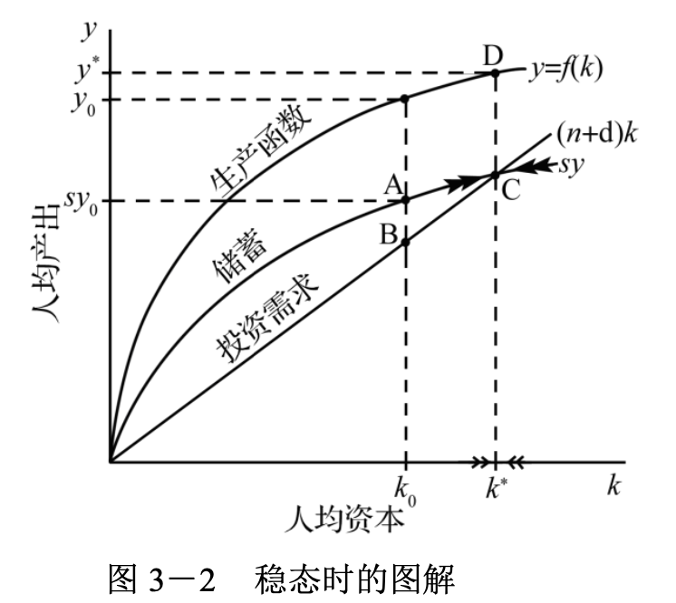
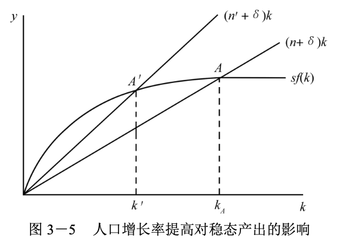
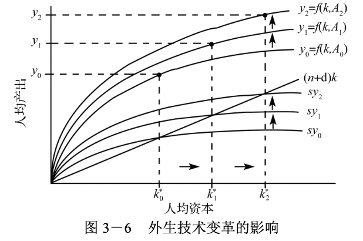
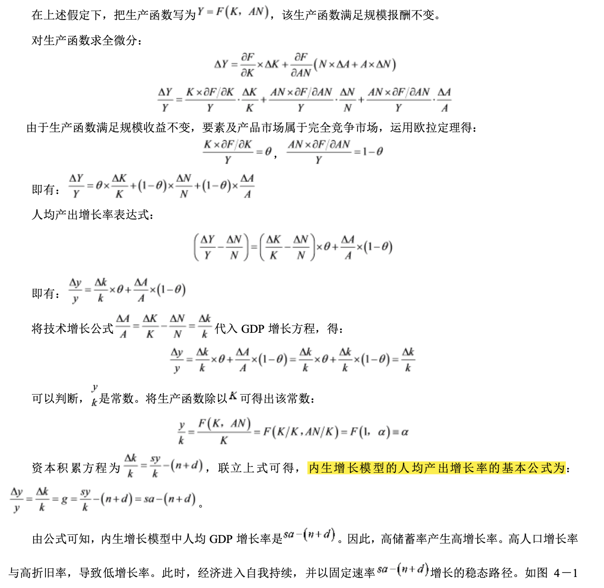
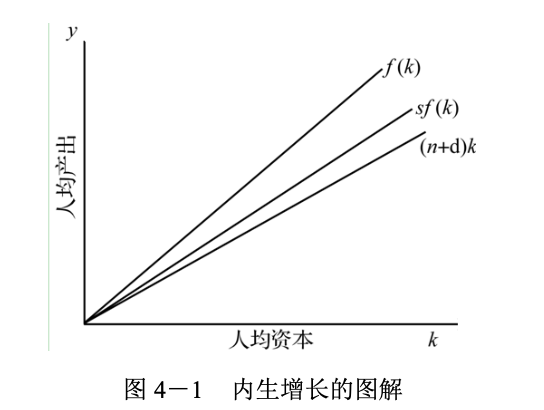

## 1.导论

1.宏观经济学主要讨论总体经济的运行。具体包括：

- 经济增长问题：收入、就业机会的变化；
- 经济波动问题：失业、通货膨胀问题；
- 经济政策：政府能否、以及如何干预经济，改善经济的运行。

2.宏观经济学的三类模型：

- 经济增长模型。主要解释：经济增长的源泉；各国经济增长率差异的原因；经济起飞的原因；投入的积累和技术进步如何导致生活水平的提高。
- 经济波动模型：总供给-总需求模型，解释物价水平与产出的决定与波动。
  - 长期总供给-总需求模型。特点：总供给水平由生产能力决定，与价格水平无关；长期总供给曲线是垂直的；长期总供给曲线位置取决于生产能力。长期中，总供给曲线是垂直的。
  - 短期总供给-总需求模型。短期中，总供给曲线是平坦的。产量只取决于总需求，而价格不受产量水平的影响。

3.经济周期

经济周期又称经济波动或国民收入波动，指总体经济活动的扩张和收缩交替反复出现的过程。现代经济学中关于经济周期的论述一般是指经济增长率的上升和下降的交替过程，而不是经济总量的增加和减少。

一个完整的经济周期包括繁荣、衰退、萧条、复苏（也可以称为扩张、持平、收缩、复苏）四个阶段 。在繁荣阶段，经济活动全面扩张，不断达到新的高峰。在衰退阶段，经济短时间内保持均衡后出现紧缩的趋势。在萧条阶段，经济出现急剧的收缩和下降，很快从活动量的最高点下降到最低点。在复苏阶段，经济从最低点恢复并逐渐上升到先前的活动量高度，进入繁荣。衡量经济周期处于什么阶段，主要依据国民生产总值、工业生产指数、 就业和收入、价格指数、利息率等综合经济活动指标的波动。

经济周期的类型按照其频率、幅度、持续时间的不同，可以划分为短周期、中周期、长周期三类。对经济周期的形成原因有很多解释，其中比较有影响的主要是纯货币理论、投资过度论、消费不足论、资本边际效率崩溃论、资本存量调整论和创新论。

# 2.国民收入核算

### 2.1 国内生产总值

- 国内生产总值（gross domestic product, GDP）：既定时期内，一国所生产的全部最终产品和服务的市场价值。
- 国民生产总值（gross national product, GNP）：是指一国或地区的**国民**所拥有的全部生产要素在一定时期内所生产的全部最终产品（物品和劳务）的市场价值。
- 国民总收入（gross national income, GNI）：在概念上与 GNP 类似，两者之间的细微差别仅涉及间接税的计算。
- 国内生产净值（net domestic product, NDP）：等于 GDP 减去折旧。因此，NDP 更接近于计量既定时期内一国生产商品的净数量：它是生产总值减去在生产该部分产品过程 中所消耗掉的资本量的价值。
- 国民收入（national income, NI）：从 NDP 中扣除企业缴纳的间接税（例如，销售税、财产税和收益税），扣除这些间接税后剩下的、作为支付要素报酬的为 NI ，即对生产要素的支付总额。

### 2.2 支出和需求的构成
支出和需求的构成： $Y = E =  C + I + G + NX$ 。
- 家庭的消费支出：指居民在购买产品与服务时所形成的开支。按支出性质分为：非耐用品（食品、服装、娱乐等）、耐用品（电视机、冰箱、家具等）。 注意：购买房地产不计入消费，而是列入投资。购买房屋，用于出租获得租金收入，是一种投资行为。购买自住房实际上产生隐性租金收入，也按投资算。
- 企业和家庭的投资支出：指非政府个体国内总投资，物质资本存量的增加，包括房屋建设、机器采购、办公楼建设、增加存货等，但不包括购买债券、股票等。
- 政府采购支出：指政府使用财政资金对最终产品与服务的购买，比如基础设施投资、军火采购、公务员工资支出等。注意：转移支付不属于政府采购，它仅仅是收入的再分配，不涉及产品与服务的买卖。
- 净出口：本国出口量减去进口量，是国外居民对国内产出的净需求。

### **2.3 一些重要的恒等式**

- 一种简单的经济：假定一种既没有政府， 也没有对外贸易的简单市场经济。符号 $Y$ 表示其产值，符号 $C$ 表示消费，符号 $I$ 表示投资支出。$I \equiv Y -C \equiv S$ ，投资恒等于储蓄。
- 引进政府和对外贸易：$S - I \equiv (G + TR -TA) + NX$ ，其中 $TA$ 表示所有税收，$TR$ 表示对私人领域的转移支付。
- 储蓄、投资、政府预算与贸易：$\underbrace{S - I}_{私人储蓄超过投资} \equiv \underbrace{(G + TR -TA)}_{政府预算赤字} + \underbrace{NX}_{贸易盈余}$ 。

### 2.4 GDP 核算
GDP 核算：$GDP_i = \sum P_iQ_i$ 。
- GDP 核算原则
  - 最终产品和服务
  - 市场价格原则
  - 流量原则
- GDP 核算中存在的问题
  - 许多经济活动不进入市场。如政府提供的产品与服务（国防、警察等）、家庭劳动、志愿者服务等。
  - 地下经济。市场经济活动并不都进入政府统计范围。如非法的活动（赌博、毒品交易等）；避税原因（现金交易，避开政府税务系统，免交增值税、所得税等）；政府统计遗漏（菜市场里面的交易计入 GDP ，菜市场外面马路上的交易不计入 GDP）。
  - 价格不能准确度量质量提高所增加的福利。
  - 市场价格不能反映生产活动对社会造成的外部性。
  - 由于不同国家产品结构和市场价格的差异，两国国民收入指标难以进行精确比较。
- 名义 GDP 与实际 GDP
  - 名义 GDP ：以当期价格计算当期 GDP 。名义 GDP 变化的因素：实际支出的变化；价格的变化。
  - 实际 GDP ：以不变价格核算每年的 GDP。一般以某一年的价格作为基期价格；排除了价格对 GDP 的影响，真实反映了经济活动规模的变化。

### 2.5 通货膨胀与价格指数

- 通货膨胀率：物价的变化率，物价水平是以前通货膨胀的积累。$\pi = \frac{P_t - P_{t-1}}{P_{t-1}}$ 。

- 价格指数
  - GDP 平减指数（GDP Deflator）：GDP 平减指数 = 名义GDP / 实际 GDP 。
  - 消费价格指数（CPI）：消费价格指数也称零售物价指数和生活费用指数，是反映消费品（包括劳务）价格水平变动状况的一种价格指数，一般用加权平均法来编制。消费价格指数的优点是能及时反映消费品供给与需求的对比关系，资料容易搜集，能够迅速直接地反映影响居民生活的价格趋势。其缺点是范围较窄，只包括社会最终产品中的居民消费品的这一部分，因而不足以说明全面的情况。
  - 个人消费支出平减指数（PCE）：个人消费支出平减指数是一种*权重连锁指数*，计量以国民收入账户中消费部分为基础的消费购买支出方面的通货膨胀。
  - 生产价格指数（PPI）：生产价格指数也称为出厂价格指数，是衡量全部工业产品出厂价格水平的变动趋势和变动程度的重要指标，反映了某一时期生产领域价格变动情况。
  - CPI 与 GDP 平减指数的不同
    - GDP 平减指数计量的是远比 CPI 涉及的范围要广泛得多的商品的价格；
    - CPI 计量的是一篮子年复一年没有变动的给定商品的费用。但 GDP 平减指数中包括的一篮子商品，年年有所不同；
    - CPI 直接包括进口价格，而 GDP 平减指数只包括在美国生产的产品的价格。
  - PPI 与 CPI 的区别
    - 覆盖的范围不同。例如 PPI 包括原料与半成品。
    - PPI 是设计用来计量批发销售系统早期阶段的价格。CPI 计量城市居民实际支付的价格（即处于零售水平的价格），PPI 是由最初的重要商业交易水平的价格构成的。

### 2.6 失业率

失业率是指失业人口占劳动人口的比率（一定时期全部就业人口中有工作意愿而仍未有工作的劳动力数字），旨在衡量闲置中的劳动产能，是反映一个国家或地区失业状况的主要指标。

### 2.7 利率

名义利率：指包括了物价变动的利息率，是与“实际利率”相对而言的。$ r = \pi + p$，名义利率 = 实际利率 + 借贷期内物价的变动率。

实际利率：指物价不变、从而货币购买力不变的条件下的利息率。

### 2.8 汇率

汇率是指外国通货的价格，分为浮动和固定两种：

- 浮动汇率：意味着汇价是由供给和需求决定的。
- 固定汇率：一般通过将该国货币和美元之间按照固定的比率进行交换，进而固定其汇率值。

### 2.9 例题

表 2-1 是来自一个假设国家的国民收入账户信息：

<table align="center" style="width:100; border:#000 solid; border-width:1px 0">
  <caption>表 2-1 一国国民收入账户信息 （单位：美元）</caption>
<tr>
<th style="border:0">GDP</th>
<td style="border:0">6000</td>
</tr>
<tr>
<th style="border:0">总投资</th>
<td style="border:0">800</td>
</tr>
<tr>
<th style="border:0">净投资</th>
<td style="border:0">200</td>
</tr>
<tr>
<th style="border:0">消费</th>
<td style="border:0">4000</td>
</tr>
<tr>
<th style="border:0">政府对商品和劳务的购买</th>
<td style="border:0">1100</td>
</tr>
<tr>
<th style="border:0">政府预算盈余</th>
<td style="border:0">30</td>
</tr>
</table>
计算：

- 1.NDP 

$NDP = GDP - 折旧 = GDP - （总投资 - 净投资）= 6000-(800-200) = 5400$ 美元。

- 2.净出口

$NX = GDP - C - I - G = 6000 - 4000 - 800 - 1100 = 100 $ 美元 。

- 3.政府税收减去转移支付

政府税收减转移支付为 $TA - TR$，

政府预算盈余 $BS = TA -G - TR$，

所以 $TA -TR = BS +G$ 。

因此政府税收减转移支付为 $TA - TR = 30 + 1100 = 1130$ 美元。

- 4.个人可支配收入

$YD = C + S = Y - (TA - TR)$，

而政府预算盈余 $BS = TA -G -TR$，

所以 $TA -TR = BS +G$ 。

故个人可支配收入 $YD = Y - (BS + G) = 6000 - (30 + 1100) = 4870$ 美元。

- 5.个人储蓄

$YD = C + S  => S = YD - C = 4870 - 4000 = 870$ 美元。 

## 3.增长和积累

### 3.1 增长核算

#### 3.1.1 增长核算的概念

增长核算是经济学中解释经济增长的一套理论，该理论主要是对经济增长源泉进行衡量。

一国经济中的国民总收入可以用多种要素建模来解释。在一个简单的模型中主要是资本、劳动力和技术。这里，国民总收入的增长由资本的增长、劳动力的增长以及所采用的技术的提升来解释。国民收入水平、资本存量和劳动力的大小可以通过经济统计来估算。这样数理模型就可以由劳动力、资本和一个余值来解释国民收入水平。这个余值被称为*“全要素生产率”*，用来解释没有被资本和劳动投入水平变化所解释的部分。这个全要素生产率通常被用来衡量所采用的技术的水平，有时也称为“索洛余值”。

20 世纪 50 年代，诺贝尔经济学奖获得者索洛提出了具有规模报酬不变特性的总量生产函数和增长方程，形成了现在通常所说的生产率（全要素生产率）含义，并把它归结为是由技术进步而产生的。按照他的理论，**全要素生产率等于产出增长率与资本增长率和劳动增长率加权之差。**

全要素生产率：全要素生产率指生产活动在一定时间内的效率，它一般的含义为资源（包括人力、物力、财力）开发利用的效率。从经济增长的角度来说，生产率与资本、劳动等要素投入都贡献于经济的增长。从效率角度考察，生产率等同于一定时间内国民经济中产出与各种资源要素总投入的比值。从本质上讲，它反映的则是一个国家（地 区）为了摆脱贫困、落后和发展经济在一定时期里表现出来的能力和努力程度，是技术进步对经济发展作用的综合反映。

#### 3.1.2 增长核算方程及其推导

增长核算方程用生产函数说明技术进步与经济增长的关系，描述了在规模收益不变的情况下，技术、劳动和资本对于产出的贡献情况。

设经济的生产函数为：
$$
Y = A F(K,N)
$$
其中，$Y, K$ 和 $N$ 分别表示总产出、投入的资本量和投入的劳动量，$A$ 表示经济的技术状况，也被称为全要素生产率。

假设资本变动 $\Delta K$ ，劳动变动为 $\Delta N$ ，技术变动为 $\Delta A$ ，则产出变动为：
$$
\Delta Y = MPN \times \Delta N + MPK \times \Delta K + F(K,N) \times \Delta A
$$
其中，$MPN$ 与 $MPK$ 分别表示劳动与资本的边际产出。将方程两边同时除以 $Y = A F(K,N)$ ，可得：
$$
\frac{\Delta Y}{Y} = \frac{MPN}{Y} \times \Delta N + \frac{MPK}{Y} \times \Delta K + \frac{\Delta A}{A} \\
\frac{\Delta Y}{Y} = (\frac{MPN \times N}{Y}) \times \frac{\Delta N}{N} + (\frac{MPK \times K}{Y}) \times \frac{\Delta K}{K} + \frac{\Delta A}{A}
$$
在竞争性的市场上，厂商使用生产要素的原则是，将要素需求量固定在**使要素的边际产量等于要素实际价格的水平上**。因此，表达式 $MPN \times N$ 和 $MPK \times K$ 分别表示劳动和资本的收益，从而表达式 $\frac{MPN \times N}{Y}$ 就是劳动收益在产出中的份额，简称**劳动份额**，用 $(1-\theta)$ 表示；表达式 $\frac{MPK \times K}{Y}$ 就是资本收益在产出中所占的份额，简称**资本份额**，用 $\theta$ 表示。则有方程：
$$
\frac{\Delta Y}{Y} = (1- \theta)\times\frac{\Delta N}{N} + \theta \times \frac{\Delta K}{K} + \frac{\Delta A}{A}
$$
 $产出增长 = （劳动份额 \times 劳动增长）+（资本份额 \times 资本增长） + 技术进步$

其中，$(1-\theta)$ 和 $\theta$ 分别代表收入中劳动获得的份额和收入中资本获得的份额。 

#### 3.1.3 增长核算方程的含义

- 劳动和资本各自的贡献量等于它们各自的增长率乘以该投入在收入中所占份额。

- **$\frac{\Delta A}{A}$ 称之为技术进步或全要素生产率增长的技术进步速度，是在所有投入不变的情况下，由于生产方法改进所导致的产出增加的数额。**

#### 3.1.4 增长核算方程的人均形式

人均 GDP 是 GDP 与人口的比值。在研究增长时，传统上用小写字母来表示人均值，因此定义 $y = \frac{Y}{N}, k = \frac{K}{N}$ ，分别表示人均产出和人均资本。

GDP 的增长率等于人均 GDP 增长率加上人口增长率，即 $\frac{\Delta Y}{Y} = \frac{\Delta y }{y} + \frac{\Delta N}{N}, \frac{\Delta K}{K} = \frac{\Delta k }{k} + \frac{\Delta N}{N}$ 。

在增长核算方程两边同减去人口增长 $\frac{\Delta N}{N}$ ，重新排列后可得：
$$
\frac{\Delta Y}{Y} - \frac{\Delta N}{N} = \theta \times (\frac{\Delta K}{K} - \frac{\Delta N}{N}) + \frac{\Delta A}{A}
$$
增长核算方程的人均形式可写成：
$$
\frac{\Delta y}{y} = \theta \times \frac{\Delta k}{k} + \frac{\Delta A}{A}
$$
其中，$y \equiv Y/N, k \equiv K/N$，分别表示人均产出和人均资本。

### 3.2 增长理论：新古典增长模型

增长理论：增长理论指试图解释生产为什么在一定时期内会增长，并且证实影响这种增长率的要素的理论。由于经济增长一直是经济学研究的焦点之一，理论流派众多，从亚当·斯密和大卫·李嘉图为代表的**古典经济理论**到**哈罗德—多马经济增长模型**，再到索洛含技术进步因素的**新古典经济增长理论**。近年来，又出现了以罗默和卢卡斯为代表人物的**新经济增长理论**。

新古典增长理论将注意力集中于资本积累以及它与储蓄决策等的联系方面。美国经济学家索洛提出了新古典增长模型。

**该理论讨论了资本增长率（$\frac{\Delta K}{K}$）、劳动力增长率（$\frac{\Delta L}{L}$）以及储蓄倾向（$s$）变动对经济增长的影响。**新古典增长理论认为，假定不存在技术进步（$\frac{\Delta A}{A} = 0$），劳动增长率与人口增长率一致（$\frac{\Delta L}{L} = n$），要使人均收入不变，就必须保持人均资本量不变。也就是说：**在人口增长的条件下，维持人均收入不下降，资本增长率等于人口增长率，便达到了经济的稳定状态。**

---

**增长理论可以从三个大的步骤进行说明：首先，了解不同经济变量是如何决定经济的稳定状态的（稳态）；其次，了解经济从当前状态向稳定状态的转变（增长）；最后，将技术进步加入模型（技术）。**

稳态：人均收入与人均资本不变

增长：储蓄率和人口增长率

技术：当有外生技术变革

---

#### 3.2.1 模型的基本假定

1. 社会储蓄函数为 $S = sY$ ，其中 $s$ 为储蓄率。

2. 劳动增长率 $n$ 不变。 

3. 全社会只有一种产品；劳动与资本可以相互替代。

4. 资本的边际产品递减；生产规模报酬不变。

5. 完全竞争市场，工资率和利润率分别等于劳动与资本的边际生产力。

#### 3.2.2 基本方程

在上述假定条件下，索洛推导出新古典增长模型的基本方程为：
$$
\underbrace{\Delta k}_{资本的深化} = \underbrace{sy}_{人均储蓄} - \underbrace{(n+d)k}_{资本的广化}
$$
其中，$k$ 为人均资本，$s$ 为储蓄率，$y$ 为人均产出，$n$ 为人口增长率，$d$  为资本的折旧率。

从而 $sy$ 为社会的人均储蓄，$(n+d)k$ 为新增劳动力所配备的资本数量和资本折旧，称为资本的广化（即意味着为每一个新生的工人提供平均数量的资本存量）；$\Delta k$ 为人均资本的增加，称为资本的深化（即意味着每一个工人占有的资本存量上升）。

因而新古典增长模型的基本方程可以表述为：
$$
资本的深化 = 人均储蓄 - 资本的广化
$$

#### 3.2.3 稳态分析

稳态的原理：

稳态指的是一种长期均衡的状态。当人均收入与人均资本不变时，经济就处于稳定状态。如果储蓄大于必需的投资，工人的人均资本就会增加，从而产出也会上升。如果储蓄少于必需的投资，工人的人均资本和人均产出就会下降。人均收入与人均资本的稳态值和就是向新工人提供资本和重置损耗机器所必需的投资与经济产生的储蓄相等时的值。

人均资本的净变化 $\Delta k$ 是储蓄超过必需投资的部分：
$$
\Delta k = sy - (n+d)k
$$
稳态的条件：**$\Delta k = 0$ 并且 $y^*$ 和 $k^*$ 的值满足 $sy^* = sf(k^*) = (n+d)k^*$ 。**

稳态增长率：$\Delta Y /Y = \Delta K /K = \Delta N / N = n$ ，如图所示：

理解新古典模型的关键是，当储蓄 $sy$ 超过必需的投资线时，$k$ 会出现增长。相应地，当 $sy$ 超过$(n+d)k$ 时，$k$ 必定增大，随着时间的推移，在图 3-2 中，经济将逐渐右移。例如，如果经济从资本—劳动比率 $k$ 起步，由于 A 点的储蓄超过了 B 点的为维持 $k$ 固定不变所要求的投资，水平的箭头表示 $k$ 的增加。
调整过程在 C 点停顿下来。在该点我们已达到资本劳动比率 $k$ ，与该资本劳动比率相关联的储蓄，恰好与必需的投资一致。如果实际投资与必需的投资恰好一致，资本一产出比率既不上升也不下降。我们就达到了稳态。
要注意这个调整过程能从任意初始收入水平引导到 C 点。新古典增长模型的一个重要含义在于，有相同的储蓄率、人口增长率和技术条件（也就是说有同样的生产函数）的各国，最终将在同样的收入水平上趋于一致，尽管趋于一致的过程可能十分缓慢。
在该稳态，$k$ 和 $y$ 都是固定不变的。由于人均收入固定不变，总收入以相同于人口的增长率而增长，即增长率为 $n$ 。由此可见，稳态增长率不受储蓄率的影响。这是新古典增长理论的一个关键结论。

#### 3.2.4 储蓄率对产出增长的影响

新古典增长理论认为储蓄率能带来短期增长，但并不影响长期增长率。

#### 3.2.5 黄金律的资本存量

#### 3.2.6 人口增长对产出增长的影响

人口增长率提高对稳态产出的影响有：

- 增长率的增加降低了人均资本的稳态水平，进而降低了人均产出的稳态水平；
- 人口增长率的上升增加了总产量的稳态增长率。

#### 3.2.7 有外生技术变革的增长

外生技术变革的影响有：

- 外生技术水平的提高引起生产函数和储蓄曲线的上升，从而在更高的人均产出与更高的人均资本处达到新的稳态；
- 人均产出增长率和总产出增长率稳定于 $n+g$ ，独立于储蓄率。

#### 3.2.8 新古典增长理论的结论

1. 稳态中产出增长率是外生的，在这种情况下它等于 $n$ ，独立于储蓄 $s$ 。

2. 尽管储蓄率的增加不影响稳态增长率，但通过提高资本—产出比率可以提高稳态收入水平。

3. 产量的稳态增长率保持外生。稳态的人均收入增长率由技术进步率决定。总产出的稳态增长率是技术进步率和人口增长率之和。

4. 趋同是新古典理论的最后判断：如果两国人口增长率、储蓄率和生产函数相同，那么它们最终将达到相同的收入水平。

   如果两个国家之间有着不同的储蓄率，那么它们会在稳态中达到不同的收入水平，但是如果它们的技术进步率和人口增长率相同，那么它们的稳态增长率也将相同。

## 4.增长与政策

### 4.1 内生增长理论

内生增长理论是指罗默、卢卡斯等经济学家提出的，用**规模收益递增**和**内生技术进步**来说明一个国家长期经济增长和各国增长率差异的一种经济增长理论。该理论试图将增长率解释为社会决策的函数，特别是储蓄率的函数。修改新古典增长模型中假定的生产函数的形状，在一定程度上就会出现容许自我持续的（即内生的）增长。

#### 4.1.1 基本假设

1. 社会储蓄函数为 $S = sy$ ，其中 $s$ 为储蓄率；

2. 劳动增长率 $n$ 不变；

3. 资本的边际产品不变；

4. 存在外部经济且外部报酬相当大；

5. 技术进步是内生要素，技术与总体经济中每个工人的资本水平成正比例，$A=\alpha K/N = \alpha k$，并假定技术属于劳动增加型。

#### 4.1.2 基本方程

#### 4.1.3 内生增长的更深层次的经济学

与新古典增长理论不同的是，内生增长理论坚持“两个不变”的假设——规模报酬不变和资本边际报酬不变同时存在。正确理解和把握“两个不变”同时并存，这里的关键在于当单要素（资本 $K$）的数量变动如果能通过某一途径同时导致其他要素（如劳动生产率 $A$）发生同方向、同比例的数量变动时，即当技术内生化时 ，所有要素的规模报酬不变性质已经与单要素边际收益不变性质合而为一。

罗默用“资本报酬的外部性”、“人力资本”、“私人报酬”与“社会报酬”区别的引入对此进行了成功地解释。 他提出，投资不仅产生新机器设备，而且产生新的生产方式。尽管厂商攫取了新机器的生产利益（表现为资本的 私人边际报酬递减），但由于思想和方法易于复制，要将发明的新思想和新方法的好处攫取尽并不让其他企业获得好处要困难得多。这就是资本的外部报酬。考虑到人力资本的作用，特别是知识投资，与物质资本的复制相比， 思想复制需要的耗费很少甚至无需耗费。知识的利益只是部分为创造者所攫取，存在相当大的外部好处。考虑到其外部性，就可以理解为什么资本的边际报酬不变而不是递减，这是站在综合考虑资本带给创造者自身和其他人 外部好处的角度给出的观点。经济学家认为，一般的人力资本投资和具体的研究与开发是理解长期增长的关键。

#### 4.1.4 趋同

“趋同”问题的核心是，原先产出水平不同的经济最终会增长到相同的生活标准。 新古典增长理论预言，具有相同的储蓄率、相同的人口增长率并能得到相同技术的各个经济会出现绝对趋同。

换言之，它们都会达到同样的稳态收入水平。条件趋同是对储蓄率或人口增长率不同的经济所作的预测，即根据索洛增长图形的预测，稳态收入会不同，但增长率最终将相等。

将条件趋同与内生增长理论关于高储蓄率导致高增长率的预言相比较，巴罗在其一系列论文中已指出，虽然投资较多的国家趋向于增长得较快，但高投资对增长的影响看来是暂时性的:投资较高的国家将最终达到较高人均收入的稳定，而不是较高增长率的稳态。这意味着这些国家的趋同确实是有条件的。**因此，尽管内生增长理论在解释技术上居领先地位的国家的增长也许十分重要，但在解释增长率的国际差异方面却不太重要。**

#### 4.1.5 内生增长理论的结论

1. 内生增长理论依赖于可积累要素的规模报酬不变，以产生持续增长；

2. 作为内生增长理论基础的微观经济学强调，当厂商不能获取某些投资收益时，社会报酬与私人报酬有差异；

3. 技术进步率取决于储蓄，特别是致力于人力资本的储蓄；

4. 储蓄率的增长在提高产出水平的同时也提高产出增长率，即储蓄的增加会导致产出持续增长；

5. 内生增长理论在解释增长率的国际差异方面并不是很重要。

### 4.2 增长陷阱与两部门模型

假定条件

原理说明

### 4.3 增长政策

人口增长

具有内生人口增长的索洛模型的简单形式

如何走出贫困陷阱

#### 4.4 例题

1.什么是内生增长理论？内生增长理论与新古典增长理论的不同。

## 5.总供给与总需求

5.1 总供给曲线

古典总供给曲线

凯恩斯总供给曲线

摩擦性失业和自然失业率

5.2 总供给曲线和价格调整机制

5.3 总需求曲线

总需求曲线概述

产出与价格之间的总需求关系

货币数量论

5.4 不同供给假定下的总需求政策

总供给曲线和总需求曲线共同决定均衡产出和均衡价格

凯恩斯情况下的总需求政策

古典情况下的总需求政策

5.5 供给学派的经济学

5.6 长期内将总供求放在一起

## 6.总供给与菲利普斯曲线

6.1 通货膨胀和失业

菲利普斯曲线

政策性替代

6.2 滞胀、预期通货膨胀和附加预期的菲利普斯曲线

预期通货膨胀

附加预期的菲利普斯曲线

滞胀

6.3 理性预期革命

6.4 工资-失业关系：为什么工资是黏性的

6.5 从菲利普斯曲线推导总供给曲线

6.6 供给冲击

6.7 失业和通货膨胀——评估权衡

## 7.失业

7.1 失业的解剖

7.2 充分就业

7.3 失业的代价

## 8.通货膨胀

8.1 通货膨胀的成本

8.2 通货膨胀与指数化：防止通货膨胀影响的经济

## 9. 政策预览

9.1 关于政策实践的一个媒体水平的观点

9.2 作为规则的政策

9.3 利率和总需求

9.4 计算如何达到政策目标

## 10. 收入与支出

10.1 总需求与均衡产出

10.2 消费函数与总需求

10.3 乘数

10.4 政府部门

10.5 预算

## 11. 货币、利息与收入

11.1 商品市场与 IS 曲线

11.2 货币市场与 LM 曲线

11.3 商品市场与货币市场的均衡

11.4 总需求曲线的推导

11.5 财政政策乘数与货币政策乘数

## 12. 货币政策与财政政策

12.1 货币政策

12.2 零利率约束和非常规货币政策

12.3 财政政策与挤出

12.4 产出构成与政策组合

## 13. 国际联系

13.1 国际收支与汇率

13.2 长期汇率

13.3 商品贸易、市场均衡与贸易余额

13.4 资本的流动性

13.5 蒙代尔-弗莱明模型：固定汇率制下的资本完全流动性

13.6 资本完全流动性与浮动汇率制

## 14.消费与储蓄

14.1 消费函数之谜

14.2 消费与储蓄的生命周期—持久性收入理论

14.3 不确定情况下的消费：现代分析方法

14.4 消费行为的深层方面

