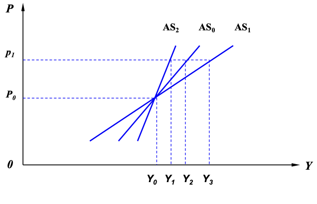

> 人文社会科学、经济科学本质上来讲是一门历史的科学。

B 站视频：[浙江大学叶航宏观经济学全84课](https://www.bilibili.com/video/BV1Yx411x7Ba?p=1)

配套教材、课件和课后习题答案：

链接: https://pan.baidu.com/s/1fMGW-0a2VqoLq_6Y8H35FA  

密码: w277

<!-- more -->

## 导论

### 宏观经济学是什么

叶航的定义：宏观经济学是以整个国民经济活动为研究对象，采用总量分析的方法，研究社会经济活动各种总量关系及其变化规律的经济学。

### 宏观经济学和微观经济学的区别

（如果有微观经济学的基础，可以从生活中的例子引出微观和宏观的比较）

叶航将微观和宏观的区别归纳：

### 凯恩斯革命

[1929年经济危机短片（Docu - The Crash of 1929）](https://www.youtube.com/watch?v=FAZjlxWNszw)

凯恩斯（1883-1946）是马歇尔（1842-1924）的学生，在20世纪30年代资本主义经济危机中，凯恩斯对马歇尔所主张的市场可以自由调节经济产生质疑，起初他通过一系列的讲座对马歇尔的观点进行讨论，后来将思想集中写在《就业、利息与货币通论》一书，成为宏观经济学的开山之作。

在通论的引言中，凯恩斯对经济危机产生原因归纳为建立在心理作用基础上的三点规律：

不同于主张完全任由市场，凯恩斯的反危机政策包括：

- 政府通过反危机政策干预经济
- 通过政府购买来扩大有效需求
- 通过政府财政赤字降低失业率

（发放钞票、深矿埋金、挖沟填埋）

从凯恩斯有效需求理论可知，当 I 不等于 S 的时候，可以通过政府调控和进出口进行调节。但是在对外贸易中，进出口的调整还取决于贸易国的意愿，所以采用政府调控的手段最方便。政府宏观调控的主要方式有：发放货币、税收、财政收支，发放货币可以引起流通中的货币量增加、影响利率，税收、财政转移支付也可以调节储蓄和投资。因此，第一个层面，凯恩斯认为自由放任的市场会失效，主张政府通过宏观调控来对付危机，第二个层面主要主张通过政府购买和财政赤字来进行调整。

从有效需求理论来看，凯恩斯认为总供给和总需求与就业水平是紧紧联系的，但是总供给和总需求均衡时产生的就业水平不等于社会最优的就业水平，因为社会最优的就业水平还需要考虑社会需要就业的劳动力总量。

后来凯恩斯的思想被罗斯福采纳，也就是“罗斯福新政”，帮助美国度过了经济危机。罗斯福比较著名的还有“黄金法案”来平息在银行挤兑黄金潮，“黄金法案”的内容众多，其中重要的一点是“美元不直接兑黄金”，而是说模棱两可的可以用美元兑换法定货币，直到20世纪70年代年有一个较真的农民想要弄清楚怎么兑换法定货币，引起美元挂钩的讨论，于是美国1971年宣布美元脱离金本位制。

### 马克思、马歇尔和凯恩斯

> “马克思是在设法了解这个制度，以加速它的倾覆。马歇尔设法把它说得可爱，使它能为人们接受。凯恩斯是在力求找出这一制度的毛病所在，以便使它不至于毁灭自己。”（琼·罗宾逊:《马克思、马歇尔和凯恩斯》，商务印书馆1963年版，第14页。）

### 宏观经济学的内容与体系

### 课程大纲

0.导论

1.宏观经济变量

- 总产出
- 消费、储蓄和投资
- 货币需求与货币供给

2.宏观经济模型

- 有效需求决定模型
- IS-LM 模型
- AD-AS 模型

3.宏观经济运行

- 通货膨胀
- 经济增长
- 经济周期

4.宏观经济调控

- 宏观经济调控政策
- 宏观经济调控效应
- 宏观经济调控技术

5.宏观经济流派

- 新古典综合派
- 货币学派
- 供应学派
- 理性预期学派
- 新凯恩斯主义

## 宏观经济变量

宏观经济变量

- 总产出
- 消费、储蓄和投资
- 货币需求与货币供给
- 通货膨胀（物价指数）
  - （1）消费物价指数（居民消费价格指数）（CPI） 
  - （2）零售物价指数（商品零售价格指数）（RPI）
  -  （3）批发物价指数（工业品出厂价格指数）（WPI）

### 总产出

#### 总产出核算的指标

- 国内生产总值
- 国民生产总值
- 其他指标
  - 国民净产值
  - 国内净产值
  - 国民收入
  - 个人收入
  - 个人可支配收入

#### 总产出核算的办法

- 收入法
- 支出法

#### 总产出核算的校正

消费者价格平减指数

购买力平价

### 消费、储蓄与投资

#### 消费、消费函数与消费倾向

##### 消费

一个国家或地区一定时期内居民个人或家庭为满足消费欲望而用于购买消费品和劳务的所有支出。

##### 消费函数

指消费支出与决定消费的各种因素之间的依存关系。

影响居民个人或家庭消费的因素很多，如收入水平、消费品的价格水平、消费者个人的偏好、消费者对其未来收入的预期、甚至消费信贷及其利率水平等等，但其中最重要的无疑是居民个人或家庭的收入水平。**因此，宏观经济学假定消费及其消费的规模与人们的收入水平存在着稳定的函数关系。**
$$
C = c(Y)
$$

假设将消费函数视为简单的线性函数：
$$
C = 
\underbrace{a}_{自发性消费} + 
\underbrace{bY}_{诱致性消费} \quad (0 < b<1)
$$

3.消费倾向：消费与收入的比率

- 平均消费倾向：$APC = \frac{C}{Y}$
- 边际消费倾向：$MPC = \frac{\Delta C}{\Delta Y}$

#### 储蓄、储蓄函数与储蓄倾向

##### 储蓄

一个国家或地区一定时期内居民个人或家庭收入中未用于消费的部分。

##### 储蓄函数

指储蓄与决定储蓄的各种因素之间的依存关系。

影响储蓄的因素很多，如收入水平、财富分配状况、消费习惯、社会保障体系的结构、利率水平等等，但其中最重要的无疑是居民个人或家庭的收入水平。 **因此，宏观经济学假定储蓄及其储蓄规模与人们的收入水平存在着稳定的函数关系。**

以S代表储蓄，Y代表收入，可以用公式表示为:
$$
S = s(Y)
$$

因为 $S+C=Y$，则在线性假设下：
$$
S = Y - C \\
= Y-（a+bY）\\
= - a + (1-b)Y \quad (0 <b <1)
$$

3.储蓄倾向：储蓄与收入的比率

(1)平均储蓄倾向：储蓄总量与收入总量的比率, 简称APS。根据定义有:

$APS = \frac{S}{Y}$

(2)边际储蓄倾向：储蓄增量与收入增量的比率，简称MPS。根据定义有: 

$MPS=\frac{\Delta S}{\Delta Y}$

(3)消费倾向与储蓄倾向的关系

对收入来说储蓄函数与消费函数为互补函数，即Y = C + S，如果在该式两边同除Y有Y/Y = C/Y + S/Y，即: 

**APC + APS = 1**

**1 - APC = APS**

**1 - APS = APC**

与上同理，我们有ΔY = ΔC + ΔS；如果在两边同除ΔY，则有ΔY/ΔY = ΔC/ΔY +ΔS/ΔY，即:

**MPC + MPS = 1 **

**1 - MPC = MPS **

**1 - MPS = MPC**

#### 投资、投资函数与投资的边际效率

##### 投资

一个国家或地区一定时期内社会资本的形成和增加。从会计学的角度看，对磨损的补偿就是折旧，也称重置投资。因此有：净投资 = 投资 - 折旧（重置投资），或者净投资 = 期末的资本存量-期初的资本存量。

但对宏观经济学来说，严格区分投资和净投资意义不大。因为不论是净投资还是折旧（重置投资），都是当年的投资支出，都构成对当年资本品市场的社会需求。**宏观经济学在分析总供给和总需求时，为了使问题简单化，往往假定折旧为零。**

##### 投资函数

影响投资的因素是很多，如货币供求状况、利率水平、投资品的价格水平、投资者个人的资金状况、投资者对投资回报的预期、甚至一个国家或地区的投资环境等等，但国内私人投资来说，其中最重要的无疑是利率水平的高低。**因此，宏观经济学假定投资及其投资的规模与一定时期的利率水平存在着稳定的函数关系。**如果我们以 I 代表投资，以 r 代表利率，则上述关系可以用公式表示为：

$$
I = i(r)
$$

如果视为线性函数，可以写为：
$$
I = 
\underbrace{\alpha}_{自发性投资} + 
\underbrace{\color{red}{\underbrace{\beta}_{投资系数}} r}_{诱发性投资}
$$
如同在微观经济学中曲线上的移动和曲线的平移，投资量也会表现出两种类似的变化。

上图中，随着利率水平的变化，使投资量沿着同一条投资曲线移动。

如果利率水平不变，由其它因素引起的投资量变动，在坐标系中则表现为投资曲线的移动。如下图所示：

投资曲线水平移动的原因有：厂商预期、风险偏好、政府投资。

##### 投资的边际效率

投资的边际效率是指投资收益的增量与投资增量的比率，简称为 MEI 。
$$
MEI = \frac{\Delta R}{\Delta I}
$$
随着投资规模 I 的增加，投资的总收益 TR 也在不断增加，但是收益增加的速率（投资的边际效率）具有递减的趋势：

用 MEI 曲线表示则为：

投资的边际效率曲线向右下方倾斜，说明投资收益率存在着一种递减的趋势。因为：

- 第一，在竟争性的市场中，一旦某种产品的生产有较高的投资收益率，许多厂商都会增加对该部门的投资，结果使该产品的供给增加、价格回落，从而导致投资收益率的降低；
- 第二，在竞争性的市场上，如果许多厂商都增加对高收益部门的投资，结果还将使投资所需的机器设备、原材料等投入品的需求增加，价格上涨，从而导致投资成本的增大，即便产品的销售价格不变，投资的边际收益率也会降低。

### 货币需求与货币供给

#### 货币需求

交易性货币需求、预防性货币需求与生产规模成正比

$$
L_1 = f(Y) = k Y
$$

投机性货币需求与同期银行利率水平成反向关系
$$
L_2 = f(r) = - hr
$$

##### 流动性陷阱

指利率水平较低、证券市场的获利空间较大时，人们对货币的流动性偏好趋于无限大的现象，也称凯恩斯陷阱。

流动性过剩 ——> 现金（$M_0$）过剩

##### 货币总需求
$$
L = L_1 + L_2 = k Y - hr
$$

#### 货币供给

现金货币：由一个国家央行发行的货币。

存款货币：由一个国家商业银行经营活动创造的货币。

货币乘数：如果用 M 表示货币供给，R 表示中央银行发行的现金，r 表示准备金率，则 $M = R \cdot 1/r$ 。

#### 货币市场的均衡

##### 古典货币市场的均衡

古典货币市场的均衡机制，市场利率在均衡过程中起了决定性的作用。

当利率水平较低时，如上图中的 $R_1$ ，市场上货币需求的量超过货币供给的量，从而促使利率水平上扬；当利率水平较高时，如上图中的 $R_2$，市场上货币供给的量超过货币需求的量，从而促使利率水平下降。只有一个合适的利率水平，如上图中的 $R_0$，才能保证市场上货币供求的均衡。**这一利率水平就是所谓的均衡利率。**

##### 现代货币市场的均衡

现代货币市场中货币供求的均衡完全是由政府控制的，政府可以根据自己的目的确定货币供应量的多少，并根据货币供应量的多少来调控市场利率水平。

上图中，当货币供给由 $M_0$ 扩大至 $M_1$ 时，利率水平则由 $r_0$ 降低至 $r_1$ ；反之，如果货币供给由 $M_1$ 减少至 $M_0$ ，利率水平则由 $r_1$ 上升至 $r_0$ 。

## 有效需求模型

> 模型是经济学家分析经济现象的关系，模型主要建立经济变量之间的关系。

何为有效需求理论？

按照凯恩斯理论，之所以出现“大萧条”，是因为有效需求不足，有效需求不足是由于存在**边际消费倾向递减规律**、**资本边际效率递减规律**和**流动性陷阱**（有些教材认为第三个基本因素为“流动性偏好”，差异不大）这三个基本心理因素。这三个基本心理因素造成市场机制不能使总需求与总供给在充分就业水平上达到均衡，必然会出现萧条和失业。**对此，凯恩斯主张政府干预经济，通过调节经济来维持经济的稳定。考虑到此时经济陷入流动偏好陷阱，货币政策效果不理想，凯恩斯推崇采用财政政策来进行总需求管理。**

边际消费倾向递减规律：按照凯恩斯的消费理论，消费曲线是以递减的速率单调上升，因此消费的增加存在一个上限，存在—个极大值。当消费达到极大值时，无论怎样增加可支配收入，消费都不会进一步增加。如果消费达到极大值时的消费不能实现充分就业，那说明消费是不足的。

资本边际效率递减：原因是在经济萧条的情况下，投资的收益率（资本的边际效率）低，投资者不投资或少投资，这样经济更加萧条，投资的收益率（资本的边际效率）更低，更不投资 ...... 形成恶性循环。资本边际效率递减的后果是：投资的增加存在一个上限，存在一个极大值，不可能无限制地增加。

流动性陷阱：当利率极低时，有价债券的价格会达到很高，人们为了避免因有价债券价格跌落而遭受损失，几乎每个人都宁愿持有现金而不愿持有有价债券，这意味着货币需求会变得完全有弹性，人们对货币的需求量趋于无限大，表现为流动偏好曲线或货币需求曲线的右端会变成水平线。在此情况下，货币供给的增加不会使利率下降，从而也就不会增加投资引诱和有效需求，当经济出现上述状态时，就称之为流动性陷阱。由此可见，货币的价格利率也存在刚性，货币政策会失效。

#### 有效需求与充分就业

**有效需求决定社会的就业水平，但不决定社会的充分就业。**

##### 有效需求决定就业水平

有效需求：总供给价格与总需求价格达到均衡时的社会产出总量和需求总量。

总供给价格：指该社会全体厂商销售其产品时期望得到的最低价格总额。

总需求价格：指该社会全体居民购买消费品时愿意支付的最高价格总额。

为什么 AS 的斜率高于 AD?

##### 充分就业与失业

**（1）充分就业**：是指一个社会不存在非自愿失业时的就业状态，即充分就业并非全都有工作，充分就业时依然存在自愿失业和摩擦性失业。自愿失业和摩擦性失业合称自然失业。自然失业与全部劳动力之比为自然失业率。

**（2）自愿失业**：具有劳动能力的人出于种种原因自愿放弃工作而形成的失业。

**（3）摩擦性失业**：就业状态暂时中断而形成的失业。

**（4）非自愿失业**：有劳动能力且愿意接受现行工资水平或工作条件但仍然找不到工作而形成的失业。非自愿失业是由于经济衰退和萧条而造成的，因而也称周期性失业。

3.有效需求与充分就业的关系

宏观不同于微观，还需要考虑经济整体的运行情况。充分就业不仅要看 $N_0$，还要考虑需要就业的劳动力供给总量。

$N_0$ = 充分就业  （充分就业均衡）

$N_0$ > 充分就业  （通货膨胀条件下的就业状态）

$N_0$ < 充分就业  （经济衰退条件下的就业状态）

#### 有效需求的决定

##### 两部门经济

总供给：Y = C + S  （收入法）
总需求：Y = C + I   （支出法）

总供给 = 总需求：I = S

I = S（总需求 = 总供给） 经济增长均衡

I < S（总需求 < 总供给） 经济增长收缩

I > S（总需求 > 总供给） 经济增长扩张

##### 三部门经济

总供给:**Y = C + S +T·················**(**1**) 

总需求:**Y = C + I + G ················**(**2**)

 (总需求)**I + G = S + T**(总供给)**·······**(**3**)

 **I = S +**(**T - G**)**············**(**4**)

**I = S +**(**T - G**)（总需求 **=** 总供给）经济增长均衡

 **I < S +**(**T - G**)（总需求 **<** 总供给）经济增长收缩 

**I > S +**(**T - G**)（总需求 **>** 总供给）经济增长扩张

要使得 I=S，从 I 的角度来看，降低利率可以刺激投资，但是消费者预期很悲观，利率降的太低会陷入流动性陷阱。所以在经济衰退时，政府可以通过财政赤字调控，（T-G）也被称为财政因子。

##### 四部门经济

总供给:**Y = C + S +T + M············**(**1**)
 总需求:**Y = C + I + G + X············**(**2**) 

(总需求)**I + G + X = S + T + M**(总供给)**···**(**3**) 

**I = S +**(**T - G**)**+**(**M -X**)**·········**(**4**) 

**I=S+**(**T-G**)**+**(**M-X**)（总需求**=**总供给）

**I<S+**(**T-G**)**+**(**M-X**)（总需求**<**总供给）

**I>S+**(**T-G**)**+**(**M-X**)（总需求**>**总供给）

进出口的自主权在贸易国，所以凯恩斯认为政府通过财政收支来调节经济是比较有效的。

#### 有效需求的变动及其趋势

##### 有效需求的变动

考虑两部门经济：

**Y = C + I···············**(**1**)
 **C = a + bY············**(**2**) 

(2)式代入(1)式，有:

 **Y=(a+I)/(1-b)····**(**3**)

例题:
 例**1**:已知消费函数C = 1000 + 0.8Y，投资I = 600亿元，求总产出水平Y。

解:Y = 1000 + 600 / 1 - 0.8 = 8000(亿元)

 例**2**:假设上述消费函数中自发性消费a由1000亿元减少至900亿元，投资I仍为600亿元，求总产出水平Y。

 解:Y = 900 + 600 / 1 - 0.8 = 7500(亿元)

例**3**:假设消费函数仍为C = 1000 + 0.8Y，投资规模I由600亿元扩大至650亿元，求总产出水平Y。

解:Y = 900 + 650 / 1 - 0.8 = 8250(亿元)

> 宏观经济学中有乘数效应，投入石头会引起一波一波的变动。

##### 消费乘数与投资乘数

在投资I不变的条件下，由**消费变化**ΔC引起的产出变化ΔY，根据式(3)来推导: ΔY = Δa ·(**1 / 1 – b** )**··································** (**4**)

在消费C不变的条件下，由**投资变化**ΔI引起的产出变化ΔY，根据式(3)来推导: ΔY = ΔI ·(**1 / 1 – b** )**··································** (**5**)

**式(4)中的1 / 1 - b称为消费乘数**，记作$K_c$。

式(5)中的1 / 1 - b称为投资乘数，记作$K_I$。

例题:

假设边际消费倾向b = 0.8,消费或投资扩大100亿元，则由它引发的有效需求的变动为: 

$$
100+100\cdot 0.8+100 \cdot0.8 \cdot 0.8 + \cdots \\

=100 \cdot (0.8^0 + 0.8^1+0.8^2+···+0.8^{n-1})  \\

=100\cdot(1/1-0.8)=500
$$

“破窗理论”、“蜜蜂的寓言”与节约悖论

##### 有效需求的不足及其原因

(1)边际消费倾向递减规律

(2)投资的边际效率递减规律

 (3)灵活偏好与流动性陷阱

凯恩斯认为：在常规的市场经济下，由于这三大规律的存在，S>I 是常规的状态，经济总会趋于衰退。

这和马克思所说的资本主义经济总会出现过剩的结论一致，但马克思是从生产社会化和生产资料私人占有之间的矛盾。

##### 政府对有效需求的调节

三部门经济的收支平衡

**Y = C + I + G···················**(**1**) 

消费函数为:

**C = a + bY························**(**2**) 

考虑财政转移支付g和政府税收T，居民消费的可支配收入 $Y_d$ 为:

Y_d = Y + g - T··················(3) 

调整后的消费函数为:

**C=a+b(Y+g-T) ·················**(**4**) 

把式(4)代入式(1)整理后则有:

**Y =**(**a + I + G + bg - bT**) **/ (1-b)·····**(**5**)

##### 各项政府乘数

(1)**政府购买**对有效需求的影响:
 ΔY = ΔG · (**1/1-b**) 上式中的1/1-b就是所谓的政府购买乘数，记作K_G。

(2)**政府转移支付**对有效需求的影响:
 ΔY = Δg · (**b/1-b**) 上式中的b/1-b就是所谓的政府转移支付乘数，记作K_g。

(3)**政府税收**对有效需求的影响: ΔY = ΔT · (**-b/1-b**)

上式中的-b/1-b就是所谓的政府税收乘数，记作K_T。

##### 两种税收形式下的各项乘数

税收有定额税和比例税之分，如果我们考察的是两种形式的税收，则税收

T’= T + tY，式中T为固定税，t为比例税率，在这一情况下居民的可支配收入为:

Y_d **= Y + g - T - tY··················**(**1**)

相应的消费函数为:

**C = a + b**(**Y + g - T - tY**)**··········**(**2**) 

将式2代入**Y=C+I+G,**有:

**Y =**(**a + I + G + bg - bT**) **/ (1 - b + bt)**(**3**)

由式3推导而来的各项乘数则将改写为: 
K_C=K_I=K_G=1/(1-b+bt)
K_g= b/(1-b+bt)
K_T= -b/(1-b+bt)

## IS-LM 模型

#### 商品市场的均衡与 IS 曲线

##### IS 曲线的推导

a 和 $\alpha$ 是自发性，模型中给定的。

例题**1**:已知消费函数C = 200+0.8Y，投资函数I = 300-5r；求IS曲线的方程。

 解:A = (a+α)/β=(200 + 300)/ 5 = 100

B = (1-b)/β=(1 - 0.8)/ 5 = 0.04 

IS曲线的方程为:r = 100 - 0.04Y

##### IS曲线的经济含义

（1）IS曲线是一条描述商品市场达到宏观均衡即 I = S 时，总产出与利率之间关系的曲线。

（2）在商品市场上，总产出与利率之间存在着反向变化的关系，即利率提高时总产出水平趋于减少，利率降低时总产出水平趋于增加。

（3）处于IS曲线上的任何点位都表示 I = S ，即商品市场实现了宏观均衡。反之，偏离 IS曲线的任何点位都表示 I ≠ S ，即商品市场没有实现宏观均衡。

如果某一点位处于IS 曲线的右边（A点），表示 I < S ，即现行的利率水平过高，从而导致投资规模小于储蓄规模。 

如果某一点位处于IS曲线的左边（B点），表示 I > S ，即现行的利率水平过低，从而导致投资规模大于储蓄规模。

##### IS曲线的水平移动

（1）如果利率没有变化，由外生经济变量冲击导致总产出增加，可以视作原有的IS曲线在水平方向上向右移动。

 （2）如果利率没有变化，由外生经济变量冲击导致总产出减少，可以视作原有的IS曲线在水平方向上向左移动。

##### IS曲线的移动旋转

（1）IS曲线斜率的经济意义：总产出对利率变动的敏感程度。斜率越大，总产出对利率变动的反应越迟钝。反之，斜率越小，总产出对利率变动的反应越敏感。

（2）决定IS曲线斜率的因素：Y的系数(1-b)/β,如果β不变，边际消费倾向b与IS曲线的斜率成反比。如果b不变，投资系数β与IS曲线的斜率成反比。

#### 货币市场的均衡与 LM 曲线

##### LM 曲线的推导

例题**2**:已知货币供应量M = 300，货币需求量L = 0.2Y - 5r;求LM曲 线的方程。
 解:E = - m/h = - 300 / 5 = - 60 F = k/h = 0.2 / 5 = 0.04

LM曲线的方程为:r = - 60 + 0.04Y

##### LM曲线的经济含义

(1)LM曲线是一条描述货币市场达到宏观均衡即L = M时，总产出与利率之间关系的曲线。

(2)在货币市场上，总产出与利率之间存在着正向变化的关系，即利率提高时总产出水平 趋于增加，利率降低时总产出水平趋于减少。

(3) 处于LM曲线上的任何点位都表示L = M，即货币市场实现了宏观均衡。反之，偏离 LM曲线的任何点位都表示L ≠ M，即货币市场没有实现宏观均衡。如果某一点位处 于LM 曲线的右边，表示L > M，即现行的利率水平过低，从而导致货币需求大于货 币供应。如果某一点位处于LM曲线的左边，表示 L < M，即现行的利率水平过高， 从而导致货币需求小于货币供应。

##### LM曲线的水平移动

(1)如果利率没有变化，由外生经济变量冲击导致总产出增加，可以视作原有

的LM曲线在水平方向上向右移动。

 (2)如果利率没有变化，由外生经济变量冲击导致总产出减少，可以视作原有的LM曲线在水平方向上向左移动。

##### LM曲线的旋转移动

(1)LM曲线斜率的经济意义:总产出对利率变动的敏感程度。斜率越小，总 产出对利率变动的反应越敏感，反之，斜率越大，总产出对利率变动的反 应越迟钝。

(2)决定LM曲线斜率的因素:Y的系数(k/h)，如果h不变，k与LM曲线的 斜率成正比，如果k不变，h与LM曲线的斜率成反比。

#### 商品市场、货币市场的同时均衡与 IS-LM 曲线

##### 宏观经济的均衡状态

（1）均衡的决定：

例题**3**:已知IS曲线的方程为r = 100 - 0.04Y，LM曲线的方程为r = - 60 + 0.04Y;求 均衡的产出水平和利率水平及其图象。

解:解联立方程得Y = 2000;r = 20。

（2）均衡的变动

LM曲线不变，IS曲线水平方向左右移动，均衡状态将随之变动(下左图)。

IS曲线不变，LM曲线水平方向左右移动，均衡状态也将随之变动(下右图)。

##### 宏观经济的非均衡状态

（1）一个市场均衡，另一个市场不均衡

**A**点 **I=S L**<**M **

**B**点 **I**<**S L=M **

**C**点 **I**>**S L=M**

**D**点 **I=S L**>**M**

（2）两个市场同时不均衡

I点 **I**<**S L**<**M** 

II点 **I**<**S L**>**M** 

III点 **I**>**S L**>**M** 

IV点 **I**>**S L**<**M**

##### 宏观经济非均衡状态的自我调整

##### 宏观经济非均衡状态的政府调控

若某一宏观经济模型的参数如下:

C = 200 + 0.8Y I = 300 - 5r

L = 0.2Y - 5r
 M = 300 (单位:亿元)

试求:

(1)IS — LM模型和均衡条件下的产出水平及利率水平，并作图进行 分析。

(2)若充分就业的有效需求水平为2020亿元，政府为了实现充分就业， 单独运用扩张的财政政策或货币政策，追加的投资或货币供应分别为多 少?请作出新的IS—LM模型。

(3)若政府在提高收入水平的同时仍想保持原有的利率水平，应采取什 么政策措施?追加的投资或货币供应各为多少?请作图进行分析。

解:
 (1) IS-LM模型为:r=100-0.04Y r=-60+0.04Y

故:Y = 2000 r = 20
 (2) 设动用扩张的财政政策，政府追加的投资为G，则新的IS方程为:

\- 200 + 0.2Y = 300 + G - 5r ，化简为 r = 100 + 0.2G - 0.04Y 求联立方程 r=100+0.2G-0.04Y r=-60+0.04Y 得:Y = 2000 + 2.5G，当Y = 2020时，G = 8

设动用扩张的货币政策，追加的货币供应为M，则新的LM方程为:0.2Y - 5r = 300 + M，化简为r = -60 - 0.2M + 0.04Y

求联立方程 r=100-0.04Y r=-60-M+0.04Y

得:Y = 2000 + 2.5M，当Y = 2020时，M= 8

(3) 同时运用扩张的财政政策和扩张的货币政策，设政府追加的投资为G’，追加的货币供 应为M’，则G’=M’=4

## AD-AS 模型

AD-AS模型与有效需求模型和IS-LM模型有何不同？

凯恩斯创立有效的时候，正是古典货币市场开始向信用货币市场，货币的供给还不能完全由政府说了算，到50年代，现代货币市场形成，希克斯创立 IS-LM，LM 曲线假定实际货币等于名义货币，M=m，当时布雷顿森林黄金体系健全，货币与黄金挂钩稳定，通货膨胀不严重；到70年代，放弃黄金挂钩，通胀高峰期，需要不假定物价水平不变（价格指数不等于 1 ），萨缪尔森考虑了通货膨胀。AD-AS 考虑了物价水平变动，考虑了商品市场、货币市场和劳动力市场三个市场。

总需求（Aggregate Demand）是指社会所有消费者在一个给定的价格水平上愿意并且能够购买的所有商品和劳务的总和。

总供给（Aggregate supply）是指社会所有生产者在一个给定的价格 水平上愿意并且能够提供的所有商品和劳务的总和。

AD-AS 模型是描述商品市场、货币市场和劳动力市场同时处于均衡状态时物价水平和总产出水平相互关系的模型。

#### 总需求函数与 AD 曲线

##### 总需求函数与 AD 曲线的推导

AD曲线的通俗定义：物价指数不等于1时，IS-LM模型的通解。

上述(2)式就是总需求函数，该式表明总产出与总价格水平成反向变化关系。所以在纵 轴代表价格水平P，横轴代表总产出水平Y的坐标中，AD曲线是一条向右下方倾斜的曲线:

如果IS曲线和IM曲线已知，则我们可以求出某一经济状态AD曲线的方程;如果AD曲线已知， 则我们可以根据一定的价格水平推测该经济状态的总收入水平或总产出水平。

例1:已知IS曲线的方程为r=80-0.4Y，LM曲线的方程为r = − 5/4* M/P + 0.4*Y* ， 其中名义货币供给量 M=5000,求AD曲线的方程及其图像。

解:由IS=LM,可得80-0.4Y = − 5/4* *M/P* + 0.4*Y*

再由M=5000,代入上式并化简后可得AD曲线的方程为:Y= 100 + 5000/P

如果P=10,则Y=600;如果P=5，则Y=1100;其图像如下:

上述AD曲线的方程及图像表明，当价格水平为10时，总产出水平为600;当价格 水平下降为5时，总产出水平为1100。两者成反方向变化关系。

图形推导：总需求函数与 AD 曲线的推导

##### AD曲线及其经济含义

(1)AD曲线是一条描述总需求达到宏观均衡即IS=LM时，一个国家总产出水平与价格水平之间关系的曲线。

(2)AD曲线表明总产出Y与价格水平P之间存在着成反向变化的关系。

(3)AD曲线反映了价格水平影响实际货币供给，实际货币供给影响利率水平， 利率水平影响投资水平，投资水平影响产出水平或收入水平这样一个复杂而 迂回的传导机制。

##### AD曲线的水平移动及其经济学意义

物价水平的变化使总需求量在总需求曲线上滑动。如果物价水平不变，其他因 素变化导致总产出的增加或减少，可以用AD曲线的水平移动来表示。总产出增加， AD曲线向右边平移;总产出减少，则AD曲线向左边平移:

##### AD曲线的斜率及其经济含义

如果AD曲线在坐标系中作旋转式移动，则意味作AD曲线斜率的变动。下图中 AD0顺时针方向旋转所产生的AD1，其斜率大于AD0;逆时针方向旋转所产生的AD2其 斜率小于AD0。AD曲线斜率的经济意义是收入或产出对价格变动的敏感程度。斜率越 大，收入或产出对价格变动的反应越迟钝，图中价格由P0降至P1时，AD0所反应的收 入或产出由Y0增加至Y2，而由斜率更大的AD1所反应的收入或产出则只是由Y0增加至 Y1，增加幅度要小。反之，由斜率较小的AD2所反应的收入或产出则由Y0增加至Y3， 增加幅度较大。影响AD曲线斜率的主要因素是β、k、h、b等参数。

---

【总阶】曲线的移动

曲线上的点的上下移动

曲线的平移

曲线的旋转

---

#### 总供给函数与 AS 曲线

##### 总供给曲线的推导

图形推导：

总供给函数:AS=f(P,w,N,Y) = f(P)，反应物价指数和总产出之间的关系。

传导机制：物价——实际工资——就业——总产出——总供给曲线

##### AS曲线的经济含义

（1）AS曲线是一条描述总供给达到宏观均衡时（资源全部调动的全部铲除），一个国家总产出水平与价格水平之间关系的曲线。

（2）AS曲线表明总产出Y与价格水平P之间存在着正向变化的关系。

（3）AS曲线反映了价格水平影响实际工资，实际工资影响就业水平，就业水平影响投资水平，投资水平影响产出水平或收入水平这样一个复杂而迂回的传导机制。

##### AS曲线的水平移动及其经济学含义

物价水平的变化使总供给量在总供给曲线上滑动。如果物价水平不变，其他因 素变化导致总供给的增加或减少，可以用AS曲线的水平移动来表示。总供给增加， AS曲线向右边平移;总供给减少，则AS曲线向左边平移:

##### AS曲线的斜率及其经济含义

如果AS曲线在坐标系中作旋转式移动，则意味作AS曲线斜率的变动。下图中AS0顺时 针方向旋转所产生的AS1，其斜率小于AS0;逆时针方向旋转所产生的AS2其斜率大于AS0。 **AS曲线斜率的经济意义是收入或产出对价格变动的敏感程度。**斜率越大，收入或产出对价格变动的反应越迟钝，图中价格由P0升至P1时，AS0所反应的收入或产出由Y0增加至Y2，而 由斜率较小的AS1所反应的收入或产出则由Y0增加至Y3，增加幅度较大。反之，由斜率较 大的AS2所反应的收入或产出则只由Y0增加至Y1，增加幅度较小。

#### 总需求与总供给的均衡：AD-AS 模型

##### 宏观均衡的决定

##### 宏观均衡的变动

（1）AD曲线的右移：经济增长与通货膨胀

（2）AD 曲线的左移：经济衰退与通货紧缩

AD曲线的左移：

- 政府宏观调控失误；
- 天灾人祸等不可抗因素。

（3）AS曲线的右移：创新与增长

（4）AS曲线的左移：衰退与通胀（滞胀）

菲利普斯曲线

## 通货膨胀

### 通货膨胀概述

##### 通货膨胀的定义

在信用货币制度下，流通中的货币超过经济增长所需要的数量而引起的货币贬

值和价格水平全面、持续上涨的经济现象。

##### 通货膨胀（物价指数）的度量

消费物价指数中包含政府提供的公共产品，如教育、医疗等，所以国家上目前主要采用 RPI 衡量通货膨胀。

RPI 给消费者带来对通货膨胀理性预期很悲观，容易导致通货膨胀恶性循环。当时弗里德曼建议人为制造一次通货膨胀，准备印500元的通货膨胀，改变人们对通货膨胀的恶性预期，但是当时李鹏反对。

CPI中包含的政府的公共品，在社会保障体制下，对物价变动的反应不如 RPI 明显。2002年为了使人们对通货膨胀的预期没有那么悲观，以后改为 CPI 。

PPI 具有前瞻性、预测性，PPI 波动之后五六个月之后 CPI 和 RPI 会变动。

---

【总结】理解通货膨胀的概念

CPI 上涨与通货膨胀不能完全划等号：

通货膨胀会导致物价上涨，但不是凡是CPI上涨就是通货膨胀。

提高存款准备金率是为了缩紧银根，缓解流动性过剩。

CPI中涨幅最大的是食品安全，食品价格的上涨不一定全是流通中货币过剩的原因。

中国国内CPI上涨的因素：

- 全球灾难性的气候；
- 国际市场中，大宗商品的上涨，比如煤炭、原油和钢铁等。

这两种原因导致的价格上涨是提高存款准备金率，缓解流动性过剩解决不了的。

四万亿财政投资导致流动性过剩

提高商业存款准备金率，使得商业银行在理性选择下收紧对中小企业的小额贷款、保证政府的贷款，小额贷款和大额贷款的管理成本差不多的情况下，一方面政府的贷款规模大、收益大，另一方面，政府贷款的风险小。因此，商业银行存款准备金率的提高，会导致商业银行保政府大贷款、收缩中小企业的中小额贷款。

因此，光紧缩流动性过剩是解决不了CPI上涨，CPI下不来就使劲紧缩，最后导致CPI下不来，整个经济就紧缩衰退，带来滞胀。

因此，对通货膨胀、物价上涨的因素进行结构性分析之后，再进行治理，如果是因为农产品市场的原因，就要对农产品市场进行调控，如果是石油贸易国际联系，就要局部切段贸易联动。

---

##### 通货膨胀的分类

(1)按价格上升速度区分——

第一，温和的通货膨胀，年物价水平上升速率在6%以内。 

第二，严厉的通货膨胀，年物价水平上升速率在6%-10% 。

第三，奔腾的通货膨胀，年物价水平上升速率在10%-100%。

第四，恶性通货膨胀，年物价水平上升速率超过100%。

(2)按通货膨胀是否被预期区分——

第一，未预期型通货膨胀（低于6%）。

第二，预期型通货膨胀（大于6%）。

(3)按对价格的不同影响区分——

第一，平衡型通货膨胀，即每种商品的价格都按相同比例上升。 

第二，非平衡型通货膨胀，即各种商品价格上升的比例不完全相同。

(4)按表现形式不同区分——

第一，公开型通货膨胀，指通过物价水平统计反映出来的通货膨胀。 

第二，隐蔽型通货膨胀，指没有通过物价水平统计反映出来的通货膨胀。

第三，抑制型通货膨胀，指价格管制条件下，通过排队、搜寻、寻租等途径体现

的通货膨胀。

 (5)按产生原因不同区分——

第一，需求拉动型通货膨胀。

第二，成本推进型通货膨胀。

第三，混合型通货膨胀。

第四，结构型通货膨胀。

### 通货膨胀的成因

##### 需求拉动

指**总需求超过总供给**引起的价格水平上涨。导致总需求过度扩张 的原因是流通中的货币过多。下图常被用来说明需求拉动型通货膨胀。

比如四万亿财政投资计划。

##### 成本推动

指**成本提高**所引起的价格水平上涨。又可分为资源引导型、 工资引导型或利润附加型。下图常被用来说明成本推动型通货膨胀。

比如中东石油危机导致的滞胀。

##### 混合推进

指**需求拉动与成本推动相互作用**形成的价格水平螺旋式（交替）上涨。下图常被用来说明混合型通货膨胀。

现实中混合推进型更为常见。

##### 结构失衡

在没有需求拉动和成本推动的情况下，由于**经济结构的不平衡**所导致的价格水平上涨，即结构性通货膨胀。

---

区域结构失衡如何导致通货膨胀？（全国、全球）

在改革开放初期，比如在全国来看，深圳和广东的物价先上涨，然后慢慢的移动到北方。这是因为广东作为特区投入大量财力、优惠政策，这需要用国家和国家之间的模型进行分析，但是一个国家的物价水平部分界限，商品可以自由流动和交易（传导机制）。

粮价放开：消费品价格的改革也是从广东开始的，80年代中晚期，粮食产品放开也先是在广东试点，再推广到全国。广东放开，湖南、江西要买到广东，农民和武警发上冲突。所以广东放开，导致物价上涨向周边外溢，把周边的价格拉起来了，替广东分担了物价上涨的代价。

---

### 通货膨胀对国民经济的影响

##### 通货膨胀对收入的影响

（1）实际收入不变：名义收入增长率 = 通货膨胀率

（2）实际收入减少：名义收入增长率 < 通货膨胀率 

（3）实际收入增加：名义收入增长率 > 通货膨胀率

##### 通货膨胀对财富的影响

（1）实物资产：名义价格随通货膨胀同步提高，实际价值不变

（2）货币资产：名义价格不变，实际价值随通货膨胀降低 （前苏联存的养老金，解体后俄罗斯贬值的问题，政府规定按照存款时候的实际价值）

（3）负资产（负债）：名义价格不变，实际价值随通货膨胀降低

##### 通货膨胀对产出的影响 

（1）在存在闲置资源、通货膨胀未被预期且较温和的情况下：产出增加 

（2）在不存在闲置资源（AS曲线的垂直段）或通货膨胀已被预期的情况下：产出不变

（3）在严重或恶性通货膨胀情况下：产出减少（比如囤积商品、倒卖原材料，对实际产出没有帮助）

##### 通货膨胀对就业的影响

（1）凯恩斯的观点：通货膨胀有助于就业的增加或失业的减少 

（2）菲利普斯的观点：通货膨胀率与失业率互为消长（菲利普斯曲线）

菲利普斯曲线很好的印证了凯恩斯的思想，多印钞票可以降低失业率；70年代放弃金本位制，世界范围内通货膨胀率很严重，政客选举关注就业率，政客们利用菲利普斯曲线说服公众，要降低失业率就要承受较高的通货膨胀率，以此来说服选民。

70年代后，普遍出现滞胀，凯恩斯主义不能完全解释，此时兴起货币主义学派、理性预期学派、供给学派。

（3）弗里德曼（货币主义创始人）的观点：短期中，通货膨胀有助于减少失业；长期中，通货膨胀无助失业的减少。

弗里德曼通过铅笔的故事，一本小册子描述通货膨胀，菲利普斯曲线，推导出长期的菲利普斯曲线。

政府过多货币投放、提高通货膨胀率、降低失业率——铅笔老板发现铅笔价格提高（误认为是需求扩大）——铅笔老板扩大生产，购买原材料——大量生产后，发现铅笔卖不出去——老板将生产规模恢复到原来的生产水平（使得失业率回到6%）——但是此时通货膨胀率已经到了5%——于是又缩到10%。

将A、C、E连接起来，就是长期的菲利普斯曲线，即长期中通货膨胀无助于降低失业率。

弗里德曼假设有一个自然失业率，即消除不了的失业率。

弗里德曼的理论只能解释70年代的情况。

【AS曲线的应用】AS曲线的垂直段才会出现弗里德曼提出的长期菲利普斯曲线。

90年代，美国新经济中，长期的低失业率和高增长率同时存在，这是因为技术创新导致的AS曲线右移，经济增长速度加快、价格下降。

因此，美国70年代滞胀与其说是凯恩斯宏观调控出现的状况，还不如说是美国传统的工业化到70年代已经释放完全部创新的潜力，进入AS曲线的垂直段。这种滞胀随着90年代新经济AS曲线右移得到改变。

### 通货膨胀的治理

货币政策（主要针对货币超量发行）、财政政策、收入政策

1、（货币政策）紧缩性的货币政策

（1）提高存款准备金率 

（2）提高利率（贴现率）

（3）减少基础货币发行量

（4）回收过剩的流动性（也称为公开市场操作：是指中央银行通过买进或卖出有价证券，吞吐基础货币，调节货币供应量的活动，其目的是为了调节货币供应。）

（5）压缩商业银行的贷款规模（中国表现为行政化命令；西方称为“窗口指导”，是指央银行通过劝告和建议来影响商业银行信贷行为，属于温和的、非强制性的货币政策工具。是一种劝谕式监管手段，指监管机构向金融机构解释说明相关政策意图，提出指导性意见，或者根据监管信息向金融机构提示风险。窗口指导是监管机构利用其在金融体系中特殊的地位和影响，引导金融机构主动采取措施防范风险，进而实现监管目标的监管行为。）

2、（财政政策）紧缩性的财政政策

（1）减少政府购买 

（2）减少政府投资

（3）减少转移支付

（4）提高税率、增加税收

 3、（收入政策）指数化对策

（1）工资收入指数化

指工人的工资随物价指数浮动，按照价格指数自动调整收入的一种工资制度。在东欧许多改革激烈的国家执行过。

（2）银行利率指数化

针对存在银行的钱相当于实际负利率

是指将银行的利率与物价水平表现联系起来。在美国没有执行过，但是在中国90年代中期实行过（人民币保值贴补率）。

## 经济增长

### 经济增长概述

##### 经济增长的定义

经济增长是指一国生产的商品和劳务总量的增加。通常用实际国内生产总值(GDP) 增长率或人均国内生产总值(GDP)增长率表示。假定一国某年GDP总量为$Y_t$，上一年GDP 总量为$Y_{t-1}$，则经济增长率为$\Delta Y / Y=(Y_t-Y_{t-1})/Y_{t-1}$。

【观点】现在构建许多新的指标，如绿色GDP，将其他维度的含义包含其中。经济增长是一个单纯的问题，其他维度的体现可以通过其他指标衡量。

##### 经济增长与经济发展

经济增长与经济发展都包含一国总产出的增加。但经济增长纯粹指总产出的规模及其增长速度；经济发展则不仅包括GDP的增加，而且还包括因GDP的增加而相应出现的产 出与投入结构上的变化，以及一般经济条件(包括技术与制度)的变化。《发展经济学》 专门研究一个国家的经济发展问题。

##### 经济增长理论研究的主要问题

（1）存在性问题：即一个国家的经济是否存在着一种长期增长的可能性？

18世纪，马尔萨斯的人口论（人口增长几何增长，粮食的增长算术增长），这个问题在平狄克微观经济学教材中有案例。（平狄克，马尔萨斯陷阱（表6.2））

罗马俱乐部提出：随着人类不断增加，地球上的各类资源，尤其是重要的工业原料（原油、煤炭和矿产等）最终会消耗殆尽。当资源全部消耗完，人类将面临灭顶之灾。

（2）稳定性问题：即一个国家的经济是否存在着一种稳定增长的可能性？

（3）恢复性问题：即一个国家的经济偏离正常的增长轨道，怎样才能恢复？

**经济增长的两个基本模型：**

- **以凯恩斯理论为增长基础的模型**
- **以马歇尔微观经济学理论为基础的模型**

什么是凯恩斯主义？最关键的是凯恩斯创立的宏观经济学提出的：

- 合成谬误假设
- 市场非出清假设
- 市场失灵
- **国家干预**
- 凯恩斯“看得见的手”

### 哈罗德-多马模型（凯恩斯主义经典增长模型）

由三组模型组成：

- 基本增长方程式
- 有保证的增长方程式
- 自然增长方程式

资本-产量比：生产一定产品所需投入的资本，这里的资本往往指机器设备，机器设备间接的表示技术。

如果 v 比较低，说明劳动占的比重大，即劳动密集型产业。

v与生产成本的关系：

机器设备具有一次投入，在生产中可以反复折旧，所以机器设备用的多不一定代表成本高。反过来讲，劳动力用的少，不一定生产成本就低。

【延伸】刘易斯拐点：指在工业化过程中，随着农村富余劳动力向非农产业的逐步转移，农村富余劳动力逐渐减少，最终枯竭。即劳动力过剩向短缺的转折点。

刘易斯拐点的对我国的积极影响：

- 改变中国国内收入严重不均衡的现状，增加低收入者收入；
- 使中国东部沿海地区的企业家将企业办到西部不发达地区成为可能；
- 迫使中国企业家（尤其是东部沿海地区的）考虑改变增长模式。

【⚠️注意】在哈罗德-多马模型中，储蓄越多，经济增长率越高，这和之前的有效需求理论中相悖。这是因为在有效需求理论是静态角度，哈罗德-多马模型是一个动态过程，从长期来看，储蓄越多可用于投资的资金就越多，可以用于转换为投资，从而带动经济增长。

##### 哈罗德-多马模型对经济增长基本问题的回答

经济增长能和人口增长保持一致吗？（利用存在性原理）

不稳定性原理（利用系统控制论进行论证）

$G_A > G_I$ : 经济过热

**结论：经济出现偏离，市场无法自行修复。**

因为哈罗德-多马模型认为政府可以使用政策来调控，这与凯恩斯主张国家干预的思想是一致的，因此哈罗德-多马模型也被归为以凯恩斯理论为增长基础的模型。

20世纪90年代之后，对凯恩斯主义的清算，西方国家又主张自由主义，导致到2008年爆发的次贷危机，是因为金融领域金融衍生品的。强调金融创新实质上也是一种自由主义（金融创新是政府所管不住的）。

金融创新：变更现有的金融体制和增加新的金融工具，以获取现有的金融体制和金融工具所无法取得的潜在利益。

【归纳】从历史的规律来看：1905年，马歇尔微观经济学，市场——19世纪30年代之后，政府——70年代之后，凯恩斯主义受到质疑，自由化运动——2008年以后，后危机时代，政府......40年一个周期。

### 索洛模型（新古典增长模型）

##### 索洛模型的推导

##### 索洛模型对经济增长基本问题的回答

存在性原理：人口的增长是能和经济增长相匹配的

k'表示原有人口人均资本增量，为何假设k'=0？

稳定性原理说明了经济波动向 k'=0 收敛。

**结论：经济出现偏离，总是可以收敛于 k'=0，即市场自行调节至均衡。**

亚当斯密：在资本主义经济萌芽时期，亚当斯密主张自由市场是向封建社会（旧势力）的突破。

而马歇尔和索洛还主张市场，是在为旧势力、旧制度唱赞歌。

这是为什么将凯恩斯主义称之为革命，是因为他主张政府调控。

索洛模型从公式来看是均衡的，但是均衡是在什么时间？

凯恩斯回应：长远是对当前事务错误的指导。从长远看，我们都已经死了。

##### 索洛余值

### 内生增长模型

### 罗默模型

## 经济周期

### 经济周期概述

##### 经济周期的定义与特征

经济增长过程中反复出现并具有规律性的扩张与衰退相互交替的经济现象。它具有以下特征：

（1）经济周期是市场经济不可避免的经济现象。

（2）经济周期是经济活动总体性、全局性的波动。

（3）一个完整的周期由繁荣、衰退、萧条、复苏四个阶段组成。

（4）周期的长短和振幅由周期的具体性质所决定。

左图是经济总产出。右图是经济增长速率。

##### 经济周期的类型

（1）基钦周期：短周期，平均长度为3.5年。（英国统计学家基钦1923年发现）

(2)朱格拉周期：中周期，平均长度为8~10年。（法国经济学家朱格拉1860年发现）

 (3)库兹涅茨周期：中长周期，平均长度为20年。（美国经济学家库氏1930年发现）

(4)康德拉季耶夫周期：长周期，平均长度为50年。（俄国经济学家康氏1925年发现）

 (5)熊彼特周期：综合周期，每一个平均长度为60年的长周期包括6个8~10年的中周期，每一个中周期包括三个长度约40个月的短周期。他在1939年提出，人类进入工业社 会后大约经历了三个长周期（四、五周期是根据熊彼特综合周期进行的推断）：

第一个长周期：18世纪80年代~1842年，为“纺织机时代” 

第二个长周期：1842年~1897年，为“蒸汽机和钢铁时代” 

第三个长周期：1897年~1956年，为“电气化和汽车时代” 

第四个长周期：1956年~ 2020年, 为“计算机和互联网时代” 

第五个长周期：21世纪20年代~ ，为“ 生物工程和遗传基因时代”

##### 经济周期的原因

（1）传统经济周期理论

 A、内生经济周期理论：

消费不足理论（如马克思对资本主义经济危机解释）

投资过度理论（如对固定资产投资导致的周期性震荡）

货币信用过度论等（如次贷危机[李永乐-资产证券化如何导致美国次贷危机？](https://www.youtube.com/watch?v=JhSKLEkrV0c)。金融资本家的贪婪和投资冲动，降低贷款利率但是要求风险小的担保物，*金融资本家的激进瓜分实体经济的利润*，但天下没有免费的午餐）

B、外生经济周期理论：

- 太阳黑子理论
- 心理理论
- 创新理论
- 政治周期理论等    

（2）现代经济周期理论：

乘数-加速理论（由萨缪尔森创立）

### 乘数—加速数理论

##### 加速原理

（2）产品的生命周期

##### 乘数—加速数模型

## 宏观经济调控政策

## 宏观经济调控效应

## 宏观经济调控技术

