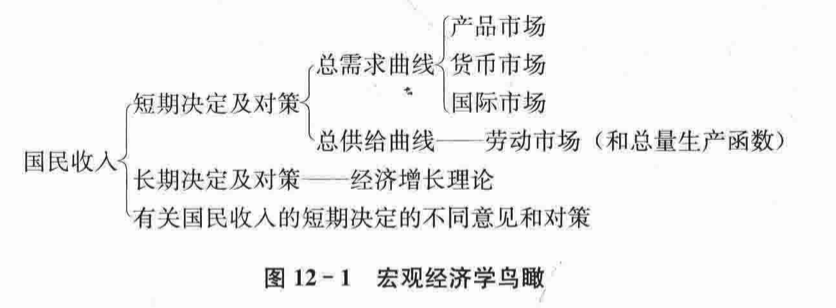

## 第十二章 宏观经济学的基本指标及其衡量

### 第一节 宏观经济学的特点

宏观经济学研究的是社会总体的经济行为及其后果。研究社会总体经济行为就是研究国民收入，即研究如何使过敏收入稳定地（没有通胀和衰退）以较合适的速度增长。这表明，宏观经济运行中的主要问题有：经济波动及与此相联系的就业与失业问题；物价水平及与此相联系的通胀问题；经济增长问题。

宏观经济学将经济划分为**家庭、企业和政府三大部门**并研究它们之间的相互关系。宏观经济学在宏观层面上研究市场活动时，将市场归结为**产品市场、货币市场和劳动市场**。对三大经济部门在这三大市场的交互作用，构成了目前西方宏观经济学的基本理论框架。

- 收入-支出模型：仅研究产品市场供求关系如何决定国民收入的理论模型
- IS-LM模型：在收入-支出模型中加入货币市场供求关系来研究国民收入决定的理论模型
- AD-AS模型：在IS-LM模型中再加入劳动力市场供求关系来研究国民收入决定的理论模型

### 第二节 国内生产总值及其核算方式

#### 国内生产总值（GDP）

国内生产总值（GDP）是指经济社会（即一国或一地区）在一定时期内运用生产要素所生产的全部最终产品（产品和劳务）的市场价值。

国民生产总值（GNP）则是一个国民概念，指某国国民所拥有的全部生产要素在一定时期内所生产的最终产品的市场价值。

#### 核算GDP的两种方法

支出法

收入法

### 第三节 国民收入的其他衡量指标

国内生产净值（NDP）

国民收入（NI）

个人收入（PI）

个人可支配收入（DPI）

### 第四节 国民收入的基本公式

### 第五节 名义GDP和实际GDP

名义GDP（或货币GDP）是用生产产品和劳务的当年价格计算的全部最终产品的市场价值。

实际GDP是用从前某一年的价格作为基期价格计算出来的全部最终产品的市场价值。

GDP平减指数 = 实际GDP/名义GDP

### 第六节 失业和物价水平的衡量

## 第十三章 国民收入的决定：收入-支出模型

### 第一节 均衡产出

均衡产出：和总需求相等的产出，也就是经济社会的收入正好等于全体居民和企业想要有的支出。

仅考虑家庭和企业的两部门经济，消费行为和储蓄行为发生在家庭部门，生产和投资行为发生在企业部门，并且假定企业投资是自发或外生的，即不随利率和产量而变动。

由于两部门经济中没有政府和对外贸易，总需求只由居民消费和企业投资构成。于是，均衡产出为：
$$
y = c + i
$$

### 第二节 凯恩斯的消费理论

#### 消费函数

均衡产出既然是指与总需求相一致的产出，则分析均衡产出如何决定就要分析总需求的各个组成部分是如何决定的。

随着收入的增加，消费也会增加，但是消费的增加不及收入的增加多，消费和收入的这种关系被称做消费函数或消费倾向，用公式表示为：$c=c(y)$。

增加的消费与增加的收入之比率被称为**边际消费倾向（MPC）**，即增加的1单位收入中用于增加消费部分的比率。$MPC = \frac{\Delta c}{\Delta y}$。

#### 储蓄函数

储蓄随收入增加而增加的比率是递增的，储蓄与收入的这种关系就是储蓄函数，其公式为：$s = s(y)$。

储蓄曲线上任一点的斜率就是边际储蓄倾向（MPS），它是该点上的储蓄增量对收入增量的比率，其公式为：$MPS = \frac{\Delta s}{\Delta y}$。

#### 消费函数和储蓄函数的关系

$$
s = y - c \\
c = \alpha + \beta y \\
=> \\
s = y - c = y - \alpha - \beta y  \\
= - \alpha+(1-\beta)y
$$

#### 家庭消费函数和社会消费函数

#### 影响消费的其他因素

利率

价格水平

收入分配

社会保障制度

### 第三节 两部门经济中国民收入的决定及乘数

