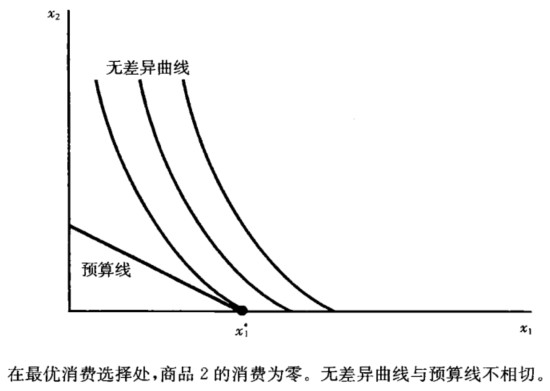
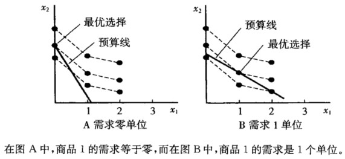

## 5. 选择

### 5.1 最优选择

**对于良好性状的偏好，**最优消费选择是无差异曲线和预算线的切点处的商品束。也存在特殊情况，最优选择的地方，无差异曲线与预算线的切点并不相切。比如：

- （1）拐折。在最优选择处，无差异曲线无切点，如完全互补品；
  
- （2）边界最优。最优选择处，无差异曲线与预算线不相切，如完全替代品、中性商品、厌恶商品、凹偏好商品；
  
- （3）多个切点的情况。相切是最优选择的必要条件而非充分条件。
  
  

最优选择的条件：
- 最优必相切，但相切不一定最优。只有在凸偏好的情况下，才是充分条件；
- 最优选择的充分必要条件：边际替代率等于价格比率，即$MRS=-\frac{p_1}{p_2}$。

### 5.2 消费者需求函数

在某组价格和消费者收入水平下，商品 1 和商品 2 的最优选择称为消费者的需求束。通常价格和收入改变时，消费者的最优选择也会发生改变。**需求函数是将最优选择（即商品的需求数量）与不同价格和收入水平关联起来的函数**。

### 5.3 特殊偏好的消费者选择

#### 5.3.1 完全替代
完全替代：比较预算线和无差异曲线谁更平坦。 

$$
x_1 = 

\begin{cases}

m/p_1 & p_1 < p_2; \\

x_1 \in [0, m/p_1] & p_1 = p_2; \\

0 & p_1>p_2

\end{cases}
$$

若两商品完全替代，则消费者只会购买便宜的那一种；若两商品价格相同，则消费者不会在意购买哪一种。

#### 5.3.2 完全互补

完全互补：最优选择必然位于对角线上。即：
$$
x_1 = x_2 = x = \frac{m}{p_1+p_2}
$$

消费者购买两种商品的数量都相同。

#### 5.3.3 中性商品和厌恶商品

中性商品和厌恶商品：在中性商品和厌恶品情况下，消费者把所有的钱都花费在喜欢的商品上，而不会去购买中性商品或厌恶品。如果商品1是喜欢品，而如果商品2是中性或厌恶品。则有：$x_1 = \frac{m}{p_1}, x_2 = 0$。

#### 5.3.4 离散商品

假设商品1是离散商品，商品2是货币。如果商品1的价格非常高，消费者选择0单位。随着商品1价格的下降，消费者选择更多的商品1。

#### 5.3.5 凹偏好

$x$是否为最优选择? 

不是。对凹偏好，最优选择永远是边界选择，不是切点X，而是Z点。因为，凹偏好意味着“端点消费束”比“平均消费束”受偏好。所以，消费者永远不会同时消费两种商品。

#### 5.3.6 柯布道格拉斯偏好

柯布道格拉斯偏好的最优选择：

$$
x_1 = \frac{c}{c+d} \frac{m}{p_1} \\

x_2 = \frac{d}{c+d} \frac{m}{p_2}
$$

柯布道格拉斯偏好有一个特性：花费在商品的开支占总收入的份额，只与c和d有关。**即消费者花费在每种商品上的资金，占收入的比例是固定的，这一比例的大小取决于柯布道格拉斯函数中变量的指数**。因此，使用变量指数和为1的柯布道格拉斯函数比较方便（事实上，$u(x_1,x_2)=x_1^ax_2^{1-a}$是$v(x_1,x_2)=x_1^cx_2^d$的单调变换，这两个函数代表相同的偏好。（曹乾《中级微观经济学：现代方法（第8 版）》）），如果$u(x_1,x_2)=x_1^ax_2^{1-a}$，可以将$a$解释为花费在商品1上的收入比例。

### 5.4 估计效用函数

现实中，我们看到的往往是需求行为，我们需要知道产生这些行为的偏好效用函数。因为知道了效用函数，我们就能预测新情况下的行为。在范里安的教材中的例子，观察数据发现支出比例在不同年份之间存在较小的变动，因此选择使用柯布道格拉斯偏好拟合。

*这也是经济学中很重要的思想：给定选择行为的某项观测值，试图确定最大化的是什么东西。一旦模拟出上述用于最大化的东西，就可以用它预测新形势下的选择，或者用它评估经济环境变化导致的影响。*

### 5.5 MRS条件的意义

价格衡量商品之间的交换率，反映人们在边际上如何评价商品。

### 5.6 税种选择

初始预算约束：$p_1x_1+ p_2x_2 =m$ 

从量税的预算线：$(1+t)p_1x_1 + p_2x_2 = m$

所得税的预算线：$p_1x_1+x_2p_x = m – t$

$(x_1’, x_2’)$位于含从量税的预算约束线上，也位于含所得税的预算约束线上。$(x_1’, x_2’)$是消费者的最优选择吗？否。

因为在$(x_1’, x_2’)$上：
- 从量税的预算线：$MRS= -\frac{(p_1+t)}{p2}$；
- 所得税的预算线：$MRS= - \frac{p_1}{p_2}$。

所以，

- 含所得税的预算线与无差异曲线（与从量税预算线相切）相交于$(x_1’, x_2’)$。
- 所以， 含所得税的预算线上也许有比$(x_1’, x_2’)$更高的消费者偏好的点。

**所以，对消费者，所得税优于从量税**。

**但是，上述结论的局限：**

- （1）它适用于**一个消费者**。对全体消费者来说，所得税不一定比数量税更好（因为：不消费商品的消费者，肯定偏好数量税）；
- （2）所得税，挫伤消费者工作的**积极性**导致的税后收入下降的幅度大于征税的数量。所得税仅改变消费者的货币数量，不影响选择；
- （3）完全忽略了**供给**对税收的反应。已经说明了需求对税收的反应，但是供给对税收也有反应。