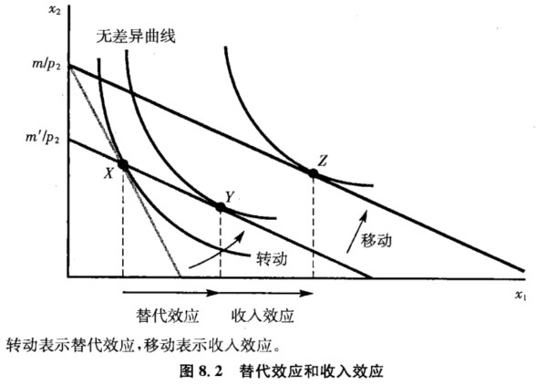

## 8.斯勒茨基方程

消费者的选择如何随价格的变化而变化？

当商品的价格发生改变时，将产生两种效应：

- 一是用一种商品交换另一种商品的比率发生了改变**（替代效应）**；
- 二是收入的总购买力也发生了改变**（收入效应）**。

比如商品1的价格下降：
- 一是购买商品 1 需要放弃的商品 2 变少，改变用商品 2 替代商品 1 的比率；
- 二是商品 1 变得便宜，同样的货币收入可以购买更多的商品 1 。

### 8.1 替代效应和收入效应

**替代效应**：购买力不变，由两种商品之间的交换比率变化所导致的需求变化。当商品价格变化但购买力不变时，消费者如何用一种商品“替代”另一种商品。$\Delta x_1^s = x_1(p_1’, m’) – x_1(p_1,m)$。（回答：当商品1价格变化，为恰好买得起原来的消费束，货币收入的调整数额为多大？）

**收入效应**：相对价格不变，由购买力的变化所导致的需求变化。$\Delta x_1^n = x_1(p_1’, m)-x_1(p_1’,m’)$。

将价格的变化分为两部分：首先，令**相对**价格改变，相应调整货币收入，以保持购买力不变；其次，保持相对价格不变，调整购买力。用图形表示为：

- 第一步：“转动”（替代效应）
  - 购买力不变，**相对价格**变化，预算线斜率变化
- 第二步：“移动”（收入效应）
  - **购买力**变化，相对价格不变，预算线斜率不变

替代效应的符号：替代效应总为负，因为由替代效应引起的需求变动和价格变动的方向相反。如果价格上升，商品的需求因替代效应而下降；

收入效应的符号：正常商品的收入效应为负；劣等商品的收入效应为负。

### 8.2 需求总变动的分解

$$
\Delta x_1 = 

\begin{cases}

\Delta X_1^s + \Delta x_1^n \\

= x_1(p_1’, m) – x_1(p_1, m) \\

= [x_1(p_1’,m’) – x_1(p_1, m)] + [x_1(p_1’, m0) – x_1(p_1’, m’)]

\end{cases}
$$

 

对于正常品来说，替代效应和收入效用符号都为负，因此总效应符号也为负；而对于劣等商品还不好确定。

### 8.3 需求定律

需求定律：如果收入增加时某种商品的需求上升，那么价格上升时，该商品的需求必然下降。

推导：收入增加—>需求上升：正常商品。对于正常商品，替代效应和收入效应互相加强，因此价格上升需求必然下降。

### 8.4 特殊偏好的收入效应和替代效应

#### 8.4.1 完全互补

#### 8.4.2 完全替代

#### 8.4.3 拟线性偏好

### 8.5 例子：退税

### 8.6 希克斯替代效应